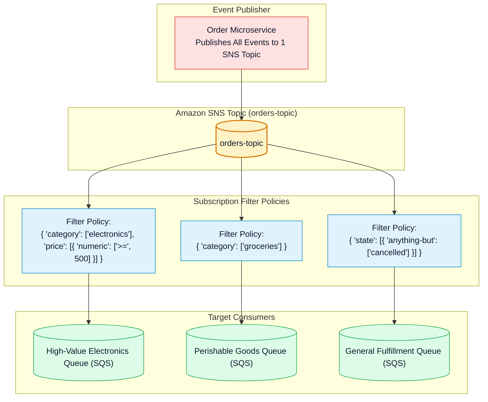
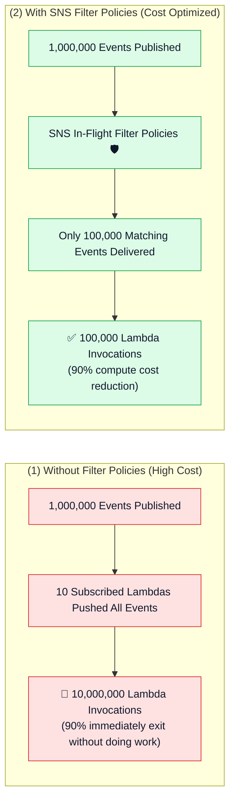

# 🎯 Amazon SNS Subscription Filter Policies, Message Attributes & Cost Optimization

- **Category**: Application Integration / Smart Event Routing & Downstream Cost Reduction
- **Language / ဘာသာစကား**: **English (Original)** | [မြန်မာဘာသာ (Burmese)](/mm/02-services/integration/sns/sns-subscription-filter-policies)
- **Primary Use Case**: Routing messages to specific subscribers based on Message Attributes or Payload contents, eliminating unneeded downstream Lambda invocations and SQS processing costs.
- **Slide Reference**: Pages 499–525 in `[[AWSCertifiedDataEngineerSlides.pdf]]`
- **Hub Links**: `[[index]]` | `[[sns]]` | `[[sns-standard-vs-fifo-topics]]` | `[[sqs]]` | `[[lambda]]`

---

## 1. High-Level Summary

By default, an Amazon SNS topic pushes **100% of published messages** to every subscribed endpoint. In large enterprise pipelines, this causes severe downstream bloat and wasted compute costs (e.g. spinning up thousands of Lambda executions just to immediately discard irrelevant records).

**Subscription Filter Policies** allow subscribers to declare JSON matching rules. SNS evaluates incoming messages against these rules and **only delivers matching messages** to the subscriber, dropping non-matching messages before delivery.



---

## 2. Filter Policy Scopes: Attributes vs. Payload Body

Amazon SNS supports two distinct filter policy evaluation scopes:

### 1. Message Attributes Filtering (Default Scope):
- Evaluates key-value metadata attached to `MessageAttributes` when the message is published.
- *Advantage*: Very fast and lightweight; does not parse JSON body.

### 2. Message Body (Payload) Filtering:
- Evaluates properties directly inside the JSON payload body of the message.
- *Configuration*: Set `FilterPolicyScope = MessageBody` on the subscription.
- *Advantage*: Producers do not need to attach separate metadata attributes; SNS parses nested JSON bodies automatically.

---

## 3. Supported JSON Filter Policy Operators

| Operator | JSON Policy Syntax Example | Matches If... |
| :--- | :--- | :--- |
| **Exact Match** | `{"event_type": ["order_created", "order_updated"]}` | `event_type` is either `order_created` OR `order_updated`. |
| **Prefix Matching** | `{"customer_id": [{"prefix": "VIP-"}]}` | `customer_id` begins with string `"VIP-"`. |
| **Suffix Matching** | `{"file_name": [{"suffix": ".parquet"}]}` | `file_name` ends with extension `".parquet"`. |
| **Numeric Range** | `{"total_amount": [{"numeric": [">=", 100, "<=", 1000]}]}` | `total_amount` is between \$100 and \$1,000 (inclusive). |
| **Anything-But** | `{"environment": [{"anything-but": ["test", "dev"]}]}` | `environment` is anything other than `test` or `dev`. |
| **Exists** | `{"fraud_risk_score": [{"exists": true}]}` | The field `fraud_risk_score` is present in the message. |

---

## 4. Multi-Attribute Evaluation Logic

When constructing complex filter policies, SNS enforces clear Boolean evaluation rules:

```json
{
  "department": ["finance", "accounting"],
  "priority": ["high", "critical"],
  "amount": [
    {
      "numeric": [">=", 50000]
    }
  ]
}
```

- **OR Logic within the same attribute array**: `department` matches if it is `"finance"` OR `"accounting"`.
- **AND Logic across different attribute keys**: Message must match (`department`) AND (`priority`) AND (`amount`).

---

## 5. Cost Optimization Impact in Data Pipelines



- **Zero Cost for Filtering**: Amazon SNS evaluates subscription filter policies **at no additional charge**.
- You only pay for messages that are successfully delivered to subscriber endpoints. Non-matching messages are dropped free of charge before downstream delivery!

---

## 6. DEA-C01 Exam Essentials

> [!IMPORTANT]
> **Key Exam Decision Triggers for Filter Policies**:
>
> - **"A single SNS topic receives all transactions, but high-value transactions (> \$10,000) must be routed to a fraud inspection queue while standard transactions go to a data lake queue"** $\rightarrow$ Configure **SNS Subscription Filter Policies** using numeric range matching on the SQS subscriptions.
> - **"Reduce unnecessary downstream AWS Lambda invocations from an SNS topic without writing application filtering code"** $\rightarrow$ Apply **Subscription Filter Policies** directly on the SNS-to-Lambda subscriptions.
> - **"Filter messages based on fields inside the JSON body rather than message headers"** $\rightarrow$ Set the subscription's **`FilterPolicyScope` to `MessageBody`**.
> - **"How are multiple keys evaluated in an SNS Filter Policy?"** $\rightarrow$ Keys are combined with **AND** logic; array values within a single key are evaluated with **OR** logic.

---

## 📌 Related Notes
- `[[sns]]` — SNS Master Hub
- `[[sns-standard-vs-fifo-topics]]` — Standard vs FIFO Topics
- `[[sqs]]` — Amazon SQS Queue Buffering
- `[[lambda]]` — AWS Lambda Ingestion Consumers
