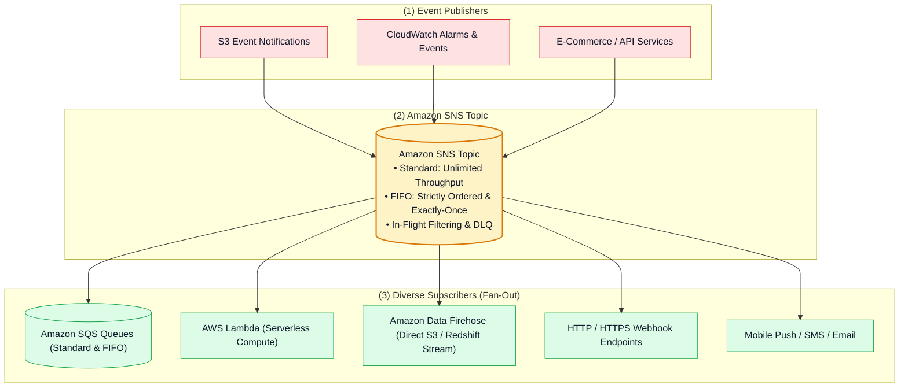

# 📢 Amazon SNS Hub (Simple Notification Service & Pub/Sub Fan-Out)

- **Category**: Application Integration / Publish-Subscribe Messaging & Event Fan-Out
- **Language / ဘာသာစကား**: **English (Original)** | [မြန်မာဘာသာ (Burmese)](/mm/02-services/integration/sns/sns)
- **Primary Use Case**: Fully managed Pub/Sub messaging, broadcasting single events to thousands of subscribers (Fan-Out), triggering downstream ETL pipelines, and streaming data directly into Amazon Data Firehose.
- **Slide Reference**: Pages 499–525 in `[AWSCertifiedDataEngineerSlides.pdf](/docs/AWSCertifiedDataEngineerSlides.pdf)`
- **Hub Links**: `[[index]]` | `[[service-catalog]]` | `[[domain-1-ingestion-and-processing]]` | `[[domain-3-data-operations-and-support]]` | `[[sqs]]` | `[[kinesis]]`

---

## 1. High-Level Summary

**Amazon Simple Notification Service (Amazon SNS)** is a fully managed, serverless publish/subscribe (Pub/Sub) messaging service designed for high-throughput, highly reliable message delivery.

In modern cloud data architectures and data engineering pipelines, Amazon SNS serves as the **central event broadcaster**. Publishers (such as microservices, CloudWatch Alarms, S3 Event Notifications, or AWS Step Functions) send a message once to an **SNS Topic**, and SNS automatically duplicates and pushes that message to multiple heterogeneous subscribers in parallel (the **Fan-Out pattern**).

---

## 2. Core Concepts & Messaging Mechanics

1. **Publish/Subscribe (Pub/Sub) Model**:
   - **Push Model**: Unlike SQS (where workers poll messages), SNS immediately pushes messages out to all registered endpoints as soon as they are published.
   - **Zero Persistence / Ephemeral Delivery**: SNS does not store messages long-term. If a subscriber endpoint is unreachable and has no Dead-Letter Queue (DLQ) configured, the message is permanently dropped after retry policies expire.
2. **SNS Topics**:
   - A logical access point and communication channel to which publishers send messages and subscribers bind subscriptions.
3. **Message Payload Limits**:
   - Up to **256 KB** of text (JSON, XML, or unformatted text) per message.
   - Supports **Message Attributes** (up to 10 metadata key-value pairs) used by **Subscription Filter Policies** for smart routing.

---

## 3. Standard Topics vs. FIFO Topics

| Feature / Dimension | Standard Topic | FIFO (First-In, First-Out) Topic |
| :--- | :--- | :--- |
| **Throughput** | **Unlimited** messages per second. | 300 msg/sec (3,000 with batching); up to **30,000 msg/sec** with High Throughput mode. |
| **Delivery Ordering** | **Best-effort ordering**. | **Strictly ordered** (First-In, First-Out guarantee). |
| **Deduplication** | At-least-once delivery (occasional duplicate messages). | **Exactly-once delivery** (5-minute deduplication window). |
| **Naming Requirement** | Any alphanumeric name. | **Must end with `.fifo`** (e.g., `orders.fifo`). |
| **Supported Subscribers** | SQS (Standard), Lambda, Firehose, HTTP/S, Email, SMS, Push. | **Amazon SQS FIFO Queues ONLY**. |
| **Required Identifiers** | None. | **Message Group ID** & **Message Deduplication ID**. |

---

## 4. Modular SNS Deep-Dive Topics

To master Amazon SNS for the **AWS Certified Data Engineer - Associate (DEA-C01)** exam, study the following modular notes:

1. `[[sns-standard-vs-fifo-topics]]` — **Standard vs. FIFO Topics, Message Group ID, Deduplication & SQS FIFO Integration**
2. `[[sns-subscription-filter-policies]]` — **Message Attributes, Payload-Based Filtering, Numeric Ranges & Ingestion Cost Optimization**
3. `[[sns-delivery-retries-and-dead-letter-queues]]` — **4-Phase Delivery Retry Policies, Subscription DLQs & Fault-Tolerant Fanout**
4. `[[sns-fanout-firehose-and-eventbridge]]` — **SNS + SQS Fan-Out, Direct Amazon Data Firehose Streaming & SNS vs. EventBridge vs. SQS Matrix**
5. `[[sns-security-access-policies-and-encryption]]` — **Topic Access Policies, SSE-KMS Encryption, Cross-Account Publishing & VPC Endpoints**

---

## 5. DEA-C01 Exam Essentials

> [!IMPORTANT]
> **Key Exam Rules for Amazon SNS**:
>
> - **Fan-Out Architecture**: Whenever an exam question requires sending a single event to multiple disparate downstream systems (e.g. S3 data lake, auditing, fraud detection), use an **SNS Topic fanning out to multiple SQS Queues**.
> - **Direct S3 / Redshift Streaming without Compute**: SNS topics can deliver messages directly to **Amazon Data Firehose**, buffering streams straight into S3, Redshift, OpenSearch, or Splunk with zero Lambda code.
> - **Eliminate Unnecessary Downstream Invocations**: Use **SNS Subscription Filter Policies** (attribute or message-body filtering) to route messages only to relevant subscribers.
> - **Strictly Ordered Pub/Sub**: Use an **SNS FIFO Topic** (`.fifo`) subscribing only to **SQS FIFO Queues** (`.fifo`).
> - **Subscription-Level DLQs**: In SNS, Dead-Letter Queues (DLQs) are configured at the **Subscription level**, not at the Topic level.

---

## 📌 Related Notes
- `[[sns-standard-vs-fifo-topics]]` — Standard vs FIFO Topics
- `[[sns-subscription-filter-policies]]` — Subscription Filter Policies
- `[[sqs]]` — Amazon SQS Modular Deep-Dive Suite
- `[[kinesis-firehose]]` — Amazon Data Firehose Ingestion
- `[[cloudwatch-and-eventbridge]]` — EventBridge vs SNS Comparison
