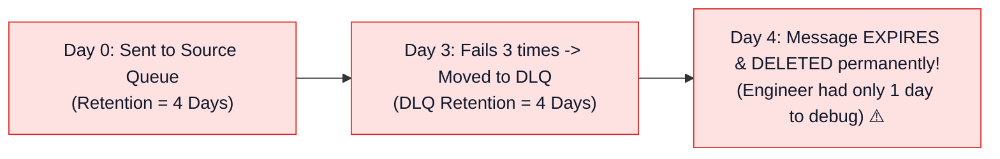
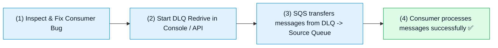

# ☠️ Amazon SQS Dead-Letter Queues (DLQ), Poison Pill Handling & DLQ Redrive

- **Category**: Application Integration / Fault Tolerance, Error Handling & Message Redrive
- **Language / ဘာသာစကား**: **English (Original)** | [မြန်မာဘာသာ (Burmese)](/mm/02-services/integration/sqs/sqs-dead-letter-queues-and-error-handling)
- **Primary Use Case**: Isolating unprocessable poison pill messages, configuring `RedrivePolicy` and `maxReceiveCount`, preventing infinite retry loops, and executing DLQ Redrive for batch reprocessing.
- **Slide Reference**: Pages 499–525 in `[AWSCertifiedDataEngineerSlides.pdf](/docs/AWSCertifiedDataEngineerSlides.pdf)`
- **Hub Links**: `[[en/index|index]]` | `[[en/02-services/integration/sqs/sqs|sqs]]` | `[[en/02-services/integration/sqs/sqs-standard-vs-fifo-queues|sqs-standard-vs-fifo-queues]]` | `[[en/02-services/integration/sqs/sqs-timing-parameters-and-polling|sqs-timing-parameters-and-polling]]` | `[[en/01-domains/domain-3-data-operations-and-support|domain-3-data-operations-and-support]]`

---

## 1. High-Level Summary

In distributed data pipelines, bad input data (such as corrupted JSON, schema mismatches, or unexpected NULL values) can cause consumer applications to crash repeatedly. These problematic records are known as **Poison Pill Messages**.

Without a Dead-Letter Queue, a poison pill message will repeatedly fail, return to the queue upon Visibility Timeout expiration, and loop indefinitely, consuming compute resources and stalling FIFO queues.

Amazon SQS solves this by using a **Dead-Letter Queue (DLQ)** configured via a **`RedrivePolicy`** to automatically quarantine failing messages after **`maxReceiveCount`** attempts.

```mermaid
graph TD
    subgraph DLQ_Workflow["Poison Pill Quarantine & DLQ Redrive Architecture"]
        Producer["Data Producer / S3 Event"] --> SourceQ[("Primary Source Queue<br/>orders-queue")]

        SourceQ -->|ReceiveMessage (Attempt 1..3)| Worker["Consumer Application<br/>(Worker Crashes on Corrupted JSON 💥)"]
        Worker -.->|Processing Fails| SourceQ

        SourceQ -->|ReceiveCount > maxReceiveCount (e.g. 3)| DLQ[("Dead-Letter Queue (DLQ)<br/>orders-dlq<br/>(Retention: 14 Days)")]

        DLQ --> Alert["CloudWatch Alarm & SNS Notification<br/>(Alerts On-Call Engineer)"]
        DLQ --> Redrive["SQS DLQ Redrive Task<br/>(Moves fixed messages back to Source Queue)"]
        Redrive -.->|Reprocess After Bugfix| SourceQ
    end

    classDef src fill:#e0f2fe,stroke:#0284c7,stroke-width:1px,color:#0f172a;
    classDef worker fill:#fee2e2,stroke:#dc2626,stroke-width:1px,color:#0f172a;
    classDef dlq fill:#fef3c7,stroke:#d97706,stroke-width:2px,color:#0f172a;
    classDef fix fill:#dcfce7,stroke:#16a34a,stroke-width:1px,color:#0f172a;

    class Producer,SourceQ src;
    class Worker worker;
    class DLQ dlq;
    class Alert,Redrive fix;
```

---

## 2. Configuring the `RedrivePolicy`

To attach a Dead-Letter Queue to a source SQS queue, configure a JSON `RedrivePolicy`:

```json
{
  "deadLetterTargetArn": "arn:aws:sqs:us-east-1:123456789012:orders-dlq",
  "maxReceiveCount": 3
}
```

### Key Parameters:
1. **`deadLetterTargetArn`**: The Amazon Resource Name (ARN) of the designated DLQ queue.
2. **`maxReceiveCount`**: The threshold of failed processing attempts (e.g. 1 to 1,000). When `ReceiveCount` exceeds `maxReceiveCount`, SQS moves the message to the DLQ automatically without consumer intervention.

---

## 3. Strict DLQ Compatibility Rules

| Compatibility Requirement | Rule & Explanation |
| :--- | :--- |
| **Queue Type Matching** | **Standard Source Queues** must route to **Standard DLQs**.<br/>**FIFO Source Queues** (`.fifo`) must route to **FIFO DLQs** (`.fifo`). |
| **AWS Region & Account** | The source queue and the DLQ **must reside in the exact same AWS Region and AWS Account**. |
| **Dead-Letter Queue Redrive Allow Policy** | The DLQ can define permissions (`RedriveAllowPolicy`) specifying which source queues are permitted to send dead-letter messages to it (`allowAll`, `byQueue`, or `denyAll`). |

---

## 4. The Critical Retention Period Nuance

> [!WARNING]
> **High-Yield DEA-C01 Exam Trap**:
> The expiration timer of a message in a Dead-Letter Queue is based on the **original timestamp when the message was sent to the SOURCE queue**, NOT when it was moved into the DLQ!



### Architectural Best Practice:
Always set the **Message Retention Period of the DLQ to 14 days** (the maximum allowed). This ensures that messages failing over several days in the source queue do not prematurely expire before data engineering teams can investigate and fix bugs.

---

## 5. SQS DLQ Redrive (Automated Reprocessing)

Once data engineers identify and deploy a code fix for the consumer application:



- **DLQ Redrive**: A managed SQS capability that programmatically moves messages from the DLQ back to their original source queue (or a custom queue) without requiring custom script development or manual copy-pasting.

---

## 6. DEA-C01 Exam Essentials

> [!IMPORTANT]
> **Key Exam Decision Triggers for DLQs & Error Handling**:
>
> - **"A malformed event causes consumer Lambda functions to fail repeatedly, blocking downstream records"** $\rightarrow$ Configure an **SQS Dead-Letter Queue (DLQ)** with a `maxReceiveCount` (e.g. 3).
> - **"FIFO Queue DLQ Type"** $\rightarrow$ An SQS FIFO source queue must use a **FIFO DLQ** ending with `.fifo`.
> - **"Prevent messages from expiring in a DLQ before operators can fix the issue"** $\rightarrow$ Configure the DLQ **Message Retention Period to 14 days**.
> - **"Reprocess 10,000 failed messages after fixing the downstream application bug"** $\rightarrow$ Execute an **Amazon SQS DLQ Redrive** to move messages back to the primary source queue.

---

## 📌 Related Notes
- `[[en/02-services/integration/sqs/sqs|sqs]]` — SQS Master Hub
- `[[en/02-services/integration/sqs/sqs-standard-vs-fifo-queues|sqs-standard-vs-fifo-queues]]` — FIFO Ordering & Deduplication
- `[[en/02-services/integration/sqs/sqs-timing-parameters-and-polling|sqs-timing-parameters-and-polling]]` — Visibility Timeouts & Polling
- `[[en/01-domains/domain-3-data-operations-and-support|domain-3-data-operations-and-support]]` — Operational Monitoring and Support
