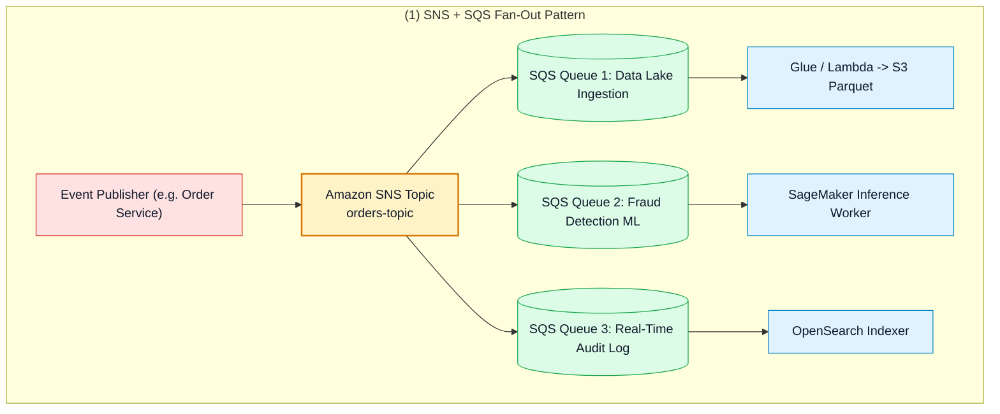
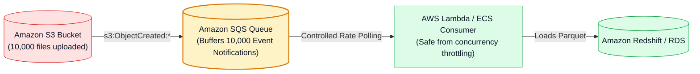
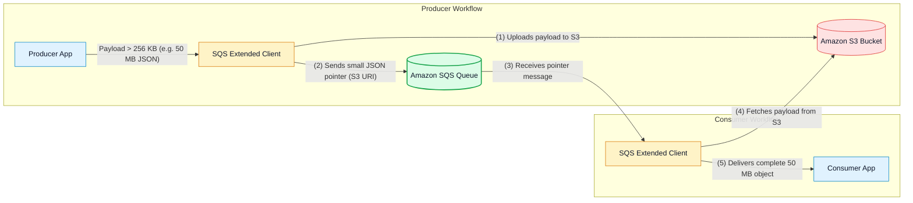

# 🔀 Amazon SQS Integration Patterns, SNS Fan-Out, S3 Events & Streaming Matrix

- **Category**: Application Integration / Distributed Patterns & Streaming Service Comparison
- **Language / ဘာသာစကား**: **English (Original)** | [မြန်မာဘာသာ (Burmese)](/mm/02-services/integration/sqs/sqs-integration-patterns-and-fanout)
- **Primary Use Case**: Implementing the SNS+SQS Fan-Out architecture, buffering bursty S3 event notifications, handling large payloads with the SQS Extended Client Library, and comparing SQS with Kinesis and MSK.
- **Slide Reference**: Pages 499–525 in `[AWSCertifiedDataEngineerSlides.pdf](/docs/AWSCertifiedDataEngineerSlides.pdf)`
- **Hub Links**: `[[index]]` | `[[sqs]]` | `[[sqs-standard-vs-fifo-queues]]` | `[[s3-event-notifications]]` | `[[kinesis]]` | `[[msk]]`

---

## 1. High-Level Summary

Amazon SQS is a foundational building block for constructing resilient, event-driven data pipelines.

For the **DEA-C01** exam, you must recognize classic architectural design patterns including **SNS+SQS Fan-Out**, **S3 File Upload Buffering**, **Buffer Leveling for Database Protection**, and how **SQS compares to Kinesis Data Streams and Amazon MSK**.

---

## 2. The SNS + SQS Fan-Out Architecture Pattern

When a single event must be processed asynchronously by multiple independent downstream applications, connecting a publisher directly to multiple queues creates tight coupling.

### The Fan-Out Solution:
1. The publisher sends a single notification to an **Amazon SNS Topic**.
2. Multiple **Amazon SQS Queues** subscribe to the SNS topic.
3. SNS delivers copies of the message to all subscribed queues in parallel.
4. Each queue can independently configure its own **Visibility Timeout**, **DLQ**, and consumer scaling policies.
5. **SNS Subscription Filter Policies**: Can be applied so specific queues only receive matching subset events (e.g. routing high-value orders $> \$10,000$ to an executive audit queue).

---

## 3. S3 Event Notifications with SQS Buffering

When thousands of files are uploaded into an Amazon S3 bucket within seconds (e.g., IoT batch uploads or midnight data exports):

- Direct S3-to-Lambda invocation can quickly exhaust Lambda account concurrency limits ($1,000$ concurrent executions).
- Placing an **SQS Queue between S3 and Lambda** buffers the notifications, allowing Lambda to consume messages in controlled batches with **Event Source Mapping** (`BatchSize: 10`, `MaximumBatchingWindowInSeconds: 30`).

---

## 4. Amazon SQS Extended Client Library for Large Payloads

- When message payloads exceed the **256 KB native SQS limit**, use the **Amazon SQS Extended Client Library** (available for Java, Python, and other SDKs).
- The library automatically offloads payloads up to **2 GB** into an Amazon S3 bucket, passes an S3 reference pointer across the SQS queue, and reconstructs the original object transparently upon receipt.

---

## 5. Definitive AWS Messaging & Streaming Comparison Matrix

| Evaluation Dimension | Amazon SQS | Amazon SNS | Amazon Kinesis Data Streams | Amazon MSK (Apache Kafka) |
| :--- | :--- | :--- | :--- | :--- |
| **Communication Model** | **Pull** (Consumers poll queue). | **Push** (Pushes events to subscribers). | **Pull / Enhanced Fan-Out Push** (Sharded stream). | **Pull** (Kafka consumer group offsets). |
| **Message Deletion** | **Explicit deletion** by consumer (`DeleteMessage`). | No storage (Transient notification). | **Time-based retention** (Data remains in stream for all consumers). | **Time/Size retention** (Data remains in log). |
| **Multiple Consumers** | **Competing Consumers** (1 message read by 1 worker). | **Fan-out** (Every subscriber gets a copy). | **Multiple independent consumer groups** read the same stream. | **Multiple consumer groups** read same topic partitions. |
| **Ordering** | FIFO Queue only (via `MessageGroupId`). | FIFO Topic only. | **Per-Shard ordering** (via `PartitionKey`). | **Per-Partition ordering** (via `Key`). |
| **Data Replayability** | **No** (Message gone once deleted). | **No** (Cannot replay past events). | **Yes** (Replay within 24h to 365 days retention). | **Yes** (Replay by resetting Kafka consumer offsets). |
| **Best Used For** | Asynchronous job queuing, worker task queues, decoupling microservices. | Multi-protocol alerts (Email/SMS), broadcasting events to multiple queues. | Real-time analytics, continuous IoT ingestion, Flink streaming joins. | Enterprise Kafka migrations, open-source ecosystem, custom Kafka Connectors. |

---

## 6. DEA-C01 Exam Essentials

> [!IMPORTANT]
> **Key Exam Decision Triggers for Integration Patterns**:
>
> - **"Send a single transactional event to three different processing systems that scale independently"** $\rightarrow$ Use **Amazon SNS topic with Fan-Out to three Amazon SQS queues**.
> - **"Prevent downstream Lambda functions from being overwhelmed by a sudden spike of 50,000 S3 file upload notifications"** $\rightarrow$ Configure **S3 Event Notifications $\rightarrow$ Amazon SQS $\rightarrow$ Lambda Event Source Mapping**.
> - **"Send 10 MB payload messages through an SQS queue"** $\rightarrow$ Use the **Amazon SQS Extended Client Library with Amazon S3**.
> - **"Replay data from 3 days ago for a newly developed analytics consumer"** $\rightarrow$ Choose **Amazon Kinesis Data Streams** or **Amazon MSK** (SQS cannot replay deleted messages).

---

## 📌 Related Notes
- `[[sqs]]` — SQS Master Hub
- `[[sqs-standard-vs-fifo-queues]]` — Standard vs FIFO Queues
- `[[s3-event-notifications]]` — S3 Event Triggers
- `[[kinesis]]` — Kinesis Data Streams
- `[[msk]]` — Amazon Managed Streaming for Apache Kafka
