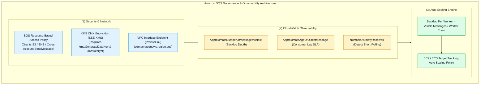
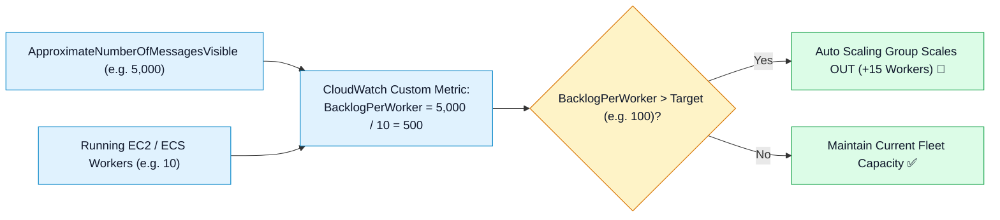

# 🛡️ Amazon SQS Security, CloudWatch Monitoring, Auto Scaling & Troubleshooting

- **Category**: Application Integration / Security Governance, Observability & Production Triage
- **Language / ဘာသာစကား**: **English (Original)** | [မြန်မာဘာသာ (Burmese)](/mm/02-services/integration/sqs/sqs-security-monitoring-and-troubleshooting)
- **Primary Use Case**: Securing queues with Access Policies and KMS encryption, monitoring backlog depth and message age with CloudWatch, scaling worker fleets via Backlog per Worker, and troubleshooting production failures.
- **Slide Reference**: Pages 499–525 in `[[AWSCertifiedDataEngineerSlides.pdf]]`
- **Hub Links**: `[[index]]` | `[[sqs]]` | `[[sqs-timing-parameters-and-polling]]` | `[[sqs-dead-letter-queues-and-error-handling]]` | `[[domain-3-data-operations-and-support]]`

---

## 1. High-Level Summary

Operating Amazon SQS in production requires a deep understanding of **Queue Access Policies**, **KMS encryption permissions**, **CloudWatch backlog metrics**, and **Auto Scaling algorithms**.

For the **DEA-C01** exam, you must know how to scale EC2/ECS consumers using the **Backlog per Worker** custom metric, grant S3 bucket event delivery permissions, and resolve **head-of-line blocking in FIFO queues**.



---

## 2. SQS Security & Access Policies

### 1. Resource-Based Queue Access Policy:
To allow an external service (like Amazon S3 or Amazon SNS) or another AWS account to send messages to your queue, attach an **SQS Access Policy**:

```json
{
  "Version": "2012-10-17",
  "Statement": [
    {
      "Sid": "AllowS3ToPublishToQueue",
      "Effect": "Allow",
      "Principal": {
        "Service": "s3.amazonaws.com"
      },
      "Action": "sqs:SendMessage",
      "Resource": "arn:aws:sqs:us-east-1:123456789012:data-ingestion-queue",
      "Condition": {
        "ArnEquals": {
          "aws:SourceArn": "arn:aws:s3:::my-production-data-lake-bucket"
        }
      }
    }
  ]
}
```

---

### 2. Encryption (SSE-SQS vs. SSE-KMS):
- **SSE-SQS**: Default server-side encryption with 256-bit AES keys managed directly by SQS at no additional cost.
- **SSE-KMS**: Uses AWS Key Management Service Customer Managed Keys (CMK).
  - *Exam Gotcha*: If SSE-KMS is enabled, the producing service (e.g. S3 or SNS) and the consumer (e.g. Lambda or EC2) must have `kms:GenerateDataKey` and `kms:Decrypt` permissions on the KMS Key Policy!

---

## 3. Critical CloudWatch Metrics for SQS

| CloudWatch Metric | Description | What It Signifies / Operational Alarm |
| :--- | :--- | :--- |
| **`ApproximateNumberOfMessagesVisible`** | Number of messages available for retrieval in the queue. | **Primary Backlog Metric**: Used as the basis for consumer Auto Scaling. |
| **`ApproximateNumberOfMessagesNotVisible`** | Number of messages currently in-flight (being processed by consumers under Visibility Timeout). | High values indicate consumers are actively working or visibility timeout is too long. |
| **`ApproximateAgeOfOldestMessage`** | Age (in seconds) of the oldest unconsumed message. | **SLA Alert**: If this spikes, consumers are falling behind or stalled by poison pills. |
| **`NumberOfEmptyReceives`** | Number of `ReceiveMessage` API calls that returned zero messages. | **Cost Indicator**: High values indicate Short Polling is active and should be switched to Long Polling. |

---

## 4. Consumer Fleet Auto Scaling: Backlog per Worker

Scaling EC2 or ECS consumer fleets based purely on CPU utilization is flawed because worker CPU might remain low while thousands of messages accumulate in the queue.

### The Correct Formula: Backlog Per Worker
$$\text{Backlog Per Worker} = \frac{\text{ApproximateNumberOfMessagesVisible}}{\text{Running Worker Count}}$$



1. Publish a CloudWatch custom metric calculating `BacklogPerWorker`.
2. Configure a **Target Tracking Auto Scaling Policy** in EC2 Auto Scaling or ECS Service Auto Scaling targeting an acceptable backlog per instance (e.g., 100 messages per worker).

---

## 5. Master Troubleshooting Cheat Sheet

| Symptom / Production Issue | Root Cause | Remediation / Long-Term Fix |
| :--- | :--- | :--- |
| **Duplicate processing of the same message** | Visibility Timeout is shorter than processing time. | Increase default Visibility Timeout or call `ChangeMessageVisibility` periodically in a heartbeat thread. |
| **S3 bucket cannot deliver event notifications to SQS** | SQS queue access policy is missing S3 service principal permissions. | Update SQS Access Policy to allow `s3.amazonaws.com` `sqs:SendMessage` with `aws:SourceArn` condition. |
| **`AccessDenied` when publishing to KMS-encrypted queue** | IAM role or S3 service lacks `kms:GenerateDataKey` on the KMS key policy. | Update the KMS Key Policy to grant the producer permission to encrypt data keys. |
| **Head-of-line blocking in FIFO queue** | A poison pill message in a specific `MessageGroupId` fails repeatedly. | Configure a **FIFO Dead-Letter Queue (DLQ)** with `maxReceiveCount` to isolate the failed message so subsequent messages in the group can proceed. |
| **High SQS API costs with mostly empty responses** | Short Polling is configured (`WaitTimeSeconds = 0`). | Enable **Long Polling** by setting `ReceiveMessageWaitTimeSeconds = 20` on the queue. |

---

## 6. DEA-C01 Exam Essentials

> [!IMPORTANT]
> **Key Exam Decision Triggers for Security, Monitoring & Scaling**:
>
> - **"Scale an EC2 worker fleet based on queue depth rather than instance CPU utilization"** $\rightarrow$ Create a custom CloudWatch metric for **Backlog per Worker** (`ApproximateNumberOfMessagesVisible / InstanceCount`) and attach a **Target Tracking Scaling Policy**.
> - **"S3 Event Notification failing with Access Denied"** $\rightarrow$ Attach an **SQS Queue Policy** granting `s3.amazonaws.com` permission to call `sqs:SendMessage`.
> - **"Detect messages breaching processing SLA thresholds"** $\rightarrow$ Set a CloudWatch Alarm on **`ApproximateAgeOfOldestMessage`**.
> - **"FIFO Queue blocked by a single unprocessable transaction"** $\rightarrow$ Configure a **FIFO Dead-Letter Queue (DLQ)** with a low `maxReceiveCount` (e.g. 3) to unblock the `MessageGroupId`.

---

## 📌 Related Notes
- `[[sqs]]` — SQS Master Hub
- `[[sqs-standard-vs-fifo-queues]]` — Standard vs FIFO Architecture
- `[[sqs-timing-parameters-and-polling]]` — Visibility Timeouts & Polling
- `[[sqs-dead-letter-queues-and-error-handling]]` — DLQ Configuration & Redrive
- `[[domain-3-data-operations-and-support]]` — CloudWatch & Operational Excellence
