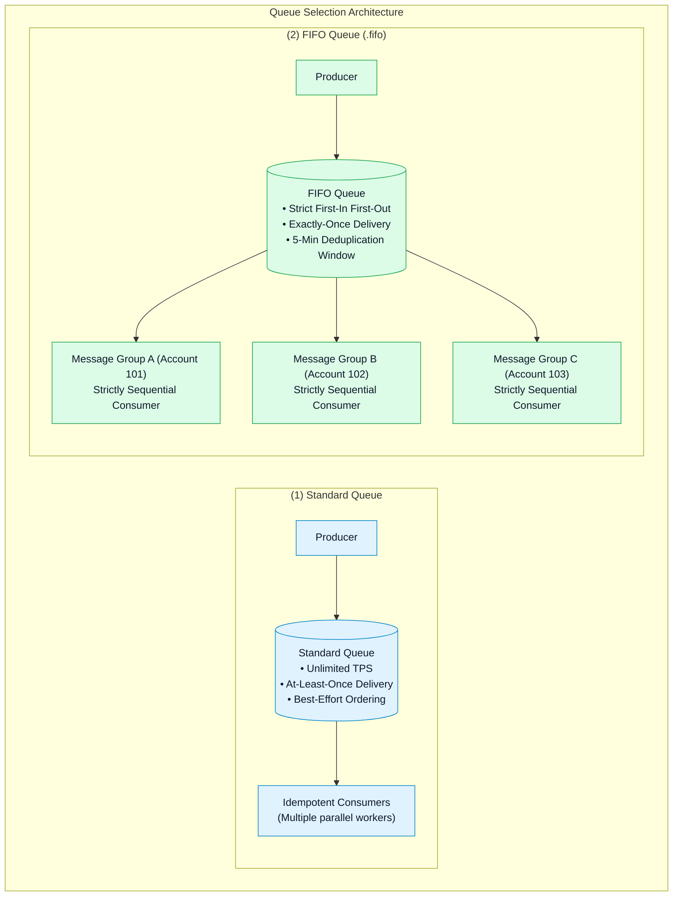
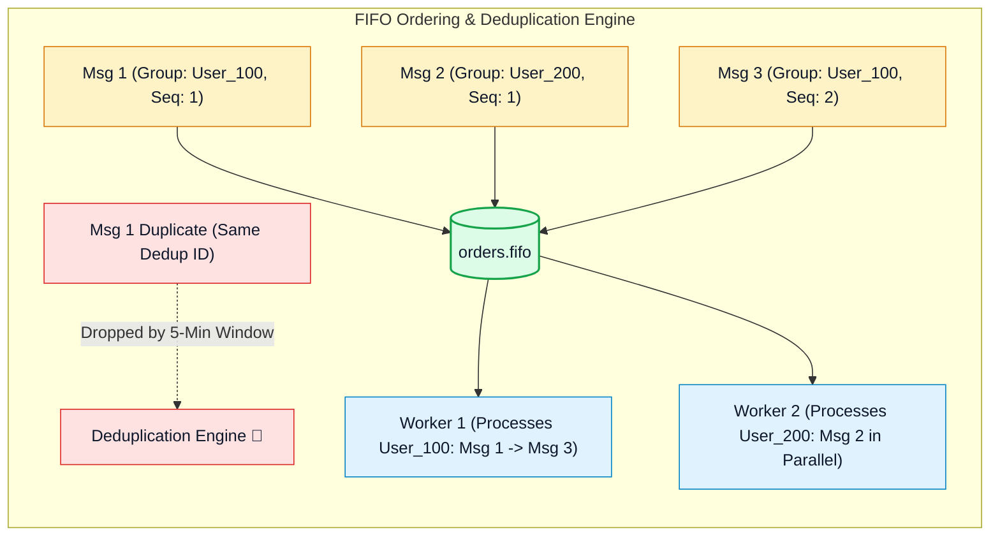

# ⚖️ Amazon SQS Standard vs. FIFO Queues, Message Grouping & Deduplication

- **Category**: Application Integration / Message Ordering & Delivery Semantics
- **Language / ဘာသာစကား**: **English (Original)** | [မြန်မာဘာသာ (Burmese)](/mm/02-services/integration/sqs/sqs-standard-vs-fifo-queues)
- **Primary Use Case**: Choosing between Standard and FIFO queue semantics, configuring Message Group IDs for parallel ordered processing, enabling Content-Based Deduplication, and scaling with High-Throughput FIFO mode.
- **Slide Reference**: Pages 499–525 in `[AWSCertifiedDataEngineerSlides.pdf](/docs/AWSCertifiedDataEngineerSlides.pdf)`
- **Hub Links**: `[[index]]` | `[[sqs]]` | `[[sqs-timing-parameters-and-polling]]` | `[[sqs-dead-letter-queues-and-error-handling]]`

---

## 1. High-Level Summary

Choosing the correct Amazon SQS queue type is one of the most critical architectural decisions in AWS data engineering.

- **Standard Queues** offer **unlimited throughput** and **at-least-once delivery**, but order is not strictly guaranteed.
- **FIFO (First-In, First-Out) Queues** guarantee **strict ordering** and **exactly-once processing**, utilizing **Message Group IDs** to parallelize processing across separate entities while maintaining per-group order.

---

## 2. Standard Queues Deep Dive

### 1. Unlimited Throughput:
Standard queues support a nearly unlimited number of API calls per second (`SendMessage`, `ReceiveMessage`, `DeleteMessage`), making them ideal for high-velocity telemetry, clickstream buffering, and massive web scraping workloads.

### 2. At-Least-Once Delivery & Idempotency:
Because SQS stores copies of messages across multiple redundant servers in an AWS Region, network delays or server failures might result in a message being delivered more than once.

> [!IMPORTANT]
> **Idempotent Consumers**: Consumers processing messages from Standard SQS queues MUST be **idempotent** (processing the same message twice produces the exact same result without unintended side effects, e.g. using `UPSERT` / `MERGE` in SQL instead of raw `INSERT`).

---

## 3. FIFO Queues Deep Dive

Amazon SQS FIFO queues are designed for applications where the order of operations and events is critical, and duplicate data could cause corruption (e.g. banking transactions, inventory adjustments, and change data capture streams).

### 1. Queue Naming Requirement:
The name of an SQS FIFO queue **must end with the `.fifo` suffix** (e.g. `financial-transactions.fifo`).

### 2. Message Group ID (Parallelism with Per-Group Ordering):
- The `MessageGroupId` is a mandatory tag that acts as a **partition key**.
- Messages sharing the **same `MessageGroupId`** are guaranteed to be delivered and processed in **strict FIFO sequence**, one by one.
- Messages with **different `MessageGroupId`s** can be consumed and processed **concurrently in parallel** by multiple consumer threads.
- *Best Practice*: Set `MessageGroupId = CustomerId` or `AccountId` so that customer transactions are processed sequentially without bottle-necking other customers.

### 3. Exactly-Once Delivery & Deduplication ID:
SQS FIFO queues enforce a **5-minute deduplication window**. If a message with an identical deduplication ID is sent within 5 minutes, SQS accepts the request but ignores the duplicate message.

There are two deduplication methods:
1. **Explicit Deduplication ID**: The producer provides a unique `MessageDeduplicationId` (e.g. transaction hash, UUID, or order ID).
2. **Content-Based Deduplication**: SQS automatically calculates a **SHA-256 hash** of the entire message body to generate the deduplication ID automatically.

---

## 4. Standard vs. High-Throughput FIFO Mode

| Dimension | Standard FIFO Queue | High-Throughput FIFO Queue |
| :--- | :--- | :--- |
| **Throughput without Batching** | **300 transactions / sec** | Up to **7,000 transactions / sec** |
| **Throughput with Batching (10 msg/batch)** | **3,000 transactions / sec** | Up to **70,000 transactions / sec** |
| **Configuration** | Default FIFO setting. | Enable **High throughput for FIFO queue** in SQS console / API (`DeduplicationScope = messageGroup` and `FifoThroughputLimit = perMessageGroupId`). |
| **Requirement for Scaling** | Single queue partition. | Requires a **high cardinality of Message Group IDs** to distribute load across internal partitions. |

---

## 5. Standard vs. FIFO Queue Definitive Comparison

| Architecture Feature | Standard Queue | FIFO Queue |
| :--- | :--- | :--- |
| **Throughput Capacity** | Unlimited. | 300 to 70,000 TPS (with High-Throughput mode). |
| **Ordering** | Best-effort (out-of-order possible). | Strictly guaranteed (First-In, First-Out). |
| **Duplicates** | At-least-once (Duplicates possible). | Exactly-once (5-minute deduplication window). |
| **Message Group ID** | Not supported. | **Mandatory** (defines ordered stream). |
| **Deduplication ID** | Not supported. | **Mandatory** (explicit or Content-Based SHA-256). |
| **Pricing** | \$0.40 per million requests. | \$0.50 per million requests. |
| **Target Workload** | High-volume decoupled microservices, S3 file ingestion buffers. | Bank account ledger updates, e-commerce order processing, state machines. |

---

## 6. DEA-C01 Exam Essentials

> [!IMPORTANT]
> **Key Exam Decision Triggers for Queue Types**:
>
> - **"Need strictly ordered message processing where duplicate events cannot be tolerated"** $\rightarrow$ Choose **SQS FIFO Queue** with `.fifo` suffix.
> - **"Process thousands of customer transactions concurrently while guaranteeing that no single customer's transactions are processed out of order"** $\rightarrow$ Use an **SQS FIFO Queue** with `MessageGroupId = CustomerId`.
> - **"Prevent duplicate message ingestion without generating custom UUIDs on the producer"** $\rightarrow$ Enable **Content-Based Deduplication** on the SQS FIFO queue.
> - **"Scale FIFO queue throughput beyond 3,000 TPS"** $\rightarrow$ Enable **High Throughput FIFO mode** with `DeduplicationScope = messageGroup` and ensure high cardinality of `MessageGroupId`.
> - **"Standard Queue Duplicate Handling"** $\rightarrow$ When using Standard Queues, design downstream consumers to be **idempotent**.

---

## 📌 Related Notes
- `[[sqs]]` — SQS Master Hub
- `[[sqs-timing-parameters-and-polling]]` — Visibility Timeouts & Long Polling
- `[[sqs-dead-letter-queues-and-error-handling]]` — DLQs and Poison Pill Isolation
- `[[lambda]]` — SQS Batch Size and Scaling
