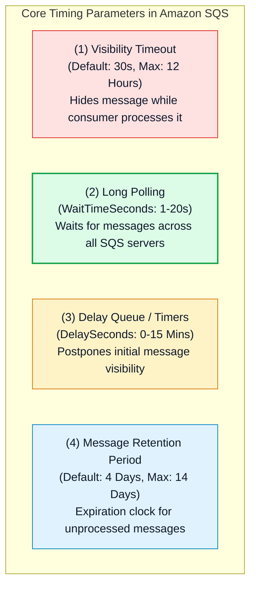
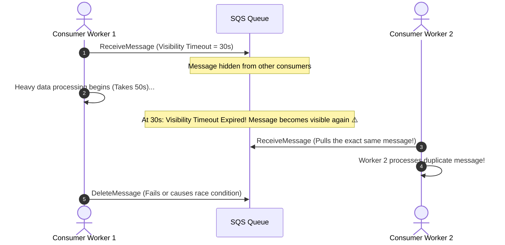
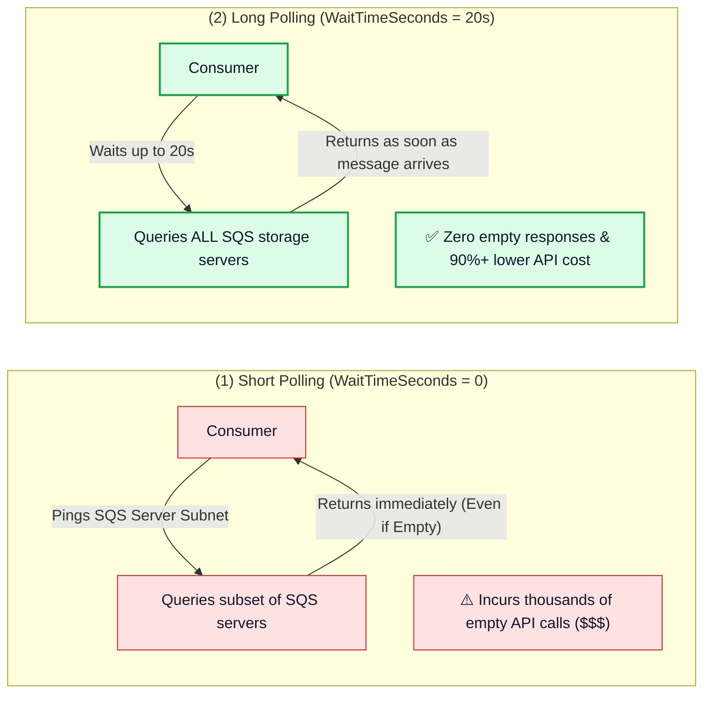

# ⏱️ Amazon SQS Timing Parameters, Visibility Timeout, Long Polling & Delay Queues

- **Category**: Application Integration / Queue Mechanics & Consumer Optimization
- **Language / ဘာသာစကား**: **English (Original)** | [မြန်မာဘာသာ (Burmese)](/mm/02-services/integration/sqs/sqs-timing-parameters-and-polling)
- **Primary Use Case**: Configuring visibility timeouts to prevent duplicate processing, implementing `ChangeMessageVisibility` for long-running ETL jobs, slashing costs with Long Polling, and configuring Delay Queues.
- **Slide Reference**: Pages 499–525 in `[[AWSCertifiedDataEngineerSlides.pdf]]`
- **Hub Links**: `[[index]]` | `[[sqs]]` | `[[sqs-standard-vs-fifo-queues]]` | `[[sqs-dead-letter-queues-and-error-handling]]`

---

## 1. High-Level Summary

Fine-tuning timing parameters in Amazon SQS ensures that message processing remains efficient, resilient to consumer failures, and cost-effective.

For the **DEA-C01** exam, you must master the **Visibility Timeout mechanics**, when to call **`ChangeMessageVisibility`**, how **Long Polling** eliminates empty responses and reduces cloud bills, and how **Delay Queues** postpone message availability.



---

## 2. Visibility Timeout & `ChangeMessageVisibility`

### 1. Visibility Timeout Mechanics:
- When a consumer receives a message using `ReceiveMessage`, the message is **not deleted**.
- Instead, SQS makes the message invisible to other consumers for the duration of the **Visibility Timeout** (Default: **30 seconds**; Range: **0 seconds to 12 hours**).
- **Successful Processing**: The consumer finishes processing and issues `DeleteMessage` before the timeout expires.
- **Consumer Failure / Timeout Expiration**: If the consumer crashes or takes longer than the visibility timeout without deleting the message, the message reappears in the queue for another consumer to process.



---

### 2. Preventing Duplicate Processing: `ChangeMessageVisibility`
When processing unpredictable or heavy data jobs (such as large file decompression, OCR, or complex transformations), the worker can periodically extend its lock on the message by calling the **`ChangeMessageVisibility`** API:

```python
import boto3

sqs = boto3.client('sqs')

# Dynamically extend visibility timeout by another 60 seconds
sqs.change_message_visibility(
    QueueUrl='https://sqs.us-east-1.amazonaws.com/123456789012/my-queue',
    ReceiptHandle=message['ReceiptHandle'],
    VisibilityTimeout=60
)
```

> [!TIP]
> **Production Best Practice**: Implement a background heartbeat thread in your consumer application that calls `ChangeMessageVisibility` every 20 seconds while the job is still actively running.

---

## 3. Short Polling vs. Long Polling



| Dimension | Short Polling (`WaitTimeSeconds = 0`) | Long Polling (`WaitTimeSeconds = 1 to 20`) |
| :--- | :--- | :--- |
| **Server Query Scope** | Samples only a subset of SQS distributed servers. | Queries **all SQS storage servers** across the fleet. |
| **Response Behavior** | Returns immediately, even if no messages are found (**Empty Response**). | Waits up to 20 seconds for a message to arrive before returning. |
| **Cost & Efficiency** | High API invocation costs due to frequent empty polling loops. | **Highly cost-effective**: Eliminates empty responses and reduces API request volume. |
| **Configuration** | Default behavior if no wait time is specified. | Configured via Queue property `ReceiveMessageWaitTimeSeconds` or API parameter `WaitTimeSeconds`. |

---

## 4. Delay Queues vs. Message Timers

Amazon SQS allows you to postpone the visibility of new messages when downstream systems require a cooldown or warm-up period:

| Feature | Scope | Configuration | Common Use Case |
| :--- | :--- | :--- | :--- |
| **Delay Queue** | **Queue-Wide**: Postpones visibility for **all new messages** arriving in the queue. | `DelaySeconds` (0 seconds to 15 minutes, Default: 0). | Giving downstream microservices time to update relational databases before processing background jobs. |
| **Message Timer** | **Per-Message**: Postpones visibility for a **single specific message**. | Producer passes `DelaySeconds` in the `SendMessage` API call (0 to 15 minutes). | Scheduling retry attempts or staggered notification dispatches. |

> [!NOTE]
> SQS FIFO Queues support Delay Queues at the queue level, but **do not support per-message Message Timers**!

---

## 5. Message Retention & Payload Size Limits

1. **Message Retention Period**:
   - Configurable from **1 minute up to 14 days** (Default: **4 days**).
   - Once a message exceeds its retention period, SQS permanently purges it from the queue without invoking a DLQ.
2. **Payload Size Limits**:
   - Native message payload size: Minimum 1 byte, maximum **256 KB** of text (JSON, XML, or unformatted text).
   - **Extended Client Library for Amazon SQS**: Uses **Amazon S3** to store large payloads (from 256 KB up to **2 GB**), storing only a small S3 JSON pointer in the SQS queue message.

---

## 6. DEA-C01 Exam Essentials

> [!IMPORTANT]
> **Key Exam Decision Triggers for SQS Timing & Polling**:
>
> - **"Downstream consumers take 10 minutes to process a message, but the message is delivered to another consumer after 30 seconds"** $\rightarrow$ Increase the queue's default **Visibility Timeout** or call **`ChangeMessageVisibility`** programmatically.
> - **"Reduce costs and eliminate empty JSON responses from SQS polling applications"** $\rightarrow$ Enable **Long Polling** by setting `ReceiveMessageWaitTimeSeconds = 20`.
> - **"Delay all incoming messages by 5 minutes to allow an external database replica to synchronize"** $\rightarrow$ Set the queue's **`DelaySeconds` to 300** (Delay Queue).
> - **"Store and process 50 MB batch payloads using SQS"** $\rightarrow$ Use the **Amazon SQS Extended Client Library for Java / Python** with **Amazon S3**.

---

## 📌 Related Notes
- `[[sqs]]` — SQS Master Hub
- `[[sqs-standard-vs-fifo-queues]]` — Standard vs FIFO Queues
- `[[sqs-dead-letter-queues-and-error-handling]]` — Handling Poison Pills & DLQs
- `[[s3]]` — S3 Object Storage for Extended Payloads
