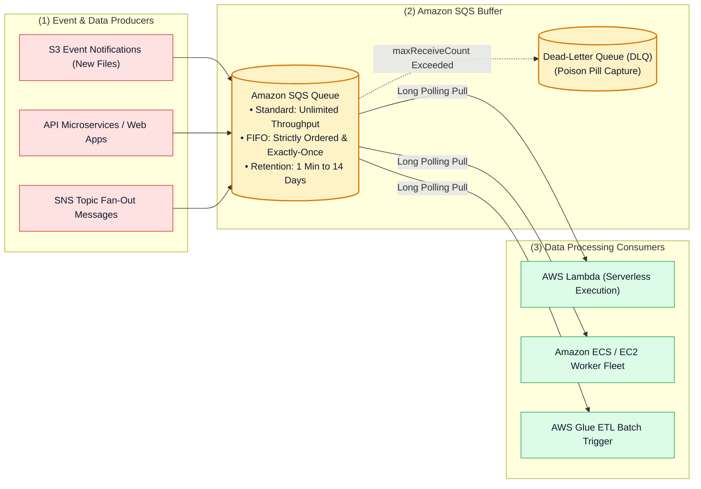
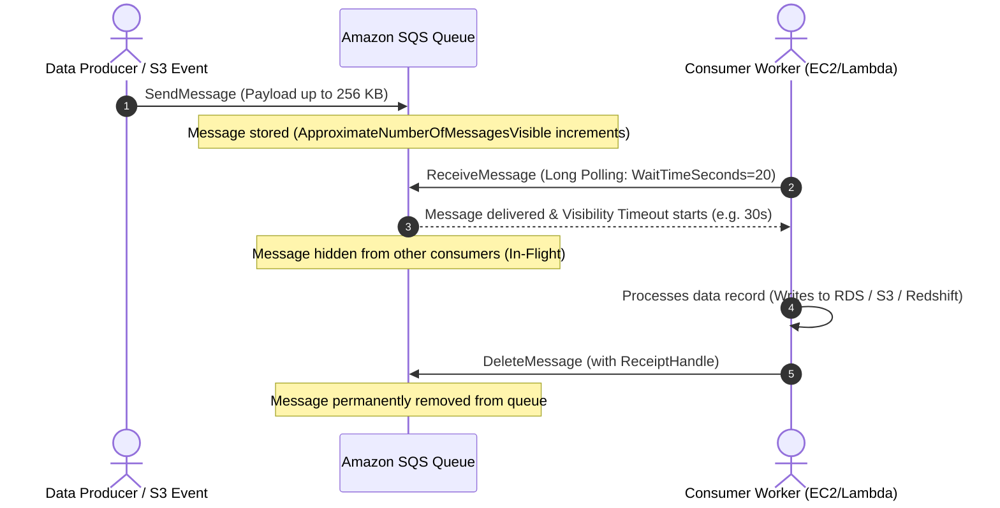

# ✉️ Amazon SQS Hub (Simple Queue Service & Asynchronous Decoupling)

- **Category**: Application Integration / Message Queuing & Distributed Systems Decoupling
- **Language / ဘာသာစကား**: **English (Original)** | [မြန်မာဘာသာ (Burmese)](/mm/02-services/integration/sqs/sqs)
- **Primary Use Case**: Fully managed message queuing, buffering data ingestion spikes, decoupling microservices and ETL pipelines, and enabling reliable asynchronous batch processing.
- **Slide Reference**: Pages 499–525 in `[AWSCertifiedDataEngineerSlides.pdf](/docs/AWSCertifiedDataEngineerSlides.pdf)`
- **Hub Links**: `[[index]]` | `[[service-catalog]]` | `[[domain-1-ingestion-and-processing]]` | `[[domain-3-data-operations-and-support]]` | `[[lambda]]` | `[[s3]]`

---

## 1. High-Level Summary

**Amazon Simple Queue Service (Amazon SQS)** is a fully managed, serverless distributed message queuing service that enables developers and data engineers to decouple and scale microservices, distributed data processing systems, and serverless architectures.

In data engineering pipelines, Amazon SQS acts as a resilient buffer between fast ingestion producers (such as web servers, IoT sensors, or S3 upload events) and downstream consumers (such as AWS Lambda, Amazon ECS workers, or AWS Glue jobs), preventing overload and ensuring zero data loss during traffic spikes.

---

## 2. The SQS Message Lifecycle

Understanding the lifecycle of an SQS message is essential for troubleshooting ingestion pipelines and handling concurrency:

1. **SendMessage**: Producer publishes message with a payload up to **256 KB** (or up to 2 GB using the SQS Extended Client Library with S3).
2. **In-Queue & Available**: Message is visible to consumers.
3. **ReceiveMessage & Visibility Timeout**: A consumer polls and retrieves the message. SQS makes the message invisible to other consumers for the duration of the **Visibility Timeout** (default: 30 seconds).
4. **DeleteMessage**: After successful processing, the consumer issues `DeleteMessage` using the unique **Receipt Handle**. If the consumer fails to delete the message before the visibility timeout expires, the message becomes visible again for reprocessing.

---

## 3. Standard Queues vs. FIFO Queues

| Feature / Dimension | Standard Queue | FIFO (First-In, First-Out) Queue |
| :--- | :--- | :--- |
| **Throughput** | **Unlimited** transactions per second (TPS). | 300 msg/sec (3,000 with batching); up to **70,000 msg/sec** with High Throughput mode. |
| **Delivery Guarantee** | **At-least-once delivery** (occasional duplicate messages). | **Exactly-once processing** (5-minute deduplication window). |
| **Ordering** | **Best-effort ordering** (messages might be delivered out of sequence). | **Strictly ordered** (First-In, First-Out guarantee). |
| **Naming Convention** | Any valid string (e.g. `order-processing-queue`). | **Must end with `.fifo`** (e.g. `order-processing.fifo`). |
| **Required Identifiers** | None required. | **Message Group ID** (ordering partition) & **Message Deduplication ID**. |
| **Primary Use Cases** | Decoupling high-volume microservices, S3 file ingestion, buffering clickstream data. | Financial transactions, e-commerce order processing, sequence-sensitive data streams. |

---

## 4. Modular SQS Deep-Dive Topics

To master Amazon SQS for the **AWS Certified Data Engineer - Associate (DEA-C01)** exam, study the following modular notes:

1. `[[sqs-standard-vs-fifo-queues]]` — **Standard vs. FIFO Queues, Message Group ID, Deduplication ID & High-Throughput Mode**
2. `[[sqs-timing-parameters-and-polling]]` — **Visibility Timeout, ChangeMessageVisibility, Short vs. Long Polling & Delay Queues**
3. `[[sqs-dead-letter-queues-and-error-handling]]` — **Dead-Letter Queues (DLQ), RedrivePolicy, maxReceiveCount, Poison Pill Isolation & DLQ Redrive**
4. `[[sqs-integration-patterns-and-fanout]]` — **SNS + SQS Fan-Out, S3 Event Notifications, Extended Client Library & SQS vs. Kinesis vs. MSK Matrix**
5. `[[sqs-security-monitoring-and-troubleshooting]]` — **Queue Access Policies, KMS Encryption, CloudWatch Backlog Metrics & Production Triage**

---

## 5. DEA-C01 Exam Essentials

> [!IMPORTANT]
> **Key Exam Rules for Amazon SQS**:
>
> - **Decoupling Producers & Consumers**: Use SQS when components process messages at different speeds or when downstream databases need protection from sudden traffic surges.
> - **Eliminating Empty Responses & Reducing Costs**: Always configure **Long Polling** (`ReceiveMessageWaitTimeSeconds = 20`) to save API polling costs and minimize empty JSON responses.
> - **Preventing Duplicate Processing of Long Jobs**: If a consumer requires more time than the default Visibility Timeout (30s) to process a heavy file, call `ChangeMessageVisibility` dynamically.
> - **Handling Poison Pills**: Route unprocessable messages to a **Dead-Letter Queue (DLQ)** by setting a `RedrivePolicy` with `maxReceiveCount` (e.g., 3 to 5 retries).
> - **Strict Sequence Processing**: Choose **SQS FIFO Queues**. Use the **Message Group ID** to maintain strict ordering per entity (e.g., `CustomerId`) while enabling concurrent multi-threaded consumption across distinct groups.

---

## 📌 Related Notes
- `[[sqs-standard-vs-fifo-queues]]` — SQS Standard vs FIFO Architecture
- `[[sqs-timing-parameters-and-polling]]` — Visibility Timeouts & Long Polling
- `[[sqs-dead-letter-queues-and-error-handling]]` — DLQ Configuration & Redrive
- `[[lambda]]` — AWS Lambda SQS Event Source Mapping
- `[[s3-event-notifications]]` — Triggering SQS Queues from S3 Events
