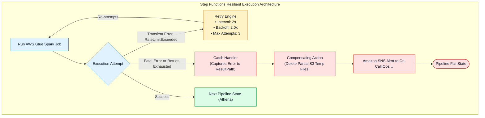

# 🛡️ AWS Step Functions Error Handling, Exponential Backoff Retries & Saga Pattern

- **Category**: Application Integration / Resilient Workflow Execution & Distributed Error Recovery
- **Language / ဘာသာစကား**: **English (Original)** | [မြန်မာဘာသာ (Burmese)](/mm/02-services/integration/step-functions/step-functions-error-handling-retry-and-sagas)
- **Primary Use Case**: Configuring automated `Retry` policies with exponential backoff, isolating failed pipeline states with `Catch` handlers, and implementing the Saga Pattern for distributed compensating transactions.
- **Slide Reference**: Pages 526–529 in `[AWSCertifiedDataEngineerSlides.pdf](/docs/AWSCertifiedDataEngineerSlides.pdf)`
- **Hub Links**: `[[index]]` | `[[step-functions]]` | `[[step-functions-standard-vs-express-workflows]]` | `[[domain-3-data-operations-and-support]]`

---

## 1. High-Level Summary

In distributed data pipelines, transient failures (such as API rate limits, temporary network timeouts, or concurrent job limit exhaustion) are inevitable.

AWS Step Functions provides native, declarative error handling constructs in **Amazon States Language (ASL)**:
- **`Retry`**: Automatically re-attempts failed tasks using configurable exponential backoff parameters.
- **`Catch`**: Routes execution to a designated fallback or error-handling state when all retries are exhausted.
- **`Saga Pattern`**: Coordinates compensating actions across distributed services to maintain state consistency if a later pipeline stage fails.



---

## 2. Declarative `Retry` Mechanics & Exponential Backoff

When transient errors occur, Step Functions evaluates the `Retry` block sequentially:

```json
{
  "Type": "Task",
  "Resource": "arn:aws:states:::glue:startJobRun.sync",
  "Parameters": {
    "JobName": "DailySalesJob"
  },
  "Retry": [
    {
      "ErrorEquals": [
        "Glue.ConcurrentRunsExceededException",
        "States.Timeout"
      ],
      "IntervalSeconds": 2,
      "BackoffRate": 2.0,
      "MaxAttempts": 4
    }
  ],
  "Next": "ProcessResults"
}
```

### Key Parameters:
1. **`ErrorEquals`**: A non-empty list of error names to match (e.g. `States.Timeout`, `States.ALL`, or service-specific errors).
2. **`IntervalSeconds`**: Initial waiting delay before the first retry attempt (e.g., 2 seconds).
3. **`BackoffRate`**: The multiplication factor applied to the previous delay. With an interval of 2s and rate of 2.0, retries occur at: **2s $\rightarrow$ 4s $\rightarrow$ 8s $\rightarrow$ 16s**.
4. **`MaxAttempts`**: Maximum number of retry attempts before executing the `Catch` block (default: 3).

---

## 3. The `Catch` Handler & Error Routing

If all retries fail, or if an unrecoverable error occurs, the `Catch` handler intercepts the exception:

```json
{
  "Catch": [
    {
      "ErrorEquals": ["States.ALL"],
      "Next": "HandlePipelineFailure",
      "ResultPath": "$.errorInfo"
    }
  ]
}
```

- **`ResultPath`**: Injects the error details (error code and cause string) directly into the state's JSON payload, preserving original state data for debugging.
- **Built-in Step Functions Errors**:
  - `States.ALL`: Wildcard matching all errors.
  - `States.Timeout`: State exceeded `TimeoutSeconds`.
  - `States.TaskFailed`: Execution failed in the integrated service.
  - `States.Permissions`: Execution failed due to insufficient IAM privileges.
  - `States.DataLimitExceeded`: Payload exceeded the 256 KB JSON limit.

---

## 4. The Saga Pattern (Compensating Transactions)

In distributed cloud architectures, traditional ACID database transactions cannot span across S3, DynamoDB, Redshift, and external APIs.

### How the Saga Pattern Works in Step Functions:
If a multi-step pipeline fails at Step 4 (e.g., Redshift Data Load fails), Step Functions triggers **Compensating Actions** in reverse order to cleanly undo previously committed side-effects:

```mermaid
graph LR
    S1["(1) S3 Upload ✅"] --> S2["(2) Glue Transform ✅"]
    S2 --> S3["(3) DynamoDB Record ✅"]
    S3 --> S4["(4) Redshift COPY (💥 Fails)"]

    S4 -.->|Catch Handler Triggers Saga| C3["Undo 3: Delete DynamoDB Item"]
    C3 --> C2["Undo 2: Purge Intermediate Glue S3 Path"]
    C2 --> C1["Undo 1: Archive Corrupt Raw File"]

    classDef ok fill:#dcfce7,stroke:#16a34a,stroke-width:1px,color:#0f172a;
    classDef fail fill:#fee2e2,stroke:#dc2626,stroke-width:1px,color:#0f172a;
    classDef undo fill:#fef3c7,stroke:#d97706,stroke-width:1px,color:#0f172a;

    class S1,S2,S3 ok;
    class S4 fail;
    class C3,C2,C1 undo;
```



---

## 5. DEA-C01 Exam Essentials

> [!IMPORTANT]
> **Key Exam Decision Triggers for Error Handling**:
>
> - **"Handle intermittent AWS Glue `ConcurrentRunsExceededException` errors automatically without failing the pipeline"** $\rightarrow$ Add a **`Retry` block with exponential backoff (`BackoffRate: 2.0`)** targeting the specific Glue error code.
> - **"Capture error stack traces and notify the data engineering team via SNS upon pipeline failure"** $\rightarrow$ Configure a **`Catch` block with `States.ALL` and a `ResultPath`**, routing to an Amazon SNS publish state.
> - **"Clean up temporary S3 staging files and roll back database updates when a downstream step fails"** $\rightarrow$ Implement the **Saga Pattern using Step Functions `Catch` blocks and compensating Lambda tasks**.

---

## 📌 Related Notes
- `[[step-functions]]` — Step Functions Master Hub
- `[[step-functions-service-integrations-and-sync-patterns]]` — Service Integrations (.sync)
- `[[domain-3-data-operations-and-support]]` — Incident Triage & Operations
- `[[sns]]` — Amazon SNS Alerting Destinations
