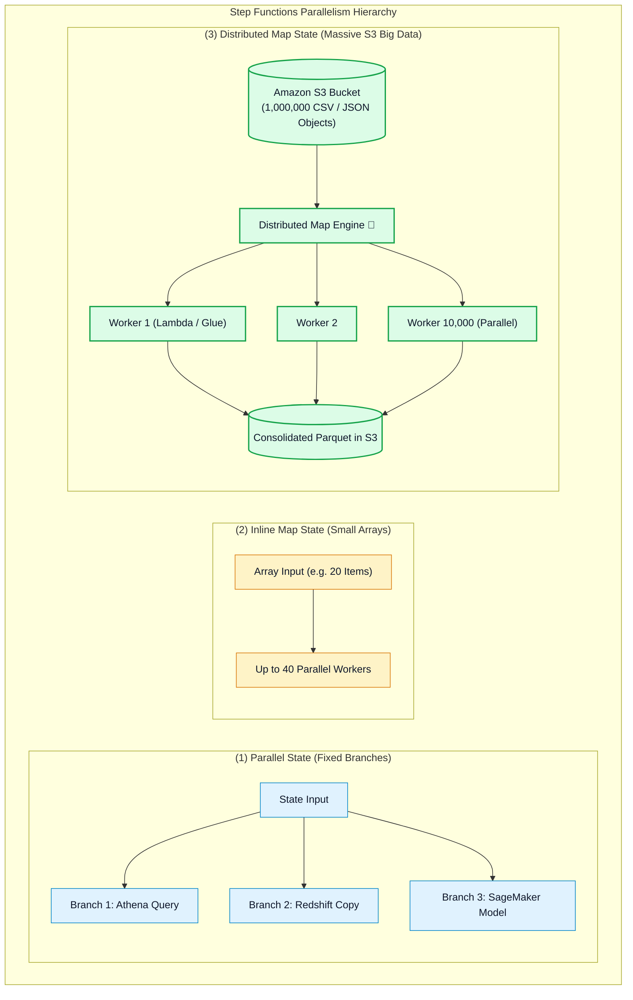
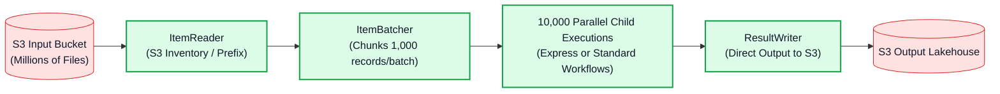

# ⚡ AWS Step Functions Parallel State, Inline Map & High-Throughput Distributed Map

- **Category**: Application Integration / High-Throughput Parallelism & Big Data Processing
- **Language / ဘာသာစကား**: **English (Original)** | [မြန်မာဘာသာ (Burmese)](/mm/02-services/integration/step-functions/step-functions-parallel-and-distributed-map)
- **Primary Use Case**: Choosing between Parallel branching, Inline Map iteration, and Distributed Map to process millions of Amazon S3 objects with up to 10,000 concurrent child executions.
- **Slide Reference**: Pages 526–529 in `[AWSCertifiedDataEngineerSlides.pdf](/docs/AWSCertifiedDataEngineerSlides.pdf)`
- **Hub Links**: `[[index]]` | `[[step-functions]]` | `[[s3]]` | `[[lambda]]` | `[[domain-1-ingestion-and-processing]]`

---

## 1. High-Level Summary

AWS Step Functions supports three distinct mechanisms for parallel execution:
1. **`Parallel` State**: Executes a fixed number of distinct workflow branches simultaneously.
2. **`Inline Map` State**: Iterates over a static array passed in the state input (concurrency up to 40).
3. **`Distributed Map` State**: Purpose-built for big data engineering, allowing serverless state machines to iterate over **millions of objects directly in Amazon S3** with concurrency scaling up to **10,000 parallel child workflow executions**!

---

## 2. Parallel State vs. Inline Map State

### 1. `Parallel` State:
- Used when you have **different tasks** that can run simultaneously.
- *Example*: A daily data pipeline needs to run an Amazon Athena aggregation query, an Amazon Redshift staging copy, and a SageMaker inference validation concurrently before triggering an SNS notification.
- *Behavior*: The state machine waits until **all branches finish successfully** before advancing. If any branch fails without a catch handler, the entire parallel state fails.

### 2. `Inline Map` State:
- Used when you want to execute the **same task across a collection of items**.
- Input array is embedded directly inside the state JSON payload (payload limit: **256 KB**).
- Concurrency limit: Up to **40 parallel child iterations**.

---

## 3. Distributed Map State Deep Dive

Distributed Map transforms AWS Step Functions into a **massive distributed batch compute engine**, eliminating the need to spin up dedicated Spark clusters for simple file-based transformations.

### Key Capabilities:
1. **Direct S3 Integration (`ItemReader`)**: Reads files directly from an S3 bucket or S3 Inventory list without loading items into the state machine input payload.
2. **Item Batching (`ItemBatcher`)**: Groups items into batches (e.g. 500 records per Lambda invocation) to optimize compute cost and execution speed.
3. **Massive Concurrency**: Scales up to **10,000 concurrent child workflow executions**.
4. **Direct S3 Result Writing (`ResultWriter`)**: Automatically streams consolidated execution logs and outputs directly back to Amazon S3.

---

## 4. Comprehensive Parallelism Comparison

| Dimension | Parallel State | Inline Map State | Distributed Map State |
| :--- | :--- | :--- | :--- |
| **Execution Pattern** | Fixed divergent branches. | Dynamic iteration over in-memory array. | **Dynamic iteration over massive external S3 datasets**. |
| **Concurrency Limit** | Number of branches defined in ASL. | Up to **40 iterations**. | Up to **10,000 parallel child executions**. |
| **Input Data Source** | State JSON payload. | State JSON payload (max 256 KB). | **Amazon S3 Objects, S3 Inventory, JSON, CSV files**. |
| **Child Execution Type** | Part of parent state machine. | Part of parent state machine. | **Child Workflows (Standard or Express)**. |
| **Ideal Use Case** | Running Athena + Redshift + Glue in parallel. | Processing 20 customer IDs from a database query. | **Batch processing 500,000 images, logs, or CSV files in S3**. |

---

## 5. DEA-C01 Exam Essentials

> [!IMPORTANT]
> **Key Exam Decision Triggers for Parallelism & Distributed Map**:
>
> - **"Process hundreds of thousands of CSV files in Amazon S3 in parallel without managing an Apache Spark cluster"** $\rightarrow$ Use **AWS Step Functions Distributed Map state** with AWS Lambda workers.
> - **"Execute an Amazon Athena query and an Amazon Redshift COPY command concurrently, and only continue when both have completed"** $\rightarrow$ Use a **`Parallel` state**.
> - **"State input exceeds 256 KB payload limit when passing thousands of records to a Map state"** $\rightarrow$ Switch from Inline Map to **Distributed Map with an Amazon S3 `ItemReader`**.
> - **"Control maximum parallel executions to avoid overwhelming a downstream RDS database"** $\rightarrow$ Set the **`MaxConcurrency` parameter** on the Map state.

---

## 📌 Related Notes
- `[[step-functions]]` — Step Functions Master Hub
- `[[step-functions-standard-vs-express-workflows]]` — Standard vs Express Workflows
- `[[s3]]` — Amazon S3 Big Data Lake Storage
- `[[lambda]]` — AWS Lambda Serverless Workers
