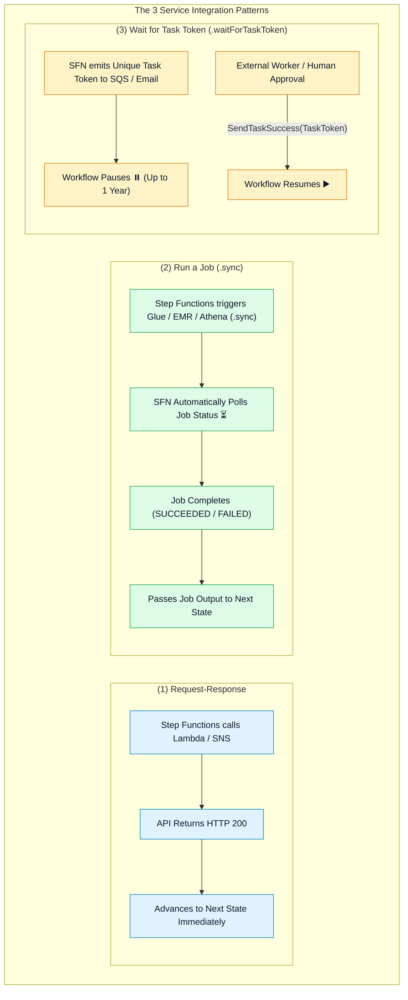
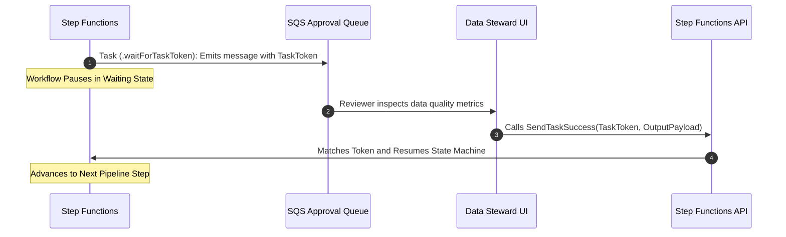

# 🔗 AWS Step Functions Service Integrations, Sync Patterns (.sync) & Task Tokens

- **Category**: Application Integration / Service Integration Patterns & Synchronous Polling
- **Language / ဘာသာစကား**: **English (Original)** | [မြန်မာဘာသာ (Burmese)](/mm/02-services/integration/step-functions/step-functions-service-integrations-and-sync-patterns)
- **Primary Use Case**: Coordinating asynchronous big data jobs (AWS Glue, Amazon EMR, Amazon Athena, Amazon Redshift) using `.sync` integrations and handling human approvals with `.waitForTaskToken`.
- **Slide Reference**: Pages 526–529 in `[AWSCertifiedDataEngineerSlides.pdf](/docs/AWSCertifiedDataEngineerSlides.pdf)`
- **Hub Links**: `[[en/index|index]]` | `[[en/02-services/integration/step-functions/step-functions|step-functions]]` | `[[en/02-services/integration/step-functions/step-functions-standard-vs-express-workflows|step-functions-standard-vs-express-workflows]]` | `[[en/02-services/analytics-streaming/glue/glue|glue]]` | `[[en/02-services/analytics-streaming/emr/emr|emr]]` | `[[en/02-services/analytics-streaming/athena/athena|athena]]`

---

## 1. High-Level Summary

When orchestrating data pipelines with AWS Step Functions, different AWS services operate under different response behaviors. Step Functions provides three distinct **Service Integration Patterns**:

1. **Request-Response (Default)**: Calls the service API and immediately progresses to the next state without waiting for downstream task completion.
2. **Run a Job (`.sync`)**: Step Functions starts the job and **automatically manages polling behind the scenes**, waiting until the job completes before advancing to the next state.
3. **Wait for a Task Token (`.waitForTaskToken`)**: Pauses the workflow indefinitely until an external worker or human approver sends back a callback token.



---

## 2. Optimized Integrations: The `.sync` Pattern

In traditional architectures without Step Functions `.sync`, data engineers had to write custom Lambda functions and DynamoDB polling loops to check when an AWS Glue Spark job or EMR cluster finished.

### How `.sync` Works:
- Appending `.sync` to the Resource ARN (e.g. `arn:aws:states:::glue:startJobRun.sync`) instructs Step Functions to **handle all status polling automatically**.
- Step Functions monitors the underlying service, catches job failures, extracts execution metrics, and passes the result payload to downstream states.

### Common `.sync` Task Definitions:
```json
{
  "Type": "Task",
  "Resource": "arn:aws:states:::glue:startJobRun.sync",
  "Parameters": {
    "JobName": "DailySalesAggregationJob",
    "Arguments": {
      "--year": "2026",
      "--quarter": "Q3"
    }
  },
  "Next": "RunAthenaQuery"
}
```

---

## 3. Wait for Task Token (`.waitForTaskToken`) Pattern

For data engineering pipelines that require **human approval**, data stewardship checks, or coordination with on-premises legacy systems:



---

## 4. Integration Patterns Comparison Matrix

| Integration Pattern | Resource ARN Suffix | State Progression | Use Case in Data Engineering |
| :--- | :--- | :--- | :--- |
| **Request-Response** | `arn:aws:states:::lambda:invoke` | Moves to next state immediately after API invocation. | Triggering fast Lambda validations, sending SNS notifications, DynamoDB writes. |
| **Run a Job (`.sync`)** | `arn:aws:states:::glue:startJobRun.sync` | **Pauses and polls automatically** until job reaches terminal status. | Running AWS Glue jobs, Amazon EMR steps, Athena queries, and Redshift SQL statements. |
| **Wait for Task Token** | `arn:aws:states:::sqs:sendMessage.waitForTaskToken` | **Pauses workflow indefinitely** until `SendTaskSuccess` callback API is executed. | Human data quality approvals, integration with external legacy on-prem systems. |

---

## 5. DEA-C01 Exam Essentials

> [!IMPORTANT]
> **Key Exam Decision Triggers for Service Integrations**:
>
> - **"Execute an AWS Glue ETL job and wait for completion before running an Amazon Athena query, with zero custom polling code"** $\rightarrow$ Configure the Step Functions task using **`arn:aws:states:::glue:startJobRun.sync`**.
> - **"Pause a data pipeline until a data steward verifies data quality and approves the load"** $\rightarrow$ Use **`.waitForTaskToken`** on the task state and call **`SendTaskSuccess`** upon approval.
> - **"What happens if you omit `.sync` when configuring a Glue task?"** $\rightarrow$ Step Functions calls `glue:startJobRun` (Request-Response) and immediately advances to the next state while the Glue job is still initializing in the background.

---

## 📌 Related Notes
- `[[en/02-services/integration/step-functions/step-functions|step-functions]]` — Step Functions Master Hub
- `[[en/02-services/integration/step-functions/step-functions-standard-vs-express-workflows|step-functions-standard-vs-express-workflows]]` — Standard vs Express Workflows
- `[[en/02-services/analytics-streaming/glue/glue|glue]]` — AWS Glue ETL & Spark Jobs
- `[[en/02-services/analytics-streaming/athena/athena|athena]]` — Amazon Athena Query Orchestration
