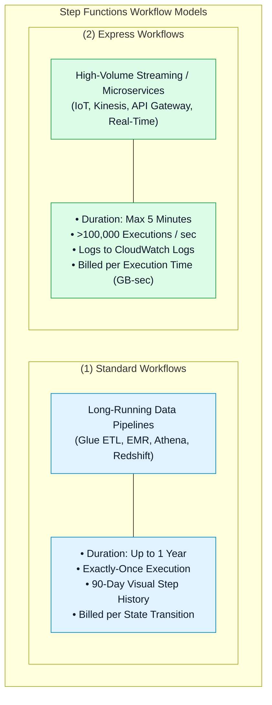

# ⚖️ AWS Step Functions Standard vs. Express Workflows & Cost Architecture

- **Category**: Application Integration / Workflow Types, Execution Guarantees & Pricing
- **Language / ဘာသာစကား**: **English (Original)** | [မြန်မာဘာသာ (Burmese)](/mm/02-services/integration/step-functions/step-functions-standard-vs-express-workflows)
- **Primary Use Case**: Choosing between Standard and Express workflow types based on duration, throughput, execution semantics, and cost efficiency.
- **Slide Reference**: Pages 526–529 in `[AWSCertifiedDataEngineerSlides.pdf](/docs/AWSCertifiedDataEngineerSlides.pdf)`
- **Hub Links**: `[[index]]` | `[[step-functions]]` | `[[step-functions-service-integrations-and-sync-patterns]]` | `[[domain-1-ingestion-and-processing]]`

---

## 1. High-Level Summary

AWS Step Functions provides two distinct workflow types optimized for different workload profiles: **Standard Workflows** and **Express Workflows**.

Choosing between Standard and Express is one of the most frequently tested topics on the **DEA-C01** exam. Standard Workflows are designed for **long-running, audited, exactly-once batch ETL processes**, while Express Workflows are designed for **high-throughput, sub-5-minute streaming event processing**.

---

## 2. Standard Workflows Deep Dive

Standard Workflows are the default state machine type in Step Functions:

1. **Maximum Duration**: Can run for **up to 1 year**, making them suitable for long-running batch jobs, multi-stage data pipelines, and manual human approvals.
2. **Execution Guarantee**: **Exactly-once execution** (each step is guaranteed to run precisely once unless a retry is configured).
3. **Observability & Auditing**: Detailed step-by-step visual execution history is preserved in the AWS Management Console for **90 days**.
4. **Pricing Architecture**: Billed strictly per **State Transition** (\$0.025 per 1,000 state transitions).
5. **Key Use Cases**:
   - Orchestrating AWS Glue ETL jobs and waiting for completion.
   - Submitting EMR cluster steps and monitoring status.
   - Long-running financial month-end reconciliations.
   - Multi-step approval workflows using Task Tokens (`.waitForTaskToken`).

---

## 3. Express Workflows Deep Dive

Express Workflows are purpose-built for high-volume, event-driven microservices and fast data ingestion:

1. **Maximum Duration**: **Up to 5 minutes** per execution.
2. **Extreme Throughput**: Scales to **over 100,000 executions per second**.
3. **Execution Modes**:
   - **Asynchronous Express Workflows**: Executes in the background with **at-least-once** delivery semantics. Returns an execution ARN immediately.
   - **Synchronous Express Workflows**: Executes immediately and **holds the connection open to return the response payload directly** to the caller (ideal for API Gateway REST endpoints). Semantics are **at-most-once**.
4. **Observability**: Execution history is **streamed directly to Amazon CloudWatch Logs** (no step-by-step visual console viewer).
5. **Pricing Architecture**: Billed per **request count (\$1.00 per 1M requests)** and **compute duration (GB-seconds)** based on memory consumed.

---

## 4. Standard vs. Express Definitive Comparison

| Architectural Dimension | Standard Workflows | Express Workflows |
| :--- | :--- | :--- |
| **Max Execution Time** | **Up to 1 year** | **Up to 5 minutes** |
| **Execution Rate** | Up to 2,000 / sec | **Over 100,000 / sec** |
| **Execution Guarantee** | **Exactly-once** | At-least-once (Async) / At-most-once (Sync) |
| **Pricing Model** | \$0.025 per 1,000 State Transitions | \$1.00 / 1M requests + duration (GB-seconds) |
| **Execution History** | Visual step history in Console (90 days) | Streamed to **Amazon CloudWatch Logs** |
| **Service Integration Modes** | Supports `.sync`, Request-Response, and `.waitForTaskToken` | Supports Request-Response and `.sync` (limited) |
| **Synchronous Execution** | No (Always Asynchronous) | **Yes** (StartSyncExecution supported) |
| **Ideal Workload** | **Big Data ETL, EMR, Glue, Human Approvals** | **IoT Ingestion, Streaming Transforms, APIs** |

---

## 5. DEA-C01 Exam Essentials

> [!IMPORTANT]
> **Key Exam Decision Triggers for Workflow Types**:
>
> - **"Orchestrate a daily AWS Glue Spark ETL job that takes 45 minutes to complete"** $\rightarrow$ Choose **Standard Workflows** (Express workflows timeout after 5 minutes).
> - **"Process 50,000 IoT sensor events per second with high throughput and low cost"** $\rightarrow$ Choose **Express Workflows** (handles >100k TPS at fraction of cost).
> - **"Need visual step-by-step auditing and execution history in the console for compliance"** $\rightarrow$ Choose **Standard Workflows** (stores 90 days in console).
> - **"Trigger a state machine synchronously from an Amazon API Gateway REST endpoint and return the result to the caller"** $\rightarrow$ Choose **Synchronous Express Workflows**.
> - **"Pause workflow execution and wait up to 3 days for a data steward to approve a dataset"** $\rightarrow$ Choose **Standard Workflows with `.waitForTaskToken`**.

---

## 📌 Related Notes
- `[[step-functions]]` — Step Functions Master Hub
- `[[step-functions-service-integrations-and-sync-patterns]]` — Service Integrations (.sync)
- `[[glue]]` — AWS Glue ETL Orchestration
- `[[kinesis-data-streams]]` — Streaming Ingestion with Express Workflows
