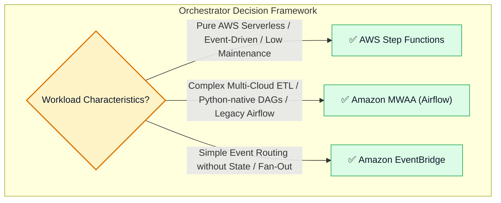

# 🔍 AWS Step Functions vs. Amazon MWAA (Airflow), Observability & Troubleshooting

- **Category**: Application Integration / Orchestrator Comparison, Observability & Production Triage
- **Language / ဘာသာစကား**: **English (Original)** | [မြန်မာဘာသာ (Burmese)](/mm/02-services/integration/step-functions/step-functions-vs-mwaa-and-troubleshooting)
- **Primary Use Case**: Choosing between AWS Step Functions and Amazon MWAA (Apache Airflow), configuring CloudWatch and AWS X-Ray monitoring, and resolving common production state machine errors.
- **Slide Reference**: Pages 526–529 in `[AWSCertifiedDataEngineerSlides.pdf](/docs/AWSCertifiedDataEngineerSlides.pdf)`
- **Hub Links**: `[[en/index|index]]` | `[[en/02-services/integration/step-functions/step-functions|step-functions]]` | `[[en/02-services/integration/mwaa-airflow|mwaa-airflow]]` | `[[en/02-services/networking-monitoring/cloudwatch-and-eventbridge|cloudwatch-and-eventbridge]]` | `[[en/01-domains/domain-3-data-operations-and-support|domain-3-data-operations-and-support]]`

---

## 1. High-Level Summary

A primary architectural decision in the **DEA-C01** exam is selecting the appropriate data orchestration service: **AWS Step Functions** (serverless, event-driven state machines) or **Amazon MWAA / Apache Airflow** (Python-based, complex programmatic DAG orchestration).

Additionally, data engineers must understand how to monitor workflows using **Amazon CloudWatch** and **AWS X-Ray**, and how to debug common runtime issues such as **`States.DataLimitExceeded`** and **task timeout failures**.

---

## 2. Step Functions vs. Amazon MWAA vs. EventBridge

| Architectural Dimension | AWS Step Functions | Amazon MWAA (Apache Airflow) | Amazon EventBridge |
| :--- | :--- | :--- | :--- |
| **Primary Paradigm** | **Serverless State Machine** orchestration. | **Programmatic Python DAG** workflow engine. | **Stateless Event Router** & Event Bus. |
| **Definition Model** | **Amazon States Language (ASL - JSON)** / Visual Workflow Studio. | **Python Code (DAGs)**. | **JSON Event Pattern Rules**. |
| **Infrastructure Management** | **100% Serverless** (Zero infrastructure, zero server provisioning). | Managed EC2/Fargate instances (Webservers, Workers, Schedulers). | **100% Serverless**. |
| **Ecosystem & Connectors** | Native **AWS Service Integrations** (.sync for Glue, EMR, Athena). | **Vast Open-Source Provider Ecosystem** (Snowflake, Databricks, GCP, Azure). | Native AWS targets & 300+ SaaS event sources. |
| **Data Lineage & Backfills** | Basic CloudWatch logs / X-Ray traces. | **Rich UI for historical backfills**, task reruns, and lineage. | None. |
| **Throughput & Speed** | Sub-millisecond state transitions, Express workflows >100k TPS. | Polling-based scheduling latency (seconds to minutes). | Sub-second event routing. |
| **Cost Model** | Pay-per-state-transition (Standard) or duration (Express). | Hourly base fee for environment + worker instance hours. | Pay-per-million events routed. |

---

## 3. Observability: CloudWatch Metrics & AWS X-Ray Tracing

### Key Amazon CloudWatch Metrics:
- **`ExecutionsFailed`**: Count of state machine executions that terminated in failure (triggers operational alarms).
- **`ExecutionsTimedOut`**: Count of executions that exceeded their configured timeout limit.
- **`ExecutionTime`**: Total time taken by state machines to finish (tracks pipeline performance degradation).
- **`ExecutionsSucceeded`**: Count of successful runs.

### AWS X-Ray Tracing:
- Enabling **AWS X-Ray Tracing** on a Step Functions state machine provides an end-to-end distributed trace map.
- Helps visualize latency bottlenecks across Lambda, API calls, and downstream database operations.

---

## 4. Master Troubleshooting Cheat Sheet

| Production Error / Symptom | Root Cause | Remediation & Fix |
| :--- | :--- | :--- |
| **`States.DataLimitExceeded`** | State payload exceeded the **256 KB JSON limit** (e.g. passing a huge array directly in state input). | **Offload heavy payload to Amazon S3** and pass only the `s3://` URI between states, or switch to **Distributed Map**. |
| **Downstream state fails because S3 data is missing (Race Condition)** | The upstream task used default Request-Response instead of waiting for job completion. | Append **`.sync`** to the Task Resource ARN (e.g., `arn:aws:states:::glue:startJobRun.sync`). |
| **Task fails with `States.Timeout`** | Task exceeded the default or configured `TimeoutSeconds`. | Increase `TimeoutSeconds` or check if the underlying Lambda / Glue job is hanging. |
| **Task fails with `States.Permissions`** | Step Functions execution role lacks IAM permissions for the target service API. | Attach required IAM policy granting `glue:StartJobRun`, `athena:StartQueryExecution`, etc., to the Step Functions Role. |
| **Express Workflow steps cannot be inspected in Console** | Express workflows do not store visual execution history in the console. | Enable **CloudWatch Logs integration** in the Express state machine settings and inspect CloudWatch log streams. |

---

## 5. DEA-C01 Exam Essentials

> [!IMPORTANT]
> **Key Exam Decision Triggers for Orchestrator Selection & Triage**:
>
> - **"Choose between Step Functions and Airflow for an engineering team that writes all data pipelines exclusively in Python with complex DAG dependencies across multi-cloud systems"** $\rightarrow$ Choose **Amazon MWAA (Managed Workflows for Apache Airflow)**.
> - **"Choose an orchestration service that requires ZERO server management, provides serverless visual workflows, and natively integrates with AWS Glue `.sync`"** $\rightarrow$ Choose **AWS Step Functions**.
> - **"Resolve `States.DataLimitExceeded` error in Step Functions"** $\rightarrow$ **Store the large payload in Amazon S3** and pass the S3 object reference in the state payload.
> - **"Ensure a Step Functions task waits for an AWS Glue job to finish before triggering Athena"** $\rightarrow$ Use the **Optimized Integration pattern (`glue:startJobRun.sync`)**.

---

## 📌 Related Notes
- `[[en/02-services/integration/step-functions/step-functions|step-functions]]` — Step Functions Master Hub
- `[[en/02-services/integration/mwaa-airflow|mwaa-airflow]]` — Amazon MWAA Deep-Dive Suite
- `[[en/02-services/integration/step-functions/step-functions-service-integrations-and-sync-patterns|step-functions-service-integrations-and-sync-patterns]]` — Service Integrations (.sync)
- `[[en/01-domains/domain-3-data-operations-and-support|domain-3-data-operations-and-support]]` — CloudWatch & Incident Triage
