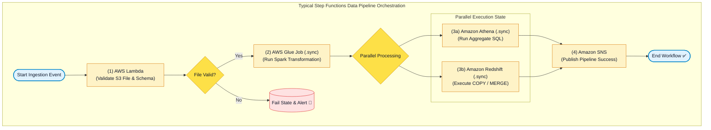

# 🔄 AWS Step Functions Hub (Serverless Visual Workflow Orchestration)

- **Category**: Application Integration / Serverless Workflow Orchestration & Data Pipeline Coordination
- **Language / ဘာသာစကား**: **English (Original)** | [မြန်မာဘာသာ (Burmese)](/mm/02-services/integration/step-functions/step-functions)
- **Primary Use Case**: Coordinating complex, multi-step ETL workflows, data processing pipelines (AWS Glue, Amazon EMR, Amazon Athena, AWS Lambda, Amazon Redshift), and automated error handling with serverless state machines.
- **Slide Reference**: Pages 526–529 in `[AWSCertifiedDataEngineerSlides.pdf](/docs/AWSCertifiedDataEngineerSlides.pdf)`
- **Hub Links**: `[[index]]` | `[[service-catalog]]` | `[[domain-1-ingestion-and-processing]]` | `[[domain-3-data-operations-and-support]]` | `[[glue]]` | `[[emr]]` | `[[lambda]]`

---

## 1. High-Level Summary

**AWS Step Functions** is a fully managed, low-code serverless visual workflow service used to orchestrate distributed applications, automate complex processes, and coordinate data processing jobs across AWS services.

In modern cloud data engineering architectures, Step Functions serves as the **serverless state machine backbone**. It replaces brittle custom orchestrators and cron scripts by providing visual state transitions, native AWS service integrations (such as `.sync` optimized jobs for Glue and EMR), automated exponential backoff retries, error catching, parallel branching, and massive dataset iteration using **Distributed Map**.

---

## 2. Core Concepts & Amazon States Language (ASL)

State machines in Step Functions are declared using **Amazon States Language (ASL)**, a structured JSON-based specification language.

### Core ASL State Types:
1. **`Task`**: Performs a unit of work by invoking an AWS service (e.g. executing a Lambda function, running a Glue ETL job, or starting an EMR cluster).
2. **`Choice`**: Evaluates Boolean logic conditions (e.g. `StringEquals`, `NumericGreaterThan`) to branch into different execution paths.
3. **`Wait`**: Delays workflow execution for a fixed duration (`Seconds`) or until a specific timestamp (`TimestampPath`).
4. **`Pass`**: Passes its input to its output without performing work; often used to transform JSON shapes or inject mock data.
5. **`Parallel`**: Executes multiple branches of states concurrently and waits until all branches finish.
6. **`Map`**: Iterates over a collection of items, executing states for each item (supports **Inline Map** and **Distributed Map**).
7. **`Fail` / `Succeed`**: Explicitly terminates the workflow with an error or success status.

---

## 3. High-Yield Data Engineering Integrations

| AWS Service | Integration Type | DEA-C01 Pipeline Use Case |
| :--- | :--- | :--- |
| **AWS Glue** | `glue:startJobRun.sync` | Running Spark ETL jobs and automatically waiting for completion before downstream tasks. |
| **Amazon EMR / EMR Serverless** | `emr-serverless:startJobRun.sync` | Provisioning ephemeral Spark/Hive clusters and submitting big data analysis jobs. |
| **Amazon Athena** | `athena:startQueryExecution.sync` | Executing analytical SQL queries over S3 data lakes and checking execution status. |
| **Amazon Redshift** | `redshift-data:executeStatement.sync` | Running asynchronous SQL commands, staging data, and executing `MERGE` upserts. |
| **AWS Lambda** | `lambda:invoke` | Lightweight schema validation, metadata lookups, and token generation. |
| **Amazon EventBridge & SNS** | `sns:publish`, `events:putEvents` | Triggering alert notifications or broadcasting downstream completion events. |

---

## 4. Modular Step Functions Deep-Dive Topics

To master AWS Step Functions for the **AWS Certified Data Engineer - Associate (DEA-C01)** exam, study the following modular notes:

1. `[[step-functions-standard-vs-express-workflows]]` — **Standard vs. Express Workflows, Execution Models & Cost Architecture**
2. `[[step-functions-service-integrations-and-sync-patterns]]` — **Service Integrations: `.sync`, Request-Response, Task Tokens, Glue, EMR & Athena Pipelines**
3. `[[step-functions-parallel-and-distributed-map]]` — **Parallel State, Inline Map & High-Throughput Distributed Map for S3 Big Data**
4. `[[step-functions-error-handling-retry-and-sagas]]` — **Error Handling, Exponential Backoff Retries, Catchers & Saga Pattern**
5. `[[step-functions-vs-mwaa-and-troubleshooting]]` — **Step Functions vs. Apache Airflow / MWAA Matrix, Observability, CloudWatch & X-Ray**

---

## 5. DEA-C01 Exam Essentials

> [!IMPORTANT]
> **Key Exam Rules for AWS Step Functions**:
>
> - **Orchestrate Multi-Service Data Pipelines Serverlessly**: Whenever an exam question asks to coordinate **Lambda, Glue, EMR, Athena, and Redshift** with automated retries and zero server maintenance, choose **AWS Step Functions**.
> - **Long-Running Workflows (Hours/Days)**: Standard Workflows can run for **up to 1 year** with visual state tracking and exactly-once execution.
> - **Eliminate Custom Polling Logic**: Use **Optimized Service Integrations (`.sync`)** so Step Functions automatically monitors Glue/EMR job status and resumes only upon job completion.
> - **Process Millions of S3 Objects in Parallel**: Use **Step Functions Distributed Map** (scales up to 10,000 parallel executions).
> - **Automate Error Recovery**: Configure `Retry` blocks with exponential backoff (`BackoffRate`) to handle transient service throttling automatically.

---

## 📌 Related Notes
- `[[step-functions-standard-vs-express-workflows]]` — Standard vs Express Workflows
- `[[step-functions-service-integrations-and-sync-patterns]]` — Service Integrations (.sync)
- `[[step-functions-parallel-and-distributed-map]]` — Distributed Map for Big Data
- `[[glue]]` — AWS Glue Spark ETL Jobs
- `[[emr]]` — Amazon EMR Big Data Processing
- `[[mwaa-airflow]]` — Managed Airflow vs Step Functions
