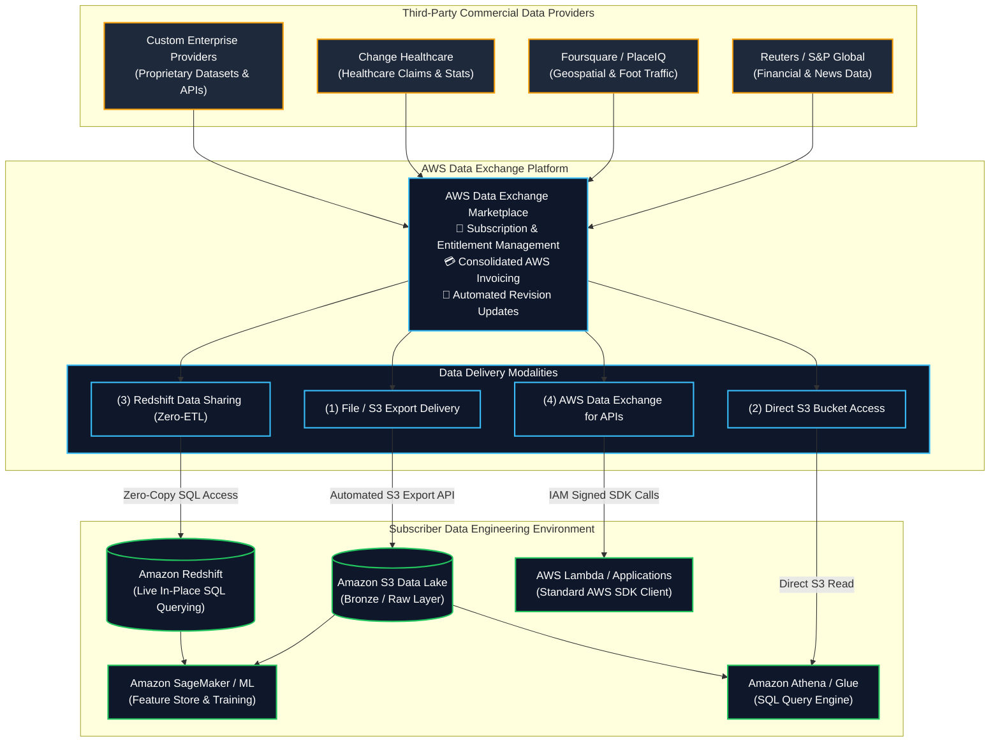
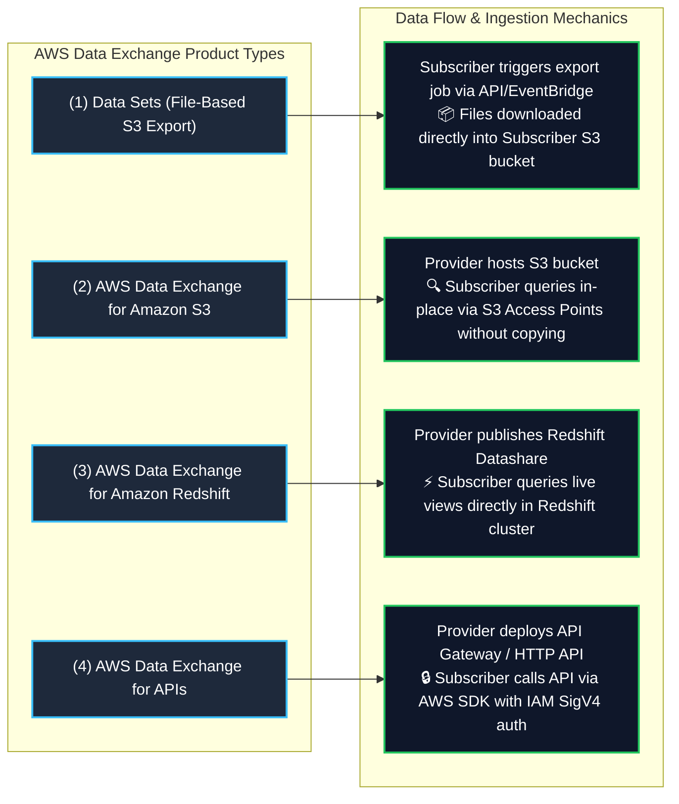
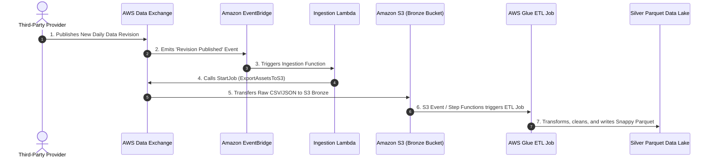

# 🌐 AWS Data Exchange (Third-Party Cloud Data Ingestion & Licensing)

- **Category**: Migration & Transfer (Third-Party Data Ingestion, Data Marketplace & Data Licensing)
- **Language / ဘာသာစကား**: **English (Original)** | [မြန်မာဘာသာ (Burmese)](/mm/02-services/migration/data-exchange)
- **Primary Use Case**: Finding, subscribing to, and seamlessly loading third-party external datasets into [[s3]], querying external data directly in [[redshift]] without ETL, and invoking third-party APIs using native AWS IAM governance.
- **Slide Reference**: Pages 281–283 in `[[AWSCertifiedDataEngineerSlides.pdf]]`
- **Hub Links**: [[index]] | [[service-catalog]] | [[domain-1-ingestion-and-processing]] | [[domain-2-data-store-management]] | [[s3]] | [[redshift]] | [[lake-formation]]

---

## 1. High-Level Summary

**AWS Data Exchange** makes it easy to find, subscribe to, and use thousands of third-party datasets from commercial providers (such as Reuters, Dun & Bradstreet, Foursquare, Change Healthcare, S&P Global) in the cloud. Instead of managing custom SFTP pipelines, one-off API credentials, or physical media contracts, AWS Data Exchange standardizes data delivery, automated updates, billing, and governance natively within AWS.

For the **AWS Certified Data Engineer – Associate (DEA-C01)** exam, you must master:
1. **Core Data Ingestion into Amazon S3**: Automating exports of newly published dataset revisions into [[s3]] data lakes for downstream processing by [[glue]], [[athena]], and [[emr]].
2. **AWS Data Exchange for Amazon Redshift**: Querying live, third-party data directly from [[redshift]] tables **without copying data or building ETL pipelines** (powered by Redshift Data Sharing).
3. **AWS Data Exchange for Amazon S3**: Directly accessing and querying provider-managed S3 buckets without copying multi-terabyte datasets to your account.
4. **AWS Data Exchange for APIs**: Calling third-party REST APIs with standardized **AWS SDKs**, native IAM authentication, and consolidated AWS billing.
5. **Data Lake & ML Integrations**: Combining external market/financial/demographic data with internal operational datasets for machine learning in Amazon SageMaker and analytics in [[quicksight]].



---

## 2. Core Delivery Modalities & Architecture

AWS Data Exchange provides four native delivery mechanisms tailored for specific data engineering consumption models:



### 1. File-Based Revisions Export to Amazon S3
- **Data Model**: Data is published as **Data Sets** containing chronological **Revisions**, which contain individual **Assets** (CSV, JSON, Parquet files).
- **Automation**: When a data provider publishes a new revision (e.g., daily market close prices), an Amazon EventBridge event is emitted.
- **Workflow**: An AWS Lambda function or AWS Step Functions workflow catches the event and invokes `SendRevisionAsyncJob` to copy the revision assets directly into your target **Amazon S3** Data Lake bucket.

### 2. AWS Data Exchange for Amazon S3 (Zero-Copy S3 Access)
- Allows data subscribers to access provider-managed S3 object data **directly from S3 without copying the files into their own account**.
- Subscribers use standard S3 APIs, Amazon Athena, AWS Glue, or Amazon EMR to read the objects in-place.
- Eliminates storage replication costs, S3 data transfer overhead, and file synchronization pipelines.

### 3. AWS Data Exchange for Amazon Redshift (Direct SQL Querying)
- Enables subscribers to query live third-party tables and views directly within their **Amazon Redshift** data warehouse within minutes of subscribing.
- **Powered by Redshift Data Sharing**:
  - Zero-ETL, zero-copy architecture.
  - Queries run securely across AWS accounts without data moving over the public internet.
  - As soon as the provider updates their Redshift data, the changes are **immediately visible to subscriber SQL queries**.
  - Subscribers can easily `JOIN` external third-party datasets with internal transactional data tables in standard SQL.

```sql
-- Query external third-party demographic data directly in Amazon Redshift
SELECT 
    c.customer_id,
    c.zip_code,
    c.lifetime_spend,
    adx_demo.median_household_income,
    adx_demo.purchasing_power_index
FROM internal_schema.customers c
JOIN "third_party_demographics_datashare"."public"."us_income_metrics" adx_demo
    ON c.zip_code = adx_demo.zip_code
WHERE adx_demo.median_household_income > 85000;
```

### 4. AWS Data Exchange for APIs (Managed REST APIs)
- Standardizes how developers and data engineers invoke third-party REST APIs.
- **Key Advantages**:
  - **No API Key Management**: Eliminates managing third-party API tokens, secret keys, or custom headers in code.
  - **Native IAM Authentication**: Requests are signed using standard AWS IAM credentials (Signature Version 4 - SigV4).
  - **Unified SDK**: Use standard AWS SDKs (`aws-sdk`, `boto3`) to make API calls.
  - **Consolidated Billing**: API usage charges appear directly on the regular AWS monthly invoice.

---

## 3. High-Yield Data Engineering Architecture Patterns

### Pattern A: Automated Third-Party Data Lake Ingestion Pipeline



### Pattern B: Real-Time Financial Market Enrichment in Amazon Redshift
- **Scenario**: A fintech platform needs to enrich customer portfolio transactions with real-time foreign exchange (FX) rates and stock market ticker feeds provided by a commercial financial vendor.
- **Solution**: Subscribe to the financial data product via **AWS Data Exchange for Amazon Redshift**.
- **Architecture**:
  - Subscribe to the vendor's Redshift Data Share on AWS Data Exchange.
  - Mount the datashare as a database reference in Amazon Redshift:
    ```sql
    CREATE DATABASE market_data FROM DATA EXCHANGE 'arn:aws:dataexchange:us-east-1:...';
    ```
  - Data analysts and BI dashboards ([[quicksight]]) run real-time join queries against the external database with **zero latency and zero ETL overhead**.

---

## 4. Multi-Product Comparison Matrix

| Product Offering | Ingestion Latency | Subscriber Storage Cost | Compute Overhead | Best DEA-C01 Use Case |
| :--- | :--- | :--- | :--- | :--- |
| **AWS Data Exchange for S3 (Export)** | Batch / Scheduled (Minutes) | Subscriber pays standard S3 storage fees | Low (Batch S3 copy) | Standard data lake ingestion where files must be archived in internal compliance buckets. |
| **AWS Data Exchange for S3 (Direct)** | Real-Time (Immediate) | **$0** for base storage (Provider hosts) | Zero (Query in-place via Athena/EMR) | Petabyte-scale datasets where duplicating data to subscriber account is cost-prohibitive. |
| **AWS Data Exchange for Redshift** | **Near Real-Time (< 1 second)** | **$0** (No storage duplication) | Zero ETL; uses Redshift query compute | Instant SQL joins between internal data warehouse tables and external third-party market data. |
| **AWS Data Exchange for APIs** | Real-Time / Request-Response | **$0** (Transient payload) | Standard application execution (Lambda/EC2) | Real-time single-record lookups (identity verification, live credit scoring, real-time address validation). |

---

## 5. High-Yield DEA-C01 Exam Tips & Traps

> [!IMPORTANT]
> **Key Exam Trigger Keywords**:
> - **"Find, subscribe to, and load third-party datasets directly into Amazon S3"** $\rightarrow$ **AWS Data Exchange**.
> - **"Query third-party vendor datasets directly in Amazon Redshift without building ETL pipelines or copying data"** $\rightarrow$ **AWS Data Exchange for Amazon Redshift (Redshift Data Sharing)**.
> - **"Subscribe to third-party commercial REST APIs using standard AWS SDKs, IAM authentication, and consolidated AWS billing"** $\rightarrow$ **AWS Data Exchange for APIs**.
> - **"Directly access multi-terabyte third-party S3 datasets without copying objects to the subscriber AWS account"** $\rightarrow$ **AWS Data Exchange for Amazon S3 (Direct Access)**.

> [!WARNING]
> **Exam Traps & Failure Modes**:
> 1. **Data Exchange for Redshift Does NOT Require S3 Staging**:
>    - You do **NOT** need to export data to Amazon S3 and run `COPY` commands into Redshift when using **AWS Data Exchange for Redshift**. The data is queried directly and instantly through **Redshift Data Sharing**.
> 2. **AWS Data Exchange vs. AWS AppFlow**:
>    - **AWS Data Exchange** is for subscribing to **commercial third-party datasets and public feeds** (Reuters, Foursquare, market data).
>    - **AWS AppFlow** is for transferring **your own organizational enterprise SaaS data** (Salesforce, ServiceNow, Marketo, Slack, Zendesk) into AWS.
> 3. **API Key Trap**:
>    - AWS Data Exchange for APIs does **NOT** require configuring third-party vendor API secret tokens in AWS Secrets Manager; it automatically authenticates using native **AWS IAM SigV4**.

---

## 📌 Related Notes

- [[redshift]] — Amazon Redshift data warehouse, Datashares, and Spectrum
- [[s3]] — S3 Data Lake destination for Data Exchange revisions
- [[application-discovery-and-mgn]] — Application discovery and automated server migration
- [[transfer-family]] — Managed SFTP/FTPS file ingestion
- [[domain-1-ingestion-and-processing]] — DEA-C01 Domain 1 Study Guide
- [[service-comparisons]] — Master DEA-C01 Service Decision Matrix
