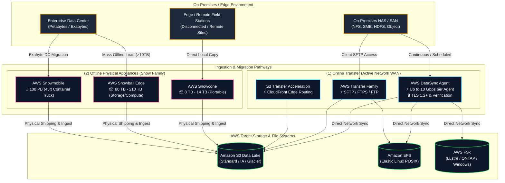
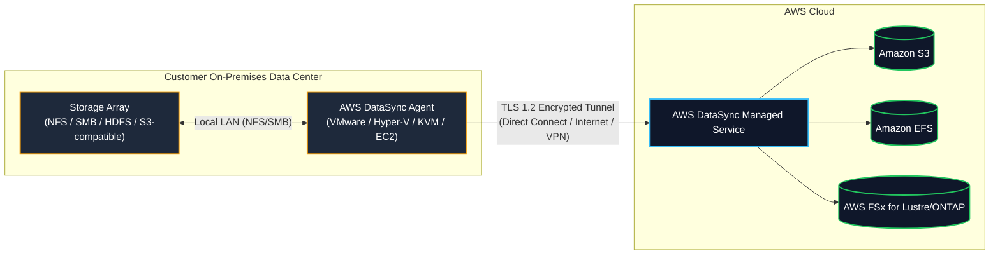
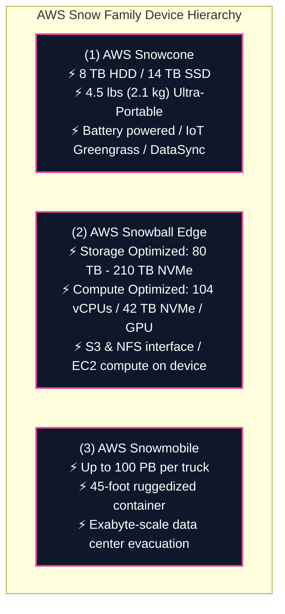
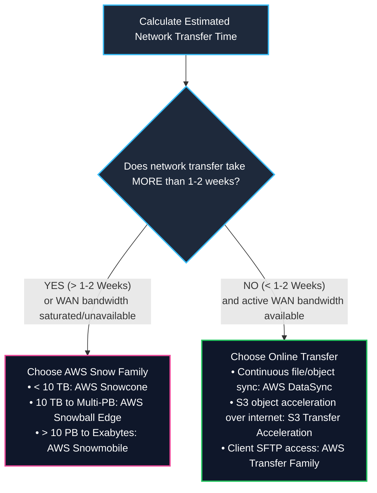
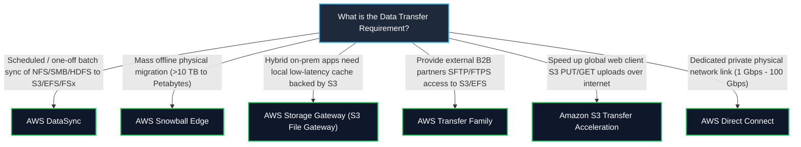

# 🚚 AWS DataSync & AWS Snow Family (Data Migration & Edge Transfer)

- **Category**: Migration & Transfer (Online High-Speed Network Transfer & Physical Offline Appliances)
- **Language / ဘာသာစကား**: **English (Original)** | [မြန်မာဘာသာ (Burmese)](/mm/02-services/migration/datasync-and-snow)
- **Primary Use Case**: Large-scale online file & object synchronization into [[en/02-services/storage/s3/s3|s3]], [[en/02-services/storage/efs-and-fsx|efs-and-fsx]], and petabyte/exabyte-scale offline physical data migrations.
- **Slide Reference**: Pages 276–285 in `[AWSCertifiedDataEngineerSlides.pdf](/docs/AWSCertifiedDataEngineerSlides.pdf)`
- **Hub Links**: [[en/index|index]] | [[en/00-hub/service-catalog|service-catalog]] | [[en/01-domains/domain-1-ingestion-and-processing|domain-1-ingestion-and-processing]] | [[en/01-domains/domain-2-data-store-management|domain-2-data-store-management]] | [[en/02-services/storage/s3/s3|s3]] | [[en/02-services/storage/efs-and-fsx|efs-and-fsx]] | [[en/02-services/migration/dms-and-sct|dms-and-sct]]

---

## 1. High-Level Summary

Moving large datasets into AWS requires choosing between **network-based online transfer** ([[en/02-services/migration/datasync-and-snow|datasync-and-snow]] — AWS DataSync) and **physical appliance-based offline transfer** (AWS Snow Family) depending on available network bandwidth, dataset size, security requirements, and time constraints.

For the **AWS Certified Data Engineer – Associate (DEA-C01)** exam, you must master:
1. **Online Transfer (AWS DataSync)**: Agent-based, accelerated network data transfer for NFS, SMB, HDFS, and Object storage into [[en/02-services/storage/s3/s3|s3]], [[en/02-services/storage/efs-and-fsx|efs-and-fsx]] (EFS, FSx for Lustre/ONTAP/Windows/OpenZFS).
2. **Offline Physical Transfer (AWS Snow Family)**: **AWS Snowcone** (8–14 TB), **AWS Snowball Edge** (80–210 TB Storage / Compute Optimized), and **AWS Snowmobile** (up to 100 PB per truck).
3. **The 1–2 Week Network Bandwidth Rule**: Mathematical formulas for calculating transfer time and selecting between DataSync and Snowball Edge.
4. **Service Differentiation**: Distinguishing **AWS DataSync** vs. **AWS Snowball** vs. **AWS Storage Gateway** vs. **AWS Transfer Family** vs. **S3 Transfer Acceleration**.
5. **Hybrid Migration Workflows**: Using Snowball Edge for initial mass data transfer and AWS DataSync or [[en/02-services/migration/dms-and-sct|dms-and-sct]] for ongoing delta catch-up.

---

## 2. AWS DataSync In-Depth

**AWS DataSync** is an automated, high-speed online data transfer service that accelerates data movement between on-premises storage, edge locations, other cloud providers, and AWS storage services.

### 1. Protocols & Supported Sources / Targets

| Supported Sources | Supported Targets | Key Integration Features |
| :--- | :--- | :--- |
| • Network File System (**NFS v3, v4.0, v4.1**) • Server Message Block (**SMB v2, v3**) • Hadoop Distributed File System (**HDFS**) • Self-managed Object Storage • Google Cloud Storage / Azure Blob • AWS S3 / EFS / FSx | • **Amazon S3** (All storage classes) • **Amazon EFS** • **AWS FSx for Lustre** • **AWS FSx for NetApp ONTAP** • **AWS FSx for Windows File Server** • **AWS FSx for OpenZFS** | • Parallel multi-threaded transfer architecture. • Automatic retry and network error recovery. • Preserves POSIX file metadata (ownership, UID/GID, permissions, timestamps, ACLs). • Up to **10x faster** than open-source tools like `rsync` or `scp`. |

### 2. Task Configuration & Operational Controls
- **Data Integrity Verification**:
  - **Verify only transferred data** (transfers new/modified files and verifies integrity).
  - **Verify full dataset** (verifies all files at source and target at end of task).
  - **Do not verify** (fastest transfer, no checksum validation).
- **Bandwidth Throttling**: Configure maximum network bandwidth consumption (e.g., limit to 500 MB/s during business hours, uncapped on weekends).
- **Scheduling**: Native cron-based task scheduling (hourly, daily, weekly).
- **Filtering**: Include/exclude filters based on file paths, extensions, or regex patterns.

### 3. AWS DataSync Discovery
- Automated discovery feature that connects to on-premises storage systems (such as NetApp ONTAP, Dell EMC Isilon) to profile performance, capacity, and utilization.
- Generates migration recommendations to right-size target AWS storage (S3, EFS, FSx).

---

## 3. AWS Snow Family In-Depth (Physical Offline Appliances)

The **AWS Snow Family** provides purpose-built, secure, ruggedized physical devices to migrate massive data sets into AWS when network connections are slow, expensive, or completely unavailable.

### 1. Technical Specifications Comparison

| Feature | AWS Snowcone | AWS Snowball Edge Storage Optimized | AWS Snowball Edge Compute Optimized | AWS Snowmobile |
| :--- | :--- | :--- | :--- | :--- |
| **Capacity** | **8 TB** usable HDD (or 14 TB SSD) | **80 TB** usable HDD (or 210 TB NVMe) | **42 TB** usable NVMe (or 28 TB NVMe + 80 TB HDD) | **Up to 100 PB** |
| **Weight & Form** | 4.5 lbs (2.1 kg) — fits in a backpack | ~50 lbs (22.5 kg) — ruggedized case | ~50 lbs (22.5 kg) — ruggedized case | 45-foot shipping container truck |
| **Compute Onboard** | 2 vCPUs, 4 GB RAM | 40 vCPUs, 80 GB RAM | **104 vCPUs, 416 GB RAM** (Optional NVIDIA GPU) | Integrated operations van |
| **Edge Capabilities** | EC2 instances, AWS IoT Greengrass | EC2 AMIs, AWS Lambda, S3 & NFS APIs | EC2 AMIs, AWS Lambda, ML inference, clustering (up to 16 nodes) | Offline physical data transport |
| **Network Transfer** | ✅ **AWS DataSync pre-installed** or physical ship | Physical shipping | Physical shipping | Physical truck transport |
| **Target Storage** | Amazon S3 | Amazon S3 | Amazon S3 | Amazon S3 |

### 2. Device Security & Management (AWS OpsHub)
- **Encryption**: All data is automatically encrypted with 256-bit keys using [[en/02-services/security-governance/kms-and-secrets|kms-and-secrets]] (AWS KMS) before being written to disk.
- **Hardware Security**: Uses an onboard **Trusted Platform Module (TPM)** chip with tamper-evident seals and automatic cryptographic erasure upon physical tampering.
- **AWS OpsHub**: A dedicated desktop GUI application used to unlock Snow devices, configure network settings, view metrics, launch EC2 instances, and manage local NFS storage.

---

## 4. The 1–2 Week Decision Rule & Transfer Time Formulas

When deciding between online network transfer ([[en/02-services/migration/datasync-and-snow|datasync-and-snow]] / Direct Connect) and offline physical transfer (Snowball Edge), apply the transfer time formula:

$$\text{Transfer Time (Seconds)} = \frac{\text{Data Size (Bits)}}{\text{Available Bandwidth (Bits/Second)} \times \text{Network Efficiency Factor}}$$

$$\text{Transfer Time (Days)} = \frac{\text{Data Size (Bytes)} \times 8}{\text{Bandwidth (bps)} \times 86400 \times 0.80}$$

*(Assuming standard 80% practical network utilization factor)*

### Network Transfer Time Reference Table (Theoretical vs. Practical)

| Data Volume | 100 Mbps WAN Connection | 1 Gbps WAN Connection | 10 Gbps Dedicated Direct Connect | Recommended Mechanism |
| :--- | :--- | :--- | :--- | :--- |
| **1 TB** | ~1.2 days | ~2.7 hours | ~16 minutes | **AWS DataSync** (Online) |
| **10 TB** | ~12 days | ~1.1 days | ~2.7 hours | **AWS DataSync** (or Snowcone/Snowball) |
| **100 TB** | **~120 days** (4 months!) | **~12 days** | ~1.1 days | **AWS Snowball Edge** (if <1 Gbps) or DataSync (if 10 Gbps) |
| **500 TB** | **~600 days** (>1.5 years!) | **~60 days** (2 months) | ~5.5 days | **AWS Snowball Edge Cluster** |
| **5 PB** | **~16 years!** | **~1.6 years!** | **~58 days** | **AWS Snowball Edge Cluster / Snowmobile** |

> [!IMPORTANT]
> **Exam Rule of Thumb**:
> - If transferring your data over your current network connection will take **longer than 1 to 2 weeks**, order **AWS Snowball Edge** devices.
> - Shipping and loading a Snowball Edge takes roughly **5 to 7 days round-trip**, making it vastly faster than a saturated network link.

---

## 5. Master Multi-Service Decision Matrix

Resolving scenarios between the various AWS data transfer and hybrid storage services is a high-frequency exam topic:

### Complete Service Comparison Table

| Service | Primary Purpose | Protocol / Ingestion Method | Directionality / Mode | Top DEA-C01 Keyword Triggers |
| :--- | :--- | :--- | :--- | :--- |
| **AWS DataSync** | Online high-speed automated file/object synchronization | NFS, SMB, HDFS, S3-API over WAN/Direct Connect | Scheduled / Continuous batch sync | *"Automated scheduled sync"*, *"preserve POSIX metadata"*, *"NFS/SMB to S3/EFS/FSx"*, *"10x faster than rsync"*. |
| **AWS Snowball Edge** | Offline physical appliance data migration & edge compute | Physical appliance shipping (S3/NFS endpoints locally) | Mass one-off offline load | *"Network transfer takes > 2 weeks"*, *"Petabyte migration"*, *"limited/no internet connectivity"*. |
| **AWS Storage Gateway** | Hybrid cloud storage bridge with local on-premises cache | NFS/SMB (File Gateway), iSCSI (Volume/Tape Gateway) | Real-time hybrid cached access | *"Local low-latency caching"*, *"seamless file share access backed by S3"*, *"replace physical tape library"*. |
| **AWS Transfer Family** | Fully managed file transfer for external partners | SFTP, FTPS, FTP, AS2 | Direct client upload/download | *"Migrate legacy SFTP workflows"*, *"seamless SFTP access directly into S3 or EFS"*, *"partner B2B file exchange"*. |
| **S3 Transfer Acceleration** | Accelerates global internet uploads into S3 buckets | HTTPS REST API routed via Amazon CloudFront Edge locations | Real-time global internet ingest | *"Global users uploading to central S3 bucket"*, *"speed up long-distance internet uploads"*. |
| **AWS Direct Connect** | Dedicated private physical network fiber connection | 1 Gbps to 100 Gbps private Ethernet link | Continuous dedicated network backbone | *"Bypass public internet"*, *"consistent dedicated network throughput"*, *"private hybrid cloud connectivity"*. |

---

## 6. Production Architecture Patterns

### Pattern A: Multi-Terabyte Scheduled Daily NAS Ingestion to S3 Data Lake
- **Scenario**: An on-premises NAS storage array produces 5 TB of new log files daily over NFS. Data must be ingested into an S3 Bronze Data Lake bucket every night within a 4-hour maintenance window.
- **Architecture**:
  - Deploy the **AWS DataSync Agent** as a virtual machine on-premises connected via 10 Gbps LAN to the NAS.
  - Configure a DataSync Task targeting Amazon S3 with scheduled execution at midnight.
  - Enable **Verify only transferred data** to skip unchanged files and maximize throughput.

### Pattern B: 500 TB On-Premises File Archive Migration (Hybrid Snowball + Delta Sync)
- **Scenario**: Migrating a 500 TB active file repository to Amazon S3 with an existing 100 Mbps internet connection (which would take over 1.5 years over WAN).
- **Architecture**:
  - **Phase 1 (Base Load)**: Order multiple **AWS Snowball Edge Storage Optimized** appliances.
  - Copy the 500 TB baseline dataset locally to the Snowball devices and ship to AWS for automated ingestion into S3.
  - **Phase 2 (Delta Catch-up)**: Deploy **AWS DataSync** on-premises to sync only modified/created files since the Snowball snapshot was taken, completing cutover in hours.

### Pattern C: Edge Data Collection & Disconnected Preprocessing
- **Scenario**: Autonomous research vessels collect 15 TB of oceanographic sensor and video data in remote marine locations without internet.
- **Architecture**:
  - Deploy **AWS Snowball Edge Compute Optimized** with onboard EC2 instances on the vessel.
  - Sensor data is ingested locally via S3 API; onboard containerized ML models preprocess and filter telemetry data.
  - Upon return to port, the device is either connected to network to sync delta via DataSync or physically shipped to AWS.

---

## 7. High-Yield DEA-C01 Exam Tips & Traps

> [!IMPORTANT]
> **Key Exam Trigger Keywords**:
> - **"Scheduled, automated transfer of NFS or SMB file shares into Amazon S3, EFS, or FSx with metadata preservation"** $\rightarrow$ **AWS DataSync**.
> - **"Migrate multi-terabyte or petabyte datasets to S3 when network transfer exceeds 1-2 weeks"** $\rightarrow$ **AWS Snowball Edge Storage Optimized**.
> - **"Petabyte to Exabyte data center evacuation with dedicated security and shipping container truck"** $\rightarrow$ **AWS Snowmobile**.
> - **"External B2B partners require SFTP access to upload files directly into S3 or EFS without modifying client software"** $\rightarrow$ **AWS Transfer Family**.
> - **"Provide on-premises applications with low-latency NFS/SMB access to files while storing all data durably in S3"** $\rightarrow$ **AWS Storage Gateway (S3 File Gateway)**.
> - **"Speed up distributed global users uploading large files to an S3 bucket over the internet"** $\rightarrow$ **Amazon S3 Transfer Acceleration**.

> [!WARNING]
> **Exam Traps & Failure Modes**:
> 1. **DataSync vs. Storage Gateway Trap**:
>    - **AWS DataSync** is designed for **batch, scheduled, or one-off high-speed migrations and syncs**; it does NOT provide a live local NFS/SMB cache for real-time reads.
>    - **AWS Storage Gateway (S3 File Gateway)** provides a **continuous, real-time local cache** for on-premises applications to read and write files directly backed by S3.
> 2. **DataSync vs. Transfer Family Trap**:
>    - Use **AWS Transfer Family** when external clients/partners need to connect via standard **SFTP/FTPS/FTP**. DataSync cannot act as an SFTP server for third parties.
> 3. **Snowball Edge Offline Ingestion to EFS / FSx**:
>    - Snowball Edge imports directly into **Amazon S3**. If the final destination is EFS or FSx, the data lands in S3 first and is then synchronized to EFS/FSx using **AWS DataSync** or automated scripts.
> 4. **Snowball vs. Snowcone Capacity Limits**:
>    - Snowcone = **8 TB HDD / 14 TB SSD**. If the question asks for 20 TB or 80 TB, Snowcone is insufficient; choose **Snowball Edge (80 TB)**.

---

## 📌 Related Notes

- [[en/02-services/migration/dms-and-sct|dms-and-sct]] — AWS DMS & SCT for database migrations and Snowball hybrid loads
- [[en/02-services/storage/s3/s3|s3]] — Amazon S3 Data Lake target for Snowball and DataSync ingestion
- [[en/02-services/storage/efs-and-fsx|efs-and-fsx]] — Amazon EFS and AWS FSx target shared file systems
- [[en/02-services/storage/s3/s3-performance|s3-performance]] — S3 Multi-part uploads & S3 Transfer Acceleration
- [[en/01-domains/domain-1-ingestion-and-processing|domain-1-ingestion-and-processing]] — DEA-C01 Domain 1 Study Guide
- [[en/01-domains/domain-2-data-store-management|domain-2-data-store-management]] — DEA-C01 Domain 2 Study Guide
- [[en/04-exam-tips/service-comparisons|service-comparisons]] — Master DEA-C01 Service Decision Matrix

