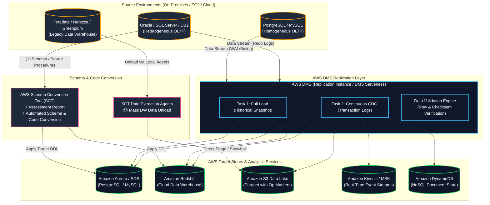
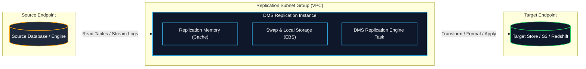
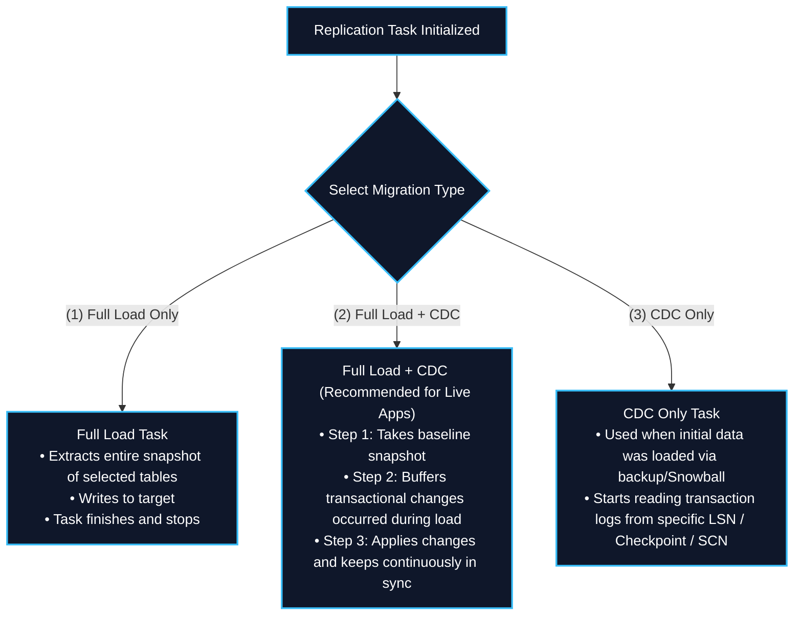
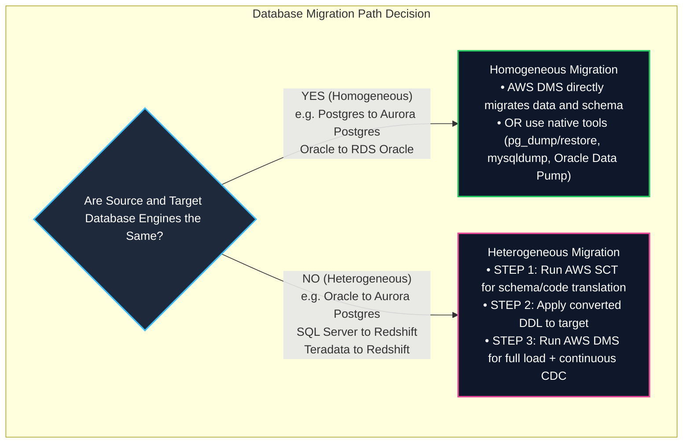
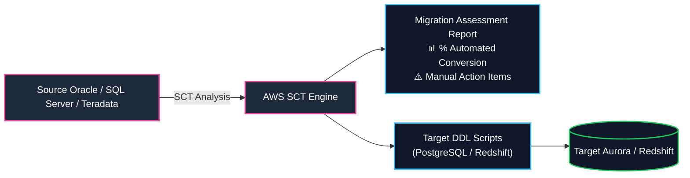
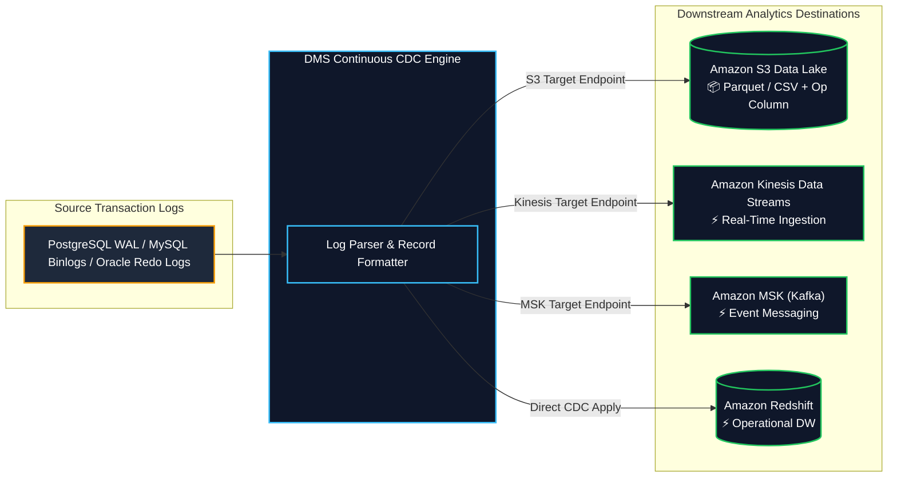
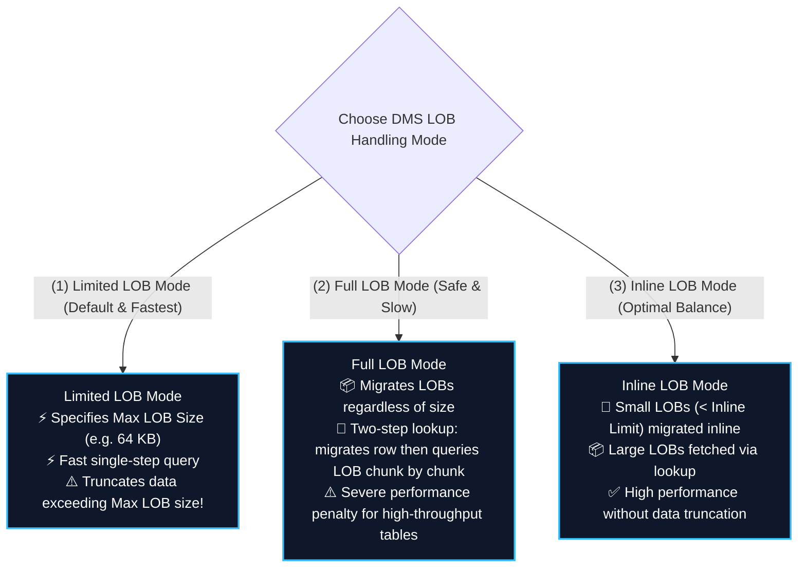
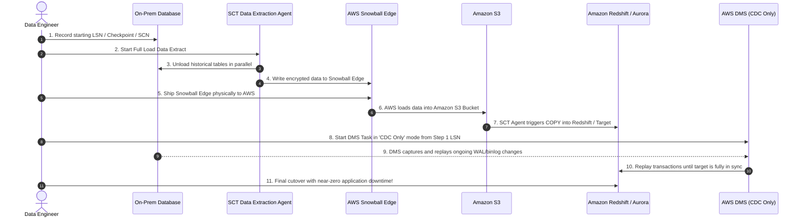

# 🔄 AWS Database Migration Service (DMS) & AWS Schema Conversion Tool (SCT)

- **Category**: Migration & Transfer (Database & Analytics Migration, Continuous CDC Ingestion)
- **Language / ဘာသာစကား**: **English (Original)** | [မြန်မာဘာသာ (Burmese)](/mm/02-services/migration/dms-and-sct)
- **Primary Use Case**: Heterogeneous and homogeneous database migrations, continuous Change Data Capture (CDC) streaming into [[s3]] Data Lakes, [[redshift]], [[kinesis]], [[msk]], and [[dynamodb]] with minimal downtime.
- **Slide Reference**: Pages 269–275 in `[[AWSCertifiedDataEngineerSlides.pdf]]`
- **Hub Links**: [[index]] | [[service-catalog]] | [[domain-1-ingestion-and-processing]] | [[domain-2-data-store-management]] | [[rds-and-aurora]] | [[redshift]] | [[s3]] | [[datasync-and-snow]]

---

## 1. High-Level Summary

**AWS Database Migration Service (AWS DMS)** is a managed migration and replication service that helps you move database and analytics workloads to AWS quickly and securely with **minimal application downtime**. AWS DMS can continuously replicate data from source databases to target data stores using **Change Data Capture (CDC)**.

**AWS Schema Conversion Tool (AWS SCT)** makes heterogeneous database and data warehouse migrations predictable by automatically converting the source database schema and majority of the database code objects (views, stored procedures, functions, triggers) to a format compatible with the target engine.

For the **AWS Certified Data Engineer – Associate (DEA-C01)** exam, you must master:
1. **Homogeneous vs. Heterogeneous Migrations**: When DMS works standalone (same engine) vs. when AWS SCT is strictly required (different engines).
2. **DMS Replication Tasks & Load Modes**: Full load, Full load + CDC, and CDC-only.
3. **Change Data Capture (CDC) Mechanics**: Reading transaction logs (PostgreSQL WAL, MySQL binlogs, Oracle Redo/LogMiner, SQL Server MS-CDC) and streaming inserts/updates/deletes.
4. **Target Data Lake & Streaming Integrations**: Outputting CDC events to [[s3]] in CSV or Apache Parquet format (with `Op` operation column), [[kinesis]], and [[msk]].
5. **LOB (Large Object) Handling Tradeoffs**: Limited LOB mode vs. Full LOB mode vs. Inline LOB mode.
6. **SCT Data Extraction Agents & Hybrid Snowball Migration**: Migrating multi-terabyte/petabyte data warehouses (Teradata, Oracle, Greenplum) offline via [[datasync-and-snow]] (Snowball Edge) + DMS continuous CDC catch-up.
7. **DMS Serverless & DMS Fleet Advisor**: Auto-scaling replication capacity units (DCUs) and automated fleet discovery.



---

## 2. Core Architecture & Components

AWS DMS operates through four primary building blocks:



### 1. Replication Instance
- A managed Amazon EC2 instance (e.g., `dms.c5`, `dms.r5`) running dedicated replication software within an Amazon VPC.
- **Single-AZ vs. Multi-AZ**:
  - **Single-AZ**: Cost-effective for dev/test migrations or one-off batch loads.
  - **Multi-AZ**: Recommended for production and continuous CDC tasks. DMS provisions an active primary instance in one AZ and a standby synchronous replica in a second AZ. Failover is automatic with zero data loss.
- **Storage Subsystem**: Uses Amazon EBS storage to buffer in-flight transactions and cache Large Objects (LOBs) during active CDC.

### 2. Endpoints (Source & Target)
An endpoint defines connection properties, credentials (or IAM roles / [[kms-and-secrets]] Secrets Manager ARNs), database type, network protocols, and Extra Connection Attributes (ECAs).

| Dimension | Supported Sources | Supported Targets |
| :--- | :--- | :--- |
| **Relational Databases** | Oracle, Microsoft SQL Server, PostgreSQL, MySQL, MariaDB, IBM Db2, SAP ASE | Amazon Aurora (PostgreSQL/MySQL), Amazon RDS (all engines) |
| **Data Warehouses** | Teradata, Oracle Exadata, Microsoft SQL Server DW | **Amazon Redshift** |
| **Data Lakes & Object** | S3 (via CSV / Parquet) | **Amazon S3** (CSV, Parquet with Snappy/GZIP compression) |
| **NoSQL & Document** | MongoDB, DocumentDB | **Amazon DynamoDB**, Amazon DocumentDB |
| **Streaming Engines** | — | **Amazon Kinesis Data Streams**, **Amazon MSK (Apache Kafka)** |
| **Search & Analytics** | — | **Amazon OpenSearch Service** |

### 3. Replication Tasks & Migration Modes

When creating a replication task, you configure one of three primary migration types:



#### Target Table Preparation Modes:
1. **`DO_NOTHING`**: DMS assumes tables already exist on the target (e.g., pre-created by AWS SCT). If tables have data, DMS appends new data without touching existing rows.
2. **`DROP_AND_CREATE_IF_EXISTS`**: DMS drops existing target tables and recreates standard basic tables (primary keys only, no secondary indexes/triggers).
3. **`TRUNCATE_BEFORE_LOAD`**: DMS truncates target tables but preserves schema structures, foreign keys, and indexes.

---

## 3. Homogeneous vs. Heterogeneous Database Migration

Understanding when AWS SCT is required versus when DMS can operate standalone is a critical DEA-C01 exam theme.



### Comparative Summary: DMS vs. Native Database Utilities

| Migration Scenario | Recommended AWS Tooling | Alternative Native Tooling | Reason / Tradeoff |
| :--- | :--- | :--- | :--- |
| **Homogeneous MySQL $\rightarrow$ Aurora MySQL** | **AWS DMS** (Minimal downtime) | Aurora MySQL Read Replica from External Master / `mysqldump` | Native binlog replication or DMS CDC provides zero-downtime cutover. |
| **Homogeneous PostgreSQL $\rightarrow$ Aurora PostgreSQL** | **AWS DMS** (Minimal downtime) | `pg_dump` + `pg_restore` or Logical Replication | `pg_dump` requires maintenance downtime; DMS CDC allows live syncing. |
| **Heterogeneous Oracle $\rightarrow$ Aurora PostgreSQL** | **AWS SCT + AWS DMS** | None native | SCT converts PL/SQL and datatypes; DMS moves data and streams WAL. |
| **Heterogeneous Teradata / Netezza $\rightarrow$ Amazon Redshift** | **AWS SCT + SCT Data Extraction Agents** | Custom python ETL scripts | SCT converts complex DW SQL queries, schemas, and extracts data in parallel chunks. |
| **Relational DB $\rightarrow$ S3 Data Lake** | **AWS DMS (CDC to Parquet)** | [[glue]] JDBC Jobs (Batch only) | DMS provides continuous streaming CDC into S3; Glue is scheduled batch. |

---

## 4. AWS Schema Conversion Tool (SCT) Deep Dive

### 1. SCT Migration Assessment Report
Before converting any schema, AWS SCT generates an **Executive Assessment Report** that analyzes the source database complexity:
- Categorizes database objects into:
  - **Automatically convertible** (100% automated translation).
  - **Simple manual intervention** (minor syntax modifications).
  - **Complex manual rewrite** (proprietary PL/SQL packages, spatial types, dynamic SQL, system procedures).
- Provides detailed estimated effort hours and step-by-step guidance for manual code refactoring.



### 2. SCT Data Extraction Agents
When migrating large on-premises data warehouses (Teradata, Oracle Exadata, Netezza, Greenplum, SQL Server DW) containing tens to hundreds of terabytes:
- Standard DMS replication instances may become an I/O and network bottleneck.
- **SCT Data Extraction Agents** are lightweight Java applications installed on dedicated on-premises servers.
- Agents extract, compress, encrypt, and unload massive tables in parallel directly to **Amazon S3** or to **AWS Snowball Edge** appliances.
- Redshift then ingests the staged data via high-speed `COPY` commands.

---

## 5. Change Data Capture (CDC) & Data Lake Ingestion

AWS DMS reads the transactional transaction logs directly from source databases to stream inserts, updates, and deletes without querying active database tables.



### Target S3 CDC Event Structure
When configuring Amazon S3 as a target endpoint for DMS CDC, DMS writes change records to S3 files containing metadata columns:

| Column Name | Type | Description / Values |
| :--- | :--- | :--- |
| **`Op`** (or `_change_type`) | String | Operation type indicator: <br/>• `'I'` = INSERT <br/>• `'U'` = UPDATE <br/>• `'D'` = DELETE |
| **`timestamp`** | Timestamp | The exact timestamp when the transaction was committed on the source database. |
| **`schema_name`** | String | Name of the source database schema. |
| **`table_name`** | String | Name of the source database table. |

#### Example S3 CDC Parquet / JSON Record:
```json
{
  "Op": "U",
  "timestamp": "2026-08-13T10:15:30.123456Z",
  "schema_name": "ecommerce",
  "table_name": "orders",
  "order_id": 98412,
  "customer_id": 5510,
  "order_status": "SHIPPED",
  "order_total": 249.99
}
```

> [!IMPORTANT]
> **Processing DMS CDC in S3 Data Lakes**:
> - Downstream consumers (such as [[glue]] ETL jobs, Apache Hudi, or [[s3-tables]] Apache Iceberg) use the `Op` column and primary keys to apply upserts (`INSERT` and `UPDATE`) and hard deletes (`DELETE`) onto Silver/Gold Data Lake tables.

---

## 6. Large Object (LOB) Modes Comparison

Handling LOB columns (BLOB, CLOB, NCLOB, TEXT, JSON, XML) is one of the most critical configuration decisions for DMS task performance.



### LOB Modes Detailed Matrix

| Dimension | Limited LOB Mode | Full LOB Mode | Inline LOB Mode |
| :--- | :--- | :--- | :--- |
| **Performance** | **Fastest** (Single round-trip per row) | **Slowest** (Significant network round-trips) | **Optimized / High** |
| **Data Safety** | ⚠️ **Risk of truncation** if LOB > `Max LOB Size` | ✅ **Zero truncation** | ✅ **Zero truncation** |
| **Memory / Disk Impact** | Low memory footprint; fixed buffer size | High disk/swap usage on replication instance | Balanced buffer allocation |
| **When to Use** | When maximum LOB size across all tables is known and strictly bounded (e.g., < 32 KB). | When table contains massive LOBs of unknown size and data loss is unacceptable (use with isolated task). | **Best practice default** when tables contain mostly small LOBs with occasional large records. |

---

## 7. Large-Scale Offline Hybrid Migration: Snowball Edge + DMS CDC

When an on-premises database is too large (e.g., 50 TB – 500 TB) to transfer over WAN within an acceptable timeframe:



---

## 8. DMS Serverless & DMS Fleet Advisor

### 1. AWS DMS Serverless
- Automatically provisions, manages, and scales replication capacity without requiring manual EC2 instance sizing (`dms.c5`/`dms.r5`).
- Measures capacity in **DMS Capacity Units (DCUs)** (1 DCU = 2 GB RAM + compute).
- Scales DCUs up or down automatically based on transaction volume, source transaction log spikes, and target latency.
- Defines **Min DCU** (cost floor) and **Max DCU** (budget ceiling).

### 2. AWS DMS Fleet Advisor
- A fully managed inventory feature of AWS DMS that discovers and analyzes database and analytics fleets across the enterprise.
- Builds an automated inventory of on-premises databases, schemas, operating systems, and versions.
- Evaluates migration complexity, identifies dependencies, and recommends right-sized AWS target engines.

---

## 9. Performance Tuning & Operational Monitoring

### Key Performance Tuning Strategies:
1. **Parallel Load Settings**:
   - For massive tables during Full Load, enable **Parallel Load** options in task settings (e.g., partitioning by primary key range or sub-ranges).
2. **Replication Instance Sizing**:
   - Monitor `CPUUtilization` and `FreeableMemory`. High swap usage or `FreeableMemory` < 500 MB causes task slowdowns and potential replication failures.
3. **Target Indexes & Constraints Timing**:
   - **Best Practice**: Drop foreign keys and secondary indexes on the target before Full Load, and recreate them **after Full Load completes but before starting CDC apply**.

### Critical Amazon CloudWatch Metrics for DMS:

| Metric Name | Unit | What It Indicates / Failure Warning |
| :--- | :--- | :--- |
| **`CDCLatencySource`** | Seconds | Latency between when a transaction occurs on the source DB and when DMS captures it from transaction logs. High latency indicates source log reading bottlenecks. |
| **`CDCLatencyTarget`** | Seconds | Latency between when DMS reads a change and when it commits it to the target endpoint. High latency indicates target database locks or insufficient target IOPS. |
| **`CDCThroughputRows`** | Count/Sec | Number of rows processed per second by the CDC engine. |
| **`FreeMemory`** | Bytes | Available RAM on the DMS replication instance. |

---

## 10. High-Yield DEA-C01 Exam Tips & Traps

> [!IMPORTANT]
> **Key Exam Trigger Keywords**:
> - **"Heterogeneous database migration (e.g. Oracle to PostgreSQL, SQL Server to MySQL, Teradata to Redshift)"** $\rightarrow$ **AWS SCT (for schema/code) + AWS DMS (for data)**.
> - **"Homogeneous database migration with minimal downtime"** $\rightarrow$ **AWS DMS (Full Load + CDC)** or native engine replication.
> - **"Continuous replication from on-premises database to S3 Data Lake with change markers"** $\rightarrow$ **AWS DMS CDC task with S3 target endpoint (`Op` column: 'I', 'U', 'D')**.
> - **"Unload hundreds of terabytes from on-premises data warehouse to S3/Redshift"** $\rightarrow$ **AWS SCT Data Extraction Agents**.
> - **"Replicate database changes to real-time streaming pipelines"** $\rightarrow$ **AWS DMS with target endpoint Amazon Kinesis Data Streams or Amazon MSK**.
> - **"Large database (> 10 TB) with limited internet bandwidth, minimal downtime migration"** $\rightarrow$ **AWS Snowball Edge for initial full load + AWS DMS CDC-only for continuous catch-up**.

> [!WARNING]
> **Exam Traps & Failure Modes**:
> 1. **SCT vs. DMS Role Separation**:
>    - AWS SCT **never moves active production data**; it only translates schema, stored procedures, views, and orchestrates extraction agents. AWS DMS **does not convert complex stored procedures or PL/SQL**; it only migrates data and creates basic tables.
> 2. **Limited LOB Mode Truncation Trap**:
>    - If an exam scenario states that data was silently truncated during a migration task, the root cause is **Limited LOB Mode with a Max LOB Size configured too small**. Switch to **Inline LOB Mode** or **Full LOB Mode**.
> 3. **Single-AZ vs. Multi-AZ DMS Instance**:
>    - For mission-critical production CDC tasks, choose **Multi-AZ replication instance** to prevent replication downtime during host maintenance or AZ outages.
> 4. **Pre-creating Secondary Indexes Before Full Load**:
>    - Creating secondary indexes on the target before Full Load causes massive write amplification and slows down the migration. Always apply secondary indexes **after** Full Load finishes.

---

## 📌 Related Notes

- [[datasync-and-snow]] — AWS DataSync & Snowball Edge for offline hybrid database migration
- [[rds-and-aurora]] — Target operational database engines and RDS CDC configuration
- [[redshift]] — Amazon Redshift data warehouse target and Zero-ETL comparison
- [[s3]] — S3 Data Lake target for CDC Parquet ingestion
- [[kinesis]] — Streaming ingestion target for real-time CDC
- [[msk]] — Managed Kafka target for change stream event messaging
- [[domain-1-ingestion-and-processing]] — DEA-C01 Domain 1 Study Guide
- [[service-comparisons]] — Master DEA-C01 Service Decision Matrix

