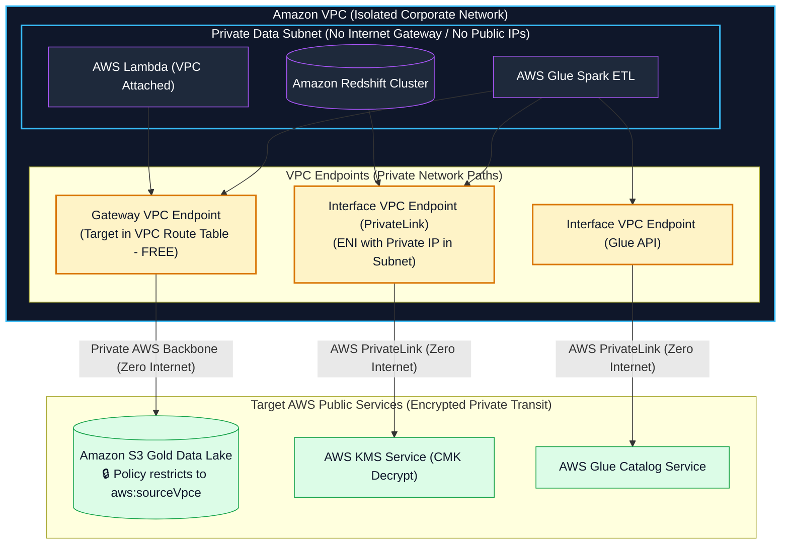
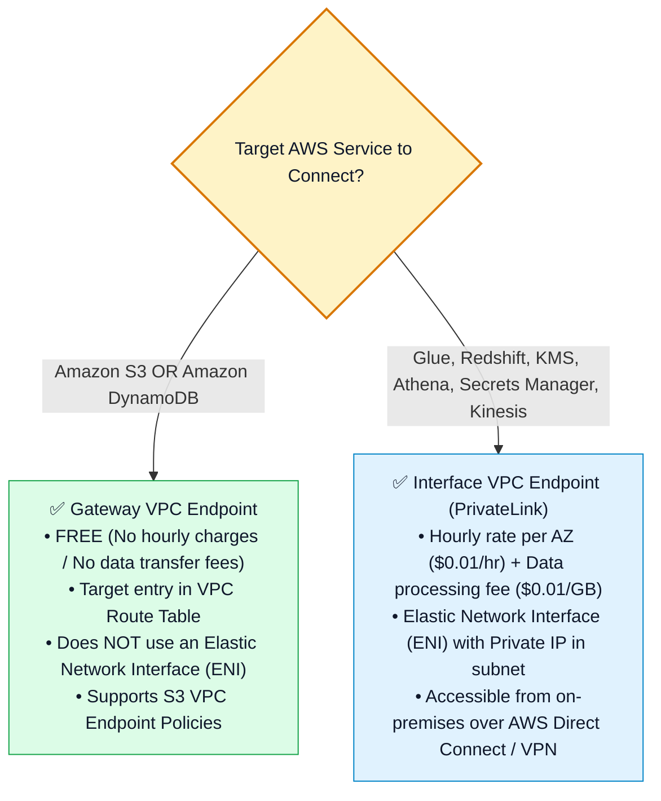
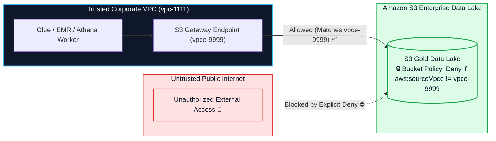

# 🌐 Amazon VPC, PrivateLink, Endpoints & Data Perimeter for Data Engineers

- **Category**: Networking & Content Delivery / Network Isolation & Private Data Transport
- **Language / ဘာသာစကား**: **English (Original)** | [မြန်မာဘာသာ (Burmese)](/mm/02-services/networking-monitoring/vpc-and-networking)
- **Primary Use Case**: Isolating data resources (Amazon Redshift, RDS, EMR, Lambda, Glue) in private subnets, establishing private connectivity via VPC Endpoints & AWS PrivateLink, and enforcing S3 Data Perimeters.
- **Slide Reference**: Pages 590–617 in `[AWSCertifiedDataEngineerSlides.pdf](/docs/AWSCertifiedDataEngineerSlides.pdf)`
- **Hub Links**: `[[index]]` | `[[service-catalog]]` | `[[domain-4-data-security-and-governance]]` | `[[s3]]` | `[[redshift]]` | `[[glue]]`

---

## 1. High-Level Summary

In production enterprise data architectures, sensitive data stores (**Amazon Redshift, Amazon RDS/Aurora, Amazon EMR, AWS Glue**) must never be exposed to the public internet.

For the **AWS Certified Data Engineer - Associate (DEA-C01)** exam, networking mastery focuses on:
1. **Private Subnet Isolation**: Deploying database and compute resources into private subnets without Internet Gateways or Public IPs.
2. **VPC Endpoints (Gateway vs. Interface Endpoints)**: Routing traffic privately to AWS services (S3, DynamoDB, Glue, KMS, Secrets Manager) across the AWS private backbone.
3. **Establishing an S3 Data Perimeter**: Using S3 Bucket Policies and **VPC Endpoint Policies** (`aws:sourceVpce`, `aws:PrincipalOrgID`) to ensure data can only be accessed from authorized corporate VPCs.



---

## 2. Security Groups vs. Network Access Control Lists (NACLs)

| Feature Dimension | Security Groups | Network ACLs (NACLs) |
| :--- | :--- | :--- |
| **Operates At** | **Instance Level** (Elastic Network Interface - ENI). | **Subnet Level** (Boundary of the entire subnet). |
| **Statefulness** | **Stateful**: Return traffic is automatically allowed regardless of inbound rules. | **Stateless**: Return traffic must be explicitly allowed in outbound rules! |
| **Rule Types** | **ALLOW rules only** (Implicit deny for everything else). | Supports both **ALLOW and DENY rules**. |
| **Rule Evaluation Order** | Evaluates **all rules** before granting access. | Evaluates rules in **strict numerical order** (lowest number first, e.g. Rule 100 before 200). |
| **Data Engineering Use Case** | Authorizing Glue/EMR security group to connect to Redshift on port 5439. | Blocking a specific malicious IP subnet from accessing the database subnet. |

---

## 3. Gateway Endpoints vs. Interface Endpoints (AWS PrivateLink)

Connecting private subnets to AWS services without traversing the public internet requires **VPC Endpoints**:



### Detailed Endpoint Comparison Matrix:

| Feature Dimension | Gateway VPC Endpoints | Interface VPC Endpoints (PrivateLink) |
| :--- | :--- | :--- |
| **Supported Services** | **Amazon S3** & **Amazon DynamoDB** ONLY. | **150+ AWS Services** (Glue, KMS, Redshift, Athena, Secrets Manager, EMR). |
| **Cost Architecture** | **100% FREE** (Zero hourly charge, zero data fees). | Billed per ENI hour + per-GB data processing fee. |
| **Routing Mechanism** | Route table prefix list entry (`pl-xxxx`). | Elastic Network Interface (ENI) with a private IP address in the subnet. |
| **On-Premises Access** | Cannot be accessed from on-premises over VPN/Direct Connect directly. | **Directly accessible from on-premises** via Direct Connect / Site-to-Site VPN. |
| **Endpoint Policies** | Supports VPC Endpoint Policies to restrict access. | Supports VPC Endpoint Policies to restrict access. |

---

## 4. Building an S3 Data Perimeter

An **S3 Data Perimeter** guarantees that sensitive organizational data can only be accessed from trusted networks by trusted identities.



### Enforcing S3 Access Exclusively via VPC Endpoint:
```json
{
  "Version": "2012-10-17",
  "Statement": [
    {
      "Sid": "RestrictAccessToSpecificVPC",
      "Effect": "Deny",
      "Principal": "*",
      "Action": "s3:*",
      "Resource": [
        "arn:aws:s3:::enterprise-gold-lake",
        "arn:aws:s3:::enterprise-gold-lake/*"
      ],
      "Condition": {
        "StringNotEquals": {
          "aws:sourceVpce": "vpce-0123456789abcdef0"
        }
      }
    }
  ]
}
```

---

## 5. DEA-C01 Exam Essentials

> [!IMPORTANT]
> **Key Exam Decision Triggers for VPC & Networking**:
>
> - **"Connect AWS Glue Spark jobs running in a private subnet to Amazon S3 without paying NAT Gateway data transfer fees or using an Internet Gateway"** $\rightarrow$ Create a **Gateway VPC Endpoint for Amazon S3** (100% free).
> - **"Connect a private Redshift cluster or AWS Glue job to AWS KMS and Secrets Manager without public internet access"** $\rightarrow$ Create **Interface VPC Endpoints (AWS PrivateLink)** for `kms` and `secretsmanager`.
> - **"Restrict Amazon S3 bucket access so that objects can ONLY be read or written from within a corporate VPC"** $\rightarrow$ Add an S3 Bucket Policy with a `Deny` statement using the Condition `"aws:sourceVpce": "vpce-xxxx"`.
> - **"Connect an on-premises Hadoop cluster over AWS Direct Connect to query Amazon S3 privately"** $\rightarrow$ Use **S3 Interface VPC Endpoints** (since Gateway Endpoints cannot route on-premises traffic).
> - **"Allow an AWS Glue job in a private subnet to connect to an Amazon RDS PostgreSQL database in another security group"** $\rightarrow$ Update the **RDS Security Group inbound rules** to allow TCP traffic on port 5432 from the **Glue Security Group ID**.

---

## 📌 Related Notes
- `[[iam]]` — IAM Policy Evaluation & Condition Keys (`aws:sourceVpce`)
- `[[s3]]` — S3 Gateway Endpoints & Bucket Policies
- `[[redshift]]` — Redshift VPC Deployment & Enhanced VPC Routing
- `[[kms-and-secrets]]` — PrivateLink connectivity to KMS & Secrets Manager
- `[[domain-4-data-security-and-governance]]` — DEA-C01 Domain 4 Study Guide
