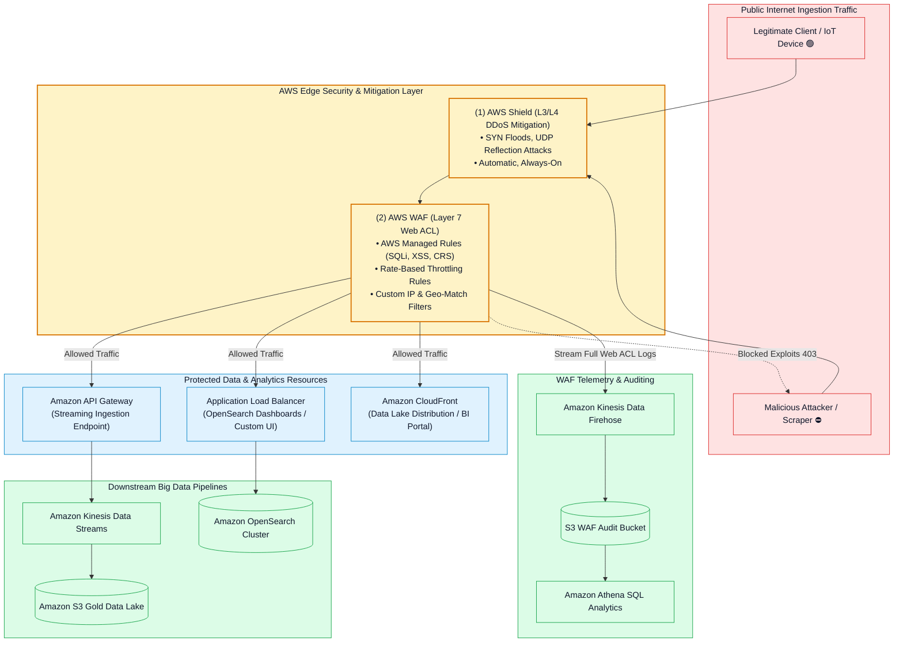
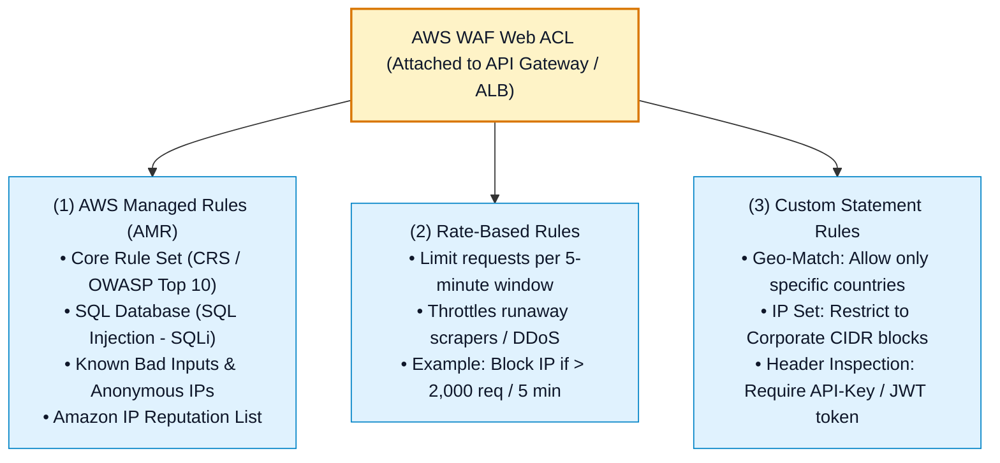
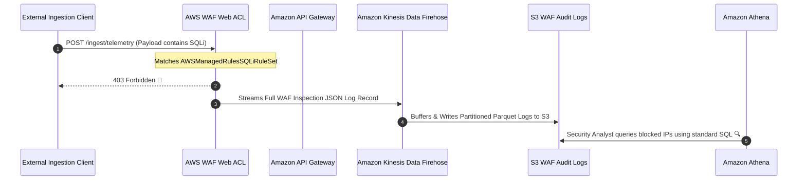
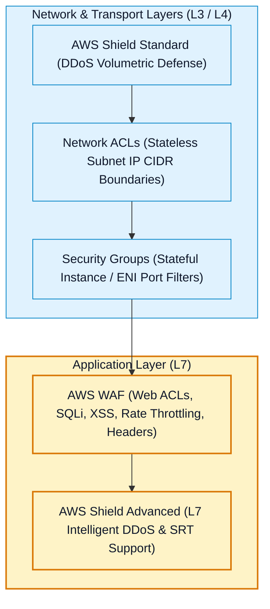

# 🛡️ AWS WAF, AWS Shield & Edge Protection for Data Pipelines

- **Category**: Security, Identity, & Compliance / Web Application Firewall & DDoS Mitigation
- **Language / ဘာသာစကား**: **English (Original)** | [မြန်မာဘာသာ (Burmese)](/mm/02-services/networking-monitoring/waf-and-shield)
- **Primary Use Case**: Protecting data ingestion endpoints (Amazon API Gateway, AWS AppSync, ALBs) and search/BI portals (Amazon OpenSearch, Amazon CloudFront) against web exploits (SQLi, XSS), runaway API scraping, and Distributed Denial of Service (DDoS) attacks.
- **Slide Reference**: Pages 600–625 in `[AWSCertifiedDataEngineerSlides.pdf](/docs/AWSCertifiedDataEngineerSlides.pdf)`
- **Hub Links**: `[[en/index|index]]` | `[[en/00-hub/service-catalog|service-catalog]]` | `[[en/01-domains/domain-4-data-security-and-governance|domain-4-data-security-and-governance]]` | `[[en/02-services/networking-monitoring/vpc-and-networking|vpc-and-networking]]` | `[[en/02-services/analytics-streaming/kinesis/kinesis|kinesis]]` | `[[en/02-services/analytics-streaming/opensearch/opensearch-security-and-monitoring|opensearch-security-and-monitoring]]`

---

## 1. High-Level Summary

In production data engineering architectures, streaming ingestion endpoints and analytics dashboards are frequently exposed to internet traffic. Without edge protection, data pipelines face **Layer 7 web application exploits** (SQL injection into streaming payloads), **brute-force scraping**, and **DDoS resource exhaustion attacks**.

For the **AWS Certified Data Engineer - Associate (DEA-C01)** exam, edge security revolves around:
1. **AWS WAF (Web Application Firewall)**: Inspecting HTTP(S) requests at Layer 7 to block SQLi, XSS, rate-limit excessive API calls, and enforce IP/Geo whitelisting.
2. **AWS Shield (Standard vs. Advanced)**: Defending against Layer 3/4 network volumetric floods (Standard - Free) and advanced Layer 7 enterprise DDoS attacks with financial cost protection (Advanced).
3. **WAF Log Streaming**: Forwarding full inspection telemetry to **Amazon Kinesis Data Firehose** $\rightarrow$ **Amazon S3** for audit analysis via **Amazon Athena**.

---

## 2. AWS WAF Core Components & Rule Architecture

**AWS WAF** operates at **Layer 7 (Application Layer)** and attaches to:
- **Amazon API Gateway** (REST / HTTP APIs used for data streaming ingestion).
- **AWS AppSync** (GraphQL APIs for data lakes).
- **Application Load Balancer (ALB)** (fronting OpenSearch Dashboards, EMR Studio, or custom ETL web portals).
- **Amazon CloudFront** (content delivery distributions).
- **AWS App Runner** and **Amazon Cognito User Pools**.

### Key WAF Rule Types for Data Engineers:

1. **AWS Managed Rules (AMRs)**:
   - *SQL Injection Rule Set (`AWSManagedRulesSQLiRuleSet`)*: Inspects incoming HTTP payloads, query strings, and headers to block malicious SQL code before it reaches databases or Spark SQL ingestion jobs.
   - *Core Rule Set (`AWSManagedRulesCommonRuleSet`)*: Defends against general web exploits (Cross-Site Scripting XSS, command injection, path traversal).
   - *Anonymous IP List (`AWSManagedRulesAnonymousIpList`)*: Blocks traffic originating from VPNs, Tor exit nodes, and anonymous proxies trying to submit fraudulent event streams.

2. **Rate-Based Rules (Preventing Ingestion Overload)**:
   - Tracks the rate of requests from each originating IP address over a configurable 5-minute rolling window.
   - *Example*: If an unauthenticated client sends $> 1,000\text{ requests / 5 minutes}$ to the API Gateway ingestion endpoint, WAF automatically responds with HTTP `429 (Too Many Requests)` or HTTP `403 (Forbidden)` until the request rate subsides.

3. **Custom Inspection Rules**:
   - Inspect specific headers (e.g., verify `X-Custom-Ingestion-Token`), query parameters, or request body sizes (e.g., block payloads $> 10\text{ MB}$ to protect downstream Lambda buffers).

---

## 3. WAF Traffic Logging & Security Analytics Pipeline

Compliance frameworks mandate that all web ACL decisions (Allowed, Blocked, Counted) must be preserved and audited:

> [!TIP]
> **Athena Querying of WAF Logs**:
> Streaming WAF logs via Kinesis Data Firehose into Amazon S3 allows security teams to run SQL queries in Athena to identify top blocked IP addresses, targeted URI paths, and attack signatures without deploying dedicated log servers.

---

## 4. AWS Shield Deep Dive (Standard vs. Advanced)

**AWS Shield** provides managed **Distributed Denial of Service (DDoS)** protection for AWS applications:

| Dimension | AWS Shield Standard | AWS Shield Advanced |
| :--- | :--- | :--- |
| **Pricing & Cost** | **100% FREE** (Included automatically for all AWS customers). | **\$3,000 / month** + Data transfer fees (Enterprise commitment). |
| **Layers Protected** | **Layer 3 (Network)** & **Layer 4 (Transport)**. | **Layer 3, Layer 4 & Layer 7 (Application)**. |
| **Attack Types Mitigated** | SYN Floods, UDP Reflection attacks, ACK Floods. | Volumetric floods, HTTP floods, DNS query floods, Layer 7 DDoS. |
| **Supported Resources** | All AWS internet-facing endpoints (EC2, CloudFront, Route 53, ALB). | Amazon CloudFront, Route 53, Elastic IPs, Application Load Balancers, AWS Global Accelerator. |
| **24/7 Security Team** | ❌ No. | ✅ **24/7 access to AWS Shield Response Team (SRT)** to write custom WAF rules during an ongoing attack. |
| **Financial Cost Protection** | ❌ No. | ✅ **DDoS Cost Protection**: Provides service credits for autoscaling spikes (EC2, CloudFront, ALB) caused by DDoS attacks. |
| **Health-Based Detection** | ❌ No. | ✅ Integrates with **Amazon Route 53 Health Checks** to minimize false positives. |

---

## 5. Defense-in-Depth Comparison Matrix

Where do WAF and Shield fit alongside VPC Security Groups and Network ACLs?

| Security Layer | AWS Mechanism | Evaluates | Data Engineering Use Case |
| :--- | :--- | :--- | :--- |
| **Layer 3 / 4 (DDoS)** | **AWS Shield Standard** | Packet volume, SYN/UDP flood signatures. | Automatically absorbing volumetric floods targeting public API endpoints. |
| **Layer 4 (Subnet)** | **Network ACLs (NACL)** | Source/Destination IP CIDR and Ports (Stateless). | Blocking an entire compromised subnet CIDR block at the VPC boundary. |
| **Layer 4 (Instance)** | **Security Groups** | Inbound/Outbound Port & Security Group IDs (Stateful). | Allowing AWS Glue or Lambda to connect to Amazon Redshift on port 5439. |
| **Layer 7 (Application)** | **AWS WAF** | HTTP body, headers, query strings, SQLi, XSS, request rates. | Blocking SQL injection payloads targeting API Gateway streaming ingestion. |
| **Layer 7 (Enterprise DDoS)** | **AWS Shield Advanced** | Application-level anomalies, HTTP request spikes. | Providing 24/7 SRT intervention and financial cost spike protection. |

---

## 6. DEA-C01 Exam Essentials

> [!IMPORTANT]
> **Key Exam Decision Triggers for WAF & Shield**:
>
> - **"Protect a public Amazon API Gateway streaming ingestion endpoint against SQL Injection (SQLi) and Cross-Site Scripting (XSS) attacks"** $\rightarrow$ Attach an **AWS WAF Web ACL** with **AWS Managed Rules (`AWSManagedRulesSQLiRuleSet`)**.
> - **"Prevent automated scraping or brute-force requests from overwhelming an Amazon API Gateway or OpenSearch dashboard"** $\rightarrow$ Configure an **AWS WAF Rate-Based Rule** to block or throttle IPs exceeding a request threshold in a 5-minute window.
> - **"Defend internet-facing data analytics applications against SYN floods and UDP reflection attacks at zero additional cost"** $\rightarrow$ Rely on **AWS Shield Standard** (automatically enabled across all AWS accounts).
> - **"Obtain 24/7 dedicated support from AWS security experts during a Layer 7 DDoS attack and receive financial protection against auto-scaling cost spikes"** $\rightarrow$ Subscribe to **AWS Shield Advanced** with **AWS Shield Response Team (SRT)** access.
> - **"Capture and analyze all allowed and blocked HTTP requests hitting an API Gateway ingestion endpoint using standard SQL"** $\rightarrow$ Enable **AWS WAF logging to Amazon Kinesis Data Firehose**, write logs to **Amazon S3**, and query with **Amazon Athena**.

---

## 📌 Related Notes
- `[[en/02-services/networking-monitoring/vpc-and-networking|vpc-and-networking]]` — Amazon VPC, Security Groups & NACLs
- `[[en/02-services/analytics-streaming/kinesis/kinesis|kinesis]]` — Amazon Kinesis Data Streams & Firehose Ingestion
- `[[en/02-services/analytics-streaming/opensearch/opensearch-security-and-monitoring|opensearch-security-and-monitoring]]` — OpenSearch Dashboard Access & Security
- `[[en/02-services/security-governance/macie-and-cloudtrail|macie-and-cloudtrail]]` — AWS CloudTrail API Auditing
- `[[en/01-domains/domain-4-data-security-and-governance|domain-4-data-security-and-governance]]` — DEA-C01 Domain 4 Study Guide
