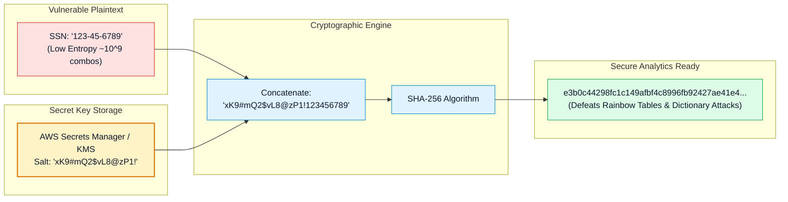
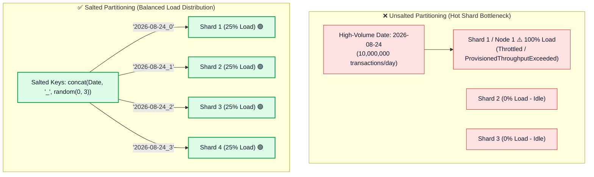
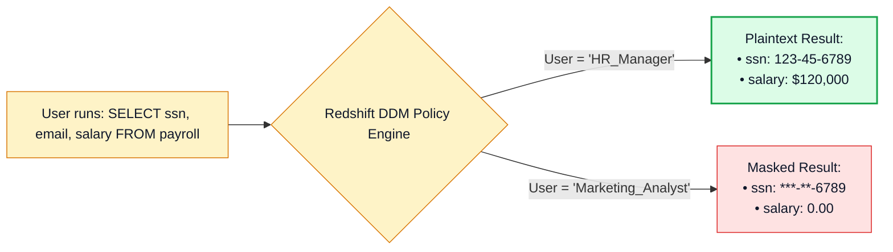

# 🎭 Data Masking, Anonymization, Pseudonymization & Key Salting

- **Category**: Security, Identity, & Compliance / Data Privacy, Cryptographic Protection & Performance Engineering
- **Language / ဘာသာစကား**: **English (Original)** | [မြန်မာဘာသာ (Burmese)](/mm/02-services/security-governance/data-masking-anonymization-and-salting)
- **Primary Use Case**: Protecting Personally Identifiable Information (PII) across the data engineering lifecycle using masking, tokenization, hashing with cryptographic key salting, and eliminating data skew using partition key salting.
- **Slide Reference**: Pages 630–675 in `[AWSCertifiedDataEngineerSlides.pdf](/docs/AWSCertifiedDataEngineerSlides.pdf)`
- **Hub Links**: `[[en/index|index]]` | `[[en/00-hub/service-catalog|service-catalog]]` | `[[en/01-domains/domain-4-data-security-and-governance|domain-4-data-security-and-governance]]` | `[[en/02-services/database/redshift|redshift]]` | `[[en/02-services/analytics-streaming/glue/glue|glue]]` | `[[en/02-services/analytics-streaming/athena/athena|athena]]` | `[[en/02-services/analytics-streaming/kinesis/kinesis|kinesis]]` | `[[en/02-services/database/dynamodb|dynamodb]]`

---

## 1. High-Level Summary

In production data engineering pipelines, data privacy regulations (**GDPR, HIPAA, PCI-DSS, CCPA**) mandate that unauthorized users and downstream analytics workloads cannot access raw Personally Identifiable Information (**PII**). 

Simultaneously, the concept of **"Key Salting"** is tested in the **AWS DEA-C01** exam across two distinct, vital domains:
1. **Security & Cryptography (Cryptographic Key Salting)**: Appending a secret cryptographic salt string to sensitive values prior to hashing to defeat rainbow table attacks, dictionary attacks, and frequency analysis.
2. **Big Data & NoSQL Performance (Partition Key Salting)**: Appending random or deterministic numeric suffixes to partition keys to eliminate data skew and hot partitions in **Amazon DynamoDB**, **Amazon Kinesis**, **AWS Glue / Apache Spark**, and **Amazon Redshift**.

```mermaid
graph TD
    subgraph Privacy_Mechanisms["Data Privacy & Protection Techniques"]
        Masking["(1) Data Masking & Redaction<br/>(Obfuscate fields e.g. XXX-XX-1234)"]
        Token["(2) Tokenization / Pseudonymization<br/>(Replace PII with reversible surrogate token)"]
        CryptoSalt["(3) Cryptographic Salting & Hashing<br/>(SHA-256(Salt + PII) for privacy & entity join)"]
        Anon["(4) Anonymization & Generalization<br/>(K-Anonymity, Age Binning [30-40])"]
    end

    subgraph AWS_Services["AWS Implementation Engines"]
        RedshiftDDM["Amazon Redshift Dynamic Data Masking (DDM)"]
        GlueSD["AWS Glue Sensitive Data Detection Transform"]
        DataBrew["AWS Glue DataBrew Masking Recipes"]
        LF["AWS Lake Formation Column & Cell Masking"]
        AthenaSQL["Amazon Athena Salted SQL Hashing"]
    end

    subgraph Skew_Optimization["Data Engineering Performance Salting"]
        PartSalt["(5) Partition Key Salting<br/>(Distribute skewed data across shards/slices)"]
        DDB["Amazon DynamoDB / Kinesis / Spark Shards"]
    end

    Masking --> RedshiftDDM & GlueSD & LF & DataBrew
    Token --> GlueSD
    CryptoSalt --> AthenaSQL & GlueSD
    Anon --> DataBrew & GlueSD
    PartSalt --> DDB

    classDef priv fill:#fee2e2,stroke:#dc2626,stroke-width:1px,color:#0f172a;
    classDef aws fill:#e0f2fe,stroke:#0284c7,stroke-width:1px,color:#0f172a;
    classDef skew fill:#fef3c7,stroke:#d97706,stroke-width:2px,color:#0f172a;

    class Masking,Token,CryptoSalt,Anon priv;
    class RedshiftDDM,GlueSD,DataBrew,LF,AthenaSQL aws;
    class PartSalt,DDB skew;
```



---

## 2. Privacy Techniques Comparison Matrix

| Technique | Description | Reversibility | Preserves Format? | Preserves Join / Analytics Utility? | Primary AWS Implementation |
| :--- | :--- | :--- | :--- | :--- | :--- |
| **Masking / Redaction** | Replaces characters with fixed masks (e.g. `***-**-1234` or `NULL`). | **Irreversible** (One-way). | ✅ Yes (partial mask) or No (full mask). | ❌ Low (cannot join or aggregate masked values). | **Amazon Redshift DDM**, **AWS Lake Formation**, **AWS Glue Studio**. |
| **Cryptographic Hashing (Salted)** | Computes one-way cryptographic digest using secret salt (`SHA-256(Salt + SSN)`). | **Irreversible** (One-way). | ❌ No (Fixed 64-char hex string). | ✅ **High** (Allows deterministic entity resolution & joins). | **Amazon Athena SQL**, **AWS Glue PySpark**, **AWS Secrets Manager**. |
| **Tokenization / Pseudonymization** | Replaces PII with a unique, randomized token stored in a secure lookup vault. | **Reversible** (via authorized token vault). | ✅ Yes (can maintain standard format). | ✅ High (if tokenization is deterministic). | **AWS Lambda Token Vault**, **DynamoDB**, **Secrets Manager**. |
| **Generalization / Binning** | Replaces exact values with broader ranges (e.g., Age `34` $\rightarrow$ `[30-39]`). | **Irreversible** (One-way). | ❌ No. | ✅ High (ideal for statistical reporting & k-anonymity). | **AWS Glue DataBrew**, **Amazon EMR Spark**. |
| **Differential Privacy / Perturbation** | Injects calculated mathematical noise into query outputs to protect individual records. | **Irreversible** (One-way). | ❌ No. | ✅ High for macro population trends. | **AWS Clean Rooms Differential Privacy**. |

---

## 3. Cryptographic Key Salting Deep Dive

### Why Raw Hashing is Vulnerable:
If you hash a 9-digit Social Security Number using plain SHA-256 (`SHA-256("123456789")`), an attacker can easily crack the identity using **Precomputed Rainbow Tables** or **Brute-Force Dictionary Lookups** (since there are only $10^9 = 1\text{ billion}$ possible SSNs).

### How Cryptographic Salting Protects PII:
A **Cryptographic Salt** is a secret, random, high-entropy string prepended or appended to the plaintext before applying the hash function:

$$\text{SecureHash} = \text{SHA-256}(\text{Secret Salt} \parallel \text{PII Value})$$



### Salted Hashing in Amazon Athena SQL:
```sql
-- Hash SSN with secret salt retrieved from application layer or parameter
SELECT 
    customer_id,
    order_date,
    to_hex(sha256(to_utf8(concat('EnterpriseSecretSalt_2026!', ssn)))) AS anonymized_ssn_key,
    order_amount
FROM "gold_lake"."orders_raw";
```

> [!IMPORTANT]
> **Deterministic vs. Randomized Salting in Data Engineering**:
> - **Consistent / Global Salt**: Using the **same secret salt** across tables allows cross-table entity joins (`JOIN on anonymized_ssn_key`) without ever revealing the plaintext SSN.
> - **Randomized Per-Record Salt**: Generates unique salts per row; maximizes security for password storage, but **prevents cross-table joins**.

---

## 4. Partition Key Salting (Big Data & NoSQL Performance)

In distributed storage and streaming architectures (**Amazon DynamoDB, Amazon Kinesis Data Streams, Apache Spark, Amazon Redshift**), heavily skewed data keys lead to **Hot Shards / Hot Partitions**, bottlenecking overall pipeline throughput.

**Partition Key Salting** distributes data evenly across physical storage nodes:



### Partition Salting Across AWS Services:

1. **Amazon DynamoDB**:
   - *Problem*: Storing IoT sensor records where `PartitionKey = SensorType` (e.g. `TemperatureSensor` receives 50k writes/sec, exceeding the 1,000 WCU per-partition limit).
   - *Solution*: Append a random integer suffix (`TemperatureSensor_0` through `TemperatureSensor_9`).
   - *Querying*: Read workers query all 10 partition keys in parallel and aggregate the results.
2. **Amazon Kinesis Data Streams**:
   - *Problem*: Producer sends all records with the same `PartitionKey` (e.g. `Country = US`), overloading a single Kinesis shard (1 MB/sec or 1,000 records/sec limit).
   - *Solution*: Generate partition keys with random salts (`US_1`, `US_2` ... `US_N`) or use UUIDs.
3. **Apache Spark / AWS Glue (Skewed Joins)**:
   - *Problem*: Joining a massive fact table with a skewed dimension key causes one Spark executor to run for hours (out of memory).
   - *Solution*: Replicate dimension rows with salts `0..N` and salt the fact table join key (`concat(key, '_', floor(rand() * N))`).

---

## 5. Amazon Redshift Dynamic Data Masking (DDM)

**Amazon Redshift Dynamic Data Masking** allows data administrators to control access to sensitive data with granular masking policies without altering the underlying data in storage:



### SQL Implementation Example:

```sql
-- 1. Create a custom Partial Masking Policy
CREATE MASKING POLICY mask_ssn
WITH (ssn_col VARCHAR(11))
USING (
    CASE 
        WHEN CURRENT_USER = 'hr_admin' THEN ssn_col
        ELSE '***-**-' || RIGHT(ssn_col, 4)
    END
);

-- 2. Create a Full Hash Masking Policy
CREATE MASKING POLICY hash_email
WITH (email_col VARCHAR(256))
USING (SHA2(email_col, 256));

-- 3. Attach Masking Policies to Table Columns
ATTACH MASKING POLICY mask_ssn ON payroll.employees(ssn) TO ROLE analyst_role;
ATTACH MASKING POLICY hash_email ON payroll.employees(email) TO ROLE analyst_role;
```

---

## 6. AWS Glue Sensitive Data Detection Transform

AWS Glue provides built-in PII detection directly inside PySpark and Glue Studio visual jobs:

```python
import sys
from awsglue.transforms import *
from awsglue.utils import getResolvedOptions
from pyspark.context import SparkContext
from awsglue.context import GlueContext
from awsglue.dynamicframe import DynamicFrame

glueContext = GlueContext(SparkContext.getOrCreate())

# Read raw dataset from S3
raw_dyf = glueContext.create_dynamic_frame.from_options(
    connection_type="s3",
    connection_options={"paths": ["s3://raw-landing-zone/customers/"]},
    format="json"
)

# Apply DetectSensitiveData transform with REDACT action
sensitive_data_dyf = DetectSensitiveData.apply(
    frame=raw_dyf,
    entity_types_to_detect=["USA_SSN", "EMAIL", "CREDIT_CARD"],
    output_actions=["REDACT"], # Options: REDACT, HASH, DROP, EXTRACT
    redaction_symbol="*"
)

# Write clean dataset to Gold S3 Data Lake
glueContext.write_dynamic_frame.from_options(
    frame=sensitive_data_dyf,
    connection_type="s3",
    connection_options={"path": "s3://gold-data-lake/customers_clean/"},
    format="parquet"
)
```

---

## 7. DEA-C01 Exam Essentials

> [!IMPORTANT]
> **Key Exam Decision Triggers for Masking, Anonymization & Salting**:
>
> - **"Mask sensitive credit card and SSN columns dynamically at query time for specific SQL roles in Amazon Redshift"** $\rightarrow$ Use **Amazon Redshift Dynamic Data Masking (DDM)** (`ATTACH MASKING POLICY ... TO ROLE`).
> - **"Prevent rainbow table attacks and frequency analysis when hashing PII data for downstream joins"** $\rightarrow$ Apply **Cryptographic Key Salting** (`SHA-256(Salt + PII)`) with a secret salt key stored in **AWS Secrets Manager** or KMS.
> - **"Allow cross-table data joins on customer identifiers without exposing raw SSNs in plain text"** $\rightarrow$ Hash the identifiers using a **Consistent / Global Secret Salt** across all ingestion pipelines.
> - **"Eliminate DynamoDB write throttling caused by 50,000 writes/sec hitting a single date partition key"** $\rightarrow$ Apply **Partition Key Salting** by appending a random integer suffix (`2026-08-24_0` to `2026-08-24_9`).
> - **"Resolve Spark skewed executor joins where one key contains 90% of fact table records"** $\rightarrow$ Apply **Salting to the join key** on both tables to distribute records across multiple worker partitions.
> - **"Redact or hash PII records in-flight during an ETL job before writing Parquet files to Amazon S3"** $\rightarrow$ Use the **AWS Glue Sensitive Data Detection transform** (`DetectSensitiveData`).

---

## 📌 Related Notes
- `[[en/02-services/security-governance/macie-and-cloudtrail|macie-and-cloudtrail]]` — Amazon Macie & AWS CloudTrail Auditing
- `[[en/02-services/security-governance/iam|iam]]` — IAM Policies & Lake Formation Fine-Grained Permissions
- `[[en/02-services/database/redshift|redshift]]` — Amazon Redshift Architecture & Performance Tuning
- `[[en/02-services/analytics-streaming/glue/glue|glue]]` — AWS Glue Studio & PySpark Transforms
- `[[en/02-services/database/dynamodb|dynamodb]]` — Amazon DynamoDB Partitioning & Performance
- `[[en/01-domains/domain-4-data-security-and-governance|domain-4-data-security-and-governance]]` — DEA-C01 Domain 4 Study Guide
