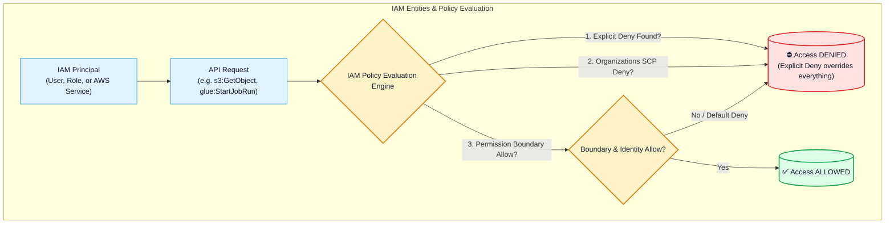
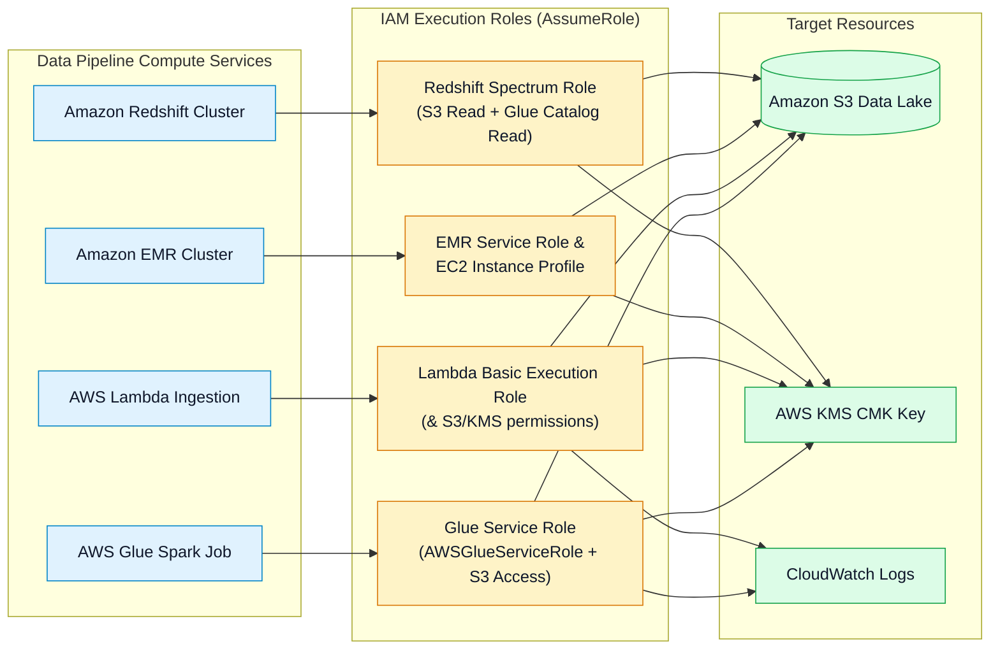
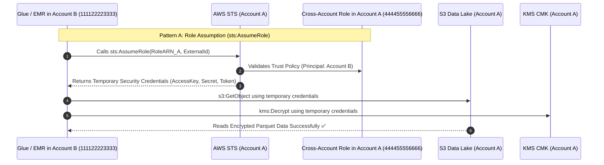
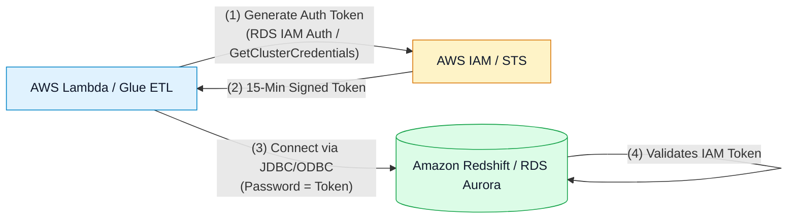

# 🔑 AWS IAM, Execution Roles, Cross-Account Access & Policy Evaluation

- **Category**: Security, Identity, & Compliance / Access Management & Data Authorization
- **Language / ဘာသာစကား**: **English (Original)** | [မြန်မာဘာသာ (Burmese)](/mm/02-services/security-governance/iam)
- **Primary Use Case**: Least-privilege identity access management, pipeline execution roles (AWS Glue, Lambda, EMR, Redshift), cross-account data lake access, and IAM database authentication.
- **Slide Reference**: Pages 542–559 in `[AWSCertifiedDataEngineerSlides.pdf](/docs/AWSCertifiedDataEngineerSlides.pdf)`
- **Hub Links**: `[[index]]` | `[[service-catalog]]` | `[[domain-4-data-security-and-governance]]` | `[[lake-formation]]` | `[[kms-and-secrets]]` | `[[glue]]` | `[[redshift]]`

---

## 1. High-Level Summary

**AWS Identity and Access Management (IAM)** is the foundational authorization and authentication engine across all AWS data services.

For data engineers preparing for the **AWS Certified Data Engineer - Associate (DEA-C01)** exam, IAM mastery requires understanding:
1. **The Policy Evaluation Logic**: How explicit `Deny`, explicit `Allow`, Permission Boundaries, and SCPs interact.
2. **Service Execution Roles**: Attaching least-privilege roles to compute engines (**AWS Glue, AWS Lambda, Amazon EMR, Amazon Redshift**).
3. **Cross-Account Data Lake Access**: Configuring **`sts:AssumeRole`** with trust policies or cross-account **S3 Bucket Policies** + **KMS Key Policies**.
4. **IAM Database Authentication**: Eliminating hardcoded database passwords by generating short-lived IAM database authentication tokens for **Amazon RDS, Aurora, and Redshift**.



---

## 2. IAM Policy Structure & Evaluation Logic

An IAM Policy is a JSON document containing one or more statements:

```json
{
  "Version": "2012-10-17",
  "Statement": [
    {
      "Sid": "AllowGlueS3GoldReadWrite",
      "Effect": "Allow",
      "Action": [
        "s3:GetObject",
        "s3:PutObject",
        "s3:ListBucket"
      ],
      "Resource": [
        "arn:aws:s3:::company-gold-lakehouse",
        "arn:aws:s3:::company-gold-lakehouse/*"
      ],
      "Condition": {
        "Bool": {
          "aws:SecureTransport": "true"
        }
      }
    }
  ]
}
```

### Core Policy Elements:
- **`Effect`**: `Allow` or `Deny`.
- **`Principal`**: The account, user, role, or service receiving the permission (required in **Resource-Based Policies** like S3 Bucket Policies; omitted in Identity-Based policies).
- **`Action`**: Specific API actions allowed or denied (e.g. `s3:GetObject`, `glue:StartJobRun`).
- **`Resource`**: Target AWS resource ARN (e.g. `arn:aws:s3:::bucket-name/*`).
- **`Condition`**: Key-value constraints for when the policy applies:
  - `aws:SecureTransport`: Enforces HTTPS/TLS in transit.
  - `aws:PrincipalArn`: Restricts to specific calling roles.
  - `s3:x-amz-server-side-encryption`: Enforces encryption header during upload.
  - `aws:sourceVpce`: Restricts access to a specific VPC Gateway Endpoint.

### Policy Evaluation Rules:
1. **Default Deny**: By default, all requests are implicitly denied.
2. **Explicit Allow**: Grants access if matched in identity-based, resource-based, or boundary policies.
3. **Explicit Deny Overrides All**: An explicit `Deny` in **any** applicable policy instantly blocks access, regardless of how many `Allow` statements exist.

---

## 3. Service Execution Roles for Data Pipelines

Data services require **IAM Execution Roles** to perform operations on your behalf:



### 1. AWS Glue Execution Role
- **Trust Policy Principal**: `glue.amazonaws.com`.
- **Managed Policy**: `AWSGlueServiceRole` (allows Glue to create network interfaces, communicate with Data Catalog, and write logs to CloudWatch).
- **Custom Policy**: S3 read/write permissions on the data lake buckets + `kms:Decrypt` and `kms:GenerateDataKey` on the S3 KMS key.

### 2. Amazon EMR Roles
- **EMR Service Role**: Allows EMR control plane to provision EC2 instances, attach EBS volumes, and configure security groups.
- **EC2 Instance Profile (Job Flow Role)**: Assigned to the underlying EC2 nodes; grants Hadoop/Spark applications permissions to read/write from Amazon S3 (`EMRFS`).

### 3. Amazon Redshift Spectrum IAM Role
- **Trust Policy Principal**: `redshift.amazonaws.com`.
- **Permissions**: `AmazonS3ReadOnlyAccess` (on external S3 data lake) + `AWSGlueConsoleFullAccess` / `glue:GetTable` (to read Glue Catalog metadata).

---

## 4. Cross-Account Data Lake Access Patterns

In enterprise data meshes, analytical datasets in Account A must frequently be consumed by Glue/Athena/EMR jobs in Account B.



### Pattern Comparison: Role Assumption vs. Bucket Policy

| Dimension | Pattern A: Cross-Account IAM Role (`AssumeRole`) | Pattern B: Cross-Account S3 Bucket Policy |
| :--- | :--- | :--- |
| **How It Works** | Account B assumes a role in Account A using AWS STS. | Account A's S3 Bucket Policy grants direct access to Account B's IAM principal. |
| **KMS Decryption** | Temporary credentials execute within Account A, using Account A's standard KMS key policy. | Account A's KMS Key Policy **must explicitly grant `kms:Decrypt` to Account B's principal**. |
| **Object Ownership** | Uploaded objects are **owned by Account A** (Role in Account A writes). | Uploaded objects are owned by Account B by default unless **S3 Object Ownership (Bucket Owner Enforced)** is enabled. |
| **Best Used When** | Third-party vendors or multi-step pipelines needing identical permissions inside Account A. | Athena or EMR querying S3 buckets directly across accounts without role switching. |

---

## 5. IAM Database Authentication (RDS, Aurora & Redshift)

Hardcoding database passwords in ETL connection strings or config files violates enterprise security standards.



1. **Amazon RDS & Aurora IAM Database Authentication**:
   - Generates a short-lived **15-minute authentication token** using the AWS SDK (`rds:connect`).
   - Database user is configured with `IDENTIFIED WITH AWSAuthenticationPlugin`.
2. **Amazon Redshift IAM Authentication**:
   - Calls `redshift:GetClusterCredentials` to generate temporary database credentials (valid for 15 minutes) for a database user.
   - Automatically provisions users or maps IAM groups to Redshift database groups.

---

## 6. S3 Bucket Policies vs. IAM Policies vs. Lake Formation

| Capability | IAM Policy | S3 Bucket Policy | AWS Lake Formation |
| :--- | :--- | :--- | :--- |
| **Attachment Target** | Users, Groups, Roles. | S3 Bucket (Resource-based). | Glue Data Catalog Tables, Columns, Rows. |
| **Object-Level Control** | ✅ Yes (`s3:GetObject`, `s3:PutObject`). | ✅ Yes (`s3:GetObject`, `s3:PutObject`). | ✅ Yes (Manages S3 data access). |
| **Column-Level Masking** | ❌ No (Cannot filter columns). | ❌ No (Cannot filter columns). | ✅ **Yes (Exclude / Mask columns)**. |
| **Row-Level Filtering** | ❌ No (Cannot filter rows). | ❌ No (Cannot filter rows). | ✅ **Yes (SQL row filter expressions)**. |
| **Cross-Account Sharing** | Via `sts:AssumeRole`. | Direct principal grants. | **Via AWS RAM (LF Resource Share)**. |

---

## 7. DEA-C01 Exam Essentials

> [!IMPORTANT]
> **Key Exam Decision Triggers for IAM**:
>
> - **"Grant an AWS Glue Spark job access to an S3 data lake encrypted with AWS KMS"** $\rightarrow$ Attach an IAM Role with `AWSGlueServiceRole`, S3 bucket permissions (`s3:GetObject`, `s3:PutObject`), and KMS permissions (`kms:Decrypt`, `kms:GenerateDataKey`).
> - **"Eliminate hardcoded database passwords in AWS Lambda connecting to Amazon Redshift"** $\rightarrow$ Use **IAM Database Authentication** (`redshift:GetClusterCredentials`) or **AWS Secrets Manager**.
> - **"Cross-Account S3 access fails with Access Denied even though S3 Bucket Policy allows Account B"** $\rightarrow$ Check if the S3 bucket is encrypted with a **KMS Customer Managed Key (CMK)** and ensure the **KMS Key Policy explicitly grants `kms:Decrypt` to Account B**.
> - **"Enforce TLS 1.2+ encryption in transit on an S3 data lake"** $\rightarrow$ Add an explicit `Deny` statement in the S3 Bucket Policy when `"aws:SecureTransport": "false"`.
> - **"Restrict access to S3 data lake exclusively from within a VPC"** $\rightarrow$ Add a Condition key `"aws:sourceVpce": "vpce-12345678"` in the S3 Bucket Policy.

---

## 📌 Related Notes
- `[[lake-formation]]` — Fine-Grained Lake Formation Governance vs IAM
- `[[kms-and-secrets]]` — KMS Key Policies & Secrets Manager
- `[[glue]]` — AWS Glue Execution Roles
- `[[redshift]]` — Amazon Redshift Spectrum IAM Role & Query Federation
- `[[domain-4-data-security-and-governance]]` — DEA-C01 Domain 4 Study Guide
