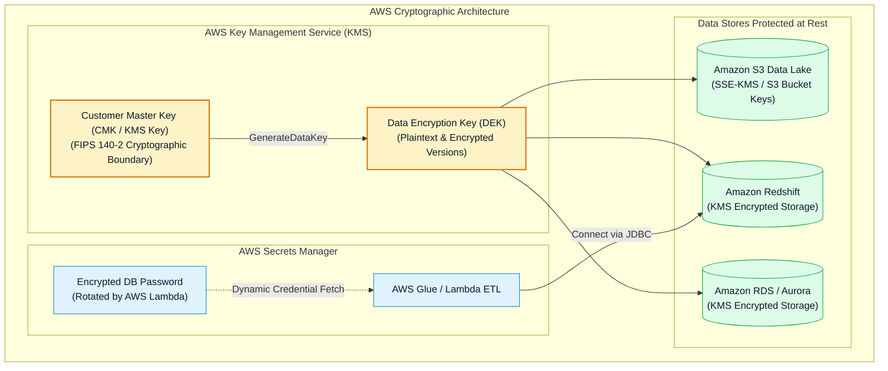
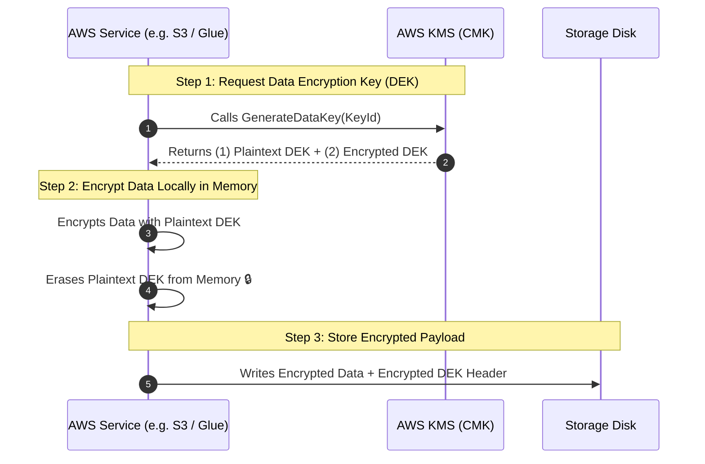
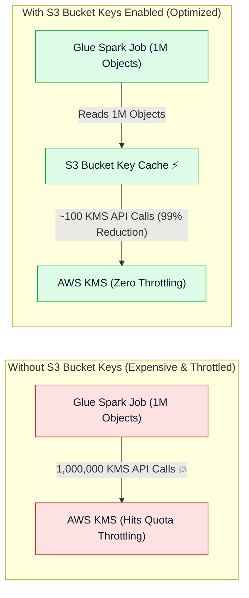
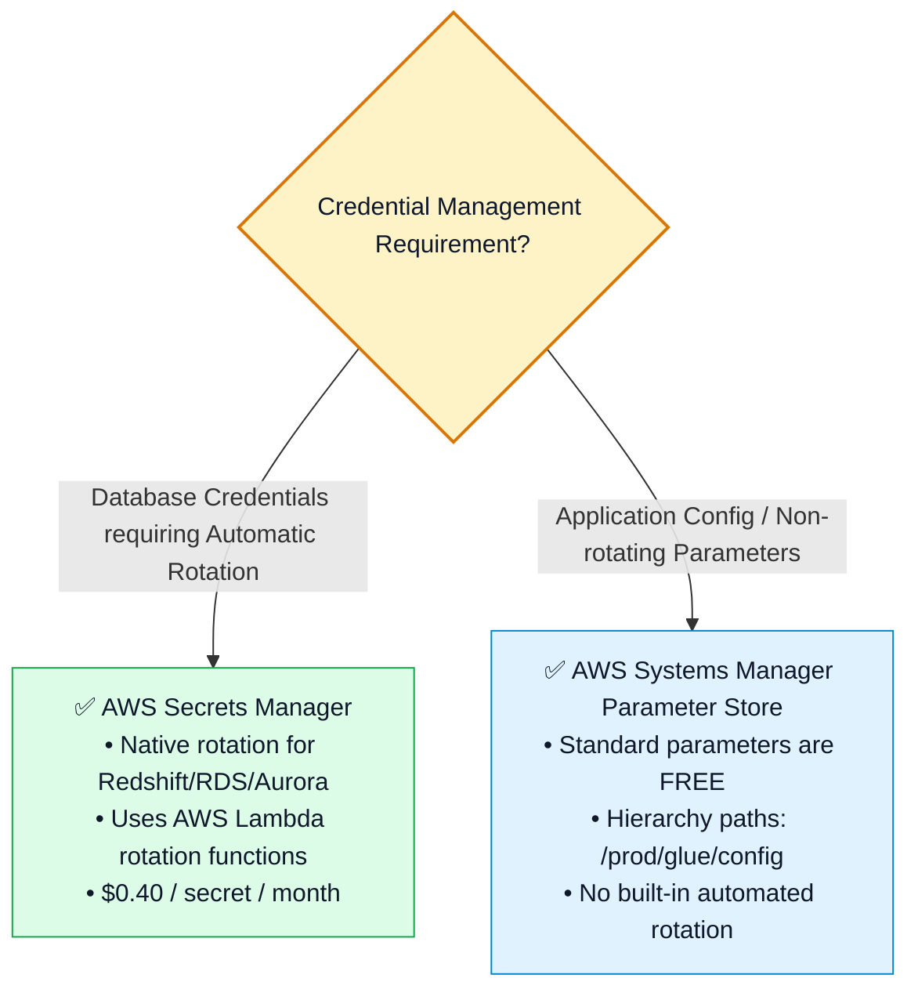

# 🔐 AWS KMS Encryption, S3 Bucket Keys, Secrets Manager & Parameter Store

- **Category**: Security, Identity, & Compliance / Cryptography, Data Protection & Secrets Governance
- **Language / ဘာသာစကား**: **English (Original)** | [မြန်မာဘာသာ (Burmese)](/mm/02-services/security-governance/kms-and-secrets)
- **Primary Use Case**: Managing cryptographic keys (AWS KMS), securing data at rest across S3/Redshift/RDS, optimizing big data KMS costs with S3 Bucket Keys, and automating database credential rotation with AWS Secrets Manager.
- **Slide Reference**: Pages 560–575 in `[AWSCertifiedDataEngineerSlides.pdf](/docs/AWSCertifiedDataEngineerSlides.pdf)`
- **Hub Links**: `[[en/index|index]]` | `[[en/00-hub/service-catalog|service-catalog]]` | `[[en/01-domains/domain-4-data-security-and-governance|domain-4-data-security-and-governance]]` | `[[en/02-services/security-governance/iam|iam]]` | `[[en/02-services/storage/s3/s3|s3]]` | `[[en/02-services/database/redshift|redshift]]` | `[[en/02-services/analytics-streaming/glue/glue|glue]]`

---

## 1. High-Level Summary

Data protection for enterprise analytics requires a comprehensive cryptographic strategy covering **Encryption at Rest**, **Encryption in Transit**, and **Automated Secrets Management**.

For the **AWS Certified Data Engineer - Associate (DEA-C01)** exam, you must master:
1. **Envelope Encryption & AWS KMS Keys**: How KMS protects petabytes of data using Customer Master Keys (CMKs) and Data Encryption Keys (DEKs).
2. **The 4 S3 Encryption Methods**: Choosing between **SSE-S3, SSE-KMS, DSSE-KMS, and SSE-C**.
3. **S3 Bucket Keys**: How enabling S3 Bucket Keys reduces KMS request traffic and API costs by up to **99%** for large AWS Glue and Amazon EMR workloads.
4. **AWS Secrets Manager vs. SSM Parameter Store**: Managing database passwords and automating rotation for Amazon Redshift, RDS, and Aurora without pipeline downtime.



---

## 2. AWS KMS & Envelope Encryption Mechanics

AWS KMS uses **Envelope Encryption** to encrypt data without transmitting massive datasets across the network to KMS.



### Types of AWS KMS Keys:
1. **AWS Owned Keys**: Internal AWS keys used across multiple accounts (free, not visible in your account).
2. **AWS Managed Keys**: Default service keys named `aws/s3`, `aws/redshift`, `aws/glue` (created automatically, cannot be shared cross-account, free key storage).
3. **Customer Managed Keys (CMKs)**: User-created KMS keys (\$1.00/month per key):
   - Supports **custom KMS Key Policies** (mandatory for cross-account data access).
   - Supports **automatic annual key rotation**.
   - Supports cryptographic deletion scheduling (7 to 30 days).

---

## 3. Amazon S3 Server-Side Encryption Breakdown

| Encryption Option | Key Managed By | CloudTrail Key Audit Trail | Cross-Account Sharing | Primary Use Case & Exam Decision |
| :--- | :--- | :---: | :---: | :--- |
| **SSE-S3 (AES-256)** | AWS (S3 Managed) | ❌ No | ✅ Yes | Default, zero-cost baseline encryption for S3 buckets. |
| **SSE-KMS** | Customer & KMS | ✅ **Yes** | ✅ **Yes (via CMK Key Policy)** | Standard for enterprise data lakes requiring audit logs and key rotation. |
| **DSSE-KMS** | Customer & KMS | ✅ **Yes** | ✅ **Yes** | **Dual-Layer** encryption to comply with strict regulatory standards (FedRAMP, DoD). |
| **SSE-C** | Customer (Client provides raw key in HTTP header) | ❌ No | ⚠️ Custom | Strict compliance mandates where keys cannot be stored in AWS under any circumstance. |

---

## 4. S3 Bucket Keys (Big Data Performance & Cost Optimization)

When analytics engines (**AWS Glue, Amazon EMR, Amazon Athena**) scan millions of small files in an SSE-KMS encrypted bucket:
- **Without S3 Bucket Keys**: Every single S3 object request triggers a distinct `kms:Decrypt` API call to AWS KMS.
  - *Result*: Rapidly exhausts KMS request quotas (e.g. 10,000 req/sec), triggering **`KMS.KMSInvalidStateException`** or **`ThrottlingException`**, while creating massive KMS billing costs!
- **With S3 Bucket Keys Enabled**: Amazon S3 creates a short-lived, intermediate bucket-level key from KMS to encrypt/decrypt objects with the same bucket prefix.
  - *Result*: **Reduces KMS API calls and billing costs by up to 99%** while eliminating throttling!



---

## 5. KMS Key Policies & Cross-Account Decryption

For an IAM role in Account B to read encrypted S3 data in Account A:
1. **S3 Bucket Policy in Account A** must grant `s3:GetObject` to Account B's role.
2. **KMS Key Policy in Account A** must grant `kms:Decrypt` and `kms:DescribeKey` to Account B's role:

```json
{
  "Sid": "AllowCrossAccountDecryption",
  "Effect": "Allow",
  "Principal": {
    "AWS": "arn:aws:iam::222233334444:role/GlueDataMeshConsumerRole"
  },
  "Action": [
    "kms:Decrypt",
    "kms:DescribeKey",
    "kms:GenerateDataKey"
  ],
  "Resource": "*"
}
```

---

## 6. Enforcing Encryption in Transit & Rest via S3 Policies

```json
{
  "Version": "2012-10-17",
  "Statement": [
    {
      "Sid": "EnforceHTTPSInTransit",
      "Effect": "Deny",
      "Principal": "*",
      "Action": "s3:*",
      "Resource": [
        "arn:aws:s3:::corporate-data-lake",
        "arn:aws:s3:::corporate-data-lake/*"
      ],
      "Condition": {
        "Bool": {
          "aws:SecureTransport": "false"
        }
      }
    },
    {
      "Sid": "EnforceKMSEncryptionAtRest",
      "Effect": "Deny",
      "Principal": "*",
      "Action": "s3:PutObject",
      "Resource": "arn:aws:s3:::corporate-data-lake/*",
      "Condition": {
        "StringNotEquals": {
          "s3:x-amz-server-side-encryption": "aws:kms"
        }
      }
    }
  ]
}
```

---

## 7. AWS Secrets Manager vs. SSM Parameter Store



### Detailed Feature Comparison:

| Feature Dimension | AWS Secrets Manager | AWS Systems Manager (SSM) Parameter Store |
| :--- | :--- | :--- |
| **Native Automatic Rotation** | ✅ **Yes** (Built-in Lambda templates for RDS, Aurora, Redshift, DocumentDB) | ❌ No (Requires custom EventBridge + Lambda setup) |
| **Cross-Account Secret Access** | ✅ **Yes** (Native resource-based secret policies) | ❌ No (Cross-account access complex / limited) |
| **Cost** | \$0.40 per secret/month + \$0.05 per 10,000 API calls | **FREE** (Standard parameters) |
| **Maximum Value Size** | **64 KB** | 4 KB (Standard) / 8 KB (Advanced) |
| **Ideal Data Engineering Use Case** | **Amazon Redshift & RDS database credentials for Glue/Lambda** | **Configuration paths, table names, environment constants** |

---

## 8. DEA-C01 Exam Essentials

> [!IMPORTANT]
> **Key Exam Decision Triggers for KMS & Secrets Manager**:
>
> - **"AWS Glue or EMR Spark jobs scanning millions of S3 objects encrypted with SSE-KMS fail with KMS throttling errors"** $\rightarrow$ Enable **Amazon S3 Bucket Keys** on the S3 bucket to reduce KMS API calls by 99%.
> - **"Securely store Amazon Redshift / RDS database credentials and automatically rotate them every 30 days without code changes"** $\rightarrow$ Store credentials in **AWS Secrets Manager** with automatic Lambda rotation enabled.
> - **"Cross-Account Glue job receives Access Denied reading an S3 bucket in another account"** $\rightarrow$ Verify that the source account's **KMS Key Policy explicitly grants `kms:Decrypt` permissions to the destination account's IAM role**.
> - **"Enforce that all data uploaded to Amazon S3 is encrypted with SSE-KMS and transmitted over TLS"** $\rightarrow$ Apply an S3 Bucket Policy with `Deny` rules checking `"aws:SecureTransport": "false"` and `"s3:x-amz-server-side-encryption": "aws:kms"`.
> - **"Dual-layer server-side encryption for strict defense/financial compliance"** $\rightarrow$ Select **DSSE-KMS**.

---

## 📌 Related Notes
- `[[en/02-services/security-governance/iam|iam]]` — IAM Service Roles & Cross-Account Trust Policies
- `[[en/02-services/storage/s3/s3|s3]]` — Amazon S3 Storage & Encryption Defaults
- `[[en/02-services/database/redshift|redshift]]` — Amazon Redshift Credential Management & KMS Encryption
- `[[en/02-services/analytics-streaming/glue/glue|glue]]` — AWS Glue Security Configurations & Connection Secrets
- `[[en/01-domains/domain-4-data-security-and-governance|domain-4-data-security-and-governance]]` — DEA-C01 Domain 4 Study Guide
