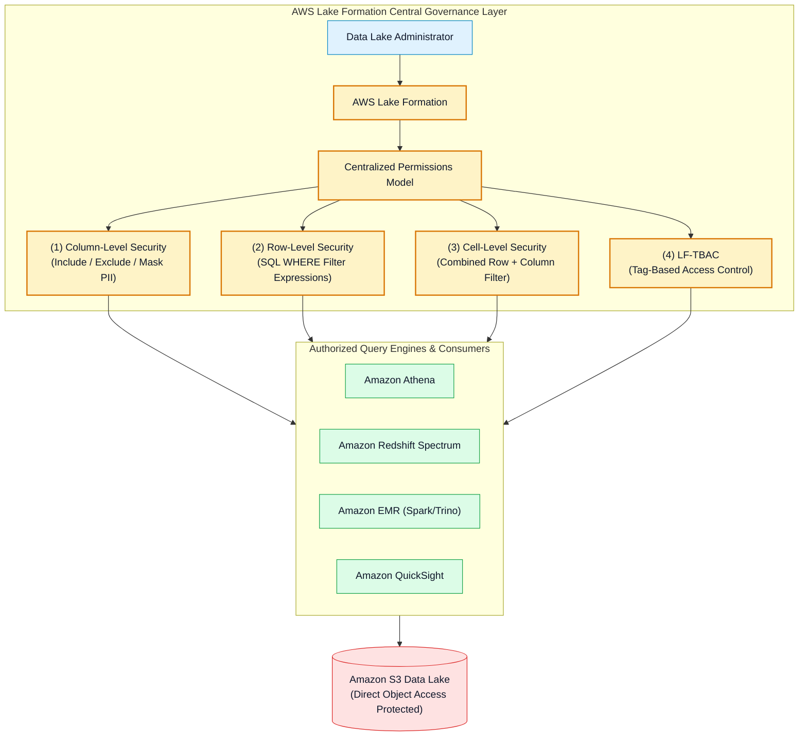
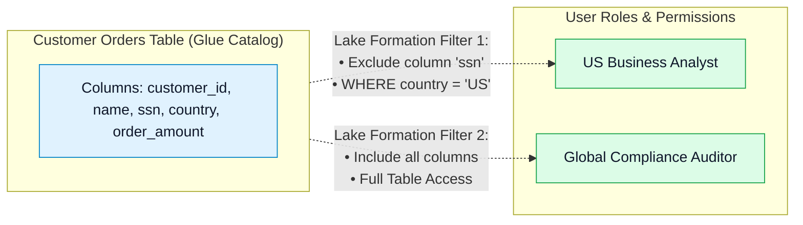
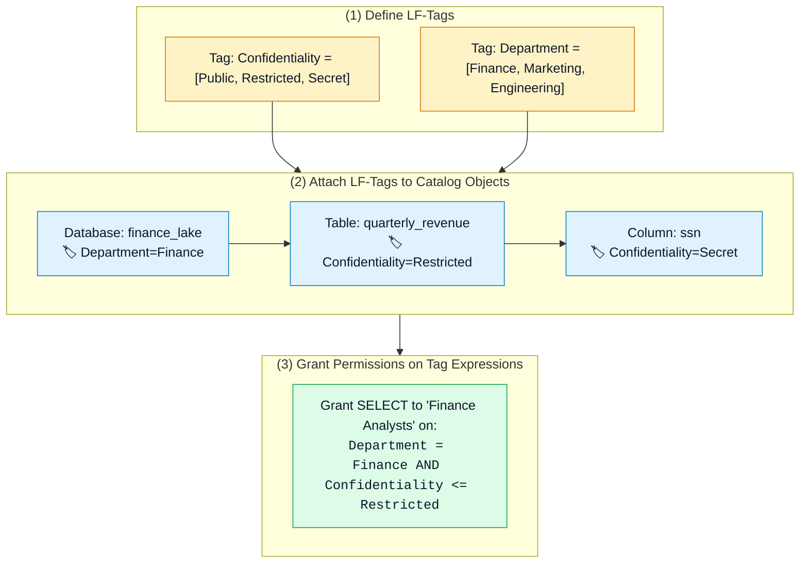
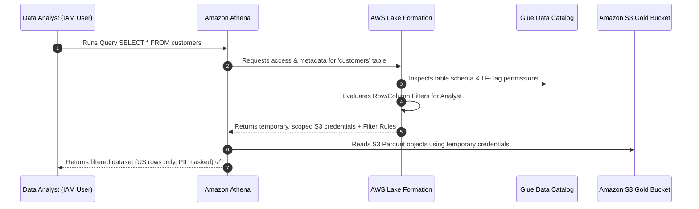

# 🛡️ AWS Lake Formation, Fine-Grained Access Control & LF-TBAC

- **Category**: Security, Identity, & Compliance / Data Lake Governance & Authorization
- **Language / ဘာသာစကား**: **English (Original)** | [မြန်မာဘာသာ (Burmese)](/mm/02-services/security-governance/lake-formation)
- **Primary Use Case**: Centralized data lake security management, fine-grained access control (column-level, row-level, and cell-level filtering), Lake Formation Tag-Based Access Control (LF-TBAC), and cross-account data sharing via AWS RAM.
- **Slide Reference**: Pages 360–364 & 576–589 in `[AWSCertifiedDataEngineerSlides.pdf](/docs/AWSCertifiedDataEngineerSlides.pdf)`
- **Hub Links**: `[[en/index|index]]` | `[[en/00-hub/service-catalog|service-catalog]]` | `[[en/01-domains/domain-4-data-security-and-governance|domain-4-data-security-and-governance]]` | `[[en/02-services/security-governance/iam|iam]]` | `[[en/02-services/analytics-streaming/glue/glue|glue]]` | `[[en/02-services/analytics-streaming/athena/athena|athena]]` | `[[en/02-services/database/redshift|redshift]]`

---

## 1. High-Level Summary

**AWS Lake Formation** is a fully managed service that centralizes, simplifies, and secures data lake governance on Amazon S3 and the AWS Glue Data Catalog.

In traditional data lake architectures, managing security using only **IAM Policies** and **S3 Bucket Policies** becomes unmanageable:
- IAM and S3 policies only operate at the **object level** (`s3://bucket/prefix/file.parquet`).
- They **cannot** enforce column-level masking, row-level filtering, or cell-level security.
- Policy size limits (5 KB per IAM policy) prevent scaling across hundreds of tables.

**AWS Lake Formation solves this** by acting as a centralized data authorization and credential vending engine. It allows data engineers to define granular table, column, and row permissions once in the Lake Formation console, and automatically enforces them across **Amazon Athena, Amazon Redshift Spectrum, Amazon EMR, and Amazon QuickSight**.

---

## 2. Core Lake Formation Permissions Architecture

Lake Formation operates on a three-tier permission model:

### 1. Data Catalog Permissions
Controls metadata access in the AWS Glue Data Catalog:
- **Database Level**: `CREATE_TABLE`, `ALTER`, `DROP`, `DESCRIBE`.
- **Table Level**: `SELECT`, `INSERT`, `ALTER`, `DROP`, `DESCRIBE`.

### 2. Data Location Permissions
Controls which IAM users or roles are allowed to register or create tables pointing to underlying **Amazon S3 bucket paths**:
- Registers S3 paths using the Lake Formation service-linked role (`AWSServiceRoleForLakeFormationDataAccess`).
- Prevents rogue users from pointing new tables to unauthorized S3 locations.

### 3. Fine-Grained Access Control (FGAC) Data Permissions
Controls the actual data records returned when querying tables:

- **Column-Level Security**: Explicitly choose which columns a principal can see (e.g. allow `customer_id`, `order_amount`, but hide `ssn` and `credit_card`).
- **Row-Level Security (Data Filters)**: Define a SQL Boolean expression to restrict row visibility (e.g. `country = 'US'` or `dept_id = 101`).
- **Cell-Level Security**: Combines column exclusion with row filter expressions to restrict specific cells.

---

## 3. Lake Formation Tag-Based Access Control (LF-TBAC)

When managing thousands of tables and hundreds of users, managing individual table permissions causes massive administrative overhead. **LF-TBAC** scales permissions dynamically using metadata tags.

### Key LF-TBAC Rules:
1. **Tag Inheritance**: Tables inherit tags from their parent Database; Columns inherit tags from their parent Table unless overridden.
2. **Dynamic Permission Evaluation**: When new tables or columns are added with matching LF-Tags, authorized users **automatically receive access without modifying IAM or Lake Formation policies**.

---

## 4. Credential Vending & Query Execution Workflow

How does Lake Formation enforce permissions on S3 when Athena or Redshift Spectrum queries data?

- Users **do not need direct `s3:GetObject` IAM permissions** on the underlying data lake bucket.
- Lake Formation **vends short-lived temporary S3 credentials** to the integrated analytical engine (Athena, Redshift Spectrum, EMR).

---

## 5. Hybrid Access Mode & Migrating from IAM

To migrate an existing S3 data lake to Lake Formation without breaking running production pipelines, Lake Formation uses **Hybrid Access Mode**:
- By default, existing Glue tables grant permissions to a virtual principal named **`IAMAllowedPrincipals`**.
- This allows existing IAM policies to continue governing access.
- To enforce Lake Formation fine-grained security, data engineers **revoke `IAMAllowedPrincipals`** on specific databases or tables and replace it with explicit Lake Formation grants.

---

## 6. Cross-Account Data Sharing via AWS RAM

Lake Formation integrates with **AWS Resource Access Manager (AWS RAM)** to share Glue Data Catalog databases and tables across AWS accounts **without replicating or copying physical S3 files**:
1. Account A (Data Lake Producer) shares a catalog database with Account B via Lake Formation Resource Share.
2. Account B accepts the RAM share and creates a **Resource Link** in its local Glue Catalog.
3. Athena users in Account B query the resource link seamlessly, while Lake Formation in Account A enforces column/row filters and manages S3 credential vending.

---

## 7. Lake Formation vs. IAM vs. S3 Bucket Policies

| Dimension | AWS Lake Formation | IAM Policies | S3 Bucket Policies |
| :--- | :--- | :--- | :--- |
| **Granularity** | **Column, Row, Cell & Table level** | Object & Bucket level only | Object & Bucket level only |
| **Tag-Based Access** | **LF-TBAC (Catalog metadata tags)** | ABAC (IAM session tags) | Resource tags (Limited) |
| **S3 Credential Model** | **Credential Vending (Temporary scoped credentials)** | Permanent IAM user / Assumed Role | Target account credentials |
| **Cross-Account Sharing** | **AWS RAM (Zero file copies, centralized audit)** | Cross-account IAM roles / STS | Cross-account bucket policies |
| **Supported Engines** | Athena, Redshift Spectrum, EMR, QuickSight | All AWS Services | All AWS Services |

---

## 8. DEA-C01 Exam Essentials

> [!IMPORTANT]
> **Key Exam Decision Triggers for Lake Formation**:
>
> - **"Enforce column-level masking or row-level filtering for Amazon Athena queries on S3 data lake"** $\rightarrow$ Choose **AWS Lake Formation** (IAM and S3 bucket policies cannot filter rows/columns).
> - **"Scale access permissions across thousands of Glue Data Catalog tables for multiple departments"** $\rightarrow$ Use **Lake Formation Tag-Based Access Control (LF-TBAC)**.
> - **"Share S3 Data Lake tables with another AWS account without copying files or managing cross-account IAM roles"** $\rightarrow$ Use **Lake Formation Cross-Account Sharing with AWS RAM (Resource Links)**.
> - **"Why can an IAM user query a table in Athena even though they lack direct `s3:GetObject` permissions on the bucket?"** $\rightarrow$ **Lake Formation Credential Vending** generates short-lived temporary access credentials on the user's behalf.
> - **"How to transition from IAM permissions to Lake Formation fine-grained security without pipeline downtime?"** $\rightarrow$ Use **Hybrid Access Mode** and gradually **revoke `IAMAllowedPrincipals`**.

---

## 📌 Related Notes
- `[[en/02-services/security-governance/iam|iam]]` — IAM Service Roles & Policy Evaluation Logic
- `[[en/02-services/analytics-streaming/glue/glue|glue]]` — AWS Glue Data Catalog & Crawler Metadata
- `[[en/02-services/analytics-streaming/athena/athena|athena]]` — Amazon Athena Query Engine & Lake Formation Integration
- `[[en/02-services/database/redshift|redshift]]` — Amazon Redshift Spectrum External Tables
- `[[en/01-domains/domain-4-data-security-and-governance|domain-4-data-security-and-governance]]` — DEA-C01 Domain 4 Study Guide
