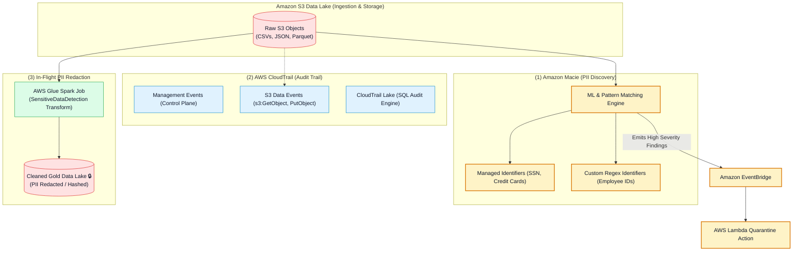
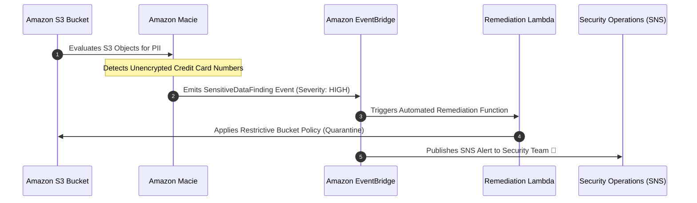
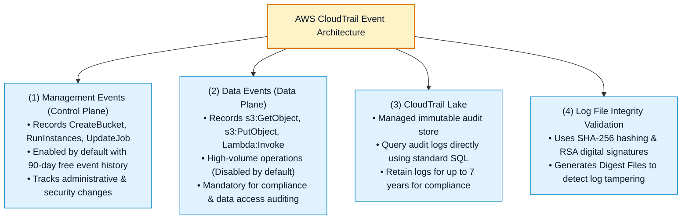
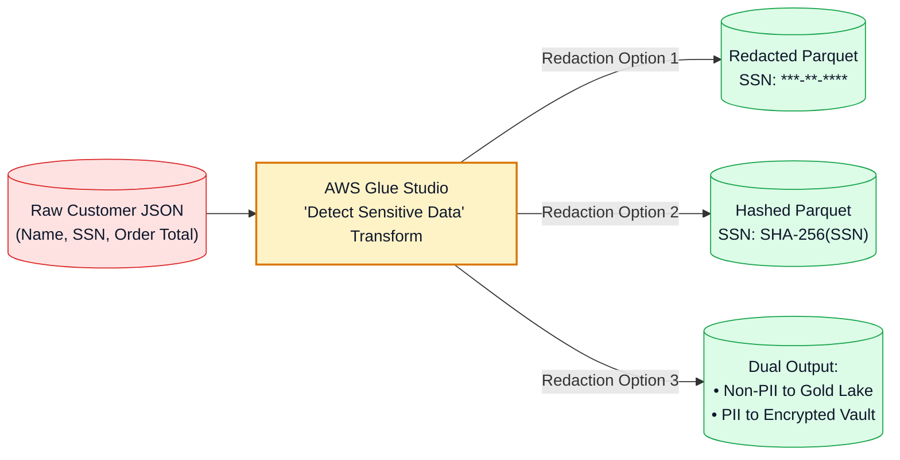

# 🔍 Amazon Macie, AWS CloudTrail & PII Compliance Governance

- **Category**: Security, Identity, & Compliance / Sensitive Data Discovery, Audit Logging & PII Governance
- **Language / ဘာသာစကား**: **English (Original)** | [မြန်မာဘာသာ (Burmese)](/mm/02-services/security-governance/macie-and-cloudtrail)
- **Primary Use Case**: Automated discovery of sensitive Personally Identifiable Information (PII) in Amazon S3 (Amazon Macie), immutable auditing of API activity and data access (AWS CloudTrail), and in-flight PII masking (AWS Glue Sensitive Data Detection).
- **Slide Reference**: Pages 630–670 in `[[AWSCertifiedDataEngineerSlides.pdf]]`
- **Hub Links**: `[[index]]` | `[[service-catalog]]` | `[[domain-4-data-security-and-governance]]` | `[[s3]]` | `[[glue]]` | `[[cloudwatch-and-eventbridge]]`

---

## 1. High-Level Summary

Enterprise data engineering pipelines must adhere to strict regulatory compliance frameworks (such as **GDPR, HIPAA, PCI-DSS, and SOC 2**). 

For the **AWS Certified Data Engineer - Associate (DEA-C01)** exam, compliance governance revolves around three complementary capabilities:
1. **Automated Sensitive Data Discovery (Amazon Macie)**: Scanning Amazon S3 data lakes using machine learning to detect unencrypted PII, financial data, and credentials.
2. **Operational & Data Plane Auditing (AWS CloudTrail)**: Tracking who accessed, modified, or deleted data resources across the AWS account.
3. **In-Pipeline PII Redaction & Masking**: Stripping or masking sensitive attributes before data reaches analytics data stores using **AWS Glue Sensitive Data Detection** and **Amazon AppFlow**.

---

## 2. Amazon Macie Deep Dive (Sensitive Data Discovery)

**Amazon Macie** is a fully managed data security and privacy service that uses machine learning and pattern matching to discover, classify, and protect sensitive data in **Amazon S3**.

### Discovery Modes:
1. **Automated Sensitive Data Discovery**: Continuously evaluates your entire S3 bucket estate at low cost, building an interactive sensitive data heat map.
2. **Sensitive Data Discovery Jobs**: Targeted, deep-scan jobs over specific buckets, object prefixes, or S3 tags (e.g., scan all new Parquet files uploaded in the last 24 hours).

### Detection Types:
- **Managed Data Identifiers (MDIs)**: Built-in detection algorithms for:
  - *PII*: Social Security Numbers (SSN), passports, national IDs, driver's licenses.
  - *Financial Information*: Credit card numbers, bank account numbers (IBAN), tax IDs.
  - *Credentials*: AWS secret access keys, private encryption keys, API tokens.
- **Custom Data Identifiers (CDIs)**: Custom regular expression (regex) patterns defined by the data engineer to detect proprietary organizational data (e.g. employee IDs formatted as `EMP-[0-9]{6}`).

### Event-Driven Remediation Architecture:

---

## 3. AWS CloudTrail Deep Dive (Audit Logging & Governance)

**AWS CloudTrail** records all API actions taken by users, IAM roles, or AWS services across your AWS infrastructure.

### Management Events vs. Data Events:

| Dimension | Management Events (Control Plane) | Data Events (Data Plane) |
| :--- | :--- | :--- |
| **What It Records** | Configuration actions (e.g. `glue:CreateJob`, `s3:CreateBucket`, `iam:CreateRole`). | Object-level operations (e.g. `s3:GetObject`, `s3:PutObject`, `dynamodb:GetItem`). |
| **Default Setting** | **Enabled by default** across all AWS accounts. | **Disabled by default** (must be explicitly enabled). |
| **Cost** | Free for 90-day event history (single trail delivery free). | Charged per 100,000 events delivered (\$0.10 / 100k events). |
| **Data Engineering Use Case** | Tracking who modified a Glue Crawler schedule or deleted an S3 bucket. | Auditing exactly which user downloaded a specific financial Parquet file from S3. |

### CloudTrail Log File Integrity:
- To prevent malicious actors from deleting or altering audit logs, enable **Log File Integrity Validation**.
- CloudTrail writes cryptographic **Digest Files** containing SHA-256 hashes of every delivered log file. Use the AWS CLI command `aws cloudtrail validate-logs` to mathematically prove logs were not tampered with.

---

## 4. In-Pipeline PII Detection & Masking Transforms

Detecting PII after it lands in S3 is reactive. Data engineers must also implement **in-flight proactive PII redaction**:

### AWS Glue Sensitive Data Detection:
- Built-in visual transform in AWS Glue Studio and PySpark (`DetectSensitiveData`).
- Scans dataset rows and replaces PII fields with:
  - **Redaction** (e.g. mask SSN with `***-**-6789`).
  - **Cryptographic Hashing** (e.g. SHA-256 hash for deterministic entity matching).
  - **Row Exclusion** (drop rows containing sensitive records).
  - **Entity Extraction** (route sensitive records to a separate, highly encrypted security bucket).

---

## 5. Amazon Redshift Dynamic Data Masking (DDM) & Row-Level Security

For SQL analysts querying data warehouses:
1. **Dynamic Data Masking (DDM)**:
   - Masks sensitive column values at query runtime without altering physical data on disk.
   - *Example*: Full mask `XXXX-XXXX-XXXX-1234` for marketing analysts, while payroll managers see full plaintext values.
2. **Row-Level Security (RLS)**:
   - Restricts row visibility based on SQL session context and user roles without creating separate views or tables.

---

## 6. DEA-C01 Exam Essentials

> [!IMPORTANT]
> **Key Exam Decision Triggers for Macie & CloudTrail**:
>
> - **"Automatically discover unencrypted PII (credit cards, SSNs) across an entire Amazon S3 data lake"** $\rightarrow$ Choose **Amazon Macie**.
> - **"Track which IAM role downloaded a specific object from an S3 data lake for compliance audit"** $\rightarrow$ Enable **AWS CloudTrail S3 Data Events** (`s3:GetObject`).
> - **"Query multi-year audit logs using standard SQL without maintaining Athena or Glue infrastructure"** $\rightarrow$ Use **AWS CloudTrail Lake**.
> - **"Ensure audit logs stored in S3 have not been modified or deleted by an unauthorized user"** $\rightarrow$ Enable **CloudTrail Log File Integrity Validation**.
> - **"Mask sensitive PII fields in-flight during an AWS Glue Spark ETL job before writing to S3"** $\rightarrow$ Use the **AWS Glue Sensitive Data Detection transform**.
> - **"Trigger automated quarantine actions when sensitive PII is detected in a public S3 bucket"** $\rightarrow$ Route **Amazon Macie findings to Amazon EventBridge** to invoke an AWS Lambda remediation function.

---

## 📌 Related Notes
- `[[iam]]` — IAM Policy Evaluation & Audit Tracking
- `[[s3]]` — Amazon S3 Data Lake Storage & Security
- `[[glue]]` — AWS Glue ETL & Sensitive Data Detection Transform
- `[[cloudwatch-and-eventbridge]]` — EventBridge Rules for Security Remediation
- `[[domain-4-data-security-and-governance]]` — DEA-C01 Domain 4 Study Guide
