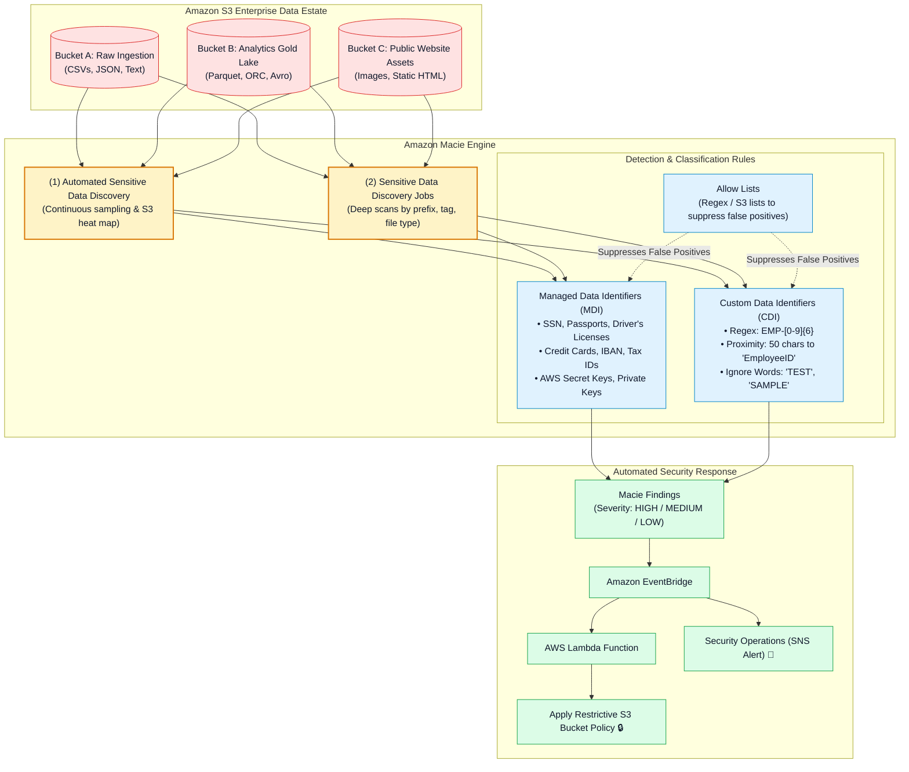
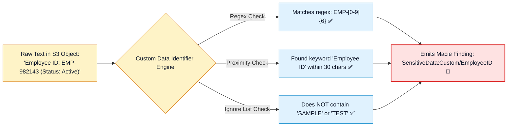
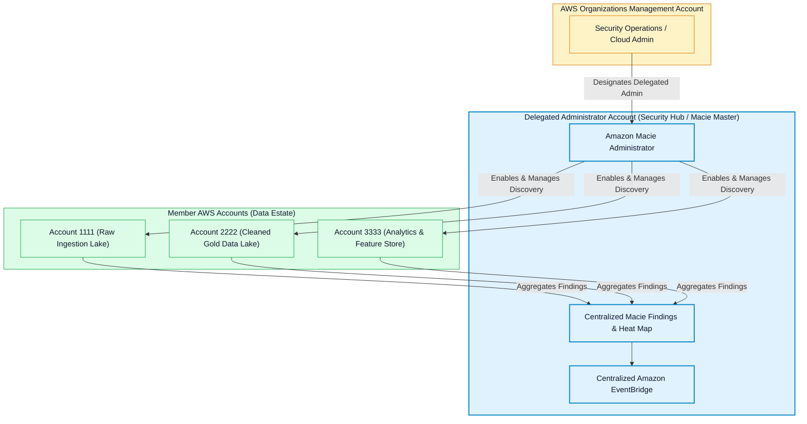
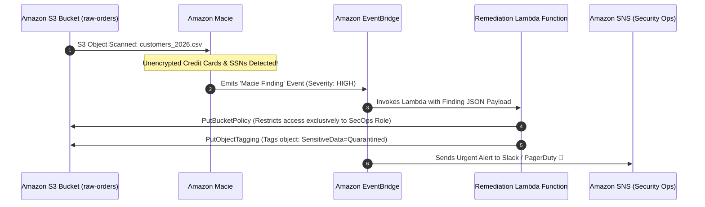

# 🔎 Amazon Macie Deep Dive & PII Discovery Architecture

- **Category**: Security, Identity, & Compliance / Automated Sensitive Data Discovery & Classification
- **Language / ဘာသာစကား**: **English (Original)** | [မြန်မာဘာသာ (Burmese)](/mm/02-services/security-governance/macie)
- **Primary Use Case**: Continuous, machine learning-powered discovery, classification, and protection of sensitive Personally Identifiable Information (PII), financial records, credentials, and custom proprietary data across Amazon S3 data lakes.
- **Slide Reference**: Pages 635–655 in `[[AWSCertifiedDataEngineerSlides.pdf]]`
- **Hub Links**: `[[index]]` | `[[service-catalog]]` | `[[domain-4-data-security-and-governance]]` | `[[s3]]` | `[[cloudwatch-and-eventbridge]]` | `[[macie-and-cloudtrail]]`

---

## 1. High-Level Summary

**Amazon Macie** is a fully managed data security and privacy service that applies **machine learning (ML)** and **pattern matching algorithms** to discover, classify, inventory, and protect sensitive data stored in **Amazon S3**.

For the **AWS Certified Data Engineer - Associate (DEA-C01)** exam, key Macie concepts include:
1. **Automated Discovery vs. Targeted Jobs**: Continuous organization-wide S3 estate evaluation vs. targeted, prefix-filtered deep scans.
2. **Managed vs. Custom Identifiers**: Built-in PII/credential detection vs. custom regex rules with proximity constraints.
3. **Allow Lists**: Eliminating false positives for internal testing data and test credit cards.
4. **Event-Driven Automated Remediation**: Emitting findings to **Amazon EventBridge** to trigger **AWS Lambda** for automated quarantine bucket policies and tagging.



---

## 2. Automated Discovery vs. Targeted Discovery Jobs

| Dimension | Automated Sensitive Data Discovery | Sensitive Data Discovery Jobs |
| :--- | :--- | :--- |
| **Execution Mode** | Continuous, automated sampling across all S3 buckets. | One-time or scheduled recurring scans over defined scopes. |
| **Configuration** | **Zero configuration** (enabled by default when enabling Macie). | Highly customizable (bucket names, prefixes, object age, size, tags). |
| **Coverage** | Evaluates a representative sample of S3 objects to build an **interactive data sensitivity heat map**. | **100% full scan** of all matching objects in the designated scope. |
| **Cost Profile** | Fixed, low predictable cost based on total S3 bucket volume. | Charged per GB of data inspected (\$1.00 / GB for the first 50,000 GB/month). |
| **Data Engineering Use Case** | Maintaining high-level compliance posture and discovering newly created public or unencrypted buckets. | Auditing a new financial dataset landed by an ETL pipeline before granting analyst access. |

---

## 3. Managed Data Identifiers vs. Custom Data Identifiers

### 1. Managed Data Identifiers (MDIs):
Pre-configured, machine learning and regex-driven detection patterns maintained by AWS:
- **Personal Information**: USA Social Security Numbers (SSN), passports (multi-national), driver's licenses, national ID cards.
- **Financial Information**: Credit card numbers (Visa, Mastercard, Amex), International Bank Account Numbers (IBAN), US bank routing numbers.
- **Credentials & Secrets**: AWS Secret Access Keys, RSA/OpenSSH private keys, JSON Web Tokens (JWT), API tokens.
- **Healthcare & Medical**: US Health Insurance Claim Numbers (HICN), National Provider Identifier (NPI), medical record numbers.

### 2. Custom Data Identifiers (CDIs):
User-defined proprietary data patterns. A CDI definition contains:
1. **Regular Expression (Regex)**: The core pattern matching logic (e.g. employee badge `EMP-[0-9]{6}`).
2. **Keywords (Optional)**: Specific words that must appear near the match (e.g. `Employee ID`, `Badge Number`, `Staff ID`).
3. **Maximum Match Distance**: How close the keyword must be to the regex match (e.g., within 50 characters).
4. **Ignore Words (Optional)**: Words that trigger an immediate discard to eliminate false positives (e.g., `SAMPLE`, `TEST-EMP`).



---

## 4. Macie Allow Lists

In production testing environments, mock credit card numbers (e.g., `4111-1111-1111-1111`) or dummy SSNs generate severe false-positive noise in compliance dashboards.

**Allow Lists** allow data engineers to define exceptions:
- **Regex-based Allow Lists**: Discard specific patterns from generating findings (e.g., discard any SSN matching `000-00-.*`).
- **S3 Predefined Text File Lists**: Upload a plain text list of internal employee names or dummy test account numbers to S3; Macie ignores matches against this list.

---

## 5. Multi-Account AWS Organizations Architecture

In modern enterprise data platforms, data lakes span multiple AWS accounts (Ingestion, Raw Lake, Gold Lake, Analytics).



- **Delegated Administrator**: Designate a dedicated Security Account to centrally manage discovery jobs, custom identifiers, and suppressions across all member accounts.
- **Automated Account Enrollment**: Automatically enables Macie for newly created AWS accounts within AWS Organizations.

---

## 6. Event-Driven Automated Remediation Architecture

When Macie detects unencrypted PII in an unapproved S3 bucket, relying on human intervention creates compliance violations. **Automated Event-Driven Remediation** quarantines data in real-time:



### Sample EventBridge Rule Pattern:
```json
{
  "source": ["aws.macie"],
  "detail-type": ["Macie Finding"],
  "detail": {
    "severity": {
      "description": ["High"]
    },
    "type": [
      "SensitiveData:S3Object/Financial",
      "SensitiveData:S3Object/Personal"
    ]
  }
}
```

---

## 7. Amazon Macie vs. Other AWS Security Services

| Service | Primary Purpose | Scope of Inspection | Data Engineering Role |
| :--- | :--- | :--- | :--- |
| **Amazon Macie** | **Data Discovery & Classification** | **Amazon S3 Object Contents** (PII, Financial, Credentials, Health). | Identifying sensitive data at rest in data lakes. |
| **Amazon GuardDuty** | **Threat Detection & Anomaly Monitoring** | CloudTrail, VPC Flow Logs, DNS Logs, EKS Logs, S3 Data Events. | Detecting compromised credentials or unauthorized data exfiltration. |
| **AWS Security Hub** | **Centralized Security Posture Management** | Aggregates findings from Macie, GuardDuty, Inspector, IAM Access Analyzer. | Single-pane-of-glass compliance dashboard (CIS, PCI-DSS). |
| **Amazon Inspector** | **Vulnerability Management** | EC2 instances, ECR container images, Lambda code. | Scanning ETL container images and compute instances for CVEs. |

---

## 8. DEA-C01 Exam Essentials

> [!IMPORTANT]
> **Key Exam Decision Triggers for Amazon Macie**:
>
> - **"Continuously discover unencrypted PII, credit card numbers, or AWS secrets across an entire Amazon S3 data estate"** $\rightarrow$ Choose **Amazon Macie Automated Sensitive Data Discovery**.
> - **"Perform a scheduled deep scan over newly uploaded Parquet files in an S3 raw landing zone"** $\rightarrow$ Create a **Targeted Sensitive Data Discovery Job** with S3 prefix and date filtering.
> - **"Detect proprietary employee ID numbers formatted as EMP-XXXXXX in S3 data files"** $\rightarrow$ Create a **Custom Data Identifier (CDI)** with a regular expression pattern and proximity keywords.
> - **"Prevent mock test data from generating false-positive PII alerts in Macie"** $\rightarrow$ Configure an **Amazon Macie Allow List**.
> - **"Automatically quarantine an S3 bucket or apply restrictive policies immediately when Macie detects sensitive data"** $\rightarrow$ Route **Macie Findings to Amazon EventBridge**, triggering an **AWS Lambda remediation function**.
> - **"Manage sensitive data discovery policies centrally across 50 AWS accounts"** $\rightarrow$ Configure a **Delegated Administrator Account in AWS Organizations**.

---

## 📌 Related Notes
- `[[macie-and-cloudtrail]]` — AWS CloudTrail Audit Logging & PII Governance
- `[[data-masking-anonymization-and-salting]]` — In-Flight Masking & Salting
- `[[s3]]` — Amazon S3 Data Lake Security & Encryption
- `[[cloudwatch-and-eventbridge]]` — Amazon EventBridge Security Automation
- `[[domain-4-data-security-and-governance]]` — DEA-C01 Domain 4 Study Guide
