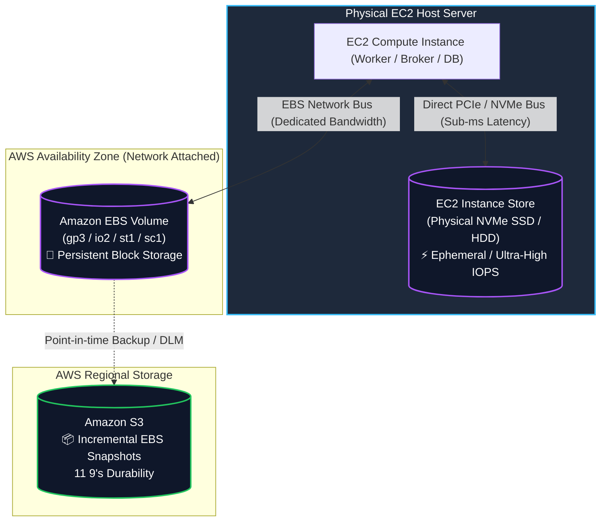
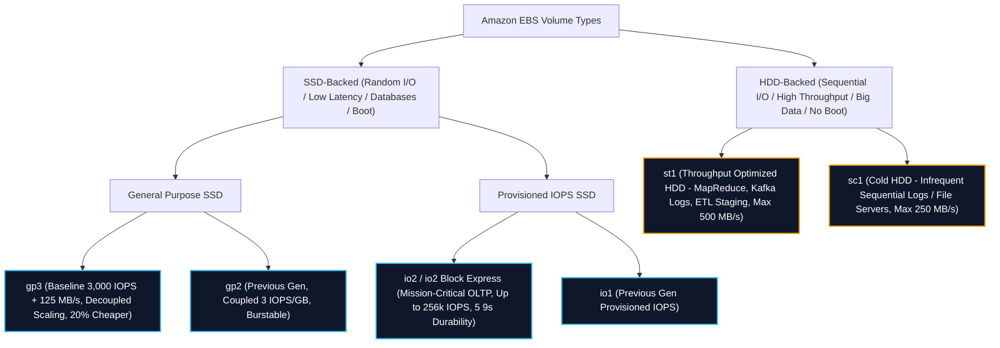
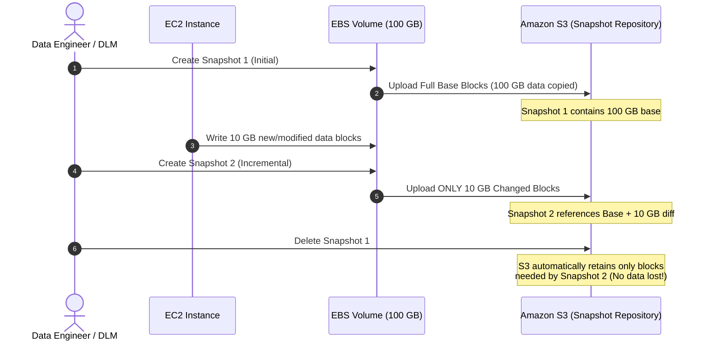
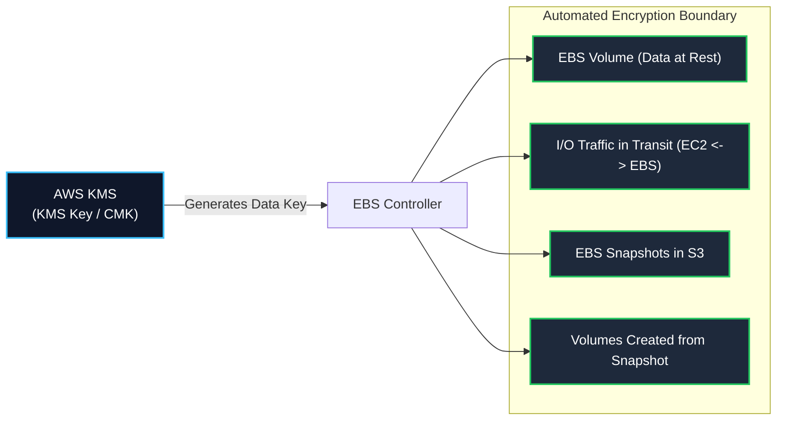
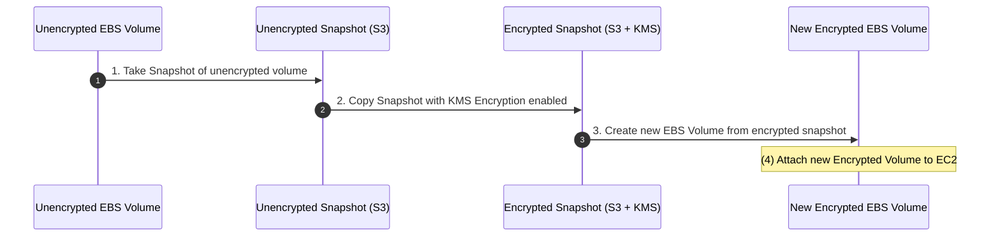
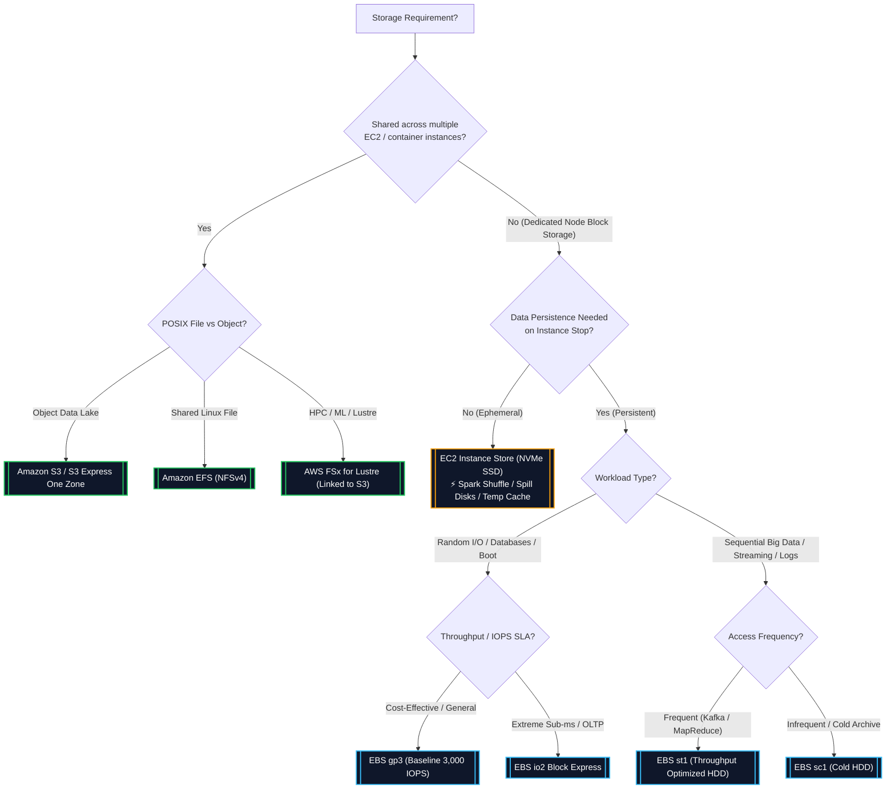

# 💾 Amazon EBS & EC2 Instance Store

- **Category**: Storage (Block Storage)
- **Language / ဘာသာစကား**: **English (Original)** | [မြန်မာဘာသာ (Burmese)](/mm/02-services/storage/ebs-and-instance-store)
- **Primary Use Case**: Block-level storage for EC2 compute instances, high-throughput intermediate scratch storage for big data processing, persistent volumes for databases, and streaming broker storage.
- **Slide Reference**: Pages 139–154 in [AWSCertifiedDataEngineerSlides.pdf](/docs/AWSCertifiedDataEngineerSlides.pdf)
- **Hub Links**: [[index]] | [[service-catalog]] | [[domain-2-data-store-management]] | [[s3]] | [[efs-and-fsx]]

---

## 1. High-Level Summary

Block storage provides dedicated, low-latency disk volumes attached directly to compute instances ([[ecr-ecs-eks]] / EC2). In modern AWS Data Engineering architectures, block storage serves as the working storage layer for data processing engines, distributed streaming brokers, and self-hosted databases.

Data engineers must master the trade-offs between **EC2 Instance Store** (physically attached, ephemeral, maximum IOPS/throughput) and **Amazon EBS** (network-attached, persistent, snapshot-backed block storage), as well as selecting the exact EBS volume type (`gp3`, `io2`, `st1`, `sc1`) matching the workload's access pattern.

---

## 2. Technical Comparison: EBS vs. EC2 Instance Store

Understanding when to choose persistent Amazon EBS versus ephemeral EC2 Instance Store is a core **DEA-C01** exam topic.

| Architectural Dimension             | Amazon EBS (Elastic Block Store)                                          | EC2 Instance Store                                                                |
| :---------------------------------- | :------------------------------------------------------------------------ | :-------------------------------------------------------------------------------- |
| **Physical Architecture**           | Network-attached virtual block device (SAN over AWS network)              | Physically attached NVMe SSD or SATA HDD directly on the host server              |
| **Data Persistence**                | **Persistent**: Retains data independently of instance lifecycle          | **Ephemeral (Temporary)**: Data is lost upon instance stop or termination         |
| **Survives Instance Reboot?**       | ✅ Yes                                                                    | ✅ Yes (Data is preserved across OS reboots)                                      |
| **Survives Instance Stop?**         | ✅ Yes                                                                    | ❌ **No (Data is wiped permanently upon STOP)**                                   |
| **Survives Instance Terminate?**    | ✅ Yes (Configurable: `DeleteOnTermination` flag)                         | ❌ **No (Data is wiped permanently)**                                             |
| **Survives Host Hardware Failure?** | ✅ Yes (Volume remains intact on EBS network)                             | ❌ **No (Data is lost if physical host server fails)**                            |
| **Performance & Latency**           | Low latency (single-digit ms down to sub-ms with `io2 Block Express`)     | **Ultra-low latency (Sub-millisecond), millions of IOPS, highest raw throughput** |
| **Availability & Scope**            | Bound to a **single Availability Zone (AZ)**                              | Bound to the **specific physical host machine** in that AZ                        |
| **Backup Mechanism**                | Automated incremental **EBS Snapshots to Amazon S3**                      | Manual data replication scripts to S3 / EBS / remote storage                      |
| **Elasticity & Resizing**           | Dynamic resizing and type changes on the fly via **Elastic Volumes**      | Fixed capacity determined by the selected EC2 instance type                       |
| **Multi-Attach Support**            | ✅ Yes (`io1` / `io2` with Nitro instances up to 16 EC2 nodes in same AZ) | ❌ No (Dedicated strictly to single host instance)                                |
| **Primary Data Engineering Role**   | Databases (RDS / self-hosted PostgreSQL), Kafka logs, persistent nodes    | **Spark shuffle space, MapReduce spill disks, intermediate cache, temp buffers**  |

---

## 3. EBS Volume Types Deep Dive

EBS volumes are categorized into two primary storage technologies: **SSD-backed** (optimized for transactional, random I/O, high IOPS) and **HDD-backed** (optimized for large, sequential, throughput-intensive big data workloads).

### Complete EBS Volume Specification Matrix

| Volume Type                        | Volume Code             | Storage Tech | Max IOPS / Volume | Max Throughput / Volume | Max Volume Size | Boot Disk? | Ideal Data Engineering Use Case                                                           |
| :--------------------------------- | :---------------------- | :----------- | :---------------- | :---------------------- | :-------------- | :--------- | :---------------------------------------------------------------------------------------- |
| **General Purpose SSD (Latest)**   | **`gp3`**               | SSD          | **16,000 IOPS**   | **1,000 MB/s**          | 16 TiB          | ✅ Yes     | Default choice for data processing nodes, dev/test, balanced database workloads.          |
| **General Purpose SSD (Legacy)**   | `gp2`                   | SSD          | 16,000 IOPS       | 250 MB/s                | 16 TiB          | ✅ Yes     | Legacy workloads; migrate to `gp3` for cost savings and decoupled performance.            |
| **Provisioned IOPS Block Express** | **`io2 Block Express`** | SSD          | **256,000 IOPS**  | **4,000 MB/s**          | 64 TiB          | ✅ Yes     | Mission-critical high-throughput OLTP (Oracle, SAP HANA, high-load Cassandra/Postgres).   |
| **Provisioned IOPS SSD**           | **`io2`**               | SSD          | 64,000 IOPS       | 1,000 MB/s              | 16 TiB          | ✅ Yes     | Sustained I/O-heavy relational and NoSQL databases requiring 99.999% durability.          |
| **Provisioned IOPS SSD (Legacy)**  | `io1`                   | SSD          | 64,000 IOPS       | 1,000 MB/s              | 16 TiB          | ✅ Yes     | Legacy high-IOPS applications.                                                            |
| **Throughput Optimized HDD**       | **`st1`**               | HDD          | 500 IOPS          | **500 MB/s**            | 16 TiB          | ❌ **No**  | **Big Data, MapReduce, Apache Kafka commit logs, log processing, streaming ETL staging.** |
| **Cold HDD**                       | **`sc1`**               | HDD          | 250 IOPS          | **250 MB/s**            | 16 TiB          | ❌ **No**  | Infrequently accessed cold logs, backup volumes, lowest-cost block storage.               |

---

### Detailed Volume Type Characteristics

#### 1. General Purpose SSD (`gp3` vs. `gp2`)

- **`gp3` (Recommended Default)**:
  - Delivers a baseline performance of **3,000 IOPS and 125 MB/s throughput included free** with any volume size.
  - Allows independent provisioning of storage capacity, IOPS (up to 16,000), and throughput (up to 1,000 MB/s) without paying for unneeded disk space.
  - Provides up to **20% lower price per GB** than `gp2`.
- **`gp2` (Previous Generation)**:
  - IOPS are tied directly to volume size ($3 \text{ IOPS per GB}$, minimum 100 IOPS, max 16,000 IOPS).
  - Volumes under 1 TiB rely on an I/O burst credit bucket to reach 3,000 IOPS.

#### 2. Provisioned IOPS SSD (`io2` & `io2 Block Express`)

- Designed for workloads requiring sub-millisecond latency and guaranteed sustained I/O performance.
- **`io2 Block Express`**:
  - Runs on the AWS Nitro System.
  - Achieves **sub-millisecond latency**, up to **256,000 IOPS**, **4,000 MB/s throughput**, and **64 TiB capacity**.
  - Provides a **1,000:1 IOPS-to-GB ratio** and **99.999% (5 nines)** annual volume durability.
- **EBS Multi-Attach**:
  - Allows attaching a single `io1` or `io2` volume concurrently to up to **16 Nitro-based EC2 instances** in the **same Availability Zone**.
  - **Requirement**: Must use a cluster-aware file system (e.g., GFS2, OCFS2) to prevent concurrent write corruption.

#### 3. Throughput Optimized HDD (`st1`)

- Built specifically for **frequently accessed, throughput-intensive workloads** that execute large, sequential read/write operations.
- Uses a burst-bucket credit model: baseline throughput scales at $40 \text{ MB/s per TiB}$ up to $250 \text{ MB/s}$, bursting up to $500 \text{ MB/s}$.
- **Data Engineering Key Fit**:
  - Apache Spark / Hadoop clusters on EC2 / [[emr]].
  - Distributed Kafka broker logs ([[msk]]).
  - Data warehouse staging and log aggregation pipelines.
- **Limitation**: **Cannot be used as an OS boot volume**.

#### 4. Cold HDD (`sc1`)

- Lowest-cost block storage on AWS, optimized for **infrequently accessed sequential datasets**.
- Baseline throughput of $12 \text{ MB/s per TiB}$ bursting up to $250 \text{ MB/s}$.
- **Limitation**: **Cannot be used as an OS boot volume**.

---

## 4. EBS Operations, Snapshots & Lifecycle Management

### EBS Snapshots Architecture & Mechanics

EBS Snapshots are point-in-time, crash-consistent (or application-consistent via VSS) backups stored automatically in **Amazon S3**.

### Key Snapshot Features for DEA-C01

1. **Incremental Backup Nature**:
   - The initial snapshot copies the entire volume; subsequent snapshots copy **only modified blocks (deltas)**.
   - Even if earlier snapshots in a chain are deleted, AWS automatically retains any referenced blocks so the remaining snapshots stay 100% complete and restorable.

2. **Fast Snapshot Restore (FSR)**:
   - Standard volumes restored from S3 snapshots experience a first-read latency penalty ("lazy loading") as blocks are pulled on-demand from S3.
   - **FSR eliminates this latency penalty**, delivering instant, full-provisioned performance immediately upon volume creation. Charged per DSU (Data Services Unit) per hour per AZ.

3. **EBS Snapshot Archive**:
   - A dedicated low-cost storage tier for long-term retention of full snapshots (compliance/audit).
   - Reduces snapshot storage costs by up to **75%** compared to the standard snapshot tier.
   - Retrieval time: **24 to 72 hours** (similar to Glacier Flexible Retrieval).

4. **Amazon Data Lifecycle Manager (DLM) & AWS Backup**:
   - DLM provides automated policy-driven snapshot creation, retention, cross-account sharing, and cross-Region replication schedules based on resource tags.
   - AWS Backup provides centralized, cross-service backup management, WORM compliance (AWS Backup Vault Lock), and cross-Region DR policies.

5. **Recycle Bin for EBS Snapshots**:
   - Protects against accidental or malicious deletion by retaining deleted snapshots for a configurable retention period (from 1 day up to 1 year).

6. **Elastic Volumes (Live Dynamic Modification)**:
   - EBS allows dynamic resizing, changing volume type (e.g., migrating `gp2` to `gp3`), or adjusting IOPS/throughput **without detaching the volume and without stopping the EC2 instance (zero downtime)**.
   - Note: Volume size can only be **increased**, never decreased (to reduce volume size, create a new smaller volume and copy data over).

---

## 5. EBS Security & Encryption

Amazon EBS provides end-to-end encryption integrated seamlessly with [[kms-and-secrets]] (AWS KMS).

### Encryption Scope & Guarantees

- **What is encrypted?**:
  1. Data stored at rest inside the EBS volume.
  2. All disk I/O transmitted between the EC2 instance and the attached EBS volume over the AWS network.
  3. All point-in-time snapshots created from the volume.
  4. All new EBS volumes created from those snapshots.
- **Performance Impact**: Zero performance overhead on all modern Nitro-based instances (encryption occurs in dedicated Nitro hardware).
- **Default EBS Encryption**: Account-level and Region-level configuration ensuring that all newly created EBS volumes and snapshot copies are automatically encrypted with a chosen KMS key.

### Encrypting an Unencrypted EBS Volume (Classic Exam Pattern)

You cannot directly toggle encryption on an existing unencrypted EBS volume. To encrypt it, follow this 4-step migration:

---

## 6. Storage Decision Matrix for AWS Data Engineers

Choosing the correct storage service is tested extensively across Domain 2 of the DEA-C01 exam.

### Comprehensive Storage Comparison Table

| Storage Service              | Protocol / Model                | Durability                | Latency                                         | Scalability                                 | Primary Data Engineering Use Case                                                       |
| :--------------------------- | :------------------------------ | :------------------------ | :---------------------------------------------- | :------------------------------------------ | :-------------------------------------------------------------------------------------- |
| **Amazon S3**                | Object (REST API / HTTPS)       | 11 9's                    | ~10–50 ms (Single-digit ms on Express One Zone) | Virtually Infinite                          | Central Data Lake storage, raw bronze landing zone, curated parquet tables.             |
| **Amazon EBS (`gp3`/`io2`)** | Block device (Network)          | 99.8% – 99.999%           | Single-digit ms (Sub-ms on `io2`)               | Up to 64 TiB per volume                     | Database storage (Postgres, RDS, Cassandra), persistent stateful compute disks.         |
| **Amazon EBS (`st1`)**       | Block device (Network)          | 99.8% – 99.9%             | Milliseconds (Up to 500 MB/s)                   | Up to 16 TiB per volume                     | **MapReduce sequential storage, Kafka commit logs, ETL staging directories.**           |
| **EC2 Instance Store**       | Block device (Direct Host NVMe) | Single disk (Ephemeral)   | **Sub-millisecond (Fastest)**                   | Fixed by instance type (up to dozens of TB) | **Spark shuffle data, intermediate MapReduce spills, memory swap, temporary caches.**   |
| **Amazon EFS**               | POSIX File (NFSv4)              | 11 9's (Multi-AZ)         | Low ms                                          | Elastic (Petabytes)                         | Shared application storage across multiple Linux instances / [[ecr-ecs-eks]] pods.      |
| **AWS FSx for Lustre**       | POSIX High Performance File     | High (Integrated with S3) | **Sub-millisecond (Hundreds of GB/s)**          | Petabytes                                   | **HPC, high-throughput distributed ML model training, massive parallel S3 processing.** |

---

## 7. Data Engineering Architecture Patterns

### Pattern A: Apache Spark Shuffle Optimization on EC2 / EMR

- **Challenge**: During wide transformations (`groupByKey`, `reduceByKey`, `join`), Spark executors spill intermediate shuffle partition files to disk.
- **Solution**: Mount **EC2 Instance Store (NVMe SSD)** for the Spark shuffle and scratch directory (`spark.local.dir`).
- **Why?**: Instance store delivers maximum IOPS and zero EBS network bandwidth contention. If a node fails, Spark's DAG scheduler automatically recalculates lost partitions from resilient S3 sources.

### Pattern B: Self-Managed Apache Kafka Brokers on EC2

- **Challenge**: Kafka requires high sequential disk write throughput and persistence across broker reboots.
- **Solution**: Attach **EBS `st1` (Throughput Optimized HDD)** or **EBS `gp3`** for Kafka topic partition commit logs.
- **Why?**: Kafka disk access is strictly sequential append-only. `st1` provides 500 MB/s sustained sequential throughput at minimal cost.

### Pattern C: Decoupled Storage & Compute Architecture

- **Rule of Thumb**: Never store long-term data lake assets on EBS or Instance Store. Always stream or stage data from EBS/Instance Store to **Amazon S3** for centralized durability, lifecycle tiering, and multi-engine querying via [[athena]], [[glue]], and [[redshift]].

---

## 8. DEA-C01 Exam Tips, Pitfalls & Scenarios

> [!IMPORTANT]
> **Key Exam Distinctions & Trigger Keywords**:
>
> - **"Ultra-high IOPS / Lowest latency temporary scratch storage for distributed processing"** $\rightarrow$ **EC2 Instance Store** (Instance store is ideal for ephemeral Spark shuffle disks and temp caches).
> - **"Cost-effective sequential throughput for big data, MapReduce, or Kafka broker logs on EC2"** $\rightarrow$ **EBS `st1` (Throughput Optimized HDD)**.
> - **"Predictable IOPS and throughput scaled independently of volume storage capacity"** $\rightarrow$ **EBS `gp3`**.
> - **"Eliminate latency / lazy-loading penalty when initializing restored EBS snapshot volumes"** $\rightarrow$ **Fast Snapshot Restore (FSR)**.
> - **"Long-term, low-cost compliance archiving of rarely accessed EBS snapshots"** $\rightarrow$ **EBS Snapshot Archive**.
> - **"Attach a single block volume to multiple EC2 instances concurrently in the same AZ"** $\rightarrow$ **EBS Multi-Attach (`io1` / `io2` with a cluster-aware file system)**.

> [!WARNING]
> **Exam Traps & Pitfalls**:
>
> 1. **Instance Store Lifecycle**: Data survives an OS **REBOOT**, but is permanently WIPED upon instance **STOP**, **TERMINATION**, or underlying hardware failure. If persistence across stops is required, you must use **EBS**.
> 2. **HDD Boot Volumes**: Neither **`st1`** nor **`sc1`** can be used as root/boot volumes. Boot volumes must be **SSD** (`gp2`, `gp3`, `io1`, `io2`).
> 3. **Availability Zone Boundary**: EBS volumes are strictly confined to a single AZ. You cannot attach an EBS volume in `us-east-1a` to an EC2 instance in `us-east-1b`. To migrate a volume across AZs: **Snapshot the volume $\rightarrow$ Create a new volume from that snapshot in the target AZ**.
> 4. **Shrinking EBS Volumes**: Elastic Volumes allows increasing volume size on the fly with zero downtime, but **cannot decrease volume size**.
> 5. **Encrypting Unencrypted Volumes**: You cannot encrypt an existing volume in place. You must: Snapshot $\rightarrow$ Copy Snapshot with KMS Encryption $\rightarrow$ Create Volume from encrypted snapshot $\rightarrow$ Attach.

---

## 📌 Related Notes

- [[s3]] — Persistent object storage and Data Lake architecture
- [[efs-and-fsx]] — Amazon EFS & AWS FSx (Lustre, ONTAP, Windows)
- [[emr]] — Amazon EMR cluster node storage and EMRFS
- [[msk]] — Managed Streaming for Apache Kafka broker storage
- [[rds-and-aurora]] — Amazon RDS storage engines and Aurora distributed storage
- [[kms-and-secrets]] — AWS KMS encryption keys and EBS volume encryption
- [[service-comparisons]] — Service decision matrix (S3 vs EBS vs EFS vs FSx)
- [[ebs-vs-efs-vs-instance-store]] — Deep Dive: Amazon EFS vs. EBS vs. EC2 Instance Store
- [[domain-2-data-store-management]] — DEA-C01 Domain 2 Study Guide
