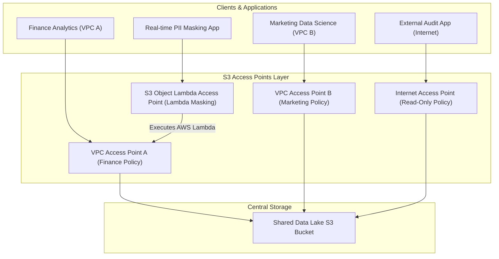
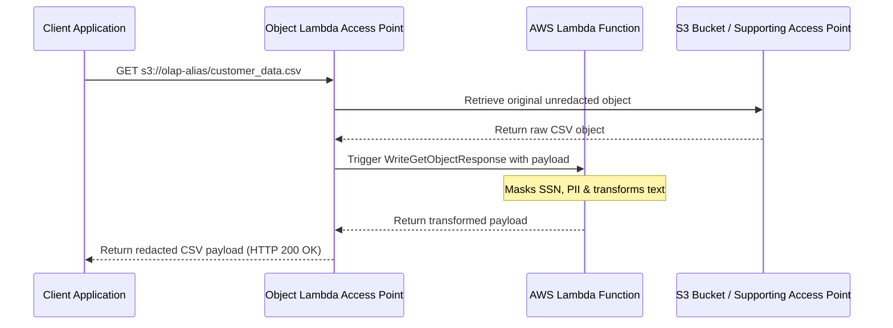

# 🌐 Amazon S3 Access Points & Object Lambda

- **Category**: Storage Governance & Access Management
- **Language / ဘာသာစကား**: **English (Original)** | [မြန်မာဘာသာ (Burmese)](/mm/02-services/storage/s3/s3-access-points)
- **Primary Use Case**: Simplified Large-Scale Access Control, Multi-Tenant Data Lakes, In-Transit Data Transformation
- **Slide Reference**: Pages 77–138 in [AWSCertifiedDataEngineerSlides.pdf](/docs/AWSCertifiedDataEngineerSlides.pdf)
- **Hub Links**: [[index]] | [[service-catalog]] | [[s3]] | [[s3-encryption]] | [[vpc-and-networking]]

---

## 1. High-Level Summary

As data lakes grow in scale, managing access permissions through a single bucket policy becomes complex and prone to errors. **Amazon S3 Access Points** solve this "single bucket policy sprawl" by creating unique, dedicated network endpoints with custom access policies tailored to specific applications, teams, or VPCs. Furthermore, **S3 Object Lambda Access Points** allow inline transformation of data (such as redacting PII or reformatting objects) as it is retrieved from S3.

---

## 2. Architecture & Access Point Types



---

## 3. Core Access Point Variants

### 1. Standard S3 Access Points (VPC & Internet)

- **Problem Solved**: Replaces a monolithic 100 KB bucket policy with decoupled, scoped policies per team or dataset consumer.
- **VPC-Restricted Access Points**: Constrains all data requests to originate strictly from a specific Virtual Private Cloud (VPC) via a **VPC Interface Endpoint** (`com.amazonaws.<region>.s3-global.accesspoint`).
- **Addressing**: Each Access Point receives a distinct hostname and ARN:
  - **ARN**: `arn:aws:s3:<region>:<account-id>:accesspoint/<access-point-name>`
  - **DNS Alias**: `s3://<access-point-alias>/` or `https://<access-point-name>-<account-id>.s3-accesspoint.<region>.amazonaws.com`

### 2. S3 Multi-Region Access Points (MRAP)

- **Mechanism**: Provides a single global endpoint (`https://<mrap-alias>.accesspoint.s3-global.amazonaws.com`) that automatically routes application requests to the lowest-latency S3 bucket across multiple AWS Regions.
- **Powered by AWS Global Accelerator**: Bypasses the public internet to route traffic over the AWS global network backbone, improving request performance by **up to 60%**.
- **Active-Passive / Active-Active Failover**: Automatically routes traffic away from an impaired region to secondary buckets in another region for high availability and disaster recovery.

---

## 4. S3 Object Lambda Access Points

S3 Object Lambda enables adding custom code (AWS Lambda) to `s3:GetObject` requests to process and transform data inline before returning it to the calling application.



### High-Yield Use Cases for Object Lambda

- **PII Redaction & Data Masking**: Dynamically mask personally identifiable information (SSN, credit card numbers, email) based on the identity of the requester.
- **Format Conversion**: Convert legacy XML or CSV files into JSON on-the-fly without storing duplicate converted files in S3.
- **Dynamic Image Resizing & Watermarking**: Resize or add watermarks to images dynamically for mobile or web clients.
- **Data Filtering & Enriched Row Stripping**: Strip sensitive columns or rows tailored to different regulatory compliance tiers.

---

## 5. Security & Delegation Architecture

To enforce access control through Access Points, permissions must be aligned across two levels:

1. **Access Point Policy**: Attached to the Access Point itself to grant specific IAM principals access to prefixes or actions (e.g., `s3:GetObject`).
2. **Bucket Policy Delegation**: The underlying S3 Bucket Policy must delegate authority to the Access Point, or use the `s3:DataAccessPointAccount` condition:

```json
{
  "Version": "2012-10-17",
  "Statement": [
    {
      "Sid": "DelegateAccessToAccessPoints",
      "Effect": "Allow",
      "Principal": "*",
      "Action": "s3:*",
      "Resource": [
        "arn:aws:s3:::central-data-lake-bucket",
        "arn:aws:s3:::central-data-lake-bucket/*"
      ],
      "Condition": {
        "StringEquals": {
          "s3:DataAccessPointAccount": "123456789012"
        }
      }
    }
  ]
}
```

> [!TIP]
> **Block Public Access per Access Point**: Each Access Point maintains its own Block Public Access settings, allowing strict isolation even if bucket-level settings differ.

---

## 6. S3 Access Points vs. Lake Formation & VPC Endpoints

| Feature               | S3 Access Points                      | AWS Lake Formation              | S3 VPC Endpoints                    |
| --------------------- | ------------------------------------- | ------------------------------- | ----------------------------------- |
| **Primary Level**     | Storage / Bucket level                | Data Catalog & Column/Row level | Networking level                    |
| **Control Mechanism** | Access Point JSON Policies            | LF-TBAC & Fine-grained IAM      | VPC Route Tables & Gateway Policies |
| **Inline Processing** | Supported via **Object Lambda**       | Not supported inline            | Not supported inline                |
| **Multi-Region**      | **Multi-Region Access Points (MRAP)** | Single-region metastore         | Single-region networking            |

---

## 7. DEA-C01 Exam Tips & Decision Triggers

> [!IMPORTANT]
> **Key Exam Decision Rules**:
>
> - **Bucket policy too large / complex for multiple teams**: Create separate **S3 Access Points** with individual access policies.
> - **Restrict S3 access to requests coming from a specific VPC**: Create a **VPC-restricted S3 Access Point** tied to an S3 VPC Interface Endpoint.
> - **Dynamic data transformation on read (PII redaction, format conversion, masking) without duplicate storage**: Choose **S3 Object Lambda Access Points**.
> - **Single global endpoint for multi-region active-active S3 data lakes with low latency routing**: Choose **S3 Multi-Region Access Points (MRAP)**.
> - **Failover between primary and secondary S3 regions for disaster recovery**: Use **S3 Multi-Region Access Points (MRAP) failover controls**.

---

## 📌 Related Notes

- [[s3]] — Amazon S3 Overview & Storage Classes
- [[s3-encryption]] — S3 Encryption & Bucket Policies
- [[s3-performance]] — S3 Request Limits & Performance
- [[vpc-and-networking]] — S3 VPC Gateway & Interface Endpoints
- [[lambda]] — AWS Lambda Event Triggers & Function Compute
- [[lake-formation]] — Fine-Grained Column/Row Governance
