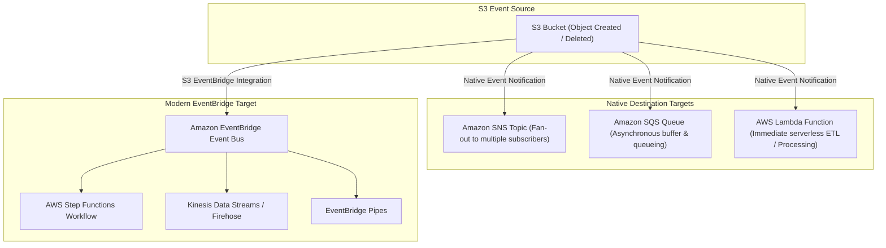

# ⚡ Amazon S3 Event Notifications & EventBridge Integration

- **Category**: Event-Driven Architecture & Integration
- **Language / ဘာသာစကား**: **English (Original)** | [မြန်မာဘာသာ (Burmese)](/mm/02-services/storage/s3/s3-event-notifications)
- **Primary Use Case**: Automated Data Pipeline Triggering, Asynchronous ETL Ingestion, Decoupled Processing
- **Slide Reference**: Pages 77–138 in [AWSCertifiedDataEngineerSlides.pdf](/docs/AWSCertifiedDataEngineerSlides.pdf)
- **Hub Links**: [[index]] | [[service-catalog]] | [[s3]] | [[lambda]] | [[sqs-and-sns]] | [[cloudwatch-and-eventbridge]]

---

## 1. High-Level Summary

**Amazon S3 Event Notifications** automatically send notification messages when specific object events occur in an S3 bucket (such as object creation, deletion, or restoration). In the **AWS Certified Data Engineer – Associate (DEA-C01)** exam, S3 Event Notifications are the foundation of **event-driven data pipelines**, triggering downstream processing in **AWS Lambda**, queuing messages in **Amazon SQS**, broadcasting to **Amazon SNS**, or emitting rich events to **Amazon EventBridge**.

---

## 2. Event Notification Destinations Architecture



---

## 3. Supported S3 Event Types & Filters

### 1. Common Event Types

- `s3:ObjectCreated:*`: Triggers on `Put`, `Post`, `Copy`, or `CompleteMultipartUpload`.
- `s3:ObjectRemoved:*`: Triggers on `Delete` or `DeleteMarkerCreated`.
- `s3:ObjectRestore:*`: Triggers on `Post` (initiated) or `Completed` (from Glacier).
- `s3:Replication:*`: Triggers on replication failure, missed threshold, or completion.
- `s3:LifecycleExpiration:*`: Triggers when objects expire via lifecycle rules.

### 2. Prefix & Suffix Filtering

Native S3 event notifications allow filtering by name:

- **Prefix Filter**: Scope events to specific folders (e.g. `Prefix: raw/` or `Prefix: incoming/`).
- **Suffix Filter**: Scope events to specific file extensions (e.g. `Suffix: .csv` or `Suffix: .parquet`).

> [!CAUTION]
> **Infinite Loop Prevention**:  
> If an S3 event triggers a Lambda function that transforms the file and writes the output back into the **same bucket with the same prefix**, it creates an infinite recursive execution loop!  
> **Solution**: Write output files to a different bucket or a distinct prefix (e.g., input from `raw/`, output to `processed/`).

---

## 4. Native S3 Notifications vs. S3 EventBridge Integration

AWS supports two distinct mechanisms for processing S3 events:

| Feature                    | Native S3 Event Notifications                  | S3 EventBridge Integration                                                            |
| -------------------------- | ---------------------------------------------- | ------------------------------------------------------------------------------------- |
| **Supported Targets**      | **SNS, SQS, AWS Lambda**                       | **Any EventBridge Target** (Step Functions, Kinesis, Firehose, ECS, API Destinations) |
| **Target Limit**           | Max 1 destination per prefix/suffix filter     | **Multiple independent targets** via EventBridge Rules                                |
| **Advanced Filtering**     | Basic prefix/suffix matching only              | Advanced JSON pattern matching (file size, tags, metadata)                            |
| **Event Replay / Archive** | ❌ Not supported                               | **Supported** (EventBridge Event Archiving & Replay)                                  |
| **Cross-Account Routing**  | Requires complex resource policies             | **Supported** via EventBridge Cross-Account Event Buses                               |
| **Delivery Guarantee**     | At-least-once delivery (typically $<1$ second) | At-least-once delivery (typically $<1$ second)                                        |

---

## 5. Required Resource Permissions (Destination Policies)

A common exam trap involves S3 event notifications failing to deliver messages due to **missing resource-based policies**. S3 must be granted permission to invoke or send messages to the target:

### 1. AWS Lambda Resource Policy

```json
{
  "Effect": "Allow",
  "Principal": { "Service": "s3.amazonaws.com" },
  "Action": "lambda:InvokeFunction",
  "Resource": "arn:aws:lambda:region:account-id:function:my-etl-function",
  "Condition": {
    "ArnLike": { "aws:SourceArn": "arn:aws:s3:::my-ingestion-bucket" }
  }
}
```

### 2. Amazon SQS Queue Policy

```json
{
  "Effect": "Allow",
  "Principal": { "Service": "s3.amazonaws.com" },
  "Action": "sqs:SendMessage",
  "Resource": "arn:aws:sqs:region:account-id:my-s3-queue",
  "Condition": {
    "ArnLike": { "aws:SourceArn": "arn:aws:s3:::my-ingestion-bucket" }
  }
}
```

### 3. Amazon SNS Topic Policy

```json
{
  "Effect": "Allow",
  "Principal": { "Service": "s3.amazonaws.com" },
  "Action": "sns:Publish",
  "Resource": "arn:aws:sns:region:account-id:my-s3-topic",
  "Condition": {
    "ArnLike": { "aws:SourceArn": "arn:aws:s3:::my-ingestion-bucket" }
  }
}
```

---

## 6. DEA-C01 Exam Tips & Decision Triggers

> [!IMPORTANT]
> **Key Exam Decision Rules**:
>
> - **Trigger a serverless transformation script immediately when a file lands in S3**: Use S3 Event Notification $\rightarrow$ **AWS Lambda**.
> - **Buffer high-volume S3 events asynchronously before processing**: Use S3 Event Notification $\rightarrow$ **Amazon SQS Queue**.
> - **Broadcast S3 creation events to multiple independent applications**: Use S3 Event Notification $\rightarrow$ **Amazon SNS Topic** (Fan-out pattern).
> - **Trigger an AWS Step Functions state machine or Kinesis stream from S3**: Enable **S3 EventBridge Integration** and create EventBridge Rules.
> - **Need to replay historical S3 events or filter by object size/tags**: Choose **S3 EventBridge Integration**.
> - **Fix S3 event notification delivery failure**: Update target resource policy (Lambda / SQS / SNS) to grant `s3.amazonaws.com` permission with `aws:SourceArn`.
> - **Prevent infinite Lambda execution loops**: Configure S3 prefix filters so Lambda writes output to a different prefix (`processed/`).

---

## 📌 Related Notes

- [[s3]] — Main Amazon S3 Overview & Storage Classes
- [[lambda]] — Serverless Event Processing & Execution Timeouts
- [[sqs-and-sns]] — Decoupling Data Pipelines & Fan-Out Architecture
- [[cloudwatch-and-eventbridge]] — EventBridge Event Buses, Rules, Archive & Replay
- [[step-functions]] — Orchestrating Complex Serverless ETL Workflows
