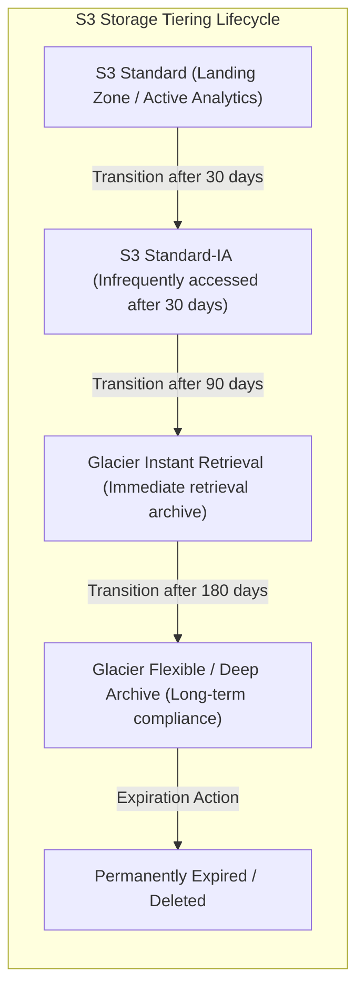
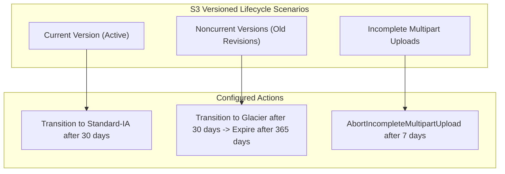

# ⏳ Amazon S3 Lifecycle Rules

- **Category**: Storage Governance & Cost Optimization
- **Language / ဘာသာစကား**: **English (Original)** | [မြန်မာဘာသာ (Burmese)](/mm/02-services/storage/s3/s3-lifecycle-rules)
- **Primary Use Case**: Automated Data Tiering, Retention Management, Storage Cost Reduction, Cleanup of Noncurrent Versions & Incomplete Multipart Uploads
- **Slide Reference**: Pages 77–138 in [AWSCertifiedDataEngineerSlides.pdf](/docs/AWSCertifiedDataEngineerSlides.pdf)
- **Hub Links**: [[en/index|index]] | [[en/00-hub/service-catalog|service-catalog]] | [[en/02-services/storage/s3/s3|s3]] | [[en/02-services/storage/s3/s3-versioning|s3-versioning]] | [[en/02-services/ml-dev-cost/cost-management|cost-management]] | [[en/02-services/storage/s3/s3-storage-lens|s3-storage-lens]]

---

## 1. High-Level Summary

**Amazon S3 Lifecycle Rules** automate object management throughout their lifecycle. In the **AWS Certified Data Engineer – Associate (DEA-C01)** exam, S3 Lifecycle rules are the primary mechanism used to implement **automated cost optimization**. They automatically transition objects to cheaper storage classes (e.g., S3 Standard $\rightarrow$ Standard-IA $\rightarrow$ Glacier $\rightarrow$ Deep Archive) or expire (delete) them based on age, prefixes, object tags, or versioning state.

---

## 2. Transition & Expiration Flow



---

## 3. Core Lifecycle Actions

### 1. Transition Actions

Defines when objects transition from one storage class to another as they age.

- **Storage Class Transition Constraints**:
  - **S3 Standard $\rightarrow$ S3 Standard-IA**: Objects must remain in S3 Standard for **at least 30 days** before transitioning to Standard-IA or One Zone-IA.
  - **Minimum File Size**: Objects smaller than $128\text{ KB}$ are generally not recommended for transition to IA/Glacier due to per-object metadata costs.
  - **S3 Intelligent-Tiering**: Objects can transition directly into Intelligent-Tiering at any time.

| Storage Class Transition Path                      | Min Days in Prior Tier | Billing Retention Requirement     | Primary Use Case                                    |
| -------------------------------------------------- | ---------------------- | --------------------------------- | --------------------------------------------------- |
| **Standard $\rightarrow$ Standard-IA**             | 30 days                | 30-day minimum billable duration  | Infrequent reads, immediate access needed           |
| **Standard-IA $\rightarrow$ Glacier Instant**      | 30 days                | 90-day minimum billable duration  | Archival data requiring millisecond retrieval       |
| **Glacier Instant $\rightarrow$ Glacier Flexible** | 90 days                | 90-day minimum billable duration  | Backup archives (3–5 hr retrieval acceptable)       |
| **Glacier Flexible $\rightarrow$ Deep Archive**    | 90 days                | 180-day minimum billable duration | Lowest cost compliance archive (12–48 hr retrieval) |

### 2. Expiration Actions

Defines when objects expire and are permanently deleted from the bucket.

- **Unversioned Buckets**: The object is permanently deleted when the expiration days threshold is reached.
- **Versioning-Enabled Buckets**: The expiration action creates a **Delete Marker** as the current version (unless deleting specific noncurrent versions).

---

## 4. Lifecycle Rules for Versioned Buckets

Managing storage costs in version-enabled buckets requires rules specifically targeting **Current** and **Noncurrent** object versions.



### Key Noncurrent Version Rules

1. **`NoncurrentVersionTransitions`**: Move old, overwritten object versions to cheaper storage classes (e.g. Standard-IA after 30 days, Glacier Deep Archive after 90 days).
2. **`NoncurrentVersionExpiration`**: Permanently delete old noncurrent versions after a set number of days (e.g. 365 days).
3. **`NewerNoncurrentVersions`**: Specify the number of recent noncurrent versions to retain before applying expiration rules (e.g., retain 3 noncurrent versions, expire all older versions).

---

## 5. Critical Maintenance Actions (Cost Killers)

### 1. Abort Incomplete Multipart Uploads (`AbortIncompleteMultipartUpload`)

- **Problem**: When large file uploads fail or are interrupted, the uploaded parts remain stored in S3 silently consuming space and incurring ongoing S3 storage costs.
- **Solution**: Configure a Lifecycle rule to automatically abort incomplete multipart uploads after a set number of days (e.g., 7 days):

```json
{
  "Rules": [
    {
      "ID": "AbortFailedUploads",
      "Status": "Enabled",
      "Filter": {},
      "AbortIncompleteMultipartUpload": {
        "DaysAfterInitiation": 7
      }
    }
  ]
}
```

### 2. Expired Object Delete Markers Cleanup (`ExpiredObjectDeleteMarkers`)

- **Problem**: In versioned buckets, deleting an object leaves a **Delete Marker**. When all noncurrent versions of that object are expired, the orphan Delete Marker remains, slightly degrading list performance.
- **Solution**: Set `ExpiredObjectDeleteMarkers: true` in the Lifecycle rule to automatically purge orphan delete markers once no noncurrent versions remain.

---

## 6. Lifecycle Filters & Scope

Lifecycle rules can be applied to an entire bucket or scoped narrowly using filters:

- **Filter by Prefix**: Apply rules to specific folder paths (e.g. `raw-logs/`, `staging/`, `temp/`).
- **Filter by Object Tags**: Apply rules to objects containing specific key-value tags (e.g. `Project=Analytics`, `Status=Archived`).
- **Filter by Object Size**: Specify `ObjectSizeGreaterThan` or `ObjectSizeLessThan` (e.g. only apply transition rules to files $> 128\text{ KB}$).

---

## 7. DEA-C01 Exam Tips & Decision Triggers

> [!IMPORTANT]
> **Key Exam Decision Rules**:
>
> - **Automate transitioning old data to cheaper storage classes**: Create **S3 Lifecycle Transition Rules**.
> - **Stop uncompleted large file uploads from incurring silent storage costs**: Configure **`AbortIncompleteMultipartUpload`** lifecycle rule (e.g. abort after 7 days).
> - **Reduce storage costs in a versioned bucket with accumulated old versions**: Configure **`NoncurrentVersionTransitions`** and **`NoncurrentVersionExpiration`** rules.
> - **Retain a specific number of old versions while deleting older ones**: Use **`NewerNoncurrentVersions`** parameter.
> - **Transition data from S3 Standard to S3 Standard-IA**: Must wait **at least 30 days** in S3 Standard.
> - **Clean up orphan Delete Markers**: Set **`ExpiredObjectDeleteMarkers: true`** in lifecycle rules.
> - **Automatically optimize storage costs for unpredictable access patterns**: Choose **S3 Intelligent-Tiering** instead of manual lifecycle rules.

---

## 📌 Related Notes

- [[en/02-services/storage/s3/s3|s3]] — Main Amazon S3 Overview & Storage Classes
- [[en/02-services/storage/s3/s3-versioning|s3-versioning]] — S3 Versioning, Delete Markers & MFA Delete
- [[en/02-services/storage/s3/s3-storage-lens|s3-storage-lens]] — Identifying Incomplete Multipart Uploads & Cost Analytics
- [[en/02-services/ml-dev-cost/cost-management|cost-management]] — AWS Cost Explorer & Cost Optimization Strategies
