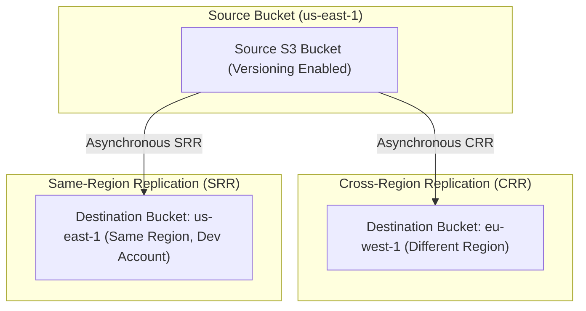
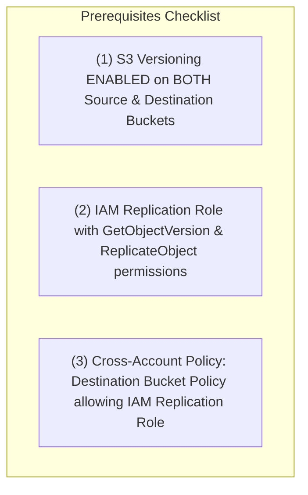

# 🔁 Amazon S3 Replication (CRR & SRR)

- **Category**: Storage Resilience & Data Availability
- **Language / ဘာသာစကား**: **English (Original)** | [မြန်မာဘာသာ (Burmese)](/mm/02-services/storage/s3/s3-replication)
- **Primary Use Case**: Disaster Recovery (DR), Cross-Region Data Distribution, Compliance Data Residency, Log Aggregation
- **Slide Reference**: Pages 77–138 in [AWSCertifiedDataEngineerSlides.pdf](/docs/AWSCertifiedDataEngineerSlides.pdf)
- **Hub Links**: [[en/index|index]] | [[en/00-hub/service-catalog|service-catalog]] | [[en/02-services/storage/s3/s3|s3]] | [[en/02-services/storage/s3/s3-versioning|s3-versioning]] | [[en/02-services/storage/s3/s3-security|s3-security]] | [[en/02-services/storage/s3/s3-encryption|s3-encryption]]

---

## 1. High-Level Summary

**Amazon S3 Replication** provides automatic, asynchronous copying of objects across Amazon S3 buckets. In the **AWS Certified Data Engineer – Associate (DEA-C01)** exam, S3 Replication is a high-frequency topic tested across **Cross-Region Replication (CRR)** for disaster recovery and latency reduction, **Same-Region Replication (SRR)** for log aggregation and account boundaries, **Replication Time Control (RTC)** for 15-minute SLAs, and **S3 Batch Replication** for copying existing historical objects.

---

## 2. Replication Types Architecture

### CRR vs. SRR Comparison Matrix

| Feature                    | Cross-Region Replication (CRR)                                               | Same-Region Replication (SRR)                                                      |
| -------------------------- | ---------------------------------------------------------------------------- | ---------------------------------------------------------------------------------- |
| **Region Scope**           | Different AWS Regions (e.g. `us-east-1` $\rightarrow$ `eu-west-1`)           | Same AWS Region (e.g. `us-east-1` $\rightarrow$ `us-east-1`)                       |
| **Primary Use Cases**      | Disaster Recovery (DR), compliance data residency, global low-latency access | Log aggregation across accounts, live dev/test environment sync, account isolation |
| **KMS Key Requirements**   | Requires target region KMS key mapping                                       | Uses same region KMS key or CMK                                                    |
| **Versioning Requirement** | **Mandatory** on source & destination                                        | **Mandatory** on source & destination                                              |

---

## 3. Mandatory Technical Prerequisites

Before S3 Replication can operate, three strict prerequisites must be satisfied:

### 1. S3 Versioning Enabled

- **S3 Versioning MUST be enabled** on BOTH the source bucket and the destination bucket.
- Versioning provides the immutable `versionId` identifiers required by S3 to track and replicate asynchronous changes.

### 2. IAM Replication Role

S3 requires a dedicated IAM service role assumed by `s3.amazonaws.com` with explicit permissions:

- **Read from source**: `s3:GetObjectVersion`, `s3:GetObjectVersionAcl`, `s3:GetObjectVersionTagging`.
- **Write to destination**: `s3:ReplicateObject`, `s3:ReplicateDelete`, `s3:ReplicateTags`.

### 3. Cross-Account Destination Bucket Policy

- If the destination bucket belongs to a different AWS account, the destination **Bucket Policy** must explicitly grant write permissions (`s3:ReplicateObject`) to the source account's IAM Replication Role.

---

## 4. What Is & Is NOT Replicated

Understanding default replication boundaries is critical for exam scenario questions:

### Replicated by Default ✅

- New objects uploaded **after** the replication rule is created (`PUT`, `POST`, `COPY`).
- Object metadata, tags, and Access Control Lists (ACLs).
- Unencrypted objects and **SSE-S3** encrypted objects.
- **SSE-KMS** encrypted objects (if explicitly enabled in the replication configuration with KMS key mappings).

### NOT Replicated by Default ❌

- **Existing Objects**: Objects uploaded **before** the replication rule was created (requires **S3 Batch Replication**).
- **Simple Delete Requests**: Simple `DELETE` calls (inserting a Delete Marker) are NOT replicated by default to prevent accidental deletion cascades. (Can be enabled via `DeleteMarkerReplication`).
- **Permanent Deletions**: Deletions specifying a `versionId` are NEVER replicated to prevent accidental data destruction.
- **SSE-C Encrypted Objects**: Objects encrypted with customer-provided keys (SSE-C) cannot be replicated.
- **Objects Without Read Permission**: Objects in the source bucket where the bucket owner lacks `s3:GetObjectVersion` rights (e.g. uploaded by external accounts).

---

## 5. S3 Replication Time Control (RTC) & Batch Replication

### 1. S3 Replication Time Control (RTC)

- **SLA Guarantee**: Backed by a Service Level Agreement (SLA) guaranteeing that **99.9% of new objects are replicated within 15 minutes**.
- **Real-Time CloudWatch Monitoring**: Emits CloudWatch metrics for:
  - `BytesPendingReplication`
  - `OperationsPendingReplication`
  - `ReplicationLatency` (tracking time to replicate)
- **Use Case**: Financial & regulatory compliance requiring strict RPO (Recovery Point Objective) guarantees.

### 2. S3 Batch Replication

- **Problem**: Standard S3 Replication rules only replicate new objects uploaded **after** the rule is enabled.
- **Solution**: **S3 Batch Replication** executes an asynchronous batch job (powered by S3 Batch Operations) to replicate:
  - Existing historical objects uploaded before the replication rule existed.
  - Objects that previously failed replication.
  - Re-replicating objects across accounts or regions.

---

## 6. S3 Ownership & Storage Class Override

When replicating across accounts, you can customize destination object settings:

- **Change Object Ownership to Destination Account**: Prevents the source account from retaining ownership of replicated objects in cross-account setups (`--replica-modifications-sync`).
- **Destination Storage Class Override**: Automatically transition replicated objects into a cheaper storage class at the destination (e.g., source is **S3 Standard**, destination replicates directly into **S3 Standard-IA** or **S3 Glacier**).

---

## 7. DEA-C01 Exam Tips & Decision Triggers

> [!IMPORTANT]
> **Key Exam Decision Rules**:
>
> - **Replicate data across regions for Disaster Recovery (DR) or compliance**: Choose **S3 Cross-Region Replication (CRR)**.
> - **Aggregate logs from multiple accounts into a single bucket in the same region**: Choose **S3 Same-Region Replication (SRR)**.
> - **Prerequisite error when enabling S3 Replication**: Check if **S3 Versioning** is enabled on BOTH source and destination buckets.
> - **Replicate existing historical objects created before rule creation**: Use **S3 Batch Replication**.
> - **Strict 15-minute replication SLA requirement for compliance**: Enable **S3 Replication Time Control (RTC)**.
> - **Replicate SSE-KMS encrypted objects across accounts**: Provide KMS key mapping in replication rule + grant KMS permissions in destination account KMS key policy.
> - **Prevent simple deletes from deleting data in destination bucket**: Leave **Delete Marker Replication** disabled (default).

---

## 📌 Related Notes

- [[en/02-services/storage/s3/s3|s3]] — Main Amazon S3 Overview & Storage Classes
- [[en/02-services/storage/s3/s3-versioning|s3-versioning]] — S3 Versioning, Delete Markers & MFA Delete
- [[en/02-services/storage/s3/s3-security|s3-security]] — S3 Security & Cross-Account Access
- [[en/02-services/storage/s3/s3-encryption|s3-encryption]] — SSE-S3, SSE-KMS & Cross-Account KMS CMK Setup
- [[en/02-services/security-governance/kms-and-secrets|kms-and-secrets]] — AWS KMS Key Policies & Cross-Account Access
