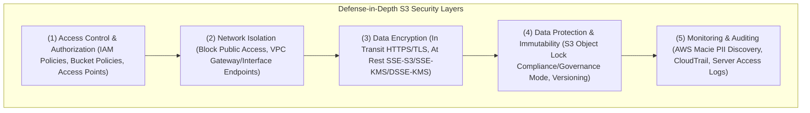
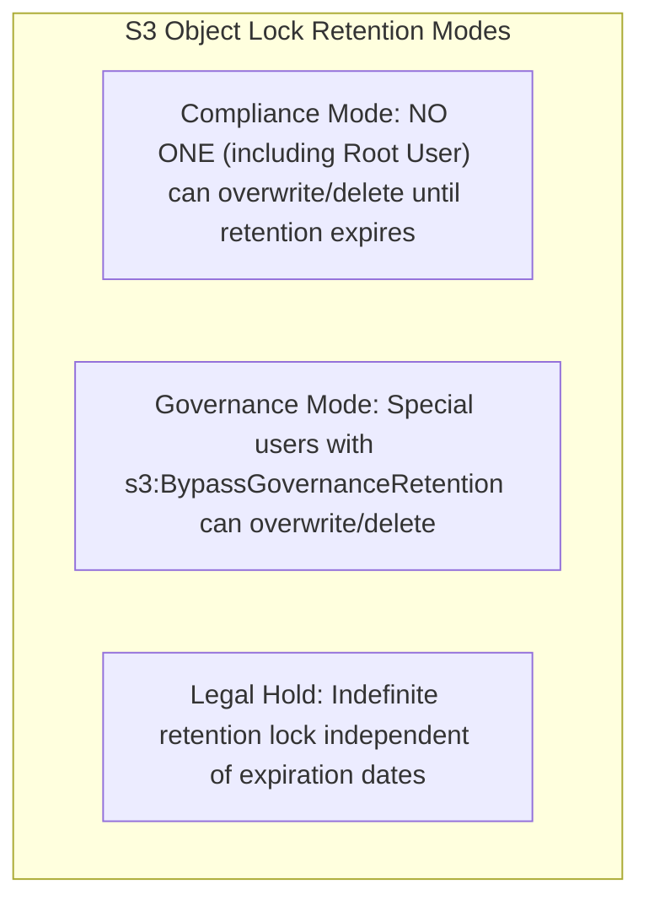

# 🛡️ Amazon S3 Security & Access Management

- **Category**: Storage Security & Data Protection
- **Language / ဘာသာစကား**: **English (Original)** | [မြန်မာဘာသာ (Burmese)](/mm/02-services/storage/s3/s3-security)
- **Primary Use Case**: Defense-in-Depth Security, Access Control, Regulatory Compliance, Data Immutability & Auditing
- **Slide Reference**: Pages 77–138 in [AWSCertifiedDataEngineerSlides.pdf](/docs/AWSCertifiedDataEngineerSlides.pdf)
- **Hub Links**: [[index]] | [[service-catalog]] | [[s3]] | [[s3-encryption]] | [[s3-access-points]] | [[iam]] | [[lake-formation]] | [[macie-and-cloudtrail]]

---

## 1. High-Level Summary

Security is a primary focus area in the **AWS Certified Data Engineer – Associate (DEA-C01)** exam. Amazon S3 implements a comprehensive **Defense-in-Depth** security model combining identity authorization (IAM policies), resource authorization (Bucket Policies & Access Points), network isolation (Block Public Access & VPC Endpoints), data encryption (SSE-S3, SSE-KMS, DSSE-KMS, TLS), data immutability (S3 Object Lock WORM), and automated PII discovery (AWS Macie).

---

## 2. S3 Security Control Pillars



---

## 3. Pillar 1: Access Control & Authorization

### 1. IAM Policies vs. S3 Bucket Policies

- **IAM Policies**: User-centric policies attached to IAM Users, Roles, or Groups. Determines what an identity can access across AWS resources.
- **S3 Bucket Policies**: Resource-centric JSON policies attached directly to an S3 bucket. Defines who (Principals) can perform actions on the bucket and its objects.
- **Policy Evaluation Logic**:
  $$\text{Access Granted} = (\text{IAM Allow} \lor \text{Bucket Policy Allow}) \land \neg (\text{Explicit Deny anywhere})$$
  - An **Explicit DENY** in any policy overrides all `ALLOW` statements.
  - For cross-account access, **both** the IAM policy (Account B) AND the S3 bucket policy (Account A) must explicitly grant `ALLOW`.

### 2. Disabling Legacy S3 ACLs (Bucket Owner Enforced)

- **S3 Access Control Lists (ACLs)**: Legacy access control mechanism.
- **Best Practice (Recommended by AWS)**: Disable ACLs by setting **Bucket Owner Enforced**. When enabled:
  - ACLs are completely disabled.
  - All objects uploaded to the bucket are automatically owned by the bucket owner account.
  - Access control is simplified and managed exclusively via IAM policies, Bucket Policies, and Access Points.

---

## 4. Pillar 2: Network Isolation & Block Public Access

### 1. S3 Block Public Access

An account-level and bucket-level safety override that prevents public access regardless of bucket policies or ACL settings. Includes 4 settings:

1. `BlockPublicAcls`: Blocks new public ACLs.
2. `IgnorePublicAcls`: Ignores existing public ACLs.
3. `BlockPublicPolicy`: Blocks new bucket policies that grant public access.
4. `RestrictPublicBuckets`: Restricts public bucket access to AWS service principals only.

### 2. VPC Endpoints for S3 (Private Network Isolation)

To prevent S3 traffic from routing over the public internet:

- **VPC Gateway Endpoints**: Free VPC routing configuration for S3. Added to VPC route tables.
- **VPC Interface Endpoints (AWS PrivateLink)**: Private IP addresses in your subnets (`com.amazonaws.<region>.s3`). Enables private access to S3 from on-premises networks via AWS Direct Connect or VPN.

---

## 5. Pillar 3: Encryption & In-Transit Security

See full deep-dive note: [[s3-encryption]].

- **Encryption in Transit (HTTPS/TLS)**: Mandatory enforcement via bucket policy:
  ```json
  "Condition": { "Bool": { "aws:SecureTransport": "false" } }
  ```
- **Encryption at Rest**:
  - **SSE-S3**: Default encryption (AES-256) managed by AWS at no cost.
  - **SSE-KMS**: Managed keys with **CloudTrail audit logging** and separate key policies.
  - **DSSE-KMS**: **Dual-Layer Server-Side Encryption** based on KMS (two independent AES-256 layers for high compliance).
  - **SSE-C**: Customer-provided encryption keys.
  - **S3 Bucket Keys**: Reduces KMS API requests & costs by up to 99%.

---

## 6. Pillar 4: Data Protection & Immutability (WORM)

### S3 Object Lock (Write Once Read Many)

Prevents object deletion or modification for compliance and ransomware protection. Requires S3 Versioning enabled.



| Object Lock Mode    | Overwrite / Delete Allowed?                         | Can Root User Override?              | Primary Use Case                        |
| ------------------- | --------------------------------------------------- | ------------------------------------ | --------------------------------------- |
| **Compliance Mode** | ❌ Strictly forbidden until retention expires       | ❌ No (Cannot be altered or deleted) | SEC Rule 17a-4, FINRA, regulatory WORM  |
| **Governance Mode** | ⚠️ Allowed only with `s3:BypassGovernanceRetention` | ✔️ Yes (If permission granted)       | Internal policy enforcement, testing    |
| **Legal Hold**      | ❌ Strictly forbidden while active                  | ❌ No (Must be manually removed)     | Ongoing legal proceedings / audit holds |

---

## 7. Pillar 5: Auditing, Monitoring & PII Scanning

### 1. AWS Macie (Automated PII Discovery)

- Uses machine learning and pattern matching to discover, classify, and protect **Personally Identifiable Information (PII)** stored in S3 buckets.
- Automatically detects Social Security Numbers (SSN), credit card numbers, passport data, and private API keys.
- Generates security findings in EventBridge and AWS Security Hub.

### 2. AWS CloudTrail & S3 Server Access Logging

- **CloudTrail Data Events**: Records API calls (`s3:GetObject`, `s3:PutObject`, `s3:DeleteObject`) for auditing.
- **S3 Server Access Logs**: Delivers detailed request records (requester, bucket, time, response status) into a target S3 bucket for analysis with [[athena]].

---

## 8. S3 Security Summary & Comparison Matrix

| Security Mechanism        | Primary Security Function              | Enforcement Level       | DEA-C01 Key Benefit                                 |
| ------------------------- | -------------------------------------- | ----------------------- | --------------------------------------------------- |
| **Bucket Policy**         | Resource-based authorization           | Bucket level            | Restrict access by IP, VPC, HTTPS, or IAM principal |
| **Block Public Access**   | Safety kill-switch against exposure    | Account / Bucket level  | Overrides accidental public policies/ACLs           |
| **S3 Object Lock**        | Data immutability (WORM)               | Object / Version level  | Regulatory WORM compliance & ransomware protection  |
| **SSE-KMS + Bucket Keys** | Encryption at rest + audit logging     | Bucket / Object level   | CloudTrail audit trail + 99% cost reduction         |
| **AWS Macie**             | Automated PII discovery                | Bucket level            | Finds SSN, credit cards, and sensitive data in S3   |
| **Lake Formation**        | Column-, Row-, and Cell-level security | Data Catalog / S3 level | Fine-grained analytical data governance             |

---

## 9. DEA-C01 Exam Tips & Decision Triggers

> [!IMPORTANT]
> **Key Exam Decision Rules**:
>
> - **Enforce HTTPS/TLS for all S3 requests**: Add S3 Bucket Policy with `"aws:SecureTransport": "false"` and `Effect: Deny`.
> - **Strict regulatory requirement where NO ONE (including root user) can delete objects**: Choose **S3 Object Lock Compliance Mode**.
> - **Discover sensitive PII (SSNs, Credit Cards) stored in S3**: Choose **AWS Macie**.
> - **Disable legacy ACLs and ensure bucket owner owns all objects**: Set S3 Object Ownership to **Bucket Owner Enforced**.
> - **Audit trail of who accessed or encrypted S3 objects**: Enable **CloudTrail Data Events** and **SSE-KMS**.
> - **Cross-account access to encrypted S3 bucket**: Use **SSE-KMS with Customer Managed Key (CMK)** + update Bucket Policy and KMS Key Policy.

---

## 📌 Related Notes

- [[s3]] — Main Amazon S3 Overview & Storage Classes
- [[s3-encryption]] — Deep-dive on SSE-S3, SSE-KMS, DSSE-KMS & SSE-C
- [[s3-access-points]] — VPC Access Points & S3 Object Lambda
- [[s3-performance]] — S3 Request Limits & Performance Optimization
- [[iam]] — IAM Roles, Policies & Service-Linked Roles
- [[lake-formation]] — Fine-Grained Column/Row Governance
- [[macie-and-cloudtrail]] — AWS Macie PII Scanning & CloudTrail Audit Logs
