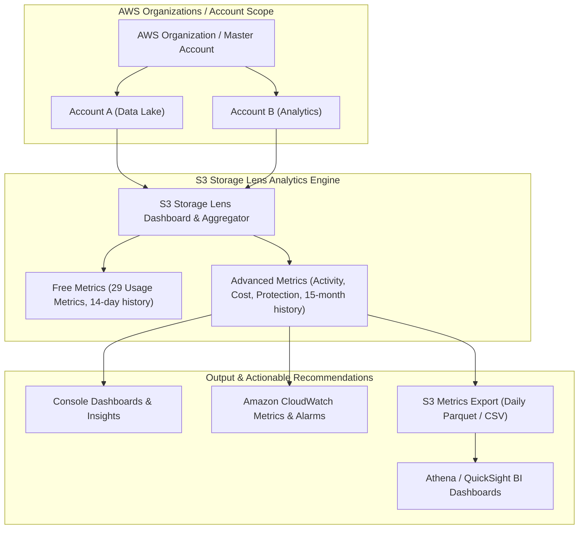

# 🔍 Amazon S3 Storage Lens

- **Category**: Storage Analytics & Governance
- **Language / ဘာသာစကား**: **English (Original)** | [မြန်မာဘာသာ (Burmese)](/mm/02-services/storage/s3/s3-storage-lens)
- **Primary Use Case**: Organization-Wide Storage Visibility, Cost Optimization, Security & Protection Auditing
- **Slide Reference**: Pages 77–138 in [[AWSCertifiedDataEngineerSlides.pdf]]
- **Hub Links**: [[index]] | [[service-catalog]] | [[s3]] | [[s3-performance]] | [[s3-encryption]] | [[cost-management]]

---

## 1. High-Level Summary

**Amazon S3 Storage Lens** is an organization-wide cloud storage analytics feature built directly into the AWS S3 Console. In AWS Data Engineering and the **DEA-C01** exam, S3 Storage Lens is the primary service used to discover **cost-optimization opportunities** (such as uncompleted multipart uploads or cold data in S3 Standard), audit **data protection and security posture** (such as unencrypted buckets or missing replication), and export granular storage metrics to S3 in **Parquet** format for downstream analytics with [[athena]] and [[quicksight]].

---

## 2. Architecture & Metrics Hierarchy



---

## 3. Storage Lens Tiers: Free vs. Advanced

| Feature                       | S3 Storage Lens Free                   | S3 Storage Lens Advanced (Paid)                               |
| ----------------------------- | -------------------------------------- | ------------------------------------------------------------- |
| **Availability**              | Auto-enabled for all AWS accounts      | Configurable per account/organization                         |
| **Usage Metrics**             | 29 usage metrics (Bytes, Object Count) | 29 usage metrics included                                     |
| **Activity Metrics**          | Not included                           | `GET`, `PUT`, `LIST`, `4xx`/`5xx` error rates, download bytes |
| **Cost Optimization Metrics** | Basic storage class breakdown          | **Uncompleted multipart uploads**, non-current version bytes  |
| **Data Protection Metrics**   | Basic encryption status                | **S3 Object Lock**, replication status, detailed KMS audit    |
| **Historical Data**           | **14 days**                            | **15 months (500+ days)** for trend analysis                  |
| **Granularity**               | Account, Region, Bucket                | Account, Region, Bucket, **Prefix**, **Storage Lens Groups**  |
| **Metrics Export**            | Console only                           | **S3 Metrics Export (Parquet / CSV)** & CloudWatch publishing |

---

## 4. Key Metric Categories & Cost Optimization Insights

### 1. Cost Optimization Recommendations

- **Incomplete Multipart Upload Bytes**: Identifies large uploads that were interrupted and never completed or aborted, which silently consume S3 storage space and incur ongoing costs.
- **Non-Current Version Bytes**: Identifies S3 version-enabled buckets storing terabytes of old, overwritten object versions that lack S3 Lifecycle expiration rules.
- **Unfrequently Accessed Data in Standard**: Identifies cold buckets in S3 Standard that have had zero read activity for $>30$ days, recommending automated transition to **S3 Standard-IA**, **Intelligent-Tiering**, or **Glacier**.

### 2. Security & Data Protection Auditing

- **Unencrypted Buckets**: Audits buckets where default server-side encryption (SSE-S3 / SSE-KMS) or bucket policies enforcing encryption are missing.
- **Block Public Access Status**: Flags accounts or buckets where S3 Block Public Access is turned off.
- **Replication Status**: Monitors Cross-Region Replication (CRR) and Same-Region Replication (SRR) byte coverage for disaster recovery compliance.

### 3. S3 Storage Lens Groups

- Allows custom filtering of metrics by:
  - **Object Tags** (e.g., `Environment=Production`).
  - **Prefixes** (e.g., `raw/`, `analytics/`).
  - **Object Creation Dates** or **File Extensions** (`.parquet`, `.csv`, `.log`).

---

## 5. Metrics Export & Downstream Analytics

S3 Storage Lens Advanced allows exporting daily metrics files directly to a designated S3 bucket:

- **Supported Formats**: **Apache Parquet** (recommended for query speed & low storage cost) or **CSV**.
- **Querying with Athena**: You can query exported Storage Lens Parquet metrics using [[athena]] to generate automated cost reporting:

```sql
SELECT
  account_id,
  bucket_name,
  sum(storage_bytes) / 1073741824 AS storage_gb,
  sum(incomplete_multipart_upload_bytes) / 1073741824 AS incomplete_mpu_gb
FROM s3_storage_lens_db.storage_lens_table
WHERE date = '2026-08-07'
GROUP BY account_id, bucket_name
HAVING sum(incomplete_multipart_upload_bytes) > 0
ORDER BY incomplete_mpu_gb DESC;
```

- **Visualizing with QuickSight**: Build executive storage cost dashboards and trend visualizations in [[quicksight]] connected directly to the Athena dataset.

---

## 6. S3 Storage Lens vs. S3 Inventory vs. Storage Class Analysis

| Feature                 | S3 Storage Lens                             | S3 Inventory                                   | S3 Storage Class Analysis                      |
| ----------------------- | ------------------------------------------- | ---------------------------------------------- | ---------------------------------------------- |
| **Scope**               | **Organization-wide / Account-wide**        | Single Bucket / Prefix                         | Single Bucket / Prefix                         |
| **Output Type**         | Visual Console, CloudWatch, Parquet/CSV     | CSV, ORC, Parquet object list                  | Recommendations in Console                     |
| **Primary Focus**       | Storage trends, cost optimization, security | Detailed list of individual objects & metadata | Access pattern analysis for IA lifecycle rules |
| **Object-Level Detail** | Aggregated (Prefix / Bucket level)          | **Individual Object level** (1 row per object) | Aggregated bucket level                        |

---

## 7. DEA-C01 Exam Tips & Decision Triggers

> [!IMPORTANT]
> **Key Exam Decision Rules**:
>
> - **Organization-wide visibility into S3 storage costs, security, and usage**: Choose **S3 Storage Lens**.
> - **Identify incomplete multipart uploads or non-current object versions across hundreds of buckets**: Use **S3 Storage Lens Advanced metrics**.
> - **Export daily S3 metrics to S3 for SQL querying in Athena in Parquet format**: Configure **S3 Storage Lens Metrics Export**.
> - **Filter S3 metrics by object tags, file extensions, or specific prefixes**: Use **S3 Storage Lens Groups**.
> - **Need a complete list of millions of individual objects and their metadata for auditing**: Choose **S3 Inventory** (not Storage Lens).
> - **Analyze access patterns of a single bucket to determine standard-IA transition days**: Choose **S3 Storage Class Analysis**.

---

## 📌 Related Notes

- [[s3]] — Amazon S3 Overview & Storage Classes
- [[s3-performance]] — S3 Request Limits & Performance Optimization
- [[s3-encryption]] — S3 Encryption & Bucket Security Auditing
- [[cost-management]] — AWS Cost Explorer, AWS Budgets & Cost Optimization
- [[athena]] — Querying Parquet Exports with SQL
- [[quicksight]] — BI Dashboards & Visualizations for Storage Lens
