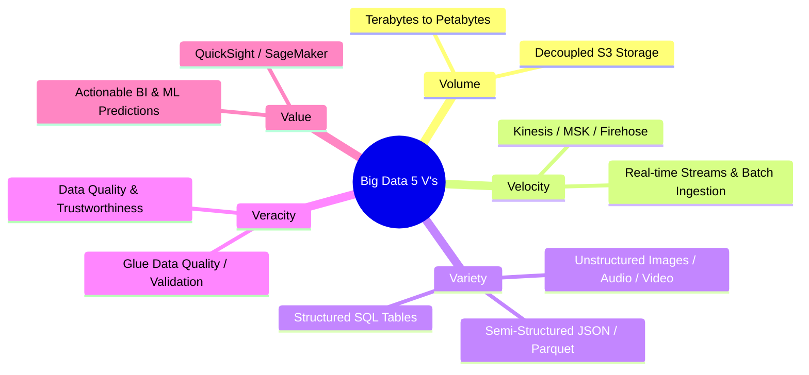
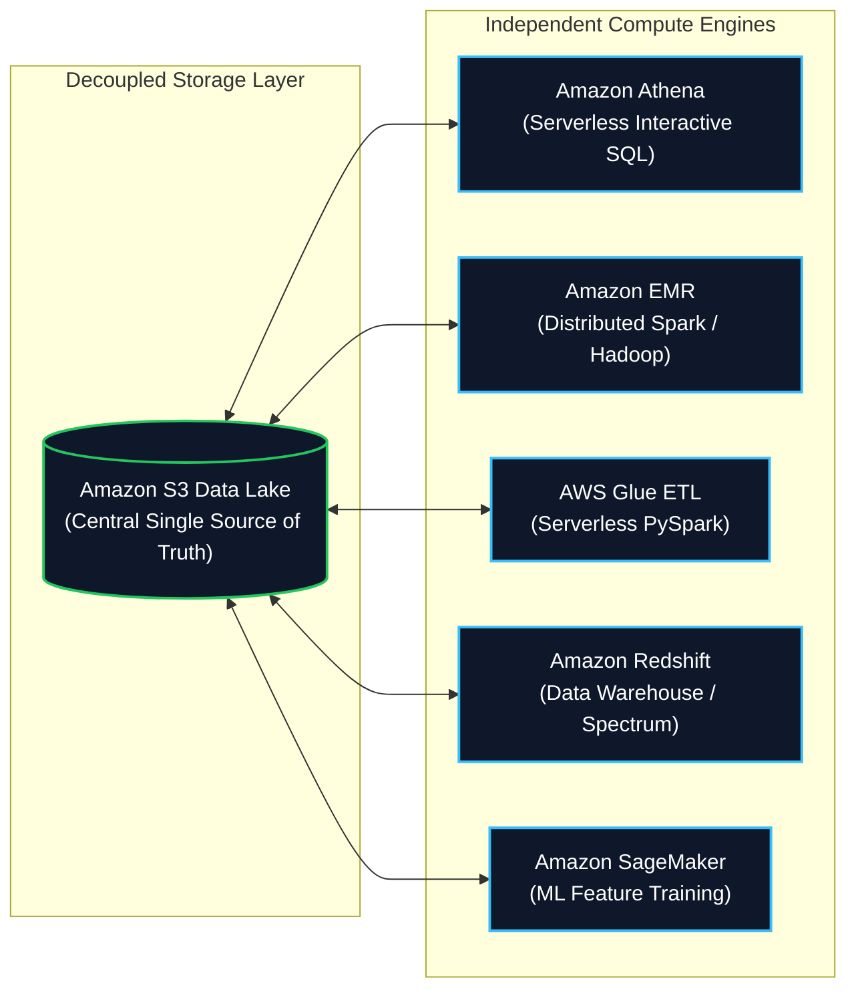
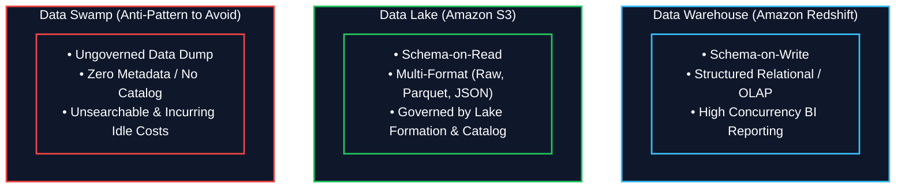
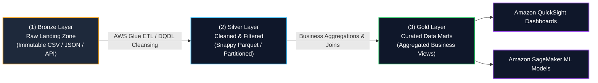

# 🌐 Big Data Fundamentals & Data Lake Architecture

- **Category**: Fundamentals (Data Engineering Core Architecture)
- **Language / ဘာသာစကား**: **English (Original)** | [မြန်မာဘာသာ (Burmese)](/mm/03-concepts/big-data-fundamentals)
- **Slide Reference**: Pages 12–37 in `[AWSCertifiedDataEngineerSlides.pdf](/docs/AWSCertifiedDataEngineerSlides.pdf)`
- **Hub Links**: `[[index]]` | `[[service-catalog]]` | `[[domain-1-ingestion-and-processing]]` | `[[domain-2-data-store-management]]` | `[[s3]]` | `[[redshift]]` | `[[glue]]`

---

## 1. The 5 V's of Big Data

Big Data refers to datasets whose size, complexity, and velocity exceed the storage, management, and processing capacity of traditional relational database management systems (RDBMS).

1. **Volume**: The massive scale of data generated (ranging from gigabytes to terabytes and petabytes). AWS solves this through **Amazon S3**, which provides virtually unlimited, decoupled object storage.
2. **Velocity**: The speed at which new data is generated, ingested, and processed. AWS handles this via streaming ingestion services like **Amazon Kinesis Data Streams** and **Amazon MSK (Apache Kafka)**.
3. **Variety**: The diversity of data formats:
   - **Structured**: RDBMS tables, CSV files with rigid schemas.
   - **Semi-Structured**: JSON, XML, Apache Avro, Apache Parquet, and ORC.
   - **Unstructured**: Video, audio, PDFs, and raw server logs.
4. **Veracity**: The accuracy, cleanliness, and trustworthiness of the data. Managed using **AWS Glue Data Quality (DQDL)** to quarantine malformed records.
5. **Value**: The ultimate business utility extracted through Business Intelligence (**Amazon QuickSight**) and Machine Learning (**Amazon SageMaker**).

---

## 2. Decoupled Storage and Compute Principle

A foundational design pattern in cloud data engineering is **decoupling storage from compute**:

- **Traditional On-Premise**: Storage and compute are tightly coupled on physical servers (scaling storage requires buying expensive compute nodes).
- **AWS Modern Cloud**: Data is stored cheaply and durability in **Amazon S3** (11 9's durability). Multiple diverse compute engines (Athena, Glue, EMR, SageMaker) can spin up on demand, query the same data simultaneously, and spin down to zero cost when idle.

---

## 3. Data Warehouse vs. Data Lake vs. Data Swamp

| Characteristic | Data Warehouse (e.g. `[[redshift]]`) | Data Lake (e.g. `[[s3]]`) | Data Swamp (Anti-Pattern) |
| :--- | :--- | :--- | :--- |
| **Data Structure** | **Schema-on-Write**: Schema must be defined before loading data. | **Schema-on-Read**: Raw data is stored first; schema is applied upon query. | Unstructured, ungoverned data dumps without schemas. |
| **Data Formats** | Structured relational tables (OLAP columnar). | Structured, semi-structured (JSON, Parquet), and unstructured. | Disorganized files with no consistent format. |
| **Storage vs. Compute** | Managed scaling (Redshift Serverless or provisioned clusters). | **Fully Decoupled** (Cheap S3 storage + independent compute). | Decoupled but unorganized and unindexed. |
| **Governance** | Strict ACID transactions, primary/foreign keys. | Governed via `[[lake-formation]]` & `[[glue]]` Data Catalog. | Zero governance, no security tagging or catalog. |
| **Primary Users** | Business Analysts, BI Developers, SQL power users. | Data Engineers, Data Scientists, Machine Learning Engineers. | None (Data is unusable and untrusted). |

---

## 4. Medallion Architecture (Data Lake Tiering Strategy)

To ensure data quality and maintain performance as data progresses through a pipeline, modern data lakes follow the **Medallion Architecture**:

1. **Bronze Layer (Raw Landing Zone)**:
   - Contains raw, un-transformed historical data in its original format (CSV, JSON, streaming events).
   - Serves as an immutable source of truth for reprocessing or auditing.
2. **Silver Layer (Processed / Standardized Zone)**:
   - Cleaned, validated, deduplicated, and converted to optimized columnar formats (**Apache Parquet with Snappy compression**).
   - Partitioned by Date/Region for fast downstream queries.
3. **Gold Layer (Curated / Business Data Marts)**:
   - Pre-aggregated, denormalized, and structured data ready for high-performance consumption by BI dashboards, executive reporting, and machine learning feature stores.

---

## 5. High-Yield DEA-C01 Exam Tips & Traps

> [!IMPORTANT]
> **Key Exam Trigger Keywords**:
> - **"Decoupled Storage and Compute for Big Data"** $\rightarrow$ **Amazon S3 (Storage) + Amazon Athena / Amazon EMR / AWS Glue (Compute)**.
> - **"Preventing Data Swamp"** $\rightarrow$ **AWS Glue Crawlers** to populate Glue Data Catalog + **AWS Lake Formation** for centralized fine-grained access control.
> - **"Optimizing analytical query costs on S3 Data Lake"** $\rightarrow$ Convert raw data to **Apache Parquet with Snappy compression** and partition by high-cardinality query filter columns.

---

## 📌 Related Notes

- `[[data-formats-and-compression]]` — Parquet, ORC, Avro, and Compression Codecs
- `[[data-modeling-and-partitioning]]` — Dimensional modeling and S3 partitioning strategies
- `[[data-validation-and-profiling]]` — Glue Data Quality (DQDL) and data profiling
- `[[s3]]` — Amazon S3 Data Lake architecture
- `[[redshift]]` — Amazon Redshift Data Warehouse and Spectrum
- `[[glue]]` — AWS Glue ETL and Data Catalog
