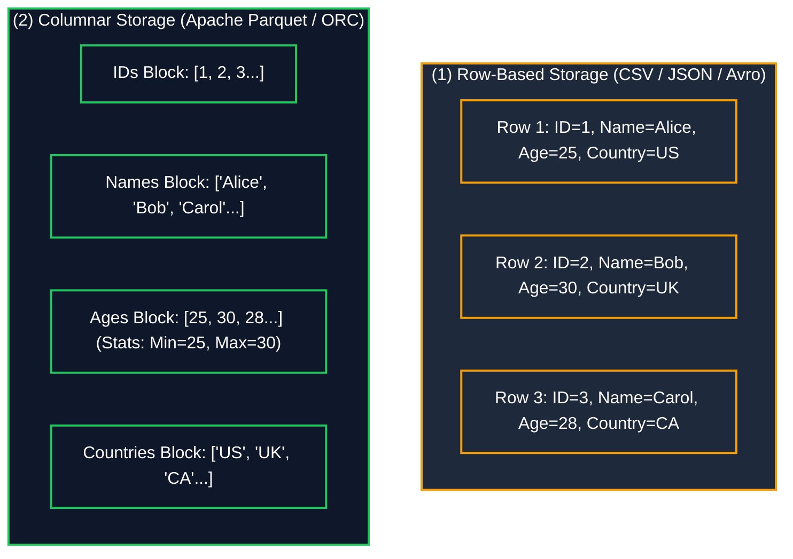
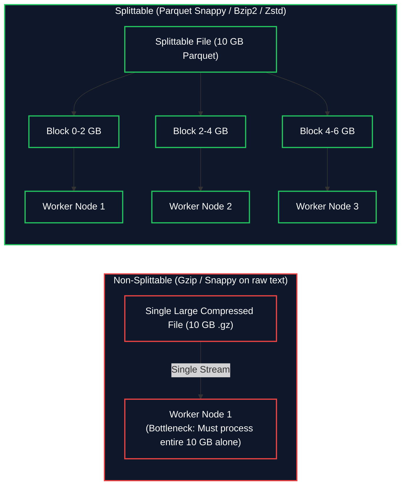

# 📄 Data Formats & Compression Codecs

- **Category**: Fundamentals / Storage & Query Optimization
- **Language / ဘာသာစကား**: **English (Original)** | [မြန်မာဘာသာ (Burmese)](/mm/03-concepts/data-formats-and-compression)
- **Slide Reference**: Pages 38–48 in `[[AWSCertifiedDataEngineerSlides.pdf]]`
- **Hub Links**: `[[index]]` | `[[service-catalog]]` | `[[athena]]` | `[[glue]]` | `[[redshift]]` | `[[emr]]` | `[[s3]]`

---

## 1. Row-Based vs. Columnar Storage Formats

In cloud big data analytics, the choice of storage format dramatically impacts storage costs, I/O bandwidth, and query execution speeds:

### Architectural Breakdown:
1. **Row-Based Formats (CSV, JSON, Avro)**:
   - Data records are stored consecutively on disk.
   - **Pros**: Optimal for write-heavy, transactional operations (OLTP) where entire individual rows are inserted, updated, or retrieved frequently.
   - **Cons**: Suboptimal for analytical queries (`SELECT AVG(Age) FROM table`). The query engine is forced to read every column of every row from disk across the network, wasting substantial I/O bandwidth.
2. **Columnar Formats (Apache Parquet, Apache ORC)**:
   - Data is organized and stored by column values within discrete row groups / stripes.
   - **Key Advantages for Data Engineering**:
     - **Column Projection**: Query engines read *only* the specific columns requested in the `SELECT` clause, completely skipping unreferenced columns.
     - **Superior Compression**: Similar data types stored adjacently compress significantly better (achieving **75% to 90% reduction in storage size**).
     - **Predicate Pushdown & Min/Max Statistics**: Each data block header contains metadata (Min/Max values, null counts). Engines skip entire blocks of non-matching data based on `WHERE` clauses.

---

## 2. Complete Format Comparison Matrix

| Format | Storage Layout | Schema Definition | Splittable? | Best AWS Fit & Primary Use Case |
| :--- | :--- | :--- | :--- | :--- |
| **CSV / TSV** | Row-based (Plain Text) | Schema-on-Read | ✅ Yes (if uncompressed) | Raw landing ingestion, human inspection, small exports |
| **JSON** | Row-based (Plain Text) | Semi-Structured | ⚠️ Multiline (No) / JSON Lines (Yes) | API payloads, web logs, event streaming payloads |
| **Apache Avro** | Row-based (Binary) | Schema included in file header | ✅ **Yes** | **Amazon MSK (Kafka)** streaming pipelines, schema evolution, high-write row ops |
| **Apache Parquet** | **Columnar** (Binary) | Self-describing schema | ✅ **Yes** | **Amazon Athena, AWS Glue, EMR Spark, Redshift Spectrum (Default Analytical Choice)** |
| **Apache ORC** | **Columnar** (Binary) | Self-describing schema | ✅ **Yes** | Apache Hive, Presto on Amazon EMR, highly optimized indexing |

---

## 3. Compression Codecs & Splittability Mechanics

In distributed data processing (Hadoop, Spark, Athena), distributed workers process file chunks in parallel. The **splittability** of a compression format is vital for compute parallelism:

### Compression Codecs Comparison Table:

| Compression Codec | Splittable? | Compression Ratio | CPU Speed | Recommended AWS Use Case |
| :--- | :--- | :--- | :--- | :--- |
| **Snappy** | ❌ No *(Splittable when used inside Parquet row groups)* | Moderate | ⚡ **Ultra Fast** | **Default compression for Parquet in Glue, Spark, and Athena** |
| **Gzip** | ❌ **No (Never Splittable)** | High | Moderate | Web log archiving, single-file HTTP transfer |
| **Zstandard (Zstd)** | ✅ **Yes (Splittable)** | High | 🚀 Fast | Modern replacement for Gzip in Parquet and S3 Cold Storage |
| **Bzip2** | ✅ **Yes (Splittable)** | Maximum | 🐢 Slow | Archival storage where splitting raw text files is mandatory |

---

## 4. High-Yield DEA-C01 Exam Tips & Traps

> [!IMPORTANT]
> **Key Exam Trigger Keywords**:
> - **"Convert S3 data to optimize Athena query performance and reduce S3 scan costs"** $\rightarrow$ **Apache Parquet + Snappy compression**.
> - **"Streaming ingestion format for Kafka / Amazon MSK with evolving schema"** $\rightarrow$ **Apache Avro**.
> - **"Parallel processing of large compressed text datasets"** $\rightarrow$ **Bzip2** (or convert to Parquet with Snappy/Zstd).

> [!WARNING]
> **Exam Traps**:
> - **The Gzip Splittability Trap**: Compressing raw CSV/JSON files with **Gzip** prevents Spark and Athena from splitting the file across multiple worker cores. A 10 GB `.csv.gz` file will be processed sequentially by a single core!
> - **Snappy on Raw Text**: Snappy on raw text is NOT splittable. It is only splittable when packaged inside Parquet/ORC block containers.

---

## 📌 Related Notes

- `[[big-data-fundamentals]]` — Big Data 5 V's and Data Lake Architecture
- `[[data-modeling-and-partitioning]]` — Structuring S3 partitions for Parquet datasets
- `[[athena]]` — Query performance and cost optimization on Parquet
- `[[glue]]` — Format conversion jobs in AWS Glue ETL
- `[[msk]]` — Avro serialization and Schema Registry
