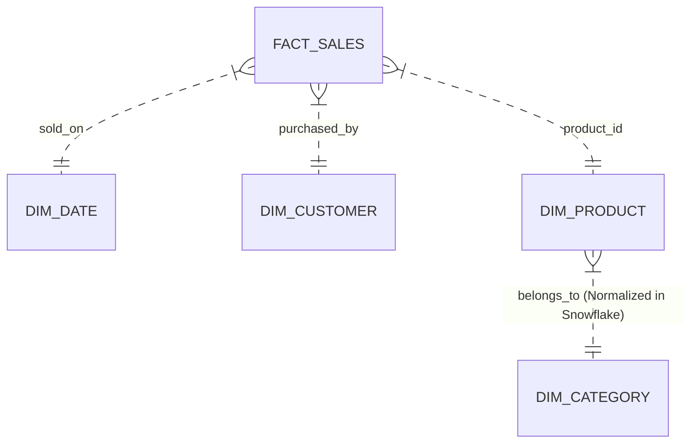
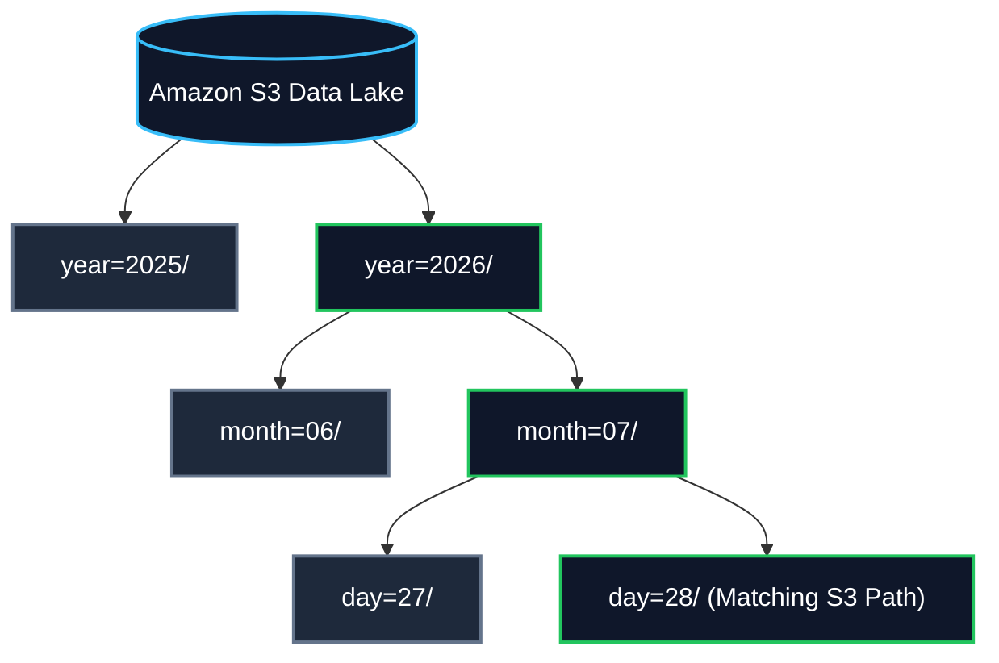
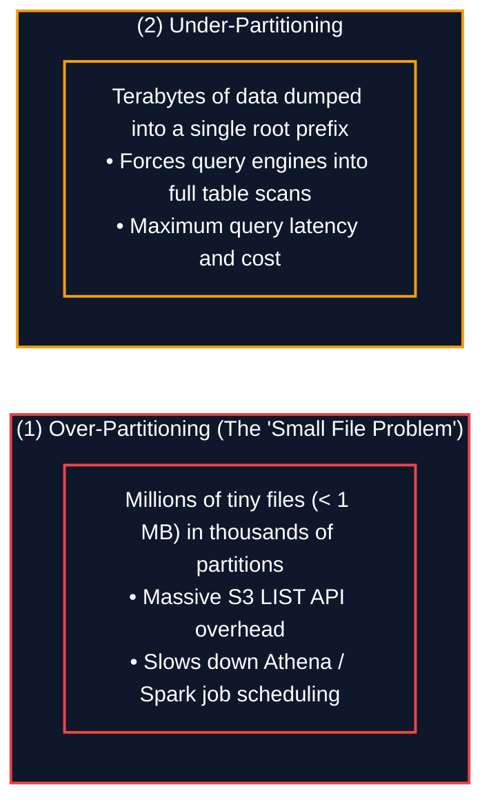

# 📐 Data Modeling & Partitioning Strategies

- **Category**: Fundamentals / Data Architecture & Storage Optimization
- **Language / ဘာသာစကား**: **English (Original)** | [မြန်မာဘာသာ (Burmese)](/mm/03-concepts/data-modeling-and-partitioning)
- **Slide Reference**: Pages 49–75 in `[[AWSCertifiedDataEngineerSlides.pdf]]`
- **Hub Links**: `[[index]]` | `[[service-catalog]]` | `[[athena]]` | `[[redshift]]` | `[[glue]]` | `[[s3]]`

---

## 1. Dimensional Modeling (Star Schema vs. Snowflake Schema)

Dimensional modeling structures enterprise data for high-performance online analytical processing (OLAP) and business reporting:



### 1. Star Schema (Denormalized - Recommended for Data Warehouses)
- Contains a central **Fact Table** holding numeric metrics/measurements (e.g. `FACT_SALES`: revenue, quantity sold) surrounded by directly joined, denormalized **Dimension Tables** (`DIM_DATE`, `DIM_CUSTOMER`, `DIM_PRODUCT`).
- **Benefits**: Simple queries, fewer joins, and **optimal query execution performance in Amazon Redshift and analytical MPP databases**.

### 2. Snowflake Schema (Normalized)
- Dimension tables are broken down further into normalized sub-tables (e.g. `DIM_PRODUCT` joins to `DIM_CATEGORY` and `DIM_SUPPLIER`).
- **Benefits**: Eliminates data redundancy and saves storage space.
- **Trade-off**: Requires complex multi-table joins, increasing query execution times.

---

## 2. Partitioning Strategies & Hive-Style S3 Prefix Structures

Partitioning divides large datasets into discrete logical directories based on high-cardinality filter columns (e.g. Date, Region, Department):

### Hive-Style S3 Partition Prefixing
The AWS standard directory layout recognized automatically by AWS Glue Crawlers and Amazon Athena:
```text
s3://my-analytics-lake/sales/year=2026/month=07/day=28/data_part001.snappy.parquet
```



---

## 3. Partition Pruning Mechanics & Query Optimization

When an analytical query is executed on a partitioned table:
```sql
SELECT customer_id, SUM(amount)
FROM sales_table
WHERE year = '2026' AND month = '07'
GROUP BY customer_id;
```

- **Partition Pruning**: Query engines (**Amazon Athena**, **Amazon EMR Spark**, **Redshift Spectrum**) inspect the metadata in the Glue Data Catalog, identify the exact S3 partition paths matching `year=2026/month=07/`, and read **ONLY** those files.
- **Impact**: Completely skips non-matching prefixes (terabytes of data), reducing scanned data by over 95%, cutting Athena costs ($5.00 per TB scanned), and returning results in seconds.

---

## 4. Partitioning Pitfalls: Over-Partitioning vs. Under-Partitioning



### 1. The Small File Problem (Over-Partitioning):
- Partitioning by excessive granular columns (e.g. `user_id` or millisecond timestamp).
- Results in millions of tiny files (< 1 MB). The query engine spends more time reading S3 object metadata via `ListBucket` API calls than processing actual data.
- **Solution**: Target individual file sizes between **128 MB and 512 MB** per partition.

### 2. Athena Partition Projection:
- For tables with hundreds of thousands of partitions, querying the AWS Glue Data Catalog for partition metadata becomes a bottleneck.
- **Partition Projection** calculates partition locations algorithmically directly from table configuration properties, completely bypassing Glue Catalog API calls.

---

## 5. High-Yield DEA-C01 Exam Tips & Traps

> [!IMPORTANT]
> **Key Exam Trigger Keywords**:
> - **"Improve Athena query performance and reduce S3 scan volume"** $\rightarrow$ **Partition data by Date / Region using Hive-style prefixes + Parquet format**.
> - **"Eliminate Glue Catalog partition throttling and speed up queries on highly partitioned tables"** $\rightarrow$ **Enable Amazon Athena Partition Projection**.
> - **"Dimensional modeling for Amazon Redshift OLAP data warehousing"** $\rightarrow$ **Star Schema** (denormalized tables for fewer joins).

---

## 📌 Related Notes

- `[[big-data-fundamentals]]` — Big Data 5 V's and Data Lake architecture
- `[[data-formats-and-compression]]` — Parquet file formatting inside S3 partitions
- `[[athena]]` — Amazon Athena Partition Projection configuration
- `[[redshift]]` — Redshift Distribution Keys and Sort Keys
