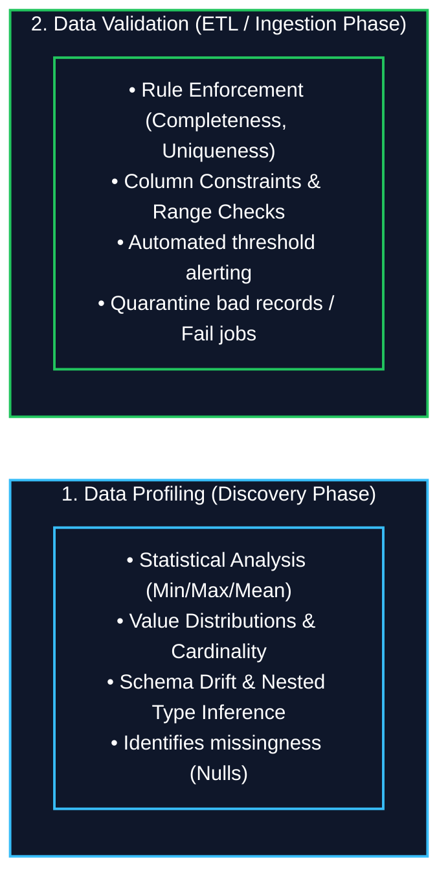
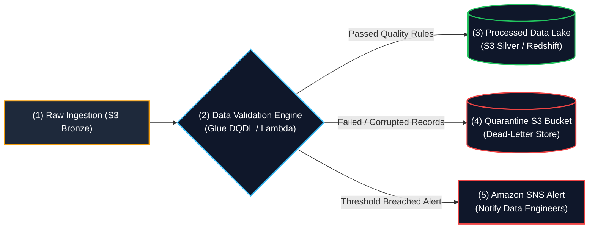

# 🔍 Data Validation and Profiling

- **Category**: Data Quality & Governance (Data Pipeline Reliability)
- **Language / ဘာသာစကား**: **English (Original)** | [မြန်မာဘာသာ (Burmese)](/mm/03-concepts/data-validation-and-profiling)
- **Slide Reference**: Data Quality & Governance in `[[AWSCertifiedDataEngineerSlides.pdf]]`
- **Hub Links**: `[[index]]` | `[[service-catalog]]` | `[[glue]]` | `[[sagemaker-and-ai]]` | `[[lambda]]` | `[[s3]]`

---

## 1. High-Level Summary: Profiling vs. Validation

In modern cloud data engineering architectures, maintaining high data quality requires two distinct operations:

| Concept | Primary Purpose | Pipeline Stage | Primary AWS Services |
| :--- | :--- | :--- | :--- |
| **Data Profiling** | Analyzing the structure, statistical distribution, cardinality, and anomalies of incoming raw data. | **Discovery & Ingestion Phase** | **AWS Glue DataBrew**, Amazon SageMaker Data Wrangler, AWS Glue Crawlers |
| **Data Validation** | Enforcing business rules, constraints (uniqueness, completeness, regex patterns), and schema compliance. | **ETL / Transformation Phase** | **AWS Glue Data Quality (DQDL)**, PyDeequ (EMR/Spark), AWS Lambda |

---

## 2. Core Frameworks & Quality Rules

### 1. Data Profiling Insights:
- **Statistical Summaries**: Calculates min, max, mean, median, standard deviation, and row count.
- **Structural Inspection**: Detects nested JSON structures, schema evolution, and data type mismatches.
- **Quality Metrics**: Identifies missing values (nulls/empty strings), duplicate primary keys, and outlier anomalies.

### 2. Declarative Validation Rules (AWS Glue DQDL Examples):
- **Completeness**: `Completeness "customer_id" >= 0.98` (No more than 2% null values allowed).
- **Uniqueness**: `IsUnique "transaction_id"` (Guarantees distinct primary keys).
- **Range Constraints**: `ColumnValues "age" between 18 and 120`.
- **Format Assertions**: Validates ISO-8601 timestamps, email regex patterns, or currency codes.

---

## 3. AWS Data Quality Services (DEA-C01 Focus)

### 1. AWS Glue Data Quality (DQDL)
- Integrates directly within serverless AWS Glue ETL jobs using **Data Quality Definition Language (DQDL)**.
- **Key Capabilities**:
  - Automatically recommends quality rules based on historical dataset trends.
  - Automatically halts / fails Glue ETL jobs if data quality scores fall below a defined threshold.
  - Publishes Data Quality Scores and metrics to the **AWS Glue Data Catalog** and Amazon CloudWatch.

### 2. AWS Glue DataBrew
- Visual, no-code data preparation and profiling service.
- **Key Capabilities**:
  - Generates comprehensive **Data Quality Profiles** featuring over 80+ statistical metrics.
  - Provides visual histograms, schema drift charts, and outlier distributions without writing code.
  - Tailored for data analysts, BI developers, and data engineers seeking rapid exploratory profiling.

### 3. PyDeequ / Deequ (Amazon EMR & Apache Spark)
- Open-source library created by AWS built on top of Apache Spark for unit testing big data.
- **Key Capabilities**:
  - Ideal for large-scale distributed PySpark pipelines running on **Amazon EMR**.
  - Tracks metrics across execution runs and provides automated constraint suggestion and anomaly detection.

---

## 4. Pipeline Handling for Corrupted Data (Quarantine Architecture)

| Pattern | Execution Mechanism | Recommended Use Case |
| :--- | :--- | :--- |
| **Quarantine Bucket / DLQ** | Routes malformed or failed records to an **S3 Quarantine Bucket** or **Amazon SQS Dead-Letter Queue**, allowing valid records to proceed unimpeded. | High-throughput streaming (Kinesis/Kafka) or non-critical ETL workflows. |
| **Fail-Fast** | Immediately aborts the Glue ETL job or Step Functions workflow upon rule breach. | Financial transactions, regulatory reporting, or strict compliance pipelines. |
| **Remediation & Masking** | Automatically replaces nulls with defaults or masks PII strings in PySpark before storage. | Analytical data lakes where missing records can be imputed safely. |

---

## 5. Scenario-Based DEA-C01 Exam Decision Matrix

> [!IMPORTANT]
> **Key Exam Decision Matrix**:
> - **Scenario 1: "Visual, no-code data profiling reports with 80+ statistical metrics"** $\rightarrow$ **AWS Glue DataBrew**.
> - **Scenario 2: "Declarative data quality rules inside serverless Glue ETL jobs with auto-fail threshold"** $\rightarrow$ **AWS Glue Data Quality (DQDL)**.
> - **Scenario 3: "Unit testing and anomaly detection on distributed Amazon EMR PySpark jobs"** $\rightarrow$ **PyDeequ / Deequ**.
> - **Scenario 4: "Alert engineering team when null value count exceeds threshold in S3 table"** $\rightarrow$ **AWS Glue Data Quality + Amazon CloudWatch Alarm + Amazon SNS notification**.

---

## 📌 Related Notes

- `[[glue]]` — AWS Glue Data Catalog, Crawlers, ETL, and Glue Data Quality
- `[[sagemaker-and-ai]]` — SageMaker Data Wrangler profiling
- `[[data-formats-and-compression]]` — File formats and schema validation
- `[[service-comparisons]]` — Glue Data Quality vs. DataBrew comparative matrix
