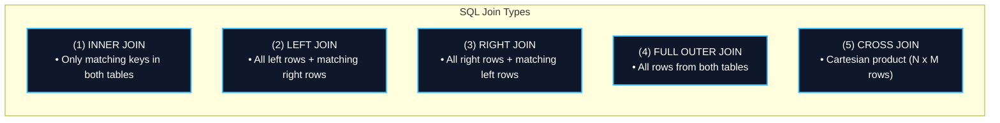

# 📊 SQL Review & Version Control (Git)

- **Category**: Fundamentals (Analytical SQL & Pipeline Version Control)
- **Language / ဘာသာစကား**: **English (Original)** | [မြန်မာဘာသာ (Burmese)](/mm/03-concepts/sql-and-version-control-review)
- **Slide Reference**: Pages 51–75 in `[AWSCertifiedDataEngineerSlides.pdf](/docs/AWSCertifiedDataEngineerSlides.pdf)`
- **Hub Links**: `[[en/index|index]]` | `[[en/00-hub/service-catalog|service-catalog]]` | `[[en/02-services/analytics-streaming/athena/athena|athena]]` | `[[en/02-services/database/redshift|redshift]]` | `[[en/02-services/ml-dev-cost/cdk-cloudformation|cdk-cloudformation]]`

---

## 1. SQL Window Functions Review

Window functions perform calculations across a defined set of table rows related to the current row without collapsing the rows into a single output row (unlike standard `GROUP BY` aggregations):

```sql
SELECT 
    employee_id,
    department_id,
    salary,
    RANK() OVER (PARTITION BY department_id ORDER BY salary DESC) as salary_rank,
    DENSE_RANK() OVER (PARTITION BY department_id ORDER BY salary DESC) as dense_rank,
    AVG(salary) OVER (PARTITION BY department_id) as dept_avg_salary
FROM employees;
```

### Key Window Functions Comparison

| Function | Behavior on Duplicate / Tied Values | Example Output Sequence | Primary Data Engineering Use Case |
| :--- | :--- | :--- | :--- |
| **`ROW_NUMBER()`** | Assigns a unique sequential integer to each row. | `1, 2, 3, 4, 5` | **Deduplication** (e.g. keeping `ROW_NUMBER() = 1` for latest record) |
| **`RANK()`** | Assigns same rank to ties, but leaves gaps in ranking. | `1, 2, 2, 4, 5` | Top-N ranking with gap penalties |
| **`DENSE_RANK()`** | Assigns same rank to ties without skipping subsequent ranks. | `1, 2, 2, 3, 4` | Continuous tier ranking (e.g. top salary tiers) |
| **`LAG(col, offset)`** | Accesses column data from a prior row in the window. | `Prev row value` | Calculating Period-over-Period growth (MoM, YoY) |
| **`LEAD(col, offset)`**| Accesses column data from a subsequent row in the window. | `Next row value` | Churn analysis, session duration calculations |

---

## 2. SQL Join Types Matrix



| Join Type | Description | Distributed Big Data Performance Consideration |
| :--- | :--- | :--- |
| **INNER JOIN** | Returns records where join keys match in both tables. | Fastest join type; compatible with Broadcast Hash Joins in Spark. |
| **LEFT OUTER JOIN** | Returns all rows from left table plus matched rows from right table (NULL if no match). | Common in Star Schema fact-to-dimension queries. |
| **FULL OUTER JOIN** | Returns all rows when there is a match in either left or right table. | Used in data reconciliation pipelines; requires full data shuffle. |
| **CROSS JOIN** | Generates the Cartesian product of both tables ($N \times M$ combinations). | **Anti-Pattern on large datasets**; causes Out-of-Memory (OOM) errors in Spark and Redshift! |

---

## 3. Git Version Control in AWS Data Engineering

In enterprise data engineering, version control is essential for Continuous Integration & Continuous Deployment (CI/CD) and disaster recovery:

```mermaid
graph LR
    Dev["Data Engineer"] -->|"git commit & push"| Repo["Git Repository (CodeCommit / GitHub)"]
    Repo -->|"Trigger Webhook"| Pipeline["AWS CodePipeline / GitHub Actions"]
    Pipeline --> Test["Automated PySpark & SQL Unit Tests"]
    Test --> Deploy["Deploy to AWS (Glue, Lambda, MWAA, Redshift)"]

    classDef dev fill:#1e293b,stroke:#f59e0b,stroke-width:2px,color:#fff;
    classDef git fill:#0f172a,stroke:#38bdf8,stroke-width:2px,color:#fff;
    classDef cicd fill:#0f172a,stroke:#22c55e,stroke-width:2px,color:#fff;

    class Dev dev;
    class Repo git;
    class Pipeline,Test,Deploy cicd;
```



### Assets Managed in Git:
- **Infrastructure as Code (IaC)**: AWS CloudFormation templates, AWS SAM templates, AWS CDK stacks.
- **Pipeline Logic**: AWS Glue PySpark scripts, AWS Lambda handlers, Amazon MWAA (Airflow) DAG definitions.
- **Database Migrations**: SQL DDL schemas, Flyway / Liquibase database migration scripts.

---

## 4. High-Yield DEA-C01 Exam Tips & Traps

> [!IMPORTANT]
> **Key Exam Trigger Keywords**:
> - **"Deduplicate records within a partition while retaining the latest record"** $\rightarrow$ Use **`ROW_NUMBER() OVER (PARTITION BY id ORDER BY timestamp DESC)`** and filter where `row_num = 1`.
> - **"Track month-over-month growth metrics in SQL"** $\rightarrow$ **`LAG()`** window function.
> - **"Version control and automate serverless data pipeline deployments"** $\rightarrow$ **AWS CodePipeline + AWS SAM / CloudFormation**.

---

## 📌 Related Notes

- `[[en/02-services/analytics-streaming/athena/athena|athena]]` — Running ANSI SQL queries and window functions in Amazon Athena
- `[[en/02-services/database/redshift|redshift]]` — Redshift SQL optimization, Sort Keys, and Distribution Keys
- `[[en/02-services/ml-dev-cost/cdk-cloudformation|cdk-cloudformation]]` — AWS CloudFormation and CDK for infrastructure version control
