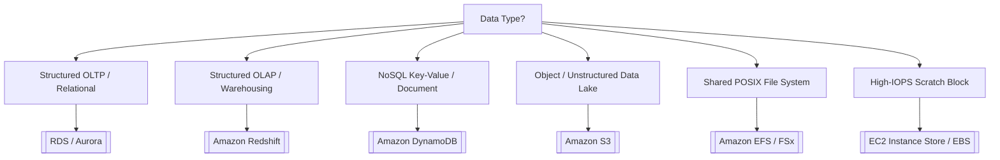
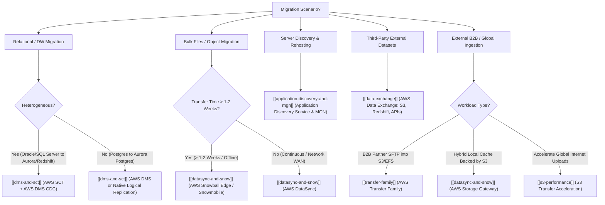
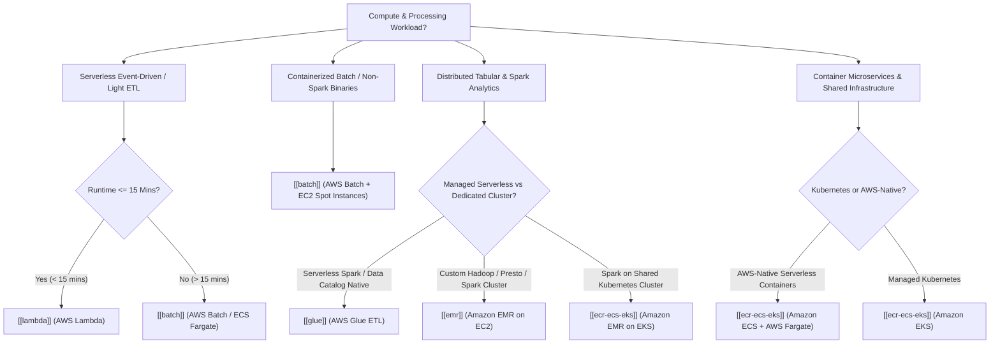

# ⚡ DEA-C01 Service Decision Matrix & Comparisons

Quick reference decision guide for resolving architectural choices on the AWS Certified Data Engineer Associate exam.

---

## 1. Storage & Database Choice Matrix

### Storage Decision Matrix: S3 vs EBS vs EFS vs Instance Store vs FSx for Lustre

| Storage Service | Protocol / Model | Scope / Durability | Persistence on STOP | Primary Data Engineering Role |
| :--- | :--- | :--- | :--- | :--- |
| **Amazon S3** | Object (REST API) | Multi-AZ (11 9's) | ✅ Persistent | Central Data Lake, Bronze/Silver/Gold analytics tables |
| **Amazon EBS** | Block device (Network) | Single-AZ (99.9%+) | ✅ Persistent | Hosted relational databases, Kafka commit logs, OS boot |
| **EC2 Instance Store** | Block device (PCIe Bus) | Host Server (Single Disk) | ❌ **WIPED** | **Spark shuffle partition cache, MapReduce spills, temp buffers** |
| **Amazon EFS** | POSIX File (NFSv4.1) | Multi-AZ (11 9's) | ✅ Persistent | **Multi-AZ shared directories, Lambda model storage, EKS/ECS PVs** |
| **AWS FSx for Lustre** | High-Perf Parallel File | Single-AZ (Linked S3) | ✅ Persistent in S3 | **Sub-ms HPC processing, distributed ML training, EMR staging** |

> 🔗 **Deep Dive Reference**: See [[en/02-services/storage/ebs-vs-efs-vs-instance-store|ebs-vs-efs-vs-instance-store]] for comprehensive lifecycle, throughput, and architecture breakdowns.

---

## 2. Ingestion & Streaming Matrix

| Use Case | AWS Service Choice | Key Keyword Trigger |
| --- | --- | --- |
| **Real-time custom stream processing (Retention up to 365 days)** | [[en/02-services/analytics-streaming/kinesis/kinesis|kinesis]] (Data Streams) | Multi-consumer, sub-second latency, custom processing code |
| **Zero-code streaming delivery to S3 / Redshift / OpenSearch** | [[en/02-services/analytics-streaming/kinesis/kinesis|kinesis]] (Data Firehose) | Micro-batching, direct delivery, automatic Parquet transformation |
| **Open-source Kafka streaming ecosystem** | [[en/02-services/analytics-streaming/msk/msk|msk]] (Amazon MSK) | Apache Kafka compatibility, Kafka Connect |
| **Ingesting data from SaaS (Salesforce, ServiceNow)** | [[en/02-services/integration/appflow/appflow|appflow]] (AWS AppFlow) | No-code SaaS connector, PrivateLink security |
| **Migrating databases with continuous replication** | [[en/02-services/migration/dms-and-sct|dms-and-sct]] (AWS DMS + CDC) | Heterogeneous database migration, minimal downtime |

---

## 3. Query Engine Matrix: Athena vs Redshift Spectrum vs EMR

| Feature | Amazon Athena | Redshift Spectrum | Amazon EMR |
| --- | --- | --- | --- |
| **Infrastructure** | Fully Serverless | Runs on Redshift cluster nodes | Provisioned EC2 or EMR Serverless |
| **Query Engine** | Trino / Presto | Redshift MPP Engine | Apache Spark / Hive / Presto |
| **Data Location** | Amazon S3 | S3 + Redshift Local Tables | S3 (via EMRFS) or HDFS |
| **Pricing** | $5 per TB scanned | $5 per TB scanned (+ Redshift cluster) | Per-second cluster node pricing |
| **Best For** | Ad-hoc SQL queries on S3 | Joining S3 data lake with Redshift DW tables | Heavy custom Spark processing, machine learning |

---

## 4. Security & Governance Matrix

| Security Goal | Primary AWS Service |
| --- | --- |
| **Column & Row-Level Security on S3 Data Lake** | [[en/02-services/security-governance/lake-formation|lake-formation]] (AWS Lake Formation) |
| **Automated PII Scanning in S3 (SSNs, Credit Cards)** | [[en/02-services/security-governance/macie-and-cloudtrail|macie-and-cloudtrail]] (Amazon Macie) |
| **Database Credential Rotation** | [[en/02-services/security-governance/kms-and-secrets|kms-and-secrets]] (AWS Secrets Manager) |
| **Private S3 access without Internet Gateway** | [[en/02-services/networking-monitoring/vpc-and-networking|vpc-and-networking]] (S3 Gateway VPC Endpoint) |
| **Centralized Cross-Service Backup & WORM Immutability** | [[en/02-services/security-governance/aws-backup|aws-backup]] (AWS Backup & Vault Lock) |

---

## 5. Migration & Data Transfer Decision Matrix

| Migration & Transfer Requirement | Recommended Service | Key Keyword / Criteria | Deep Dive Link |
| :--- | :--- | :--- | :--- |
| **Heterogeneous DB schema and code conversion** | **AWS SCT** | Convert PL/SQL, stored procedures, data types | [[en/02-services/migration/dms-and-sct|dms-and-sct]] |
| **Live database replication & CDC streaming to S3/Kinesis** | **AWS DMS** | Minimal downtime, full load + CDC, `Op` column | [[en/02-services/migration/dms-and-sct|dms-and-sct]] |
| **Mass data warehouse unload (Teradata/Oracle to Redshift)** | **SCT Data Extraction Agents** | Multi-TB/PB parallel unloads to S3/Snowball | [[en/02-services/migration/dms-and-sct|dms-and-sct]] |
| **Automated NFS/SMB/HDFS scheduled sync to S3/EFS/FSx** | **AWS DataSync** | Preserves POSIX metadata, 10x faster than rsync | [[en/02-services/migration/datasync-and-snow|datasync-and-snow]] |
| **Large offline physical migration (>10 TB to Petabytes)** | **AWS Snowball Edge** | Network transfer exceeds 1–2 weeks | [[en/02-services/migration/datasync-and-snow|datasync-and-snow]] |
| **Exabyte-scale data center evacuation** | **AWS Snowmobile** | 100 PB per 45ft shipping container truck | [[en/02-services/migration/datasync-and-snow|datasync-and-snow]] |
| **On-premises server discovery & dependency mapping** | **Application Discovery Service** | Plan migrations, agentless vCenter vs agent-based | [[en/02-services/migration/application-discovery-and-mgn|application-discovery-and-mgn]] |
| **Automated lift-and-shift server rehosting to EC2** | **AWS MGN (Application Migration Service)** | Continuous block replication, low-cost staging | [[en/02-services/migration/application-discovery-and-mgn|application-discovery-and-mgn]] |
| **Third-party datasets direct in Redshift without ETL** | **AWS Data Exchange for Redshift** | Query external vendor tables instantly via SQL | [[en/02-services/migration/data-exchange|data-exchange]] |
| **External commercial datasets loaded to S3 or APIs** | **AWS Data Exchange (S3 / APIs)** | Native IAM SigV4 auth, automated S3 revisions | [[en/02-services/migration/data-exchange|data-exchange]] |
| **Legacy SFTP/FTPS file exchange directly into S3/EFS** | **AWS Transfer Family** | Zero client modification, Active Directory auth | [[en/02-services/migration/transfer-family|transfer-family]] |
| **On-premises local file share cache backed by S3** | **AWS Storage Gateway** | Real-time hybrid cached NFS/SMB access | [[en/02-services/migration/datasync-and-snow|datasync-and-snow]] |

---

## 6. Compute & Batch Processing Engine Matrix

| Workload Type / Requirement | Recommended Service | Key Keyword / Decision Rule | Deep Dive Link |
| :--- | :--- | :--- | :--- |
| **Event-driven streaming micro-batch / S3 trigger (< 15 mins)** | **AWS Lambda** | 15-min timeout, `/tmp` (10 GB), EFS mount | [[en/02-services/compute-containers/lambda|lambda]] |
| **Long-running batch compute with custom binaries / C++ / R** | **AWS Batch** | Docker containers, Spot instances, Array jobs | [[en/02-services/compute-containers/batch|batch]] |
| **Serverless Apache Spark ETL for S3 Data Lakes** | **AWS Glue ETL** | PySpark/Scala, Data Catalog integration | [[en/02-services/analytics-streaming/glue/glue|glue]] |
| **Petabyte-scale distributed Hadoop / Presto / Spark cluster** | **Amazon EMR (EC2)** | Master (On-Demand), Core, Task (Spot) | [[en/02-services/analytics-streaming/emr/emr|emr]], [[en/02-services/compute-containers/ec2-and-graviton|ec2-and-graviton]] |
| **Run Spark analytics on existing Kubernetes cluster** | **Amazon EMR on EKS** | Multi-tenant cluster sharing, dynamic pod scaling | [[en/02-services/compute-containers/ecr-ecs-eks|ecr-ecs-eks]], [[en/02-services/analytics-streaming/emr/emr|emr]] |
| **AWS-native serverless containerized applications** | **Amazon ECS (AWS Fargate)** | Zero server management, Task IAM role | [[en/02-services/compute-containers/ecr-ecs-eks|ecr-ecs-eks]] |
| **Lowest cost Arm-based compute across analytics services** | **AWS Graviton** | 40% better price-performance (`m7g`, `c7g`, `r7g`) | [[en/02-services/compute-containers/ec2-and-graviton|ec2-and-graviton]] |

---

## 📌 Master Hub Link
Return to main hub: [[en/index|index]]

