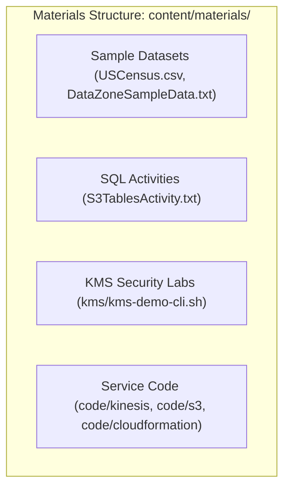

# 🧪 Hands-on Lab Materials & Code Samples (`content/materials/`)

- **Category**: Hands-on Exercises & Implementation Code
- **Language / ဘာသာစကား**: [English (Original)](/en/00-hub/lab-materials-index) | **မြန်မာဘာသာ (Burmese)**
- **Primary Use Case**: Practical AWS Data Engineering Labs များ၊ CLI Scripts များ၊ Sample Datasets များ၊ Infrastructure as Code (IaC)
- **Hub Links**: [[mm/index|index]] | [[mm/00-hub/service-catalog|service-catalog]] | [[mm/00-hub/dea-c01-roadmap|dea-c01-roadmap]]

---

## 1. Directory Overview

`content/materials/` directory တွင် **AWS Certified Data Engineer – Associate (DEA-C01)** လေ့လာရေးမှတ်စုများနှင့် တွဲဖက်ပါရှိသော hands-on lab assets များ၊ sample datasets များ၊ AWS CLI scripts များ၊ SQL queries များနှင့် Infrastructure as Code (IaC) templates များ အားလုံး ပါဝင်သည်။

---

## 2. Catalog of Lab Materials

### 1. Storage & Data Lake Labs (`S3` & `S3 Tables`)

- **`content/materials/S3TablesActivity.txt`**:
  - **Apache Iceberg** ဖြင့် **Amazon S3 Tables** ကို စမ်းသပ်ရန် SQL script ဖြစ်သည်။
  - Iceberg `TBLPROPERTIES` ဖြင့် `CREATE TABLE` ပြုလုပ်ခြင်း၊ year အလိုက် partitioning ခွဲခြင်း၊ multi-row `INSERT` ပြုလုပ်ခြင်းနှင့် Athena တွင် aggregation queries များ စမ်းသပ်ခြင်းတို့ကို သရုပ်ပြထားသည်။
  - Linked Note: [[mm/02-services/storage/s3/s3-tables|s3-tables]] | [[mm/02-services/analytics-streaming/athena/athena|athena]]
- **`content/materials/USCensus.csv`**:
  - Standard CSV dataset (အမေရိကန်ပြည်ထောင်စု ပြည်နယ်အလိုက် လူဦးရေနှင့် သန်းခေါင်စာရင်း demographic data)။
  - S3 ingestion၊ Glue Crawlers၊ Athena query performance စမ်းသပ်မှုများနှင့် Parquet conversion labs များအတွက် အသုံးပြုသည်။
  - Linked Note: [[mm/02-services/storage/s3/s3|s3]] | [[mm/03-concepts/data-formats-and-compression|data-formats-and-compression]]
- **`content/materials/code/s3/`**:
  - S3 static website hosting နှင့် CORS configurations များကို စမ်းသပ်ရန်အတွက် Sample static assets များ (`index.html`၊ test images)။

### 2. Security & Encryption Labs (`KMS` & `DataZone`)

- **`content/materials/kms/kms-demo-cli.sh`**:
  - AWS KMS CLI လုပ်ဆောင်ချက်များကို သရုပ်ပြထားသော Shell script ဖြစ်သည်: envelope encryption၊ data key generation (`aws kms generate-data-key`) နှင့် encryption/decryption validation များ ပါဝင်သည်။
  - Linked Note: [[mm/02-services/security-governance/kms-and-secrets|kms-and-secrets]] | [[mm/02-services/storage/s3/s3-encryption|s3-encryption]]
- **`content/materials/DataZoneSampleData.txt`**:
  - Amazon DataZone တွင် data assets များ၊ metadata forms များနှင့် data governance policies များကို publish လုပ်ရာတွင် အသုံးပြုသည့် structured text payload ဖြစ်သည်။
  - Linked Note: [[mm/02-services/security-governance/lake-formation|lake-formation]]

### 3. Streaming & Analytics Labs (`Kinesis` & Serverless)

- **`content/materials/code/kinesis/kinesis-data-streams.sh`**:
  - Kinesis Data Streams ထဲသို့ records များ ထည့်သွင်းခြင်း (`aws kinesis put-record`)၊ shard iterators များကို စစ်ဆေးခြင်းနှင့် stream consumer throughput ကို စမ်းသပ်ခြင်းတို့အတွက် CLI script ဖြစ်သည်။
  - Linked Note: [[mm/02-services/analytics-streaming/kinesis/kinesis|kinesis]]

### 4. Infrastructure as Code & Automation (`CDK`, `CloudFormation`, `SAM`)

- **`content/materials/code/cloudformation/`**: Data lake infrastructure များကို အလိုအလျောက် deploy လုပ်ရန်အတွက် AWS CloudFormation templates များ။
- **`content/materials/code/sam/`**: Lambda data transformation triggers များကို deploy လုပ်ရန်အတွက် AWS Serverless Application Model (SAM) templates များ။
- **`content/materials/code/cdk/`**: Data pipeline orchestration အတွက် AWS CDK constructs များ။
- **`content/materials/code/api-gateway/`**: RESTful data ingestion အတွက် API Gateway integration templates များ။

---

## 3. How to Use These Materials in Study & Labs

1. **Athena & S3 Tables Activity**:
   - `content/materials/S3TablesActivity.txt` ကို VS Code တွင် ဖွင့်ပါ။
   - S3 Table Buckets ထဲတွင် သိမ်းဆည်းထားသော Iceberg tables များ ဖန်တီးစမ်းသပ်ရန် SQL statements များကို **Amazon Athena Query Editor** ထဲသို့ ကူးယူထည့်သွင်းပါ။
2. **KMS Envelope Encryption CLI Demo**:
   - Envelope encryption လက်တွေ့လုပ်ဆောင်ပုံကို ကြည့်ရှုလေ့လာရန် AWS CLI credentials များ configure လုပ်ထားသော AWS CloudShell သို့မဟုတ် local terminal တွင် `bash content/materials/kms/kms-demo-cli.sh` ကို run ပါ။
3. **Data Profiling with Glue & Athena**:
   - `content/materials/USCensus.csv` ကို S3 bucket ထဲသို့ upload ပြုလုပ်ပြီး schema ကို အလိုအလျောက် ရှာဖွေစစ်ဆေးကာ table ကို catalog လုပ်ရန် AWS Glue Crawler တစ်ခုကို trigger ပြုလုပ်ပါ။

---

## 📌 Master Hub Links

- ပင်မ Hub သို့ ပြန်သွားရန်: [[mm/index|index]]
- AWS Service Catalog: [[mm/00-hub/service-catalog|service-catalog]]
