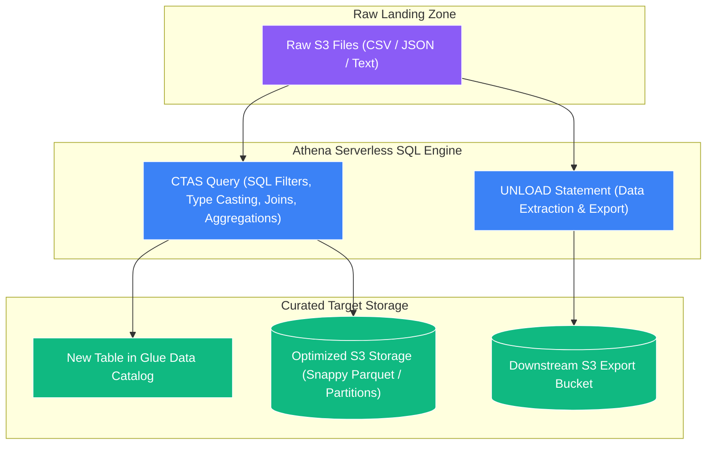

# 🔄 Athena CTAS & UNLOAD Statements (Serverless Lightweight ETL)

- **Category**: Analytics / Lightweight Serverless ETL & Data Transformation
- **Language / ဘာသာစကား**: [English (Original)](/en/02-services/analytics-streaming/athena/athena-ctas) | **မြန်မာဘာသာ (Burmese)**
- **Primary Use Case**: Spark cluster များကို manage လုပ်စရာမလိုဘဲ S3 ရှိ dataset များကို transform, compress, partition နှင့် export ပြုလုပ်ရန် lightweight SQL-based ETL ကို လုပ်ဆောင်ခြင်း။
- **Slide Reference**: Pages 365–382 in `[AWSCertifiedDataEngineerSlides.pdf](/docs/AWSCertifiedDataEngineerSlides.pdf)`
- **Hub Links**: `[[mm/index]]` | `[[mm/02-services/analytics-streaming/athena/athena|athena]]` | `[[mm/02-services/analytics-streaming/glue/glue-etl-jobs|glue-etl-jobs]]` | `[[mm/03-concepts/data-formats-and-compression|data-formats-and-compression]]`

---

## 1. High-Level Summary

**CTAS (Create Table As Select)** သည် Amazon Athena မှ support ပေးထားသော standard ANSI SQL statement တစ်ခုဖြစ်ပြီး၊ လက်ရှိရှိနေသော table တစ်ခုပေါ်တွင် query တစ်ခု run ကာ ရလဒ် (result) ကို Amazon S3 တွင် **new, fully managed table** အသစ်တစ်ခုအနေဖြင့် သိမ်းဆည်းပေးကာ ၎င်း၏ schema နှင့် partition metadata များကို **[[mm/02-services/analytics-streaming/glue/glue-data-catalog|glue-data-catalog]]** ထဲသို့ အလိုအလျောက် ထည့်သွင်းပေးပါသည်။

CTAS နှင့်အတူ Athena သည် **`UNLOAD`** statement ကိုလည်း ပံ့ပိုးပေးထားပြီး၊ ၎င်းသည် **Data Catalog တွင် table definition တစ်ခု ဖန်တီးစရာမလိုဘဲ** query ရလဒ်များကို လိုလားသော format များ (Parquet, ORC, Avro, JSON, CSV) ဖြင့် partitioning နှင့် compression ပြုလုပ်ကာ S3 ထဲသို့ တိုက်ရိုက် extract လုပ်ထုတ်ပေးပါသည်။

CTAS နှင့် UNLOAD တို့ ပေါင်းစပ်လိုက်သောအခါ ရိုးရှင်းသော data conversion များအတွက် PySpark code များ ရေးသားရန် သို့မဟုတ် compute infrastructure များကို provision ပြုလုပ်ရန် မလိုတော့ဘဲ pure SQL ကိုသာ အသုံးပြု၍ စွမ်းအားပြည့်ဝသော **Serverless Lightweight ETL** pipeline များကို တည်ဆောက်နိုင်စေပါသည်။



---

## 2. Core Capabilities & Syntax Deep Dive

### 1. Data Format Conversion & Partitioning via CTAS

```sql
CREATE TABLE curated_orders_parquet
WITH (
    -- 1. Specify target storage format
    format = 'PARQUET',
    parquet_compression = 'SNAPPY',

    -- 2. Define S3 partition hierarchy
    partitioned_by = ARRAY['order_year', 'order_month'],

    -- 3. Define hash-based bucketing for fast joins
    bucketed_by = ARRAY['customer_id'],
    bucket_count = 10,

    -- 4. Custom destination S3 location
    external_location = 's3://my-analytics-lake/curated/orders/'
) AS
SELECT 
    order_id,
    customer_id,
    amount,
    status,
    year AS order_year,
    month AS order_month
FROM raw_orders_csv
WHERE status != 'CANCELLED';
```

---

### 2. Appending Incremental Data (`INSERT INTO`)

CTAS table တစ်ခုကို ဖန်တီးပြီးသည်နှင့် နောက်ဆက်တွဲ နေ့စဉ် သို့မဟုတ် နာရီအလိုက် incremental batch များကို standard `INSERT INTO` statement များ အသုံးပြု၍ လက်ရှိ table ထဲသို့ append လုပ်နိုင်ပါသည်:

```sql
INSERT INTO curated_orders_parquet
SELECT 
    order_id,
    customer_id,
    amount,
    status,
    year AS order_year,
    month AS order_month
FROM raw_orders_csv
WHERE order_year = '2026' AND order_month = '09';
```

---

### 3. The `UNLOAD` Statement (Exporting without Catalog Tables)

အကယ်၍ သင်သည် query ရလဒ်များကို transform လုပ်ပြီး third-party team သို့မဟုတ် downstream system အတွက် S3 သို့ export လုပ်ထုတ်ရန် လိုအပ်သော်လည်း **Glue Data Catalog တွင် table definition အသစ်တစ်ခု ဖန်တီးပြီး catalog ရှုပ်ထွေးသွားခြင်း (pollute ဖြစ်ခြင်း) ကို မလိုလားပါက** `UNLOAD` ကို အသုံးပြုပါ:

```sql
UNLOAD (
    SELECT 
        customer_id, 
        SUM(amount) AS total_spend, 
        country
    FROM raw_orders_csv
    GROUP BY customer_id, country
)
TO 's3://export-bucket/customer_aggregates/'
WITH (
    format = 'PARQUET',
    compression = 'SNAPPY',
    partitioned_by = ARRAY['country']
);
```

---

## 3. CTAS Constraints & Rules for DEA-C01

| Constraint / Limit | Description | DEA-C01 Remediation |
| :--- | :--- | :--- |
| **100 Partitions Limit** | CTAS query တစ်ခုတည်းသည် အများဆုံး **partition ၁၀၀** သာ generate လုပ်နိုင်ပါသည်။ အကယ်၍ query သည် partition ၁၀၁ ခုနှင့် အထက် ရေးသားရန် ကြိုးပမ်းပါက `EXCEEDED_MAX_WRITER_PARTITIONS` ဖြင့် fail ဖြစ်မည်။ | 1. `WHERE` clauses များကို အသုံးပြု၍ CTAS ကို သေးငယ်သော run များအဖြစ် ခွဲထုတ်ပါ (ဥပမာ- တစ်နှစ်ချင်းစီ ရေးသားခြင်း)။<br>2. ကြီးမားသော multi-partition write များအတွက် **AWS Glue ETL Jobs** ကို အသုံးပြုပါ။ |
| **30-Minute Timeout** | Athena query များသည် ဆက်တိုက် run ချိန် **မိနစ် ၃၀** ကျော်လွန်ပါက timeout ဖြစ်သွားပါသည်။ | Partition pruning ဖြင့် query ကို optimize လုပ်ပါ၊ သို့မဟုတ် AWS Glue / Amazon EMR ကို အသုံးပြုပါ။ |
| **Read/Write Pricing** | `SELECT` query အတွက် scan ဖတ်သည့် **1 TB လျှင် $5.00** ကျသင့်ပြီး၊ ရေးသားသည့် ဖိုင်များအတွက် standard S3 storage နှင့် `PUT` request ကုန်ကျစရိတ်များ ကျသင့်ပါသည်။ | Scan ကုန်ကျစရိတ်ကို လျှော့ချရန် columnar input data များကို အသုံးပြုပါ။ |

---

## 4. Comparison Matrix: Athena CTAS vs. AWS Glue ETL vs. Amazon EMR

| Feature | Athena CTAS | AWS Glue ETL Jobs | Amazon EMR |
| :--- | :--- | :--- | :--- |
| **Language / Skill** | **ANSI SQL** | **PySpark, Scala, Python** | **Spark, Hive, Flink, Presto** |
| **Infrastructure Management** | **100% Serverless** | **Serverless (Configurable DPUs)** | **Managed Clusters (EC2 / EKS)** |
| **Partitioning Capacity** | Query တစ်ခုလျှင် **partition ၁၀၀** အထိ | Unlimited partitions | Unlimited partitions |
| **Transformation Complexity** | ရိုးရှင်းသော SQL filters, joins, aggregations, format conversion | ရှုပ်ထွေးသော multi-stage DAGs, ML transforms, fuzzy matching | စိတ်ကြိုက်ပြင်ဆင်နိုင်သော big data, petabyte-scale graph processing |
| **Timeout Limit** | **မိနစ် ၃၀** | Configurable (Default ၄၈ နာရီ) | Unlimited |
| **Cost Model** | Scan ဖတ်သည့် data $5/TB | သုံးစွဲသည့် DPU-second အလိုက် | EC2 instance hours + EMR software fee |

---

## 5. DEA-C01 Exam Tips & Scenarios

> [!IMPORTANT]
> **Key Exam Decision Triggers for Athena CTAS & UNLOAD**:
>
> - **"Convert raw CSV data in S3 to Snappy-compressed Parquet using pure SQL without provisioning clusters"** $\rightarrow$ **Amazon Athena CTAS query**။
> - **"Export aggregated query results to S3 in Parquet format partitioned by country without creating a Data Catalog table"** $\rightarrow$ **Amazon Athena `UNLOAD` statement**။
> - **"CTAS query fails with `EXCEEDED_MAX_WRITER_PARTITIONS` error"** $\rightarrow$ Query သည် **partition ၁၀၀** ထက်ပို၍ ဖန်တီးရန် ကြိုးပမ်းခဲ့ခြင်းဖြစ်သည်၊ query ကို သေးငယ်သော date range များအဖြစ် ခွဲထုတ်ပါ သို့မဟုတ် **AWS Glue ETL** ကို အသုံးပြုပါ၊။
> - **"Transform data in S3 but the team has no Python/Spark skills and knows only standard SQL"** $\rightarrow$ **Athena CTAS**။
> - **"Perform complex ETL involving fuzzy deduplication and machine learning transforms"** $\rightarrow$ *Athena CTAS ကို အသုံးမပြုပါနှင့်၊ **AWS Glue ETL (`FindMatches`)** ကို အသုံးပြုပါ*။

---

## 📌 Related Notes
- `[[mm/02-services/analytics-streaming/athena/athena|athena]]` — Amazon Athena Overview
- `[[mm/02-services/analytics-streaming/athena/athena-performance|athena-performance]]` — Why Columnar Formats Matter
- `[[mm/02-services/analytics-streaming/glue/glue-etl-jobs|glue-etl-jobs]]` — Heavyweight PySpark ETL Alternatives
- `[[mm/03-concepts/data-formats-and-compression|data-formats-and-compression]]` — Parquet, ORC & Compression
