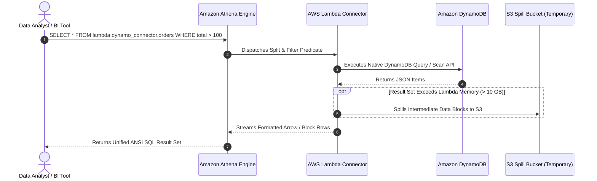

# 🔗 Athena Federated Query

- **Category**: Analytics / Cross-Source Zero-ETL Analytics
- **Language / ဘာသာစကား**: [English (Original)](/en/02-services/analytics-streaming/athena/athena-federated-query) | **မြန်မာဘာသာ (Burmese)**
- **Primary Use Case**: S3 မဟုတ်သော data store များ (DynamoDB, RDS, CloudWatch, Redshift, DocumentDB) ရှိ data များကို S3 သို့ ရွှေ့စရာမလိုဘဲ standard SQL ကို အသုံးပြုကာ မူလနေရာတွင်ပင် in-place query ပြုလုပ်ခြင်း။
- **Slide Reference**: Pages 365–382 in `[[AWSCertifiedDataEngineerSlides.pdf]]`
- **Hub Links**: `[[mm/index]]` | `[[athena]]` | `[[dynamodb]]` | `[[lambda]]` | `[[domain-1-ingestion-and-processing]]`

---

## 1. High-Level Summary

မူလက Amazon Athena သည် Amazon S3 တွင် သိမ်းဆည်းထားသော data များကိုသာ SQL query များ run နိုင်ခဲ့ပါသည်။ အကယ်၍ analytical query များအတွက် operational database များ (ဥပမာ **Amazon DynamoDB**, **Amazon RDS** သို့မဟုတ် **Amazon CloudWatch Logs**) တွင်ရှိသော data များ လိုအပ်ပါက data engineer များသည် query မပြုလုပ်မီ data များကို S3 ထဲသို့ extract, transform လုပ်ပြီး dump လုပ်ရန် ရှုပ်ထွေးပြီး scheduled ပြုလုပ်ထားသော AWS Glue ETL job များကို မဖြစ်မနေ တည်ဆောက်ခဲ့ရပါသည်။

**Athena Federated Query** သည် **Zero-ETL analytics in-place** ကို အသုံးပြုခွင့်ပေးခြင်းဖြင့် ဤ ETL overhead ကို ဖယ်ရှားပေးပါသည်။ **AWS Lambda** ဖြင့် အလုပ်လုပ်သော **Data Source Connectors** များကို အသုံးပြု၍ Athena သည် relational, NoSQL, data warehouse နှင့် custom data store များတစ်လျှောက် distributed SQL query များကို parallel အနေဖြင့် execute ပြုလုပ်နိုင်ပါသည်။



---

## 2. Core Architecture & Components

### 1. Data Source Connectors (AWS Lambda)
- Connector များသည် Presto query coordinator နှင့် target data source အကြား တံတား (bridge) သဖွယ် ဆောင်ရွက်ပေးသော pre-built သို့မဟုတ် custom AWS Lambda function များ ဖြစ်ကြပါသည်။
- Lambda connector သည် metadata retrieval, schema discovery, data extraction နှင့် predicate pushdown (ဥပမာ `WHERE` clause များကို target database engine ထဲသို့ တိုက်ရိုက် push လုပ်ခြင်း) တို့ကို ကိုင်တွယ်ဆောင်ရွက်ပါသည်။

### 2. Supported Pre-Built Data Sources
AWS သည် **AWS Serverless Application Repository (SAR)** မှတစ်ဆင့် ရယူနိုင်သော open-source, pre-built connector များကို ထောက်ပံ့ပေးထားပါသည်:
- **NoSQL & Document Databases**: Amazon DynamoDB, Amazon DocumentDB, Apache HBase, MongoDB။
- **Relational Databases (JDBC)**: Amazon RDS / Aurora (PostgreSQL, MySQL, MariaDB, Oracle, Microsoft SQL Server)။
- **Data Warehouses & Search**: Amazon Redshift, Amazon OpenSearch Service, Snowflake။
- **Logs & Key-Value**: Amazon CloudWatch Logs, Amazon CloudWatch Metrics, Amazon ElastiCache (Redis)။

---

### 3. S3 Spill Bucket (Handling Large Result Sets)

AWS Lambda execution environment များတွင် memory limit အနေဖြင့် **10 GB** နှင့် temporary `/tmp` storage limit များ ရှိပါသည်:
- Federated query တစ်ခုသည် DynamoDB သို့မဟုတ် RDS ရှိ ကြီးမားသော table တစ်ခုကို scan လုပ်သည့်အခါ Lambda connector မှ extract လုပ်လိုက်သော data များသည် ရရှိနိုင်သော Lambda memory buffer ထက် ကျော်လွန်သွားနိုင်ပါသည်။
- Out-of-Memory (OOM) failure များကို ကာကွယ်ရန်အတွက် Athena သည် **Amazon S3 Spill Bucket** ကို အသုံးပြုပါသည်။
- Lambda connector သည် ကြားခံ spilled chunk များကို S3 ထဲသို့ ရေးသားပြီး Athena query coordinator က အဆိုပါ chunk များကို အဆင်ပြေချောမွေ့စွာ aggregate လုပ်ပေးပါသည်။

---

### 4. Cross-Source Federated SQL Joins

Athena ရှိ SQL query တစ်ခုတည်းဖြင့် လုံးဝကွဲပြားခြားနားသော storage engine များပေါ်တွင် တည်ရှိနေသော table များကို join နိုင်ပါသည်:

```sql
-- Joining an S3 Data Lake table with a live DynamoDB table and a Redshift table
SELECT 
    s3_orders.order_id,
    s3_orders.order_date,
    ddb_users.customer_name,
    ddb_users.loyalty_tier,
    redshift_dim.store_region
FROM "s3_data_catalog"."curated"."orders" s3_orders
JOIN "lambda:dynamodb_connector"."default"."customers" ddb_users 
    ON s3_orders.customer_id = ddb_users.customer_id
JOIN "lambda:redshift_connector"."public"."stores" redshift_dim 
    ON s3_orders.store_id = redshift_dim.store_id
WHERE s3_orders.year = '2026' 
  AND ddb_users.loyalty_tier = 'PLATINUM';
```

---

### 5. Custom Connector Development (Query Federation SDK)
- အကယ်၍ သင့်လုပ်ငန်းသည် proprietary သို့မဟုတ် custom internal database တစ်ခုခုကို အသုံးပြုနေပါက developer များအနေဖြင့် Java ဖြင့် ရေးသားထားသော **Amazon Athena Query Federation SDK** ကို အသုံးပြု၍ custom connector များကို တည်ဆောက်နိုင်ပါသည်။
- ဤ SDK သည် metadata discovery (`MetadataHandler`) နှင့် record batching (`RecordHandler`) တို့အတွက် standard interface များကို ထောက်ပံ့ပေးထားပါသည်။

---

## 3. Cost & Performance Trade-offs

| Cost & Performance Dimension | How It Works | DEA-C01 Optimization Strategy |
| :--- | :--- | :--- |
| **Athena Scan Charges** | Scan လုပ်သော data ပမာဏအပေါ် မူတည်၍ ပုံမှန် **$5.00 per TB** ကျသင့်ပါသည်။ | Fetch လုပ်မည့် row အရေအတွက်ကို လျှော့ချရန်အတွက် selective `WHERE` clause များကို အသုံးပြုပါ။ |
| **AWS Lambda Charges** | DPU/split တစ်ခုစီအတွက် သတ်မှတ်ထားသော Lambda execution duration နှင့် allocated memory အပေါ် မူတည်၍ ကုန်ကျစရိတ် ကျသင့်ပါသည်။ | Lambda memory ကို သင့်လျော်သလို ချိန်ညှိပါ (size appropriately)။ query များသည် ပေါ့ပါးပါက over-allocate မလုပ်ပါနှင့်။ |
| **Target Database Load** | Federated query များသည် operational database များပေါ်တွင် read capacity ကို သုံးစွဲပါသည်။ | **သတိပြုရန် (Caution)**: Production DynamoDB table များပေါ်တွင် လေးလံသော Athena scan များကို run ခြင်းသည် Read Capacity Units (RCUs) များကို ကုန်ဆုံးစေပြီး production application များကို throttle ဖြစ်စေနိုင်ပါသည်။ |
| **S3 Spill Storage** | ယာယီ spill file များအတွက် ပုံမှန် S3 storage နှင့် API request charges များ ကျသင့်ပါသည်။ | Spill object များကို **1 day** (၁ ရက်) အကြာတွင် အလိုအလျောက် ဖျက်ပစ်ရန် spill bucket ပေါ်တွင် S3 Lifecycle Rules များကို configure ပြုလုပ်ပါ။ |

---

## 4. DEA-C01 Exam Tips & Scenarios

> [!IMPORTANT]
> **Key Exam Decision Triggers for Federated Query**:
>
> - **"ETL pipeline မတည်ဆောက်ဘဲ standard SQL ကို အသုံးပြုကာ DynamoDB ရှိ live data များနှင့် S3 ရှိ historical data များကို analyze ပြုလုပ်ပြီး join ရန်"** $\rightarrow$ **DynamoDB Connector ပါဝင်သော Amazon Athena Federated Query** ကို အသုံးပြုပါ။
> - **"ANSI SQL ကို အသုံးပြု၍ Amazon CloudWatch Logs များကို တိုက်ရိုက် query ပြုလုပ်ရန်"** $\rightarrow$ **CloudWatch Logs Connector ပါဝင်သော Athena Federated Query** ကို အသုံးပြုပါ။
> - **"ကြီးမားသော data extract ပြုလုပ်စဉ် federated query သည် Lambda memory limit သို့မဟုတ် timeout error ဖြင့် fail ဖြစ်သွားခြင်း"** $\rightarrow$ Lambda connector အတွက် **S3 Spill Location** တစ်ခု configure ပြုလုပ်ပါ။
> - **"Athena federated query များကြောင့် operational production database စွမ်းဆောင်ရည်အပေါ် သက်ရောက်မှုမရှိစေရန် ကာကွယ်ခြင်း"** $\rightarrow$ Query များကို **read replicas** များသို့ လမ်းကြောင်းပြောင်းပါ (RDS/Aurora အတွက်) သို့မဟုတ် DynamoDB တွင် dedicated read capacity / On-Demand capacity ကို အသုံးပြုပါ။
> - **"Athena သည် non-S3 data store များနှင့် မည်သို့ ချိတ်ဆက်သနည်း?"** $\rightarrow$ **AWS Lambda Data Source Connectors** များမှတစ်ဆင့် ချိတ်ဆက်ပါသည်။

---

## 📌 Related Notes
- `[[athena]]` — Amazon Athena Architecture Overview
- `[[dynamodb]]` — Amazon DynamoDB Ingestion & Analytics
- `[[lambda]]` — Serverless Compute with AWS Lambda
- `[[glue-etl-jobs]]` — When to use full Glue ETL vs. Federated Query
