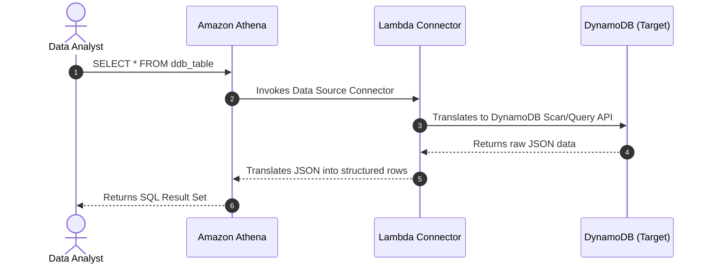

# 🔗 Athena Federated Query

- **Category**: Analytics / Data Integration
- **Language / ဘာသာစကား**: [English (Original)](/en/02-services/analytics-streaming/athena/athena-federated-query) | **မြန်မာဘာသာ (Burmese)**
- **Primary Use Case**: Amazon S3 *ပြင်ပ* တွင်သိမ်းဆည်းထားသောဒေတာများ (ဥပမာ - DynamoDB, Redshift, MySQL) ကို စံ SQL အသုံးပြု၍ Athena မှတိုက်ရိုက် Query ပြုလုပ်ခြင်း။
- **Hub Links**: `[[mm/index]]` | `[[athena]]` | `[[dynamodb]]`

---

## 1. High-Level Summary

သမိုင်းကြောင်းအရ Athena သည် Amazon S3 တွင် သိမ်းဆည်းထားသော ဒေတာများကိုသာ Query ပြုလုပ်နိုင်ခဲ့ပါသည်။ အကယ်၍ ဒေတာများသည် Amazon DynamoDB သို့မဟုတ် relational database တစ်ခုခုတွင် ရှိနေခဲ့လျှင် ဒေတာများကို ထုတ်ယူရန်အတွက် (AWS Glue ကိုအသုံးပြု၍) ETL pipeline တစ်ခုတည်ဆောက်ပြီး S3 သို့ရေးသားကာ၊ ထို့နောက်မှသာ Query ပြုလုပ်ရပါသည်။

**Athena Federated Query** သည် S3 မဟုတ်သော (non-S3) data source များကို ၎င်းတို့ရှိရင်းစွဲနေရာတွင်ပင် **AWS Lambda** ကို အသုံးပြု၍ Query ပြုလုပ်ခွင့်ပေးခြင်းဖြင့် ဤပြဿနာကို ဖြေရှင်းပေးပါသည်။

---

## 2. Core Architecture

Athena Federated Query သည် SQL query များကို ပစ်မှတ် database ၏ native API call များအဖြစ်သို့ ဘာသာပြန်ပေးရန် **Data Source Connectors** (AWS Lambda function များအဖြစ် အလုပ်လုပ်သည်) ကို အသုံးပြုပါသည်။

### Supported Data Sources:
- Amazon DynamoDB
- Amazon DocumentDB
- Amazon Redshift
- Relational Databases (Amazon RDS for MySQL, PostgreSQL, SQL Server)
- Amazon CloudWatch Logs
- Custom sources (သင်ကိုယ်တိုင် Lambda connector ကို ရေးသားနိုင်ပါသည်)။

---

## 3. Key Benefits

1. **Zero-ETL Exploration**: Data Engineer များသည် ဒေတာများကို ရွှေ့ပြောင်းရန်အတွက်သာ ရှုပ်ထွေးသော Glue ETL pipeline များ တည်ဆောက်စရာမလိုဘဲ မတူညီသော database များအကြားရှိ ဒေတာများကို စူးစမ်းလေ့လာနိုင်ပြီး join နိုင်ပါသည်။
2. **Cross-Database Joins**: S3 တွင်ရှိသော table တစ်ခုကို DynamoDB တွင်ရှိသော table နှင့် Redshift တွင်ရှိသော table တို့ဖြင့် `JOIN` လုပ်သည့် SQL query တစ်ခုတည်းကို Athena တွင် ရေးသားနိုင်ပါသည်။
3. **Serverless Execution**: Connector များသည် AWS Lambda ပေါ်တွင် run သောကြောင့် ထိန်းသိမ်းစောင့်ရှောက်ရန် အမြဲတမ်း (persistent) infrastructure မလိုအပ်ပါ။

---

## 4. DEA-C01 Exam Tips & Scenarios

> [!IMPORTANT]
> **Key Exam Trigger Keywords**:
> - **"Query DynamoDB and S3 data together using SQL without running an ETL job"** $\rightarrow$ **Use Athena Federated Query**.
> - **"Need to run ad-hoc analytics on Amazon DocumentDB or RDS without exporting data to S3"** $\rightarrow$ **Use Athena Federated Query**.
> - **"How does Athena connect to non-S3 sources?"** $\rightarrow$ **Via AWS Lambda Data Source Connectors**.

---

## 📌 Related Notes
- `[[athena]]` — Athena Overview
- `[[lambda]]` — AWS Lambda concepts
- `[[dynamodb]]` — Amazon DynamoDB
