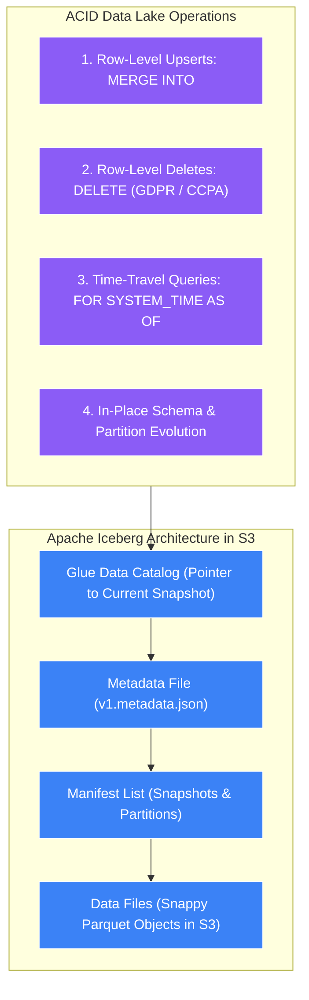
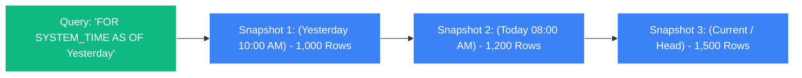

# 🧊 Athena ACID Transactions (Apache Iceberg)

- **Category**: Analytics / Data Lake Table Formats & ACID Transactions
- **Language / ဘာသာစကား**: [English (Original)](/en/02-services/analytics-streaming/athena/athena-iceberg) | **မြန်မာဘာသာ (Burmese)**
- **Primary Use Case**: S3 Data Lakes များပေါ်တွင် row-level `UPDATE`၊ `DELETE`၊ `MERGE INTO`၊ time-travel queries များနှင့် concurrent write guarantees များကို လုပ်ဆောင်နိုင်စေရန်။
- **Slide Reference**: `[[AWSCertifiedDataEngineerSlides.pdf]]` ရှိ စာမျက်နှာ 365–382
- **Hub Links**: `[[mm/index]]` | `[[mm/athena]]` | `[[mm/domain-2-data-store-management]]` | `[[mm/s3-tables]]`

---

## 1. High-Level Summary

ပုံမှန်အားဖြင့်၊ Amazon S3 နှင့် ရိုးရာ Hive-style data lake table များသည် **immutable (မပြောင်းလဲနိုင်သော) နှင့် append-only (အသစ်ထည့်ရုံသာရသော)** ဖြစ်ကြပါသည်။ multi-gigabyte Parquet file တစ်ခုအတွင်းရှိ row တစ်ခုတည်းကို update သို့မဟုတ် delete လုပ်ရန်အတွက် ယခင်က partition တစ်ခုလုံးကို ဖတ်ခြင်း၊ ဖျက်လိုက်သော row ကို filter လုပ်ဖယ်ထုတ်ခြင်းနှင့် file တစ်ခုလုံးကို S3 သို့ အသစ်ပြန်လည်ရေးသားခြင်း (rewriting) တို့ လိုအပ်ခဲ့ပါသည်။

**Apache Iceberg** သည် cloud storage ပေါ်ရှိ ကြီးမားသော analytic dataset များအတွက် ရည်ရွယ်ထုတ်လုပ်ထားသည့် open-source၊ high-performance table format တစ်ခုဖြစ်ပါသည်။ Amazon Athena သည် Apache Iceberg ကို native အနေဖြင့် အပြည့်အဝ ပံ့ပိုးပေးပြီး **ACID (Atomicity, Consistency, Isolation, Durability) transactional guarantees** အပြည့်အစုံကို Amazon S3 ပေါ်သို့ တိုက်ရိုက် သယ်ဆောင်ပေးပါသည်။



---

## 2. Core Capabilities & SQL Syntax Deep Dive

### 1. Table Creation
```sql
CREATE TABLE customer_orders_iceberg (
    order_id STRING,
    customer_id BIGINT,
    order_date DATE,
    order_amount DOUBLE,
    status STRING
)
PARTITIONED BY (order_date)
LOCATION 's3://my-analytics-lake/iceberg/orders/'
TBLPROPERTIES (
    'table_type' = 'ICEBERG',
    'format' = 'parquet',
    'write_compression' = 'snappy'
);
```

---

### 2. Row-Level Modifications (`UPDATE`, `DELETE`, `MERGE INTO`)

#### A. Row-Level Deletions (GDPR Compliance):
"Right to be Forgotten" စည်းမျဉ်းကို လိုက်နာရန်အတွက် multi-terabyte partition များကို ပြန်လည်ရေးသားနေမည့်အစား၊ standard SQL ကို တိုက်ရိုက် execute လုပ်နိုင်ပါသည်:
```sql
-- သီးခြား user တစ်ဦး၏ records များကို ချက်ချင်း ဖျက်ပစ်ခြင်း
DELETE FROM customer_orders_iceberg 
WHERE customer_id = 987654321;
```

#### B. Row-Level Updates:
```sql
UPDATE customer_orders_iceberg 
SET status = 'REFUNDED' 
WHERE order_id = 'ORD-2026-99';
```

#### C. Change Data Capture (CDC) Upserts with `MERGE INTO`:
Operational database များမှ အပြောင်းအလဲများကို S3 data lake အတွင်းသို့ single statement တစ်ခုတည်းဖြင့် synchronize လုပ်ဆောင်နိုင်ပါသည်:
```sql
MERGE INTO customer_orders_iceberg target
USING stage_orders_updates source
ON target.order_id = source.order_id
WHEN MATCHED AND source.operation = 'DELETE' THEN
    DELETE
WHEN MATCHED THEN
    UPDATE SET 
        order_amount = source.order_amount,
        status = source.status
WHEN NOT MATCHED THEN
    INSERT (order_id, customer_id, order_date, order_amount, status)
    VALUES (source.order_id, source.customer_id, source.order_date, source.order_amount, source.status);
```

---

### 3. Time-Travel & Historical Auditing Queries

Apache Iceberg သည် state ပြောင်းလဲမှုများကို immutable snapshot manifests များကို အသုံးပြု၍ မှတ်တမ်းတင်ထားသဖြင့် analyst များအနေဖြင့် table ၏ အတိတ်သမိုင်းကြောင်းအတိုင်း တိကျသော အခြေအနေကို query လုပ်နိုင်စေပါသည်:



```sql
-- 1. လွန်ခဲ့သော ၂ ရက်က တိကျစွာ တည်ရှိခဲ့သည့် table အခြေအနေကို query လုပ်ခြင်း
SELECT COUNT(*) FROM customer_orders_iceberg 
FOR SYSTEM_TIME AS OF (current_timestamp - interval '2' day);

-- 2. သီးခြား snapshot ID တစ်ခုရှိ table အခြေအနေကို query လုပ်ခြင်း
SELECT * FROM customer_orders_iceberg 
FOR SYSTEM_VERSION AS OF 8921387129847192348;
```

---

### 4. In-Place Schema & Hidden Partition Evolution

- **Schema Evolution**: `ALTER TABLE` ကို အသုံးပြု၍ column များကို safe ဖြစ်စွာ add၊ drop၊ rename သို့မဟုတ် reorder ပြုလုပ်နိုင်ပါသည်။ Data file အဟောင်းများကို ပြန်လည်ရေးသားရန် မလိုအပ်ပါ; Iceberg သည် column name များနှင့် သီးခြားစီ column ID များဖြင့် track လုပ်ပါသည်။
- **Partition Evolution**: ရှိပြီးသား သမိုင်းဝင် partition path များကို မထိခိုက်စေဘဲ partition granularity ကို ပြင်ဆင်နိုင်ပါသည် (ဥပမာ- `month` မှ `day` partitioning သို့ ပြောင်းလဲခြင်း)။

---

### 5. Concurrent Writers & Isolation Guarantees

Iceberg သည် **Optimistic Concurrency Control (OCC)** ကို အသုံးပြုပါသည်:
- Distributed writers အများအပြား (ဥပမာ- AWS Glue ETL streaming jobs၊ EMR clusters နှင့် Athena users အများအပြား) သည် တူညီသော table သို့ တစ်ပြိုင်နက်တည်း (simultaneously) ရေးသားရန် ကြိုးစားနိုင်ပါသည်။
- Readers များသည် data ၏ consistent ဖြစ်ပြီး သီးခြားခွဲထုတ်ထားသော (isolated) snapshot ကို အမြဲတမ်း တွေ့မြင်ရမည်ဖြစ်ပြီး partial/dirty reads များကို လုံးဝ ပပျောက်စေပါသည်။

---

### 6. Table Maintenance & Compaction

အချိန်ကြာလာသည်နှင့်အမျှ မကြာခဏ ပြုလုပ်သော row-level updates များနှင့် streaming ingestion များကြောင့် small data files များနှင့် snapshot manifests ပေါင်း ထောင်နှင့်ချီ ဖြစ်ပေါ်လာနိုင်ပါသည်:
1. **Compaction (`OPTIMIZE`)**: Query speed ကို လျင်မြန်စွာ ထိန်းသိမ်းထားနိုင်ရန် small files များကို ပိုမိုကြီးမားသော 128 MB+ Parquet files များအဖြစ် ပေါင်းစည်းပေးပါသည် (merges):
   ```sql
   OPTIMIZE customer_orders_iceberg REWRITE DATA USING BIN_PACK;
   ```
2. **Vacuuming (`VACUUM`)**: Storage ကုန်ကျစရိတ်များကို သက်သာစေရန် သက်တမ်းကုန်ဆုံးသွားသော snapshot manifests များကို purge လုပ်ပြီး မလိုအပ်တော့သော (orphan) S3 data files များကို delete လုပ်ပေးပါသည်:
   ```sql
   VACUUM customer_orders_iceberg;
   ```

---

## 3. Traditional Hive Tables vs. Apache Iceberg on S3

| စွမ်းဆောင်ရည် (Capability) | Traditional Hive S3 Tables | Apache Iceberg Tables |
| :--- | :--- | :--- |
| **Data Modifications** | Append-only သို့မဟုတ် full partition rewrite သာရရှိ | **ACID `INSERT`, `UPDATE`, `DELETE`, `MERGE`** |
| **GDPR / CCPA Deletes** | Partition file တစ်ခုလုံးကို ပြန်လည်ရေးသားရသည် | **Single row `DELETE` statement** |
| **Concurrent Writers** | Data corruption & race conditions ဖြစ်နိုင်ခြေရှိသည် | **Optimistic Concurrency Control (OCC)** |
| **Time-Travel Queries** | Support မလုပ်ပါ | **Native snapshot & timestamp travel** |
| **Partitioning Mechanics** | တင်းကျပ်သော physical directory paths များ | **Hidden partitioning & partition evolution** |
| **Schema Evolution** | Downstream queries များကို ပျက်စီးစေနိုင်သည် | **Column ID ဖြင့် safe ဖြစ်သော in-place evolution** |

---

## 4. DEA-C01 Exam Tips & Scenarios

> [!IMPORTANT]
> **Athena ပေါ်ရှိ Apache Iceberg အတွက် အဓိက စာမေးပွဲ Decision Triggers များ**:
>
> - **"Perform row-level updates and deletes on an S3 data lake for GDPR 'Right to be Forgotten' compliance"** $\rightarrow$ **Amazon Athena နှင့်အတူ Apache Iceberg table format ကို အသုံးပြုပါ**။
> - **"Run 'time-travel' queries to audit historical data changes or reproduce machine learning training sets"** $\rightarrow$ **`FOR SYSTEM_TIME AS OF` ဖြင့် Apache Iceberg ကို အသုံးပြုပါ**။
> - **"Prevent data corruption when multiple Glue jobs and Athena queries write to the same S3 table simultaneously"** $\rightarrow$ **ACID transactions များအတွက် table ကို Apache Iceberg သို့ migrate လုပ်ပါ**။
> - **"Ingest real-time Change Data Capture (CDC) streams with upserts into an S3 data lake"** $\rightarrow$ **Apache Iceberg ၏ `MERGE INTO` statement ကို အသုံးပြုပါ**။
> - **"Improve query performance on an Iceberg table degraded by frequent small file updates"** $\rightarrow$ **`OPTIMIZE <table_name> REWRITE DATA USING BIN_PACK`** ကို run ပါ။

---

## 📌 Related Notes
- `[[mm/athena]]` — Amazon Athena Architecture Overview
- `[[mm/athena-performance]]` — S3 Performance & Partitioning
- `[[mm/s3-tables]]` — Amazon S3 Tables for Apache Iceberg
- `[[mm/glue-etl-jobs]]` — Using AWS Glue with Apache Iceberg
