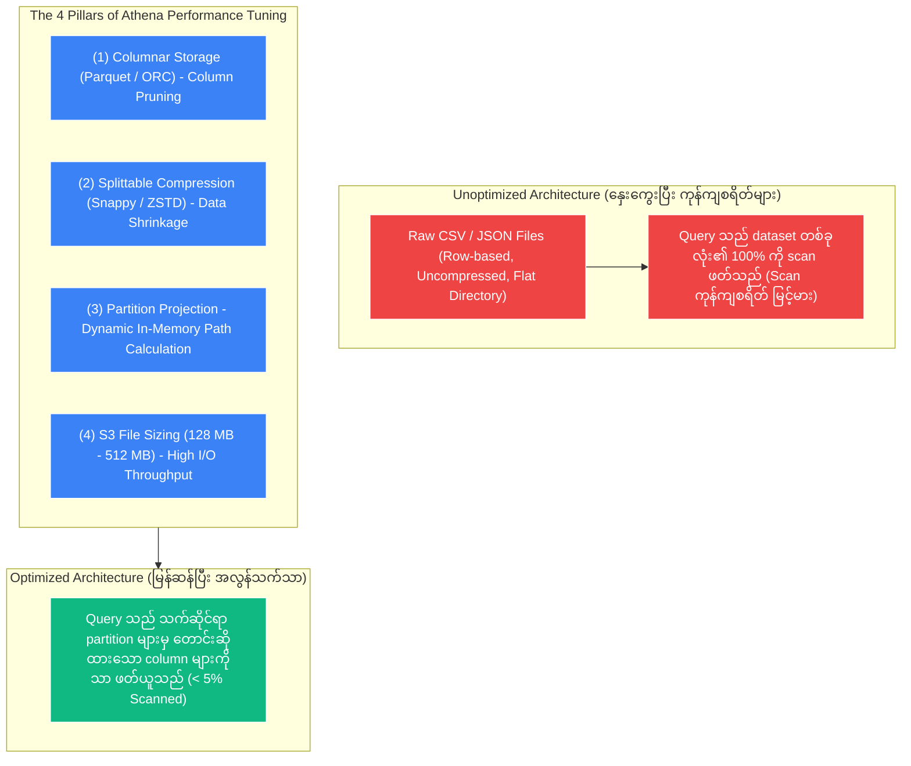

# 🚀 Athena Performance & Optimization

- **Category**: Analytics / Performance Tuning & Cost Reduction
- **Language / ဘာသာစကား**: [English (Original)](/en/02-services/analytics-streaming/athena/athena-performance) | **မြန်မာဘာသာ (Burmese)**
- **Primary Use Case**: Columnar storage၊ compression၊ partition projection နှင့် query tuning တို့ကို အသုံးပြု၍ SQL query speed ကို အမြင့်ဆုံးမြှင့်တင်ရန်နှင့် Athena scan charges ($5/TB) ကို အနည်းဆုံးဖြစ်အောင် လျှော့ချရန်။
- **Slide Reference**: `[AWSCertifiedDataEngineerSlides.pdf](/docs/AWSCertifiedDataEngineerSlides.pdf)` ရှိ စာမျက်နှာ 365–382
- **Hub Links**: `[[mm/index]]` | `[[athena]]` | `[[s3]]` | `[[domain-3-data-processing]]`

---

## 1. High-Level Summary

Amazon Athena သည် **ဖတ်ယူစစ်ဆေးသော (scanned) data တစ် Terabyte (TB) လျှင် $5.00 ကျသင့်**ပါသည်။ ထို့ကြောင့် Athena architecture တွင် **performance tuning သည် cost optimization နှင့် တိုက်ရိုက် ထပ်တူညီပါသည်**။ 

Query execute လုပ်စဉ် ကျော်သွားနိုင်သော (skipped) byte တိုင်းသည် ကုန်ကျစရိတ်ကို သက်သာစေပြီး query run ချိန်ကို ပိုမိုမြန်ဆန်စေပါသည်။ **Four Pillars of Athena Optimization** (Columnar Formats, Compression, Partitioning, နှင့် Optimal File Sizing) ကို အကောင်အထည်ဖော်ခြင်းအားဖြင့် data engineer များသည် query run ချိန်များကို မိနစ်ပိုင်းမှ စက္ကန့်ပိုင်းအောက် (sub-seconds) သို့ မြန်ဆန်စေသည့်အပြင် **ကုန်ကျစရိတ်ကို 90–99% အထိ လျှော့ချနိုင်ပါသည်**။



---

## 2. The Four Pillars of Athena Optimization

### 1. Columnar Data Formats (Apache Parquet & Apache ORC)
- **Row-Based Storage (CSV, JSON)**: အကယ်၍ query တစ်ခုသည် column ၁၀၀ ပါဝင်သော CSV file ပေါ်တွင် `SELECT customer_id, order_total` ကို execute လုပ်ပါက၊ Athena သည် row တိုင်းရှိ column ၁၀၀ လုံးကို scan ဖတ်ရမည်ဖြစ်ပြီး data volume ၏ ၁၀၀% အတွက် ကုန်ကျစရိတ် ပေးဆောင်ရမည်ဖြစ်သည်။
- **Columnar Storage (Parquet, ORC)**: Data များကို built-in statistics (block တစ်ခုစီအတွက် min/max values များ) ပါဝင်သော column chunk များအဖြစ် ဖွဲ့စည်းထားပါသည်။ Athena သည် query တွင် ရည်ညွှန်းထားသော **တိကျသည့် column များကိုသာ** ဆွဲယူဖတ်ရှုပြီး မသက်ဆိုင်သော column များကို လုံးဝ ကျော်သွားပါသည်။

---

### 2. Splittable Compression Formats (Snappy & ZSTD)
- Dataset များကို compress လုပ်ခြင်းသည် raw S3 storage သုံးစွဲမှုနှင့် network bandwidth ကို လျှော့ချပေးပါသည်။
- **Snappy**: AWS တွင် Apache Parquet အတွက် industry standard ဖြစ်ပါသည်။ Snappy သည် မျှတသော compression ratio ကို ပေးစွမ်းပြီး **splittable** ဖြစ်သောကြောင့် Athena worker node များအနေဖြင့် ဖိုင်တစ်ခုတည်း၏ အစိတ်အပိုင်းများစွာကို parallel အပြိုင် ဖတ်ယူလုပ်ဆောင်နိုင်စေပါသည်။
- **Gzip**: Snappy ထက် ပိုမိုမြင့်မားသော compression ratio ကို ရရှိသော်လည်း file level တွင် **splittable မဖြစ်ပါ** (worker တစ်ခုတည်းက ဖိုင်တစ်ခုလုံးကို decompress လုပ်ရပါသည်)။ Parallel query performance ထက် raw storage သက်သာမှုကို ပိုမိုဦးစားပေးလိုသည့်အခါမှသာ Gzip ကို အသုံးပြုပါ။

---

### 3. S3 Partitioning & Partition Pruning
- Partitioning သည် data များကို အဆင့်ဆင့်သတ်မှတ်ထားသော S3 folder prefix များအဖြစ် ပိုင်းခြားပေးပါသည် (ဥပမာ- `s3://lake/sales/year=2026/month=08/day=17/`)။
- Query တစ်ခုတွင် partition key များနှင့် ကိုက်ညီသော `WHERE` clause ပါဝင်လာသည့်အခါ (ဥပမာ- `WHERE year = '2026' AND month = '08'`)၊ Athena သည် **Partition Pruning** ကို အသုံးပြု၍ အခြားသော year/month folder များကို ကျော်သွားပြီး dataset ၏ အစိတ်အပိုင်း အနည်းငယ်ကိုသာ scan ဖတ်ပါသည်။

---

### 4. Optimal S3 File Sizing (Small File Problem ကို ဖြေရှင်းခြင်း)
- **The Small File Bottleneck**: S3 တွင် သေးငယ်သော 10 KB–1 MB ဖိုင်ပေါင်း သန်းနှင့်ချီ ရှိနေခြင်းသည် S3 `GET` API overhead ပိုမိုများပြားစေပြီး Athena တွင် file open/close latency ကို ဖြစ်ပေါ်စေပါသည်။
- **The Large File Bottleneck**: ကြီးမားလွန်းသော 1 TB ဖိုင်ကြီးတစ်ခုတည်း ရှိနေခြင်းသည် worker node များအကြား parallel execution လုပ်ဆောင်နိုင်စွမ်းကို ကန့်သတ်လိုက်သလို ဖြစ်စေပါသည်။
- **Optimal Sizing Rule**: ဖိုင်အရွယ်အစားကို **128 MB နှင့် 512 MB ကြား** ထားရှိရန် ရည်ရွယ်ပါ။ Query မလုပ်မီ AWS Glue file grouping (`groupFiles="inPartition"`) သို့မဟုတ် Athena CTAS ကို အသုံးပြု၍ ဖိုင်ငယ်များကို 128 MB chunk များအဖြစ် ပေါင်းစည်း (consolidate) ထားပါ။

---

## 3. Deep Dive: Partition Projection

Partition ပေါင်း သိန်းနှင့်ချီ ပါဝင်သော massive data lake များတွင် (ဥပမာ- `device_id` နှင့် `timestamp` ဖြင့် partition ခွဲထားသော IoT telemetry များ) API call များမှတစ်ဆင့် **[[glue-data-catalog]]** metadata ကို query လုပ်ခြင်းသည် အဓိက bottleneck ဖြစ်လာပြီး planning phase အတွင်း query များ ရပ်တန့် (hang) သွားစေတတ်ပါသည်။

**Partition Projection** သည် Glue Data Catalog partition lookup ကို လုံးဝ ကျော်လွှား (bypass) ပေးပါသည်။ Metadata API call များ ပြုလုပ်မည့်အစား Athena သည် table properties တွင် သတ်မှတ်ထားသော regex/range rule များအပေါ် အခြေခံ၍ **partition တည်နေရာများကို memory အတွင်း dynamically (in-memory) တွက်ချက်ပေးပါသည်**။

```mermaid
graph TD
    subgraph TraditionalLookup["Traditional Partition Lookup (Scale ကြီးလျှင် နှေးကွေးသည်)"]
        Q1["Athena Query with WHERE date = '2026-08-17'"] --> API["Glue Data Catalog API (GetPartitions)"]
        API --> S1["Partition Metadata Records ပေါင်း 500,000+ ကို Scan ဖတ်သည်"]
        S1 --> P1["Query ကို Plan လုပ်ရန်အတွက်ပင် စက္ကန့် 30–90 ကြာမြင့်သည်"]
    end

    subgraph PartitionProjectionLookup["Athena Partition Projection (ချက်ချင်းဖြစ်ပေါ်သည်)"]
        Q2["Athena Query with WHERE date = '2026-08-17'"] --> InMem["In-Memory Date Range Rule Evaluation"]
        InMem --> DirectS3["Direct S3 GET: 's3://lake/data/2026-08-17/'"]
        DirectS3 --> P2["စက္ကန့်ပိုင်းအောက်ဖြင့် Query ကို စတင်နိုင်သည် (Sub-Second Query Initiation)"]
    end

    classDef slow fill:#ef4444,stroke:#fff,stroke-width:1px,color:#fff;
    classDef fast fill:#10b981,stroke:#fff,stroke-width:1px,color:#fff;

    class API,S1,P1 slow;
    class InMem,DirectS3,P2 fast;
```



### Complete DDL Example with Partition Projection:
```sql
CREATE EXTERNAL TABLE website_clickstream (
    event_id STRING,
    user_id BIGINT,
    page_url STRING,
    response_time INT
)
PARTITIONED BY (
    event_date STRING,
    region STRING
)
ROW FORMAT SERDE 'org.apache.hadoop.hive.ql.io.parquet.serde.ParquetHiveSerDe'
STORED AS INPUTFORMAT 'org.apache.hadoop.hive.ql.io.parquet.MapredParquetInputFormat'
OUTPUTFORMAT 'org.apache.hadoop.hive.ql.io.parquet.MapredParquetOutputFormat'
LOCATION 's3://my-analytics-lake/clickstream/'
TBLPROPERTIES (
    -- 1. Enable Partition Projection
    'projection.enabled' = 'true',

    -- 2. Configure Date Partition Projection (Date Type)
    'projection.event_date.type' = 'date',
    'projection.event_date.range' = '2022-01-01,NOW',
    'projection.event_date.format' = 'yyyy-MM-dd',
    'projection.event_date.interval' = '1',
    'projection.event_date.interval.unit' = 'DAYS',

    -- 3. Configure Region Partition Projection (Enum Type)
    'projection.region.type' = 'enum',
    'projection.region.values' = 'us-east-1,us-west-2,eu-west-1,ap-southeast-1',

    -- 4. Dynamic S3 Storage Location Template
    'storage.location.template' = 's3://my-analytics-lake/clickstream/event_date=${event_date}/region=${region}/'
);
```

### Partition Management Strategy Comparison:

| Feature | Partition Projection | Glue Partition Index | Glue Crawlers | `MSCK REPAIR TABLE` |
| :--- | :--- | :--- | :--- | :--- |
| **Lookup Location** | **In-Memory (Athena Engine)** | **Glue Data Catalog (B-Tree)** | S3 File Scan $\rightarrow$ Catalog write | S3 File Scan $\rightarrow$ Catalog write |
| **New Partition Setup** | **Zero intervention** (အလိုအလျောက် တွက်ချက်သည်) | Crawler run ပြီးနောက် Automatic ဖြစ်သည် | Crawler run ရန် လိုအပ်သည် | Manual SQL run ရန် လိုအပ်သည် |
| **Query Planning Latency** | **Sub-second (အမြန်ဆုံး)** | Milliseconds | Large table များတွင် မိနစ်ပိုင်းကြာသည် | Minutes / Hours (Data lake ကြီးမားပါက Fail ဖြစ်နိုင်သည်) |
| **Cross-Service Support** | **Athena only** | Athena နှင့် Amazon EMR | All AWS Analytics | Athena နှင့် EMR |
| **Best Used For** | ကြိုတင်ခန့်မှန်းနိုင်သော date ranges၊ hourly timestamps၊ လူသိများသော ID များ | Athena နှင့် EMR နှစ်မျိုးလုံးမှ query ပြုလုပ်သော large partitioned table များ | မသိရှိသော schema များနှင့် ပုံမှန်မဟုတ်သော partition များကို ရှာဖွေဖော်ထုတ်ခြင်း | Dataset သေးငယ်သော နေရာများတွင် ad-hoc table repair ပြုလုပ်ခြင်း |

---

## 4. Advanced Performance Techniques & SQL Tuning

### 1. Bucketing / Clustering (`CLUSTERED BY`)
- Bucketing သည် partition တစ်ခုအတွင်းရှိ data များကို high-cardinality column (ဥပမာ- `user_id`) ပေါ် အခြေခံ၍ သတ်မှတ်ထားသော hash-based file အရေအတွက်အတိုင်း ပိုင်းခြားပေးပါသည်။
- Table အကြီးကြီးနှစ်ခုကို key တူညီစွာဖြင့် bucket လုပ်ထားပြီး အချင်းချင်း join သည့်အခါ Athena သည် **Bucket Map Join** ကို လုပ်ဆောင်ပေးပြီး worker node များအကြား ကုန်ကျစရိတ်များသော inter-node shuffle ဖြစ်ပေါ်မှုကို ရှောင်ရှားစေပါသည်။

```sql
CREATE TABLE bucketed_orders
WITH (
    format = 'PARQUET',
    partitioned_by = ARRAY['order_date'],
    bucketed_by = ARRAY['customer_id'],
    bucket_count = 10
) AS SELECT * FROM raw_orders;
```

---

### 2. SQL Anti-Patterns & Query Optimization Rules

| Rule / Optimization | Why It Matters for Performance & Cost |
| :--- | :--- |
| **`SELECT *` ကို ဘယ်တော့မှ မသုံးပါနှင့်** | Explicit column များကိုသာ အမြဲရွေးချယ်ပါ။ Columnar Parquet/ORC တွင် column အားလုံးကို select လုပ်ခြင်းသည် Athena အား data ၏ 100% ကို scan ဖတ်ရန် ဖိအားပေးစေပါသည်။ |
| **`LIMIT` Trap ကို သတိပြုပါ** | Partition မလုပ်ထားသော CSV/JSON ပေါ်တွင် `SELECT * FROM table LIMIT 10` ပြုလုပ်သော်လည်း **file တစ်ခုလုံး** ကို scan ဖတ်နေဆဲဖြစ်သည်; `LIMIT` သည် S3 scan charges များကို လျှော့ချမပေးပါ! |
| **`JOIN` Clauses များကို စီစဉ်ခြင်း (Left vs. Right)** | **အကြီးဆုံး table ကို ပထမ (Left)** တွင်ထားပြီး သေးငယ်သော dimension/lookup table ကို ဒုတိယ (Right) တွင်ထားပါ။ Athena သည် right-side table ကို worker node များအားလုံးသို့ broadcast လုပ်ပါသည်။ |
| **`approx_distinct()` ကို အသုံးပြုပါ** | Massive dataset များအတွက် `COUNT(DISTINCT column)` နေရာတွင် `approx_distinct(column)` ဖြင့် အစားထိုးပါ။ CPU နှင့် memory အနည်းငယ်သာ အသုံးပြုပြီး HyperLogLog ဖြင့် ~2.3% standard error ဖြင့် count များကို တွက်ချက်ပေးပါသည်။ |
| **`EXPLAIN (TYPE DISTRIBUTED)` ကို အသုံးပြုပါ** | Stage fragmentation၊ data shuffling နှင့် join operation များကို စစ်ဆေးရန် distributed query execution plan ကို ထုတ်ယူပေးပါသည်။ |

---

## 5. DEA-C01 Exam Tips & Scenarios

> [!IMPORTANT]
> **Key Exam Decision Triggers for Athena Performance**:
>
> - **"Petabyte-scale CSV data lake ပေါ်တွင် Athena query cost နှင့် latency ကို သိသိသာသာ လျှော့ချလိုသည်"** $\rightarrow$ **Data များကို date အလိုက် partition ခွဲပြီး Snappy compression ဖြင့် Apache Parquet သို့ ပြောင်းလဲပါ**။
> - **"Hourly partitioned table ပေါ်ရှိ query များသည် စတင် plan ရန်အတွက်ပင် မိနစ်ပိုင်းကြာမြင့်နေသည်"** $\rightarrow$ **Table properties တွင် Athena Partition Projection ကို enable လုပ်ပါ**။
> - **"`LIMIT 5` ကို သုံးထားသော်လည်း Athena query သည် 100 GB scan ဖတ်နေသည်"** $\rightarrow$ `LIMIT` သည် unpartitioned S3 storage scan များကို prune မလုပ်ပေးနိုင်ကြောင်း ရှင်းပြပါ; **၎င်းအစား Partitioning နှင့် Columnar format များကို အသုံးပြုပါ**။
> - **"Athena တွင် ကြီးမားသော 10 TB table နှစ်ခုကြား join performance ကို မြှင့်တင်လိုသည်"** $\rightarrow$ **Join key ပေါ်တွင် table နှစ်ခုလုံးကို co-bucket လုပ်ပါ (`bucketed_by = ARRAY['id']`)**။
> - **"Record သန်း 500 ကျော်မှ unique active user များကို အနည်းဆုံးကုန်ကျစရိတ်ဖြင့် လျင်မြန်စွာ တွက်ချက်လိုသည်"** $\rightarrow$ **`approx_distinct(user_id)` ကို အသုံးပြုပါ**။

---

## 📌 Related Notes
- `[[athena]]` — Amazon Athena Architecture Overview
- `[[athena-ctas]]` — CTAS ကို အသုံးပြု၍ CSV မှ Parquet သို့ ပြောင်းလဲခြင်း
- `[[data-formats-and-compression]]` — Parquet, ORC, Snappy & ZSTD Specs များ
- `[[glue-data-catalog]]` — Glue Partition Indexes များ
