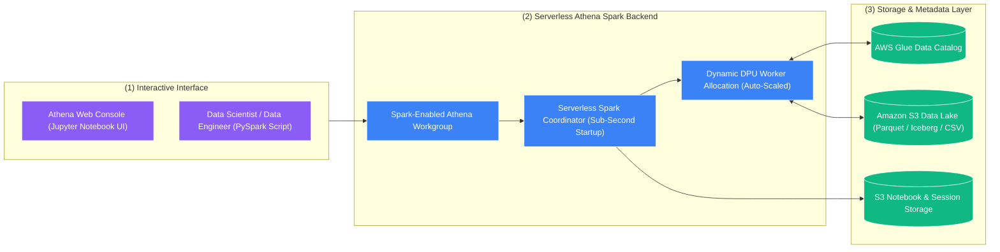

# ⚡ Amazon Athena for Apache Spark (မြန်မာဘာသာ)

- **Category**: Analytics / Distributed Serverless Processing & Interactive Notebooks
- **Language / ဘာသာစကား**: [English (Original)](/en/02-services/analytics-streaming/athena/athena-spark) | **မြန်မာဘာသာ (Burmese)**
- **Primary Use Case**: Spark cluster များကို provision လုပ်စရာမလိုဘဲ S3 ပေါ်တွင် ချက်ချင်း အလုပ်လုပ်နိုင်သော interactive PySpark data exploration နှင့် serverless Jupyter notebooks များကို အသုံးပြုရန်။
- **Slide Reference**: `[AWSCertifiedDataEngineerSlides.pdf](/docs/AWSCertifiedDataEngineerSlides.pdf)` ရှိ စာမျက်နှာ 365–382
- **Hub Links**: `[[mm/index|index]]` | `[[mm/02-services/analytics-streaming/athena/athena|athena]]` | `[[mm/02-services/analytics-streaming/glue/glue-etl-jobs|glue-etl-jobs]]` | `[[mm/02-services/analytics-streaming/emr/emr|emr]]` | `[[domain-3-data-processing]]`

---

## 1. High-Level Summary

Amazon Athena သည် အဓိကအားဖြင့် **serverless SQL** အတွက် လူသိများသော်လည်း၊ ၎င်းသည် **serverless Apache Spark** ကိုလည်း natively support လုပ်ပေးပါသည်။ 

**Amazon Athena for Apache Spark** သည် data engineers၊ data analysts နှင့် data scientists များအား Athena Web Console မှ တိုက်ရိုက် **၁ စက္ကန့်အောက် (under 1 second)** မကြုံစဖူး မြန်ဆန်သော startup time ဖြင့် interactive PySpark analytics များနှင့် Jupyter notebooks များကို execute လုပ်ရန် ခွင့်ပြုပေးပါသည်။

Engineers များအနေဖြင့် Amazon EMR clusters များ spin up ဖြစ်လာစေရန် ၅–၁၅ မိနစ်ခန့် စောင့်ဆိုင်းစရာမလိုဘဲ သို့မဟုတ် underlying infrastructure များကို manage လုပ်စရာမလိုဘဲ distributed Apache Spark dataframes များ၏ စွမ်းဆောင်ရည်နှင့် ကြွယ်ဝသော Python machine learning libraries များ (ဥပမာ Pandas, NumPy, Matplotlib, နှင့် Seaborn ကဲ့သို့သော) ကို ရရှိအသုံးပြုနိုင်ပါသည်။



---

## 2. Core Architectural Features

### 1. Sub-Second Startup Latency
- Amazon EMR သို့မဟုတ် AWS Glue ပေါ်ရှိ ရိုးရိုး standard Apache Spark သည် virtual machines များကို provision လုပ်ရန်နှင့် Spark contexts များကို initialize လုပ်ရန် မိနစ်အနည်းငယ် ကြာမြင့်တတ်သည်။
- Athena for Apache Spark သည် pre-warmed ဖြစ်နေသော serverless compute capacity ကို အသုံးပြုထားသဖြင့် interactive notebooks များနှင့် sessions များကို **၁ စက္ကန့်အောက် (less than 1 second)** အတွင်း စတင်ပေးနိုင်သည်။

### 2. Spark-Enabled Workgroups
- Athena တွင် Spark jobs များကို run ရန်အတွက် **Apache Spark engine** ဖြင့် configure လုပ်ထားသော Athena Workgroup တစ်ခုကို ဖန်တီးရမည်ဖြစ်သည်။
- Cost governance ကို ထိန်းသိမ်းရန်နှင့် မလိုလားအပ်သော computation ကုန်ကျစရိတ်များ မြင့်တက်မသွားစေရန် workgroup တစ်ခုချင်းစီအလိုက် အများဆုံး DPU limits (Data Processing Units) များကို configure လုပ်နိုင်သည်။

### 3. Interactive PySpark Code Example
```python
import athena_spark_utils as utils
from pyspark.sql import SparkSession
import matplotlib.pyplot as plt
import pandas as pd

# Initialize Spark session (Instant start)
spark = SparkSession.builder.appName("AthenaSparkExploration").getOrCreate()

# 1. Read directly from AWS Glue Data Catalog table
df = spark.read.table("analytics_db.customer_churn_data")

# 2. Perform distributed PySpark DataFrame transformations
aggregated_df = df.groupBy("subscription_tier") \
    .agg({"monthly_spend": "avg", "customer_id": "count"}) \
    .withColumnRenamed("avg(monthly_spend)", "avg_spend") \
    .withColumnRenamed("count(customer_id)", "total_users")

# 3. Convert to Pandas for local in-notebook visualization
pandas_df = aggregated_df.toPandas()

# 4. Generate visual chart directly inside Athena Console
plt.bar(pandas_df['subscription_tier'], pandas_df['avg_spend'], color='skyblue')
plt.title('Average Spend by Subscription Tier')
plt.xlabel('Tier')
plt.ylabel('Average Spend ($)')
plt.show()
```

---

## 3. Decision Matrix: Spark on AWS (Athena Spark vs. Glue ETL vs. Amazon EMR)

DEA-C01 စာမေးပွဲတွင် အမေးအများဆုံး concept များထဲမှ တစ်ခုမှာ အခြေအနေအလိုက် မည်သည့် Spark compute engine ကို ရွေးချယ်ရမည်ကို သိရှိခြင်းဖြစ်သည်:

| Feature | Amazon Athena for Spark | AWS Glue ETL Jobs | Amazon EMR Clusters | Amazon EMR Serverless |
| :--- | :--- | :--- | :--- | :--- |
| **Primary Persona** | **Data Scientists / Analysts** | **Data Engineers** | **Big Data / Platform Engineers** | **Data Engineers / Analysts** |
| **Startup Latency** | **Sub-second (< 1 sec)** | 1–2 minutes | 5–15 minutes (EC2 provisioning) | Seconds to ~1 minute |
| **Execution Mode** | **Interactive exploration (Jupyter)** | **Scheduled batch / streaming pipelines** | **Persistent, long-running clusters** | Scheduled batch / ad-hoc jobs |
| **State Management** | Interactive session memory | **Native Job Bookmarks** | Custom application logic | Custom application logic |
| **Customizability** | Fixed standard PySpark environment | Standard Glue libraries + custom jars | **Full OS/Kernel/Hadoop customization** | Pre-packaged Spark/Hive runtimes |
| **Cost Model** | Billed per DPU-hour active | Billed per DPU-second active | EC2 hourly + EMR surcharge (Spot ဖြင့် 90% အထိ လျှော့စျေး) | Billed per vCPU-hour and GB-hour |
| **Best Used For** | Ad-hoc Python analytics & fast iteration | Enterprise ETL pipelines & CDC | Petabyte-scale multi-workload clusters | EC2 tuning လုပ်စရာမလိုဘဲ Scalable Spark batch run ရန် |

---

## 4. DEA-C01 Exam Tips & Scenarios

> [!IMPORTANT]
> **Key Exam Decision Triggers for Athena for Apache Spark**:
>
> - **"Need to run interactive PySpark code or Jupyter Notebooks instantly without waiting for clusters to start"** (Cluster များ စတင်ရန် စောင့်ဆိုင်းစရာမလိုဘဲ interactive PySpark code သို့မဟုတ် Jupyter Notebooks များကို ချက်ချင်း run ရန် လိုအပ်သည်) $\rightarrow$ **Amazon Athena for Apache Spark**။
> - **"Data Analysts use SQL, but Data Scientists need Python/PySpark on the exact same S3 data lake"** (Data Analyst များသည် SQL ကို အသုံးပြုပြီး Data Scientist များသည် ထို S3 data lake ပေါ်တွင်ပင် Python/PySpark လိုအပ်သည်) $\rightarrow$ **Analyst များအတွက် Athena SQL ၊ Data Scientist များအတွက် Athena for Apache Spark**။
> - **"Execute ad-hoc statistical data exploration in Python with sub-second startup latency"** (Sub-second startup latency ဖြင့် Python တွင် ad-hoc statistical data exploration ပြုလုပ်ရန်) $\rightarrow$ **Amazon Athena for Apache Spark**။

> [!WARNING]
> **Critical Exam Trap**:
> - **Mission-critical ဖြစ်ပြီး schedule ချထားသော production ETL pipelines များအတွက် Athena for Apache Spark ကို အသုံးမပြုပါနှင့်**။ ၎င်းသည် Spark code ကို run နိုင်သော်လည်း၊ **AWS Glue ETL Jobs** သည် production batch pipelines များအတွက် ရည်ရွယ်တည်ဆောက်ထားသော purpose-built service ဖြစ်ပါသည် (Job Bookmarks၊ Glue Workflows integration နှင့် automated retries များ ပါဝင်သောကြောင့် ဖြစ်သည်)။

---

## 📌 Related Notes
- `[[mm/02-services/analytics-streaming/athena/athena|athena]]` — Amazon Athena Overview & Architecture
- `[[mm/02-services/analytics-streaming/glue/glue-etl-jobs|glue-etl-jobs]]` — Production Serverless Spark ETL
- `[[mm/02-services/analytics-streaming/emr/emr|emr]]` — Massive-Scale Spark Clusters များအတွက် Amazon EMR
- `[[domain-3-data-processing]]` — Distributed Processing Patterns
