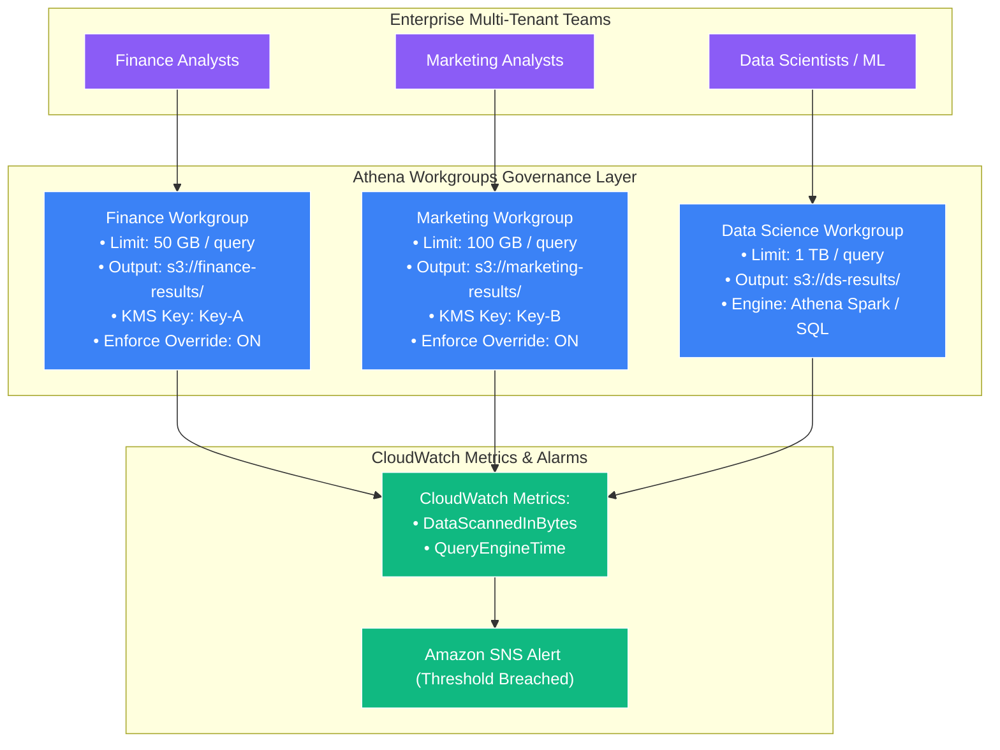
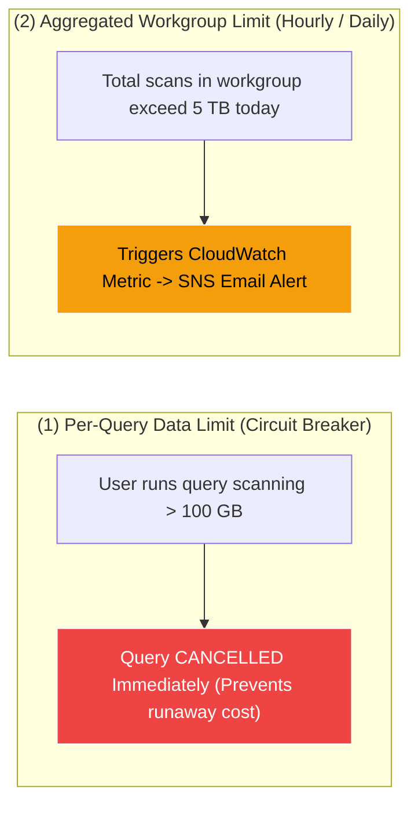

# 🛡️ Athena Workgroups & Cost Management (မြန်မာဘာသာ)

- **Category**: Analytics / Governance, Security & Cost Controls
- **Language / ဘာသာစကား**: [English (Original)](/en/02-services/analytics-streaming/athena/athena-workgroups) | **မြန်မာဘာသာ (Burmese)**
- **Primary Use Case**: Multi-tenant isolation ပြုလုပ်ရန်၊ per-query နှင့် workgroup အဆင့် data scan limit များ သတ်မှတ်ရန်၊ မဖြစ်မနေ encryption သတ်မှတ်စေရန် (mandatory encryption enforcement) နှင့် အသေးစိတ် cost tracking ပြုလုပ်ရန်။
- **Slide Reference**: `[AWSCertifiedDataEngineerSlides.pdf](/docs/AWSCertifiedDataEngineerSlides.pdf)` မှ Pages 365–382
- **Hub Links**: `[[mm/index|index]]` | `[[mm/02-services/analytics-streaming/athena/athena|athena]]` | `[[domain-5-security-and-governance]]` | `[[mm/02-services/ml-dev-cost/cost-management|cost-management]]`

---

## 1. High-Level Summary

Amazon Athena သည် pay-per-scan model (**scan လုပ်ထားသော data တစ် TB လျှင် $5.00**) ဖြင့် ကျသင့်ငွေ ကောက်ခံသောကြောင့်၊ ညံ့ဖျင်းစွာ ရေးသားထားသော query တစ်ခု (ဥပမာ - partition filter များ မပါရှိဘဲ multi-petabyte uncompressed dataset ပေါ်တွင် `SELECT *` execute လုပ်ခြင်း) သည် စက္ကန့်ပိုင်းအတွင်း မတော်တဆ ဒေါ်လာထောင်ချီ၍ ကုန်ကျသွားစေနိုင်ပါသည်။

**Athena Workgroups** သည် multi-tenant isolation၊ cost governance နှင့် security policy enforcement များကို ထောက်ပံ့ပေးပါသည်။ User များ၊ application များနှင့် business unit များကို သီးသန့် workgroup များအဖြစ် စုစည်းပေးခြင်းဖြင့် administrator များသည် query တစ်ခုချင်းစီအလိုက် တင်းကျပ်သော data limit များကို သတ်မှတ်နိုင်ခြင်း၊ query result များအား မဖြစ်မနေ encrypt လုပ်စေရန် သတ်မှတ်နိုင်ခြင်း၊ query history များကို သီးခြားစီ ခွဲခြားထားနိုင်ခြင်းနှင့် department အလိုက် ကုန်ကျစရိတ်များကို **Amazon CloudWatch** မှတစ်ဆင့် ခြေရာခံ (track) နိုင်ခြင်းတို့ကို ပြုလုပ်နိုင်ပါသည်။



---

## 2. Core Governance Capabilities

### 1. Cost Controls & Data Scan Limits (Circuit Breakers)

Workgroups များသည် budget ကျော်လွန်ကုန်ကျမှုများကို ကာကွယ်ရန် data usage threshold အဆင့် (၂) မျိုးကို ထောက်ပံ့ပေးထားပါသည်:



1. **Per-Query Data Limit**:
   - Query တစ်ခုချင်းစီအတွက် အများဆုံး data scan threshold (ဥပမာ - **100 GB**) ကို သတ်မှတ်နိုင်သည်။
   - အကယ်၍ analyst တစ်ဦးသည် သတ်မှတ်ထားသော threshold ထက် ပိုမို scan လုပ်မည့် query တစ်ခုကို submit လုပ်ပါက၊ Athena သည် **query ကို execute မလုပ်မီ အလိုအလျောက် cancel လုပ်ပေးမည်** ဖြစ်ပြီး scan ကုန်ကျစရိတ် လုံးဝမရှိစေခြင်း သို့မဟုတ် အနည်းဆုံးသာ ဖြစ်စေပါသည်။
2. **Workgroup-Wide Data Usage Alarms**:
   - Workgroup တစ်ခုလုံးအတွက် နာရီအလိုက် သို့မဟုတ် နေ့စဉ် စုစုပေါင်း data scan limit များကို သတ်မှတ်နိုင်သည်။
   - စုစုပေါင်း scan ပမာဏသည် threshold ကို ကျော်လွန်သွားပါက၊ Athena သည် **Amazon EventBridge** နှင့် **Amazon SNS** သို့ alert တစ်ခု publish လုပ်မည်ဖြစ်ပြီး administrator များကို အသိပေးခြင်းနှင့် လိုအပ်ပါက နောက်ထပ် query submission များကို တားဆီးပေးနိုင်သည်။

---

### 2. Multi-Tenant Environment Isolation

- **Query History & Saved Queries Isolation**: `finance` workgroup အတွင်းရှိ user များသည် `marketing` workgroup ၏ query history၊ saved queries များနှင့် output data များကို ကြည့်ရှုခြင်း၊ စစ်ဆေးခြင်း သို့မဟုတ် download ပြုလုပ်ခြင်းများ မလုပ်ဆောင်နိုင်ပါ။
- **IAM-Based Workgroup Access Control**: Workgroup များသို့ ဝင်ရောက်အသုံးပြုခွင့်ကို IAM policy များဖြင့် တင်းကျပ်စွာ စီမံခန့်ခွဲထားသည်:

```json
{
    "Version": "2012-10-17",
    "Statement": [
        {
            "Effect": "Allow",
            "Action": [
                "athena:StartQueryExecution",
                "athena:GetQueryExecution",
                "athena:GetQueryResults",
                "athena:StopQueryExecution"
            ],
            "Resource": "arn:aws:athena:us-east-1:123456789012:workgroup/finance_analytics"
        }
    ]
}
```

---

### 3. Enforcing Security Policies ("Override Client-Side Settings")

မူလအားဖြင့် (By default) JDBC/ODBC client များ သို့မဟုတ် Python script များသည် ၎င်းတို့၏ ကိုယ်ပိုင် S3 output path များနှင့် encryption setting များကို သတ်မှတ်နိုင်ပါသည်။ Corporate compliance စည်းမျဉ်းများကို လိုက်နာစေရန်အတွက် workgroup administrator များသည် **"Override client-side settings"** ကို enable ပြုလုပ်နိုင်ပါသည်:

| Setting Enforced | Compliance & Security Impact |
| :--- | :--- |
| **Designated S3 Output Location** | ထို workgroup အတွက် query result အားလုံးကို သတ်မှတ်ထားသော၊ စစ်ဆေးမှုခံယူထားသည့် (audited) S3 bucket path (ဥပမာ `s3://corp-analytics-results/finance/`) သို့သာ မဖြစ်မနေ ရောက်ရှိစေပါသည်။ |
| **Mandatory AWS KMS Encryption** | Client ၏ preference များကို လျစ်လျူရှုပြီး CSV query result များနှင့် metadata file များအားလုံးကို သတ်မှတ်ထားသော **AWS KMS Customer Managed Key (CMK)** ဖြင့် encrypt လုပ်ရန် အတင်းအကျပ် သတ်မှတ်စေပါသည်။ |
| **Requester Pays Compliance** | Requester Pays ဖြင့် configure လုပ်ထားသော S3 bucket များပေါ်တွင် query များ run ခြင်း ရှိ/မရှိကို ထိန်းချုပ်ပေးပါသည်။ |

---

### 4. Athena Engine Version Management

Athena သည် performance တိုးတက်ကောင်းမွန်မှုများ၊ SQL function အသစ်များနှင့် bug fix များ ပါဝင်သော engine version အသစ်များကို အခါအားလျော်စွာ ထုတ်ဝေပေးပါသည်:
- **Engine Version 3**: Trino ပေါ်တွင် အခြေခံထားသော နောက်ဆုံးပေါ် high-performance engine ဖြစ်ပါသည်။
- **Automatic vs. Manual Control**:
  - **Automatic (Recommended)**: Engine version အသစ်တစ်ခု generally available ဖြစ်လာပါက Athena သည် workgroup ကို အလိုအလျောက် upgrade ပြုလုပ်ပေးပါသည်။
  - **Manual Version Pinning**: Data engineering team များအနေဖြင့် workgroup တစ်ခုကို သီးခြား engine version တစ်ခုဖြင့် သတ်မှတ် (pin) ထားနိုင်စေပြီး၊ staging workgroup တွင် query များကို စမ်းသပ်ခြင်းနှင့် စီစဉ်ထားသော maintenance window များအတွင်း production upgrade များကို approve လုပ်ခွင့် ပြုပေးပါသည်။

---

### 5. Amazon CloudWatch Metrics Integration

Athena သည် workgroup တစ်ခုချင်းစီ၏ real-time execution metric များကို **Amazon CloudWatch** သို့ အလိုအလျောက် ပေးပို့ (stream) ပေးပါသည်:
- `DataScannedInBytes`: S3 မှ scan လုပ်ခဲ့သော စုစုပေါင်း byte ပမာဏ (billing နှင့် cost allocation အတွက် အသုံးပြုသည်)။
- `QueryEngineTime`: Presto worker များပေါ်တွင် query ကို တက်ကြွစွာ execute လုပ်ခဲ့သော အချိန်။
- `TotalExecutionTime`: စတင်ချိန်မှ ပြီးဆုံးချိန်အထိ စုစုပေါင်းကြာချိန် (End-to-end latency - queueing time + planning + execution)။
- `ServicePreExecutionTime`: Query planning ပြုလုပ်ခြင်းနှင့် metadata ရှာဖွေရယူခြင်းတွင် ကုန်ဆုံးခဲ့သော အချိန်။

---

## 3. DEA-C01 Exam Tips & Scenarios

> [!IMPORTANT]
> **Key Exam Decision Triggers for Athena Workgroups**:
>
> - **"Prevent users from accidentally running expensive queries that scan terabytes of data"** $\rightarrow$ **Athena Workgroup တွင် per-query data scan limit ကို သတ်မှတ်ပါ**။
> - **"Separate query execution histories, saved queries, and access permissions between different departments"** $\rightarrow$ **သီးသန့် Athena Workgroup များကို ဖန်တီးပြီး IAM resource-level permission များကို သတ်မှတ်ပါ**။
> - **"Force all query results to be written to a dedicated bucket and encrypted with an AWS KMS key, regardless of client JDBC settings"** $\rightarrow$ Output location နှင့် KMS encryption အတွက် workgroup တွင် **"Override client-side settings"** ကို configure လုပ်ပါ။
> - **"Track and allocate monthly Athena query spending to different business cost centers"** $\rightarrow$ Department တစ်ခုချင်းစီအတွက် သီးသန့် Workgroup တစ်ခုစီ သတ်မှတ်ပေးပြီး **Cost Allocation Tag များနှင့်အတူ CloudWatch `DataScannedInBytes` metric များကို စောင့်ကြည့်ပါ**။
> - **"Test a new Athena Engine Version before rolling it out to all production BI reports"** $\rightarrow$ **Athena Engine Version အသစ်ဖြင့် pin လုပ်ထားသော staging Workgroup တစ်ခုကို ဖန်တီးပါ**။

---

## 📌 Related Notes
- `[[mm/02-services/analytics-streaming/athena/athena|athena]]` — Amazon Athena Architecture Overview
- `[[mm/02-services/analytics-streaming/athena/athena-performance|athena-performance]]` — Query Cost Optimization
- `[[domain-5-security-and-governance]]` — Security, Encryption & IAM Policies
- `[[mm/02-services/ml-dev-cost/cost-management|cost-management]]` — AWS Analytics Cost Allocation
