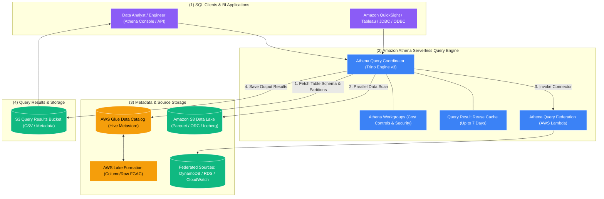

# 🏛️ Amazon Athena Overview (Serverless Interactive SQL)

- **Category**: Analytics / Interactive SQL & Data Lake Analytics
- **Language / ဘာသာစကား**: [English (Original)](/en/02-services/analytics-streaming/athena/athena) | **မြန်မာဘာသာ (Burmese)**
- **Primary Use Case**: S3 Data Lakes ပေါ်တွင် Interactive ad-hoc SQL querying ပြုလုပ်ခြင်း၊ multi-source federated analytics၊ serverless Apache Spark notebooks များနှင့် lightweight ETL များ ပြုလုပ်ခြင်း။
- **Slide Reference**: `[AWSCertifiedDataEngineerSlides.pdf](/docs/AWSCertifiedDataEngineerSlides.pdf)` မှ Pages 365–382
- **Hub Links**: `[[mm/index|index]]` | `[[mm/00-hub/service-catalog|service-catalog]]` | `[[mm/01-domains/domain-2-data-store-management|domain-2-data-store-management]]` | `[[domain-3-data-processing]]` | `[[mm/02-services/storage/s3/s3|s3]]`

---

## 1. High-Level Summary

**Amazon Athena** သည် data engineer များနှင့် analyst များအနေဖြင့် **Amazon S3** နှင့် အခြားသော federated data source များတွင် သိမ်းဆည်းထားသည့် petabytes ချီသော data များကို standard **ANSI SQL** အသုံးပြု၍ query ပြုလုပ်ပြီး ခွဲခြမ်းစိတ်ဖြာနိုင်ရန် စွမ်းဆောင်ပေးသော interactive, serverless query service တစ်ခု ဖြစ်သည်။

Athena သည် လုံးဝ serverless ဖြစ်ပြီး—အရွယ်အစားသတ်မှတ်ရန် (size)၊ provision လုပ်ရန် သို့မဟုတ် စီမံခန့်ခွဲရန် compute infrastructure၊ EC2 cluster သို့မဟုတ် data warehouse များ လုံးဝမလိုအပ်ပါ။ သင် run သော query များအတွက်သာ **scan ပြုလုပ်သည့် data ပမာဏ** ပေါ် မူတည်၍ တိကျစွာ ပေးချေရသည် (standard pricing: **scan ပြုလုပ်သော Terabyte (TB) တစ်ခုလျှင် $5.00**၊ query တစ်ခုလျှင် အနည်းဆုံး 10 MB သတ်မှတ်ထားသည်)။

Amazon Athena ၏ နောက်ကွယ်တွင် distributed SQL execution အတွက် **Presto / Trino** (Engine Version 3) ကို အသုံးပြုထားပြီး၊ centralized ဖြစ်ကာ Apache Hive နှင့် တွဲဖက်အသုံးပြုနိုင်သော (Hive-compatible) metadata layer အဖြစ် **[[mm/02-services/analytics-streaming/glue/glue-data-catalog|glue-data-catalog]]** ကို အသုံးပြုသည်။

---

## 2. Core Architecture & Query Execution Flow

1. **Query Submission**: User သို့မဟုတ် BI tool မှ standard ANSI SQL query တစ်ခုကို Athena Web Console၊ AWS CLI၊ SDK သို့မဟုတ် JDBC/ODBC driver များမှတစ်ဆင့် submit ပြုလုပ်သည်။
2. **Metadata Retrieval**: Athena query engine သည် table schema၊ serialization library (SerDe)၊ S3 prefix location များနှင့် partition metadata များကို ရယူရန် **[[mm/02-services/analytics-streaming/glue/glue-data-catalog|glue-data-catalog]]** သို့ ဆက်သွယ်သည်။
3. **Security & Access Evaluation**: Athena သည် IAM permission များကို စစ်ဆေးပြီး **[[mm/02-services/security-governance/lake-formation|lake-formation]]** မှတစ်ဆင့် fine-grained access control policy များကို စစ်ဆေးအကဲဖြတ်သည် (column-level၊ row-level နှင့် cell-level security filter များကို အသုံးပြုဆောင်ရွက်စေခြင်း)။
4. **Distributed Execution**: Athena သည် Availability Zone အများအပြားတစ်လျှောက်ရှိ distributed Presto compute worker များကို provision လုပ်ပြီး အောက်ခြေရှိ S3 object များကို parallel အနေဖြင့် scan ပြုလုပ်ကာ aggregate လုပ်သည်။
5. **Result Output & Storage**: Athena သည် ထွက်ပေါ်လာသော dataset ရလဒ်ကို `.metadata` file နှင့်အတူ **CSV format** ဖြင့် သတ်မှတ်ထားသော **Amazon S3 Query Results bucket** (`s3://aws-athena-query-results-.../`) ထဲသို့ ရေးသားသိမ်းဆည်းသည်။

---

## 3. Athena Sub-Features Breakdown for DEA-C01

Data Engineer စာမေးပွဲအတွက် Athena ကို ကျွမ်းကျင်စေရန်၊ အောက်ဖော်ပြပါ သီးသန့် specialized စွမ်းဆောင်ရည်များကို နားလည်ထားရမည်:

| Feature / Sub-Topic | Primary Purpose | Key Exam Trigger | Detailed Note |
| :--- | :--- | :--- | :--- |
| **Performance Optimization** | Parquet၊ Snappy နှင့် Partition Projection များကို အသုံးပြု၍ scan ပြုလုပ်ရမည့် data ကို လျှော့ချရန်နှင့် query speed ကို အမြင့်ဆုံးရရှိစေရန်။ | CSV/JSON မှ Parquet သို့ ပြောင်းလဲခြင်း၊ partition metadata lookup များ နှေးကွေးခြင်း။ | `[[mm/02-services/analytics-streaming/athena/athena-performance|athena-performance]]` |
| **ACID Transactions (Apache Iceberg)** | S3 ပေါ်တွင် time-travel queries များနှင့်အတူ row-level `UPDATE`၊ `DELETE` နှင့် `MERGE INTO` operation များကို ဆောင်ရွက်ရန်။ | GDPR / CCPA right-to-be-forgotten၊ S3 ပေါ်ရှိ concurrent writer များ။ | `[[mm/02-services/analytics-streaming/athena/athena-iceberg|athena-iceberg]]` |
| **Athena for Apache Spark** | စက္ကန့်ပိုင်းအတွင်း စတင်နိုင်သော (< 1 sec startup) Interactive PySpark analytics နှင့် Jupyter notebook များ။ | EMR/Glue cluster များကို စောင့်ဆိုင်းစရာမလိုဘဲ Interactive Python data exploration ပြုလုပ်ခြင်း။ | `[[mm/02-services/analytics-streaming/athena/athena-spark|athena-spark]]` |
| **Federated Queries** | AWS Lambda connector များကို အသုံးပြု၍ S3 မဟုတ်သော source များ (DynamoDB, RDS, CloudWatch) ကို နေရာမရွှေ့ဘဲ တိုက်ရိုက် (in place) query ပြုလုပ်ရန်။ | ETL မပြုလုပ်ဘဲ SQL query တစ်ခုတည်းဖြင့် S3 နှင့် DynamoDB တစ်လျှောက် cross-query ပြုလုပ်ခြင်း။ | `[[mm/02-services/analytics-streaming/athena/athena-federated-query|athena-federated-query]]` |
| **Workgroups & Governance** | Multi-tenant isolation ပြုလုပ်ခြင်း၊ query တစ်ခုချင်းစီအလိုက်နှင့် workgroup တစ်ခုလုံးအလိုက် data scan limit များ သတ်မှတ်ခြင်း၊ မဖြစ်မနေ encryption သုံးစေခြင်း။ | မလိုအပ်ဘဲ query ကုန်ကျစရိတ်များ မြင့်တက်လာခြင်းကို ကာကွယ်ခြင်း၊ team အလိုက် query history များကို ခွဲခြားထားခြင်း။ | `[[mm/02-services/analytics-streaming/athena/athena-workgroups|athena-workgroups]]` |
| **CTAS & UNLOAD Statements** | S3 dataset များကို transform ပြုလုပ်ရန်၊ partition ခွဲရန်နှင့် compress ပြုလုပ်ရန် SQL ကို အသုံးပြုသည့် lightweight serverless ETL။ | Pure SQL ကို အသုံးပြု၍ raw CSV မှ Parquet သို့ ပြောင်းလဲခြင်း၊ query result များကို export ထုတ်ခြင်း။ | `[[mm/02-services/analytics-streaming/athena/athena-ctas|athena-ctas]]` |

---

## 4. Query Result Reuse & Caching

Athena တွင် **Query Result Reuse (Result Caching)** feature ပါဝင်သည်:
- အကယ်၍ သတ်မှတ်ထားသော cache window အတွင်း (**၁ နာရီမှ ၇ ရက်အထိ**) ထပ်တူညီသော query တစ်ခုကို submit လုပ်ပါက၊ Athena သည် S3 data များကို ထပ်မံ scan မဖတ်တော့ဘဲ S3 results bucket ထဲမှ cache လုပ်ထားသော result ကို ပြန်လည်ပေးပို့သည်။
- **Cost & Latency Benefit**: ပြန်လည်အသုံးပြုသော (reused) query များသည် **data 0 bytes scan ပြုလုပ်ပြီး** ($0.00 compute cost) မီလီစက္ကန့်ပိုင်းအတွင်း ရလဒ်ပြန်လည်ရရှိသည်။
- **Cache Invalidation**: အကယ်၍ အောက်ခြေရှိ S3 data သို့မဟုတ် Glue Data Catalog table schema ပြောင်းလဲသွားပါက Result caching ကို အလိုအလျောက် bypass လုပ်ပြီး အသစ်ပြန်လည် scan ဖတ်သည်။

---

## 5. Security & Encryption Architecture

| Security Layer | Implementation Mechanism | DEA-C01 Exam Context |
| :--- | :--- | :--- |
| **Data Lake at Rest** | Amazon S3 encryption: SSE-S3, SSE-KMS, SSE-C, သို့မဟုတ် Client-Side Encryption (CSE-KMS)။ | IAM role တွင် KMS permission ရှိပါက Athena သည် data ကို transparently decrypt လုပ်ပေးသည်။ |
| **Query Results at Rest** | S3 Results Bucket ကို SSE-S3 သို့မဟုတ် AWS KMS CMK ဖြင့် encrypt လုပ်ထားခြင်း။ | Workgroup အလိုက် configure ပြုလုပ်နိုင်သည် (workgroup encryption override ကို enforce လုပ်နိုင်သည်)။ |
| **Data in Transit** | API၊ JDBC၊ ODBC နှင့် console traffic အားလုံးအတွက် TLS 1.2+ encryption။ | Athena endpoint အားလုံးတွင် default အနေဖြင့် မဖြစ်မနေ အသုံးပြုစေသည်။ |
| **Fine-Grained Access Control (FGAC)** | **AWS Lake Formation** integration။ | Table များကို ပြန်လည်ရေးသားစရာမလိုဘဲ Row-level filter များ (ဥပမာ- `country = 'US'`) နှင့် column masking များကို သတ်မှတ်အသုံးပြုခြင်း။ |
| **IAM Authorization** | Action policy များ: `athena:StartQueryExecution`, `athena:GetQueryResults`, `glue:GetTable`, `s3:GetObject`။ | Source bucket ပေါ်တွင် `s3:GetObject` သို့မဟုတ် results bucket ပေါ်တွင် `s3:PutObject` မရှိပါက query failure ဖြစ်ပေါ်စေသည်။ |

---

## 6. Analytical Compute Decision Matrix

| Feature | Amazon Athena | Amazon Redshift Serverless | Redshift Spectrum | Amazon EMR (Presto / Trino) |
| :--- | :--- | :--- | :--- | :--- |
| **Architecture** | **Serverless Interactive SQL** | **Serverless Cloud Data Warehouse** | **Hybrid S3 Query Layer for Redshift** | **Managed EC2 / EKS Cluster** |
| **Pricing Model** | **Scan ပြုလုပ်သည့် TB တစ်ခုလျှင် $5.00** | Redshift Processing Units (RPUs) တစ်နာရီနှုန်းဖြင့် အခြေခံ capacity ကုန်ကျစရိတ်။ | Scan ပြုလုပ်သည့် TB တစ်ခုလျှင် $5.00 + Redshift cluster cost။ | အောက်ခြေရှိ EC2 instance နာရီများ + EMR software fee။ |
| **Primary Use Case** | Ad-hoc query များ၊ log analytics၊ zero-ETL data lake discovery။ | Enterprise BI၊ complex analytical join များ၊ high-concurrency dashboard များ။ | Live S3 data lake table များကို Redshift local table များနှင့် တိုက်ရိုက် join လုပ်ခြင်း။ | Highly customized ဖြစ်ပြီး ကြာရှည်စွာ run သည့် big data SQL cluster များ။ |
| **Startup Latency** | ချက်ချင်း (sub-second query dispatch)။ | စက္ကန့်ပိုင်း (automatic serverless wake-up)။ | ချက်ချင်း (running ဖြစ်နေသော Redshift cluster နှင့် တွဲဖက်ထားသည်)။ | မိနစ်ပိုင်း (cluster provisioning)။ |
| **Data Modifications** | Read-only (သို့မဟုတ် Apache Iceberg ဖြင့် ACID row operation များ)။ | Full ACID relational SQL (`INSERT`, `UPDATE`, `DELETE`)။ | S3 external table များပေါ်တွင် Read-only။ | Full SQL + custom file manipulation။ |

---

## 7. DEA-C01 Exam Tips & Decision Triggers

> [!IMPORTANT]
> **Key Exam Decision Triggers for Amazon Athena**:
>
> - **"Serverless ad-hoc SQL querying on S3 with zero infrastructure management"** $\rightarrow$ **Amazon Athena**။
> - **"Pay strictly per TB scanned ($5/TB) with no ongoing idle costs"** $\rightarrow$ **Amazon Athena**။
> - **"Query fails with 'Table not found' or 'Database does not exist'"** $\rightarrow$ Table ကို **AWS Glue Data Catalog** တွင် မှတ်ပုံတင်ထားခြင်း ရှိမရှိနှင့် IAM role တွင် `glue:GetTable` permission ရှိမရှိ စစ်ဆေးပါ။
> - **"Query fails with 'Access Denied' when saving output"** $\rightarrow$ **Athena Query Results S3 bucket** ပေါ်တွင် user ၌ `s3:PutObject` နှင့် `s3:GetBucketLocation` permission များ ရှိစေရန် သေချာပါစေ။
> - **"Prevent duplicate query scan costs on identical dashboard queries"** $\rightarrow$ **Athena Query Result Reuse (Result Caching)** ကို enable လုပ်ပါ။
> - **"Enforce column-level masking (e.g., hide SSN) for Athena analysts"** $\rightarrow$ **AWS Lake Formation** ကို အသုံးပြု၍ permission များ သတ်မှတ်ပါ။

---

## 📌 Related Notes
- `[[mm/02-services/analytics-streaming/athena/athena-performance|athena-performance]]` — Athena Cost & Performance Tuning
- `[[mm/02-services/analytics-streaming/athena/athena-iceberg|athena-iceberg]]` — Apache Iceberg ACID Transactions on Athena
- `[[mm/02-services/analytics-streaming/athena/athena-spark|athena-spark]]` — Athena for Apache Spark
- `[[mm/02-services/analytics-streaming/athena/athena-federated-query|athena-federated-query]]` — Querying Non-S3 Sources with Lambda Connectors
- `[[mm/02-services/analytics-streaming/athena/athena-workgroups|athena-workgroups]]` — Workgroups, Cost Limits & Security Governance
- `[[mm/02-services/analytics-streaming/athena/athena-ctas|athena-ctas]]` — Serverless Lightweight ETL with CTAS & UNLOAD
- `[[mm/02-services/analytics-streaming/glue/glue-data-catalog|glue-data-catalog]]` — Glue Metadata Metastore
- `[[mm/02-services/storage/s3/s3|s3]]` — S3 Data Lake Foundation
