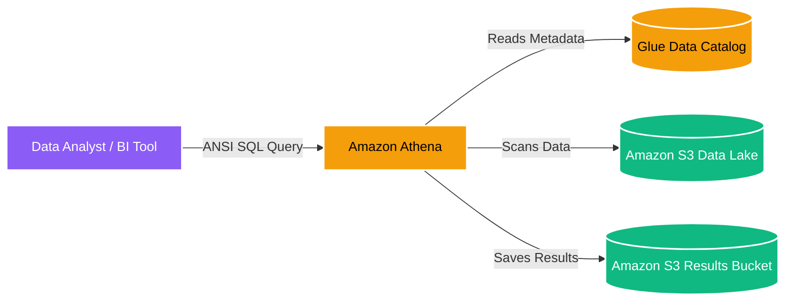

# 🏛️ Amazon Athena Overview (မြန်မာဘာသာ)

- **Category**: Analytics / Interactive Query
- **Language / ဘာသာစကား**: [English (Original)](/en/02-services/analytics-streaming/athena/athena) | **မြန်မာဘာသာ (Burmese)**
- **Primary Use Case**: Provisioning server များမလိုအပ်ဘဲ Amazon S3 data lake များပေါ်တွင် standard ANSI SQL ဖြင့် Interactive ad-hoc SQL query များကို တိုက်ရိုက်လုပ်ဆောင်ရန်။
- **Slide Reference**: `[[AWSCertifiedDataEngineerSlides.pdf]]` မှ Pages 365–382
- **Hub Links**: `[[mm/index]]` | `[[service-catalog]]` | `[[domain-2-data-store-management]]` | `[[s3]]`

---

## 1. High-Level Summary

**Amazon Athena** သည် data engineer များနှင့် analyst များကို Amazon S3 တွင် သိမ်းဆည်းထားသော data များကို standard SQL အသုံးပြု၍ ခွဲခြမ်းစိတ်ဖြာနိုင်ရန် လုပ်ဆောင်ပေးသော interactive, serverless query service တစ်ခုဖြစ်သည်။ ၎င်းသည် serverless ဖြစ်သောကြောင့် စီမံခန့်ခွဲရန် infrastructure မလိုအပ်ဘဲ၊ သင်လုပ်ဆောင်သော query များအတွက်သာ ပေးချေရသည် (အထူးသဖြင့် scan လုပ်ထားသော data ပမာဏအပေါ် အခြေခံပြီး: scan လုပ်ထားသော TB တစ်ခုလျှင် $5 ဖြစ်သည်)။

Athena သည် SQL execution အတွက် နောက်ကွယ်တွင် **Presto** (distributed SQL query engine) ကိုအသုံးပြုပြီး၊ table နှင့် database metadata များအတွက် **AWS Glue Data Catalog** ကို အားကိုးအသုံးပြုသည်။

---

## 2. Core Architecture

### Key Integrations
1. **Amazon S3**: အဓိက storage layer အဖြစ် လုပ်ဆောင်သည်။ Athena သည် database တစ်ခုထဲသို့ data များကို load လုပ်စရာမလိုဘဲ S3 ကို တိုက်ရိုက် query လုပ်သည်။
2. **AWS Glue Data Catalog**: ဗဟို metadata repository အဖြစ် လုပ်ဆောင်သည်။ Athena သည် S3 data ၏ schema (column နာမည်များ၊ အမျိုးအစားများ) နှင့် တည်နေရာကို နားလည်ရန် Glue ကို အသုံးပြုသည်။
3. **Amazon QuickSight**: S3 data အပေါ်တွင် BI dashboard များ တည်ဆောက်ရန် Athena သို့ တိုက်ရိုက် ချိတ်ဆက်သည်။

---

## 3. Athena Feature Breakdown for DEA-C01

Data Engineer စာမေးပွဲအတွက် Athena ကို ကျွမ်းကျင်စေရန်၊ ၎င်း၏ sub-feature များကို အသေးစိတ် နားလည်ထားရမည်။ ပိုမိုလေ့လာနိုင်ရန် အောက်ပါ note များကို နှိပ်ပါ:

- **[[athena-performance]]**: ကုန်ကျစရိတ်ကို လျှော့ချရန်နှင့် အမြန်နှုန်းကို မြှင့်တင်ရန် Athena query များကို မည်သို့ optimize လုပ်မည်နည်း (Parquet, Snappy, Partitioning, Partition Projection)။
- **[[athena-iceberg]]**: Apache Iceberg ကို အသုံးပြု၍ S3 ပေါ်တွင် ACID transactions, row-level updates/deletes, နှင့် time-travel query များကို မည်သို့ အသုံးပြုမည်နည်း။
- **[[athena-spark]]**: Serverless အဖြစ် ချက်ချင်း အလုပ်လုပ်သော PySpark နှင့် Jupyter notebook များကို မည်သို့ run မည်နည်း။
- **[[athena-federated-query]]**: Lambda connector များကို အသုံးပြု၍ S3 မဟုတ်သော data source များ (DynamoDB, Redshift, CloudWatch) ကို မည်သို့ query လုပ်မည်နည်း။
- **[[athena-workgroups]]**: ကုန်ကျစရိတ်များကို ထိန်းချုပ်ရန်၊ data scan ကန့်သတ်ချက်များကို သတ်မှတ်ရန်နှင့် Workgroups ကို အသုံးပြု၍ workload များကို ခွဲခြားရန် မည်သို့ လုပ်ဆောင်မည်နည်း။
- **[[athena-ctas]]**: Query ရလဒ်များကို table အသစ်များအဖြစ် S3 သို့ တိုက်ရိုက်ပြန်လည်သိမ်းဆည်းခြင်းဖြင့် lightweight ETL ကို မည်သို့ လုပ်ဆောင်မည်နည်း (Create Table As Select)။

---

## 4. Exam Tips & Scenarios

> [!IMPORTANT]
> **Key Exam Trigger Keywords**:
> - **"Serverless ad-hoc SQL querying on S3"** $\rightarrow$ **Amazon Athena**.
> - **"No infrastructure to manage, pay per TB scanned"** $\rightarrow$ **Amazon Athena**.
> - **"Athena table schema keeps disappearing or is not found"** $\rightarrow$ **AWS Glue Crawler** run ထားခြင်းရှိမရှိ၊ သို့မဟုတ် table ကို **Glue Data Catalog** တွင် သတ်မှတ်ထားခြင်း ရှိမရှိ စစ်ဆေးပါ။

---

## 📌 Related Notes
- `[[s3]]` — Athena အတွက် အခြေခံ storage။
- `[[glue]]` — Athena ကို စွမ်းဆောင်ပေးသော metadata catalog။
- `[[redshift]]` — Redshift နှင့် နှိုင်းယှဥ်ချက် (provision လုပ်ထားသော compute လိုအပ်သည့် ကြီးမားပြီး ရှုပ်ထွေးသော enterprise data warehousing အတွက် အသုံးပြုသည်)။
