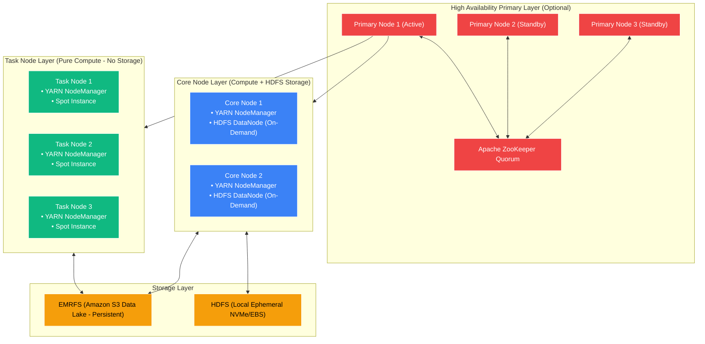
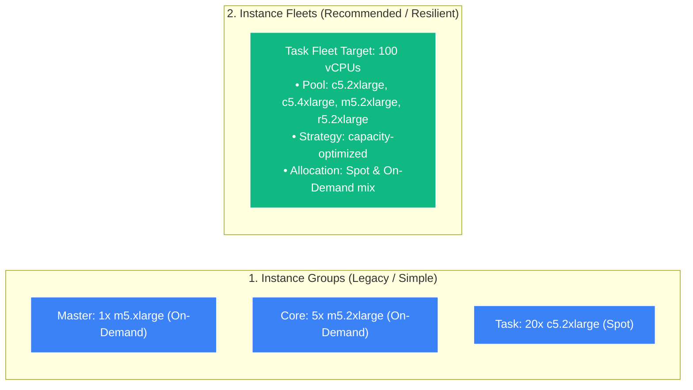
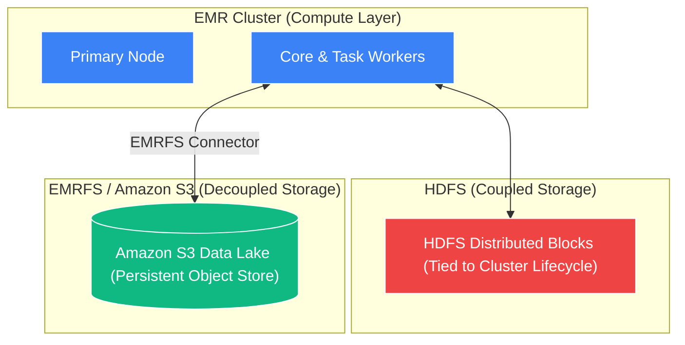

# 🏗️ EMR Cluster Architecture, Node Types & Storage (မြန်မာဘာသာ)

- **Category**: Analytics / Cluster Topology & Storage Decoupling
- **Language / ဘာသာစကား**: [English (Original)](/en/02-services/analytics-streaming/emr/emr-cluster-architecture) | **မြန်မာဘာသာ (Burmese)**
- **Primary Use Case**: Master၊ Core နှင့် Task nodes များ၊ Spot Instance Fleets၊ HDFS နှင့် Amazon S3 ပေါ်ရှိ EMRFS တို့ကို အသုံးပြု၍ fault-tolerant ဖြစ်ပြီး cost-effective သော EMR clusters များကို design ပြုလုပ်ရန်။
- **Slide Reference**: `[[AWSCertifiedDataEngineerSlides.pdf]]` ရှိ စာမျက်နှာ 383–413
- **Hub Links**: `[[mm/index]]` | `[[emr]]` | `[[s3]]` | `[[ec2-and-graviton]]` | `[[domain-1-ingestion-and-processing]]`

---

## 1. High-Level Summary

Amazon EMR on EC2 cluster ဆိုသည်မှာ **Node Types** (**Primary/Master**၊ **Core** နှင့် **Task**) ဟုခေါ်သော သီးခြား functional roles များအဖြစ် စုစည်းထားသည့် distributed virtual machines အစုအဝေး ဖြစ်ပါသည်။ 

DEA-C01 စာမေးပွဲအတွက် အကောင်းဆုံး performance ရရှိစေရန်နှင့် cloud cost များကို အနည်းဆုံးဖြစ်စေရန် data engineers များအနေဖြင့် compute instances များသည် storage layers (**HDFS vs. EMRFS on S3**) နှင့် မည်သို့ ချိတ်ဆက်အလုပ်လုပ်သည်၊ Spot interruptions များကို ခံနိုင်ရည်ရှိစေရန် **Instance Fleets** ကို မည်သို့ configure လုပ်ရမည်၊ နှင့် cluster downscaling ပြုလုပ်ချိန်တွင် ဆိုးရွားသော data loss မဖြစ်ပေါ်စေရန် မည်သို့ ကာကွယ်ရမည်ကို နားလည်ထားရပါမည်။

---

## 2. EMR Node Types Deep Dive

| Node Type | Primary Daemon Processes | Runs Compute Tasks? | Hosts HDFS Data? | Purchasing Strategy | Downscaling Impact |
| :--- | :--- | :---: | :---: | :--- | :--- |
| **Primary (Master)** | `YARN ResourceManager`, `Hadoop NameNode`, `JobTracker` | No (Coordinates only) | No | **On-Demand or Reserved** | Multi-Master HA ကို မသုံးထားပါက Single point of failure ဖြစ်နိုင်ပါသည်။ |
| **Core** | `YARN NodeManager`, `HDFS DataNode` | **Yes** | **Yes** | **On-Demand / Savings Plans** | **High Risk**: Core nodes များကို ဖယ်ရှားပါက HDFS under-replication ဖြစ်ပေါ်ပြီး data corruption ဖြစ်စေနိုင်ပါသည်။ |
| **Task** | `YARN NodeManager` | **Yes** | **NO** | **Spot Instances (Up to 90% discount)** | **Zero Risk**: HDFS data integrity ကို ထိခိုက်မှုမရှိဘဲ လွတ်လပ်စွာ add၊ remove သို့မဟုတ် interrupt ပြုလုပ်နိုင်ပါသည်။ |

### 1. Primary / Master Node
- Cluster ၏ ကျန်းမာရေး (health) ကို စီမံခန့်ခွဲခြင်း၊ data distribution ကို ညှိနှိုင်းပေးခြင်းနှင့် Spark / MapReduce tasks များကို schedule ပြုလုပ်ပေးပါသည်။
- **Multi-Master (High Availability)**: Apache ZooKeeper ဖြင့် coordinate လုပ်ထားသော **Primary nodes ၃ ခု** ကို launch လုပ်ပေးပါသည်။ အကယ်၍ active Primary fail ဖြစ်သွားပါက လက်ရှိ run နေသော jobs များကို မပျက်စေဘဲ standby Primary သို့ automatic failover ပြုလုပ်ပေးပါသည်။

### 2. Core Nodes
- Processing tasks များကို run ပြီး HDFS data ၏ partition blocks များကို သိမ်းဆည်းပေးပါသည်။
- **Critical Exam Rule**: Core nodes များသည် HDFS blocks များကို ထိန်းသိမ်းထားသောကြောင့် production clusters များတွင် **Core nodes များအတွက် Spot Instances ကို လုံးဝမသုံးရပါ (NEVER use Spot Instances)**။ အကယ်၍ Spot capacity ကို ပြန်လည်သိမ်းယူ (reclaim) ခံရပါက HDFS data blocks များ ပျောက်ဆုံးသွားပါမည်။

### 3. Task Nodes
- သီးသန့် ephemeral compute power ကိုသာ ထောက်ပံ့ပေးပါသည်။ ၎င်းတို့သည် tasks များကို execute လုပ်ပြီး intermediate shuffle data များကို ဆက်သွယ်ပေးပို့သော်လည်း **persistent HDFS blocks များကို မည်သည့်အခါမျှ သိမ်းဆည်းခြင်း မရှိပါ**။
- **Graceful Decommissioning**: AWS Spot မှ Task node တစ်ခုကို reclaim လုပ်သောအခါ သို့မဟုတ် scale down လုပ်သောအခါ YARN သည် လက်ရှိ run နေဆဲ (in-flight) tasks များကို သပ်ရပ်စွာ အပြီးသတ်ပေးပြီး ကျန်ရှိသော အခြား surviving nodes များဆီသို့ pending tasks များကို လမ်းကြောင်းပြောင်း (redirect) ပေးပါသည်။

---

## 3. Instance Groups vs. Instance Fleets

Amazon EMR cluster တစ်ခုကို provision လုပ်သည့်အခါ အောက်ပါ cluster composition topologies နှစ်ခုအနက် တစ်ခုကို ရွေးချယ်ရပါမည်:

| Feature | EMR Instance Groups | EMR Instance Fleets (Recommended) |
| :--- | :--- | :--- |
| **Instance Type Diversity** | Group တစ်ခုစီတွင် **instance type ၁ မျိုးတည်း** သာ သတ်မှတ်နိုင်သည် (ဥပမာ `r5.xlarge` တစ်မျိုးတည်း)။ | Fleet တစ်ခုစီတွင် မတူညီသော **EC2 instance types ၃၀ မျိုးအထိ** ရောနှောအသုံးပြုနိုင်သည်။ |
| **Capacity Specification** | **Instance Count** ဖြင့် configure လုပ်သည် (ဥပမာ instances ၁၀ ခု)။ | **Target Capacity Units / vCPUs** ဖြင့် configure လုပ်သည် (ဥပမာ 200 units)။ |
| **Spot Allocation Strategy** | Fallback options အကန့်အသတ်ရှိသည်။ | **`capacity-optimized`** (interruptions မဖြစ်စေရန် အနက်ရှိုင်းဆုံး Spot pools များကို ရွေးချယ်သည်) နှင့် **`lowest-price`** တို့ကို support လုပ်သည်။ |
| **Spot to On-Demand Fallback** | Manual ပြုလုပ်ရန် လိုအပ်သည်။ | သတ်မှတ်ထားသော timeout အတွင်း Spot capacity မရရှိနိုင်ပါက On-Demand instances များကို အလိုအလျောက် launch လုပ်ပေးသည်။ |
| **Auto Scaling Integration** | EMR Managed Scaling နှင့် Custom Auto Scaling policies များကို support လုပ်သည်။ | **EMR Managed Scaling** ကို support လုပ်သည်။ |

---

## 4. Storage Topologies: HDFS vs. EMRFS on S3

### 1. HDFS (Hadoop Distributed File System)
- **Core nodes** များတွင် ချိတ်ဆက်ထားသော local EBS / NVMe volumes များပေါ်တွင် သိမ်းဆည်းသည်။
- **အားသာချက်များ (Pros)**: အလုပ်များပြီး iterative ဖြစ်သော MapReduce/Spark algorithms များအတွက် ultra-low latency နှင့် high IOPS ကို ရရှိစေသည်။
- **အားနည်းချက်များ (Cons)**: **Cluster lifecycle နှင့် တိုက်ရိုက်ဆက်စပ်နေသည် (Tied to cluster lifecycle)**။ အကယ်၍ EMR cluster ကို terminate လုပ်လိုက်ပါက HDFS data အားလုံးသည် အပြီးတိုင် ပျက်စီးသွားမည်ဖြစ်သည်။ Cluster များကို ၂၄/၇ persistent run ထားရန် လိုအပ်သည်။

### 2. EMRFS (EMR File System on Amazon S3)
- EMR ပေါ်ရှိ applications များ (Spark, Hive, Presto) အား **Amazon S3 ကို object store အဖြစ်** တိုက်ရိုက် ဖတ်ရှုခြင်းနှင့် ရေးသားခြင်း ပြုလုပ်နိုင်ရန် AWS မှ တီထွင်ဖန်တီးထားသော filesystem connector ဖြစ်ပါသည်။
- **အားသာချက်များ (Pros)**:
  - **Decoupled Compute and Storage**: Compute ကို storage နှင့် သီးခြားစီ သီးသန့် scale လုပ်နိုင်သည်။
  - **Transient Clusters**: Batch job တစ်ခုကို process လုပ်ရန် EMR cluster တစ်ခုကို launch လုပ်ပြီး ရလဒ်များကို EMRFS မှတစ်ဆင့် S3 သို့ တိုက်ရိုက်ရေးသားကာ idle costs ၁၀၀% သက်သာစေရန် cluster ကို ချက်ချင်း terminate ပြုလုပ်နိုင်သည်။
  - **Durability**: Amazon S3 ၏ 99.999999999% (11 9's) durability ကို အသုံးချနိုင်သည်။
  - **Strong Consistency**: S3 သည် out-of-the-box strong read-after-write consistency ကို ထောက်ပံ့ပေးသည်။

---

## 5. DEA-C01 Exam Tips & Scenarios

> [!IMPORTANT]
> **EMR Cluster Architecture အတွက် အဓိက Exam Decision Triggers များ**:
>
> - **"Design the most cost-effective EMR cluster for batch processing without risking data loss"** $\rightarrow$ **Primary နှင့် Core nodes များအတွက် On-Demand** ကို အသုံးပြုပြီး **Task nodes များအတွက် Spot Instances** နှင့်အတူ **EMRFS on S3** ကို တွဲဖက်အသုံးပြုပါ။
> - **"Spot Instance interruptions are causing EMR jobs to fail due to lost HDFS data blocks"** $\rightarrow$ Spot instances များကို **Core nodes** ပေါ်တွင် မှားယွင်းစွာ ထားရှိထားခြင်းဖြစ်သည်; **Spot instances များကို Task nodes သို့ ပြောင်းရွှေ့ပြီး Core nodes များအတွက် On-Demand ကို အသုံးပြုပါ**။
> - **"Avoid Spot capacity shortages when launching massive EMR clusters"** $\rightarrow$ **Instance types ၃၀ မျိုးအထိ** ဖြင့် **Instance Fleets** ကို configure လုပ်ပြီး allocation strategy ကို **`capacity-optimized`** ဟု သတ်မှတ်ပါ။
> - **"Cluster terminated unexpectedly and all transformed data was lost"** $\rightarrow$ Output ကို **persistent Amazon S3 via EMRFS** သို့ မရေးဘဲ **ephemeral HDFS** သို့ ရေးသားခဲ့မိခြင်းကြောင့် ဖြစ်သည်။
> - **"Ensure 100% uptime for EMR Primary node coordination"** $\rightarrow$ **Multi-Master High Availability (Primary nodes ၃ ခု)** ကို enable ပြုလုပ်ပါ။

---

## 📌 Related Notes
- `[[emr]]` — Amazon EMR Overview Hub
- `[[emr-performance-optimization]]` — Spark Optimization & S3DistCp
- `[[emr-lifecycle-and-cost]]` — Bootstrap Actions & EMR Managed Scaling
- `[[s3]]` — S3 Data Lake Foundation
- `[[ec2-and-graviton]]` — EC2 Instance Topologies & Graviton
