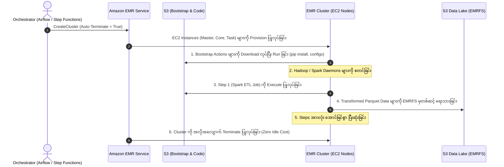
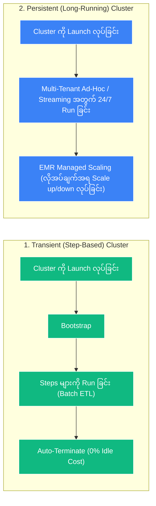

# ⚙️ EMR Lifecycle, Bootstrap Actions & Cost Optimization

- **Category**: Analytics / Cluster Lifecycle, Automation & Cost Governance
- **Language / ဘာသာစကား**: [English (Original)](/en/02-services/analytics-streaming/emr/emr-lifecycle-and-cost) | **မြန်မာဘာသာ (Burmese)**
- **Primary Use Case**: Bootstrap Actions မှတစ်ဆင့် node initialization ကို automate ပြုလုပ်ရန်၊ Steps မှတစ်ဆင့် batch workflows များကို orchestrate ပြုလုပ်ရန်နှင့် Transient Clusters များနှင့် EMR Managed Scaling တို့မှတစ်ဆင့် ကုန်ကျစရိတ် သက်သာမှုကို အမြင့်ဆုံးရရှိစေရန်။
- **Slide Reference**: Pages 383–413 in `[[AWSCertifiedDataEngineerSlides.pdf]]`
- **Hub Links**: `[[mm/index]]` | `[[emr]]` | `[[cost-management]]` | `[[step-functions]]` | `[[domain-3-data-processing]]`

---

## ၁။ အကျဉ်းချုပ် (High-Level Summary)

Amazon EMR ပေါ်တွင် big data workloads များကို စီမံခန့်ခွဲရာတွင် initialization မပြုလုပ်မီ run သည့် custom scripts (**Bootstrap Actions**) များမှသည်၊ job orchestration (**Steps Execution**)、dynamic compute scaling (**EMR Managed Scaling**) နှင့် automated cluster termination အထိ ပြီးပြည့်စုံသော **Cluster Lifecycle** ကို နားလည်သဘောပေါက်ရန် လိုအပ်ပါသည်။

Workloads များကို **Spot Instance Fleets** နှင့် **Auto-Termination** policies များပါဝင်သော **Transient (ephemeral) clusters** များပေါ်တွင် deploy ပြုလုပ်ခြင်းဖြင့် အဖွဲ့အစည်းများသည် cloud infrastructure ကုန်ကျစရိတ်ကို **၈၀–၉၀% အထိ** လျှော့ချနိုင်ပြီး petabyte-scale data pipelines များကို run နိုင်စေပါသည်။

---

## ၂။ Bootstrap Actions နှင့် Steps Execution နှိုင်းယှဉ်ချက် (Bootstrap Actions vs. Steps Execution)

| Feature (အင်္ဂါရပ်) | EMR Bootstrap Actions | EMR Steps Execution |
| :--- | :--- | :--- |
| **Execution Timing (လုပ်ဆောင်သည့် အချိန်)** | Cluster provisioning ပြုလုပ်စဉ် Hadoop/Spark daemons များ မစတင်မီ **node တစ်ခုစီတွင် တစ်ကြိမ်သာ** run ပါသည်။ | Cluster initialization အပြည့်အဝ ပြီးစီးပြီး applications များ run နေပြီးသည့် **နောက်ပိုင်းတွင်** run ပါသည်။ |
| **Target Nodes (သက်ရောက်သည့် Nodes)** | **Nodes အားလုံး** (Primary, Core နှင့် Task nodes များ) ပေါ်တွင် run ပါသည်။ | Primary coordinator မှတစ်ဆင့် cluster ပေါ်တွင် run ပါသည်။ |
| **Primary Purpose (အဓိက ရည်ရွယ်ချက်)** | Custom OS packages များ၊ Python libraries (`pip install`) များ ထည့်သွင်းခြင်း၊ kernel settings များ tune ပြုလုပ်ခြင်း သို့မဟုတ် proxy environment variables များ သတ်မှတ်ခြင်း။ | Big data processing logic အစစ်အမှန်များကို run ခြင်း (ဥပမာ- `spark-submit`, Hive script, Pig script, custom JAR)။ |
| **Failure Behavior (မအောင်မြင်ပါက ဖြစ်ပေါ်သည့် အခြေအနေ)** | Bootstrap script သည် non-zero code ဖြင့် exit ဖြစ်သွားပါက **cluster တစ်ခုလုံး launch မဖြစ်ဘဲ ချက်ချင်း terminate ဖြစ်သွားပါသည်**။ | Failure ဖြစ်ပါက စိတ်ကြိုက် configure လုပ်နိုင်သည်- `CONTINUE`, `CANCEL_AND_WAIT` သို့မဟုတ် `TERMINATE_CLUSTER`။ |
| **Adding After Launch (Launch ပြီးနောက် ထပ်ထည့်နိုင်မှု)** | Run နေဆဲ active cluster သို့ ထပ်မံထည့်သွင်း၍ မရပါ (boot တက်ချိန်တွင်သာ run သည်)။ | AWS CLI, SDK သို့မဟုတ် Step Functions မှတစ်ဆင့် run နေသော clusters များသို့ dynamic နည်းလမ်းဖြင့် အချိန်မရွေး ထပ်ထည့်နိုင်ပါသည်။ |

---

## ၃။ Transient vs. Persistent EMR Clusters

### ၁။ Transient Clusters (Batch Workloads)
- On-demand အနေဖြင့် launch ပြုလုပ်ရန်၊ steps အစီအစဉ်များကို execute လုပ်ရန် (ဥပမာ- နေ့စဉ် ၂ နာရီကြာ run သော ETL)၊ output ဒေတာများကို EMRFS မှတစ်ဆင့် S3 ထဲသို့ ရေးသားရန်နှင့် **step များ ပြီးဆုံးသည်နှင့် တပြိုင်နက် အလိုအလျောက် terminate ပြုလုပ်ရန်** ရည်ရွယ်သည်။
- **စာမေးပွဲအတွက် အဓိက အကျိုးကျေးဇူး (Key Exam Benefit)**: အလုပ်မလုပ်သော အချိန်များ (non-working hours) တွင် ကျသင့်မည့် idle infrastructure costs များကို ၁၀၀% လုံးဝ ဖယ်ရှားပေးသည်။

### ၂။ Persistent Clusters (Interactive / Streaming Workloads)
- Data analysts များထံမှ ad-hoc SQL queries များ၊ long-running streaming jobs များ (Apache Flink / Spark Streaming) သို့မဟုတ် မျှဝေသုံးစွဲသော enterprise notebooks များကို ဝန်ဆောင်မှုပေးရန် ၂၄/၇ ဆက်တိုက် run ထားသည်။
- **Auto-Termination for Idle Clusters**: Persistent cluster တစ်ခုသည် သတ်မှတ်ထားသော timeout (ဥပမာ- မိနစ် ၃၀) အတွင်း active YARN applications မရှိဘဲ idle ဖြစ်နေပါက EMR သည် cluster ကို အလိုအလျောက် shut down လုပ်ပေးနိုင်သည်။

---

## ၄။ ကုန်ကျစရိတ် သက်သာစေမည့် နည်းလမ်းများနှင့် Auto-Scaling မဟာဗျူဟာများ (Cost Optimization & Auto-Scaling Strategies)

### ၁။ EMR Managed Scaling
- EMR Managed Scaling သည် cluster metrics များ (ဥပမာ- YARN pending memory နှင့် container allocations များ) ကို အမြဲမပြတ် သုံးသပ်ပြီး cluster အရွယ်အစားကို အလိုအလျောက် ပြောင်းလဲပေးပါသည်-
- **Intelligent Downscaling**: သာမန် EC2 Auto Scaling နှင့်မတူဘဲ EMR Managed Scaling သည် **job run နေစဉ်အတွင်း Core nodes များကို မည်သည့်အခါမျှ terminate မလုပ်ပါ**။ ထို့ကြောင့် HDFS block under-replication ဖြစ်ခြင်းနှင့် data corruption ဖြစ်ခြင်းတို့မှ ကာကွယ်ပေးပါသည်။
- Computation လိုအပ်ချက် ရုတ်တရက် မြင့်တက်လာမှုများကို ထိန်းညှိရန် **Task nodes** များကို dynamically scale လုပ်ပေးပါသည်။

---

### ၂။ `capacity-optimized` Strategy ဖြင့် Spot Instance Fleets အသုံးပြုခြင်း
- Task nodes များကို EC2 instance types ပေါင်း **၃၀ အထိ** (ဥပမာ- `m5.xlarge`, `c5.2xlarge`, `r5.2xlarge`, `m6g.xlarge`) သတ်မှတ်နိုင်သော **Instance Fleet** အဖြစ် configure လုပ်ပါ။
- Allocation strategy ကို အနက်ရှိုင်းဆုံး pools များမှ Spot instances များကို ရယူနိုင်ရန် **`capacity-optimized`** ဟု သတ်မှတ်ပေးခြင်းဖြင့် Spot interruption ဖြစ်ပွားနှုန်းကို သုညနီးပါးအထိ လျှော့ချပေးနိုင်သည်။

---

### ၃။ Custom AMIs (Cluster Boot Time ကို ပိုမိုမြန်ဆန်စေခြင်း)
- အကယ်၍ bootstrap scripts များသည် node တစ်ခုစီအတွက် ၁၅ မိနစ်ကျော် ကြာမြင့်စေသော heavy packages များ (ဥပမာ- deep learning libraries များ၊ RPM packages ကြီးများ) ကို ထည့်သွင်းရပါက ထို dependencies များကို **Custom Amazon Linux AMI** တစ်ခုအတွင်း ကြိုတင် ထည့်သွင်း (bake) ထားပါ။
- Pre-baked Custom AMI ဖြင့် clusters များကို launch ပြုလုပ်ခြင်းသည် cluster launch time ကို ၁၅ မိနစ်မှ **၃ မိနစ်အောက်** သို့ လျှော့ချပေးပါသည်။

---

### ၄။ Termination Protection
- သုံးစွဲသူများ၊ automated scripts များ သို့မဟုတ် API calls များမှ အရေးကြီးသော production cluster ကို မတော်တဆ shut down လုပ်မိခြင်းမှ ကာကွယ်ပေးသည်။ Cluster ကို terminate မလုပ်မီ ၎င်း feature ကို disable ပြုလုပ်ရပါမည်။

---

## ၅။ DEA-C01 စာမေးပွဲ အကြံပြုချက်များနှင့် မေးခွန်းပုံစံများ (DEA-C01 Exam Tips & Scenarios)

> [!IMPORTANT]
> **EMR Lifecycle & Cost အတွက် စာမေးပွဲ ဆုံးဖြတ်ချက်ဆိုင်ရာ အဓိက သော့ချက်များ (Key Exam Decision Triggers)**:
>
> - **"Install third-party Python packages on all EMR cluster nodes before Hadoop daemons start"** $\rightarrow$ **EMR Bootstrap Actions** ကို အသုံးပြုပါ။
> - **"Run a scheduled daily Spark ETL job with minimal cost and zero idle compute charges"** $\rightarrow$ **Step ပြီးဆုံးပါက auto-terminate ပြုလုပ်ရန် configure လုပ်ထားသော Transient EMR Cluster** ကို အသုံးပြုပါ။
> - **"Automatically resize an EMR cluster based on workload demands without causing task failures"** $\rightarrow$ **EMR Managed Scaling** ကို ဖွင့်ပါ။ (Enable လုပ်ပါ)
> - **"Prevent accidental termination of a 24/7 mission-critical production EMR cluster"** $\rightarrow$ **Termination Protection** ကို ဖွင့်ပါ။
> - **"Bootstrap script taking too long to launch multi-node clusters"** $\rightarrow$ Software dependencies များကို **Custom Amazon Linux AMI** ထဲတွင် ကြိုတင် install လုပ်ထားပါ။
> - **"Shut down a persistent development cluster if no one uses it over the weekend"** $\rightarrow$ **Auto-Termination for Idle Clusters** ကို ဖွင့်ပါ။

---

## 📌 ဆက်စပ် မှတ်စုများ (Related Notes)
- `[[emr]]` — Amazon EMR Overview Hub
- `[[emr-cluster-architecture]]` — Master, Core & Task Nodes
- `[[cost-management]]` — AWS Cloud Financial Management
- `[[step-functions]]` — Orchestrating Transient EMR Pipelines
